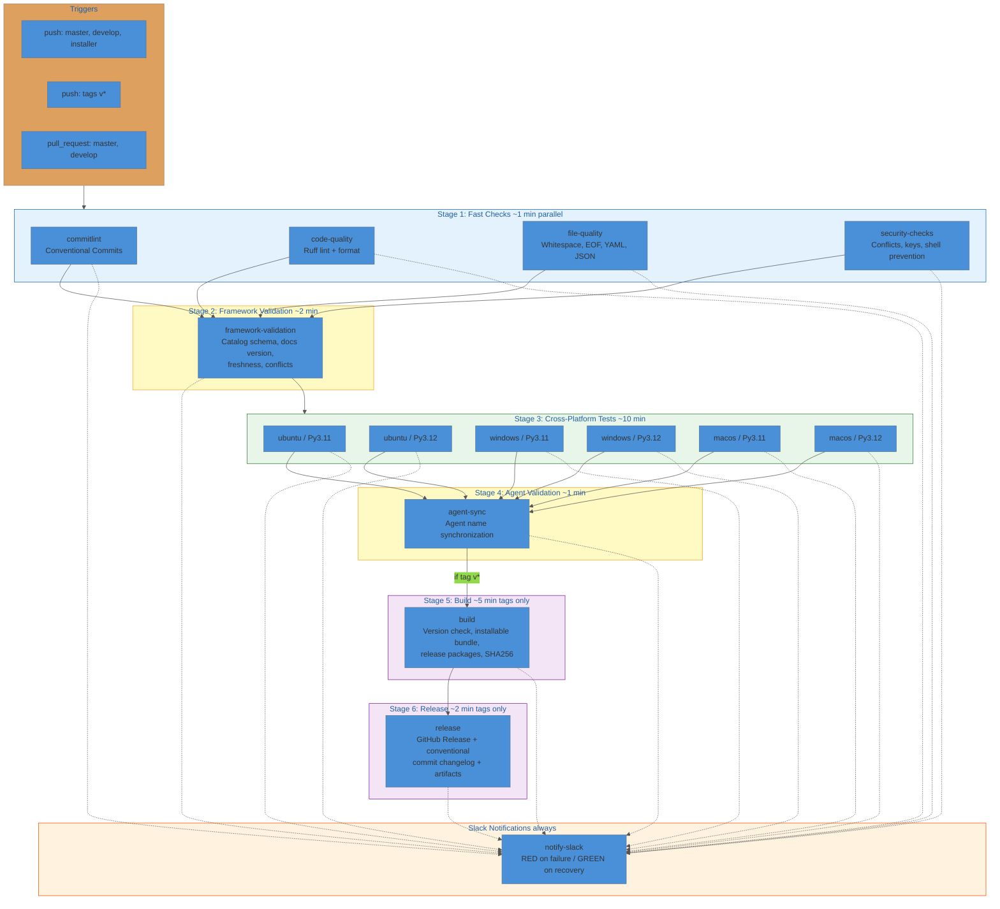

# nWave Framework CI/CD Pipeline v2.0

Single-workflow pipeline (`ci-cd.yml`) with 6 sequential stages, cross-platform testing,
tag-gated releases, and Slack state-machine notifications.

## Pipeline Diagram



## Triggers

| Event | Branches / Patterns | Notes |
|-------|---------------------|-------|
| `push` | `master`, `develop`, `installer` | Full pipeline (Stages 1-4) |
| `push` (tag) | `v*` | Full pipeline + Build + Release (Stages 1-6) |
| `pull_request` | `master`, `develop` | Full pipeline (Stages 1-4) |

**Concurrency**: grouped by `workflow + ref`. In-progress runs are cancelled when a new push arrives on the same ref.

## Environment

| Variable | Value | Purpose |
|----------|-------|---------|
| `PYTHON_DEFAULT` | `3.12` | Python version for all non-matrix jobs |
| `CACHE_VERSION` | `v3` | Pip cache key prefix (bump to invalidate) |
| `PYTHONIOENCODING` | `utf-8` | Force UTF-8 stdout/stderr |
| `PYTHONUTF8` | `1` | Python UTF-8 mode |

## Stages

### Stage 1: Fast Checks

Four parallel jobs on `ubuntu-latest`, no dependencies. Gate for everything downstream.

<details>
<summary><strong>commitlint</strong> ("Commit Messages")</summary>

Validates conventional commits using `gitlint`.

- **PR**: validates the full PR commit range (`base..head`)
- **Push**: validates the pushed commit range (`before..after`)
- **Force push / new branch**: falls back to validating HEAD only, with a warning annotation
</details>

<details>
<summary><strong>code-quality</strong> ("Code Quality (Ruff)")</summary>

Runs Ruff on `src/`, `scripts/`, `tools/`, `tests/`.

- `ruff check` with `--exit-non-zero-on-fix` (lint)
- `ruff format --check --diff` (format)
</details>

<details>
<summary><strong>file-quality</strong> ("File Quality")</summary>

- Trailing whitespace detection (excludes `dist/`, `.git/`)
- End-of-file newline enforcement (first 200 tracked files)
- YAML syntax validation via PyYAML (all `*.yaml` / `*.yml`)
- JSON syntax validation (all `*.json`, excludes `node_modules`)
</details>

<details>
<summary><strong>security-checks</strong> ("Security Checks")</summary>

- Merge conflict markers (`<<<<<<<`, `=======`, `>>>>>>>`)
- Private key detection (`-----BEGIN ... PRIVATE KEY-----`)
- Shell script prevention via `scripts/hooks/prevent_shell_scripts.py`
</details>

### Stage 2: Framework Validation

Single job on `ubuntu-latest`. **Requires**: all Stage 1 jobs pass.

| Check | Tool | What it validates |
|-------|------|-------------------|
| Catalog schema | Inline Python | `nWave/framework-catalog.yaml` has `name`, `version`, `description`, `agents`, `commands`; version is valid semver |
| Docs version | `scripts/hooks/validate_docs.py` | Documentation version consistency |
| Docs freshness | `scripts/hooks/check_documentation_freshness.py` | Documentation is not stale |
| File conflicts | `scripts/hooks/detect_conflicts.py` | No conflicting file definitions |

### Stage 3: Cross-Platform Tests

Matrix strategy (`fail-fast: false`). **Requires**: Stage 2 passes.

| | ubuntu-latest | windows-latest | macos-latest |
|---|:---:|:---:|:---:|
| **Python 3.11** | test | test | test |
| **Python 3.12** | test | test | test |

Each of the 6 jobs runs:

1. Full git history checkout (`fetch-depth: 0`)
2. Python setup + UTF-8 console config (Windows only, via `chcp 65001`)
3. Pip cache restore (keyed by OS + cache version + Python version + `Pipfile.lock` hash)
4. `pipenv install --dev` (with `--deploy --ignore-pipfile` fast path, fallback to full install)
5. Commit-msg hook installation
6. IDE bundle build (`dist/ide`)
7. Pytest with coverage (`--cov`, XML + HTML reports, JUnit XML)
8. Artifact upload: test results + coverage (14-day retention)

### Stage 4: Agent Validation

Single job on `ubuntu-latest`. **Requires**: all Stage 3 matrix jobs pass.

Runs `scripts/framework/sync_agent_names.py --verify` to confirm agent names are synchronized
across the framework catalog and source files.

### Stage 5: Build (tags only)

Single job on `ubuntu-latest`. **Requires**: Stage 4 passes. **Condition**: `refs/tags/v*` only.

Creates the GitHub Release artifact: a self-contained installable bundle that users download from the repository's Releases page.

| Step | Description |
|------|-------------|
| Extract version | Strips `v` prefix from tag (e.g., `v1.2.3` becomes `1.2.3`) |
| Version consistency | Compares tag version against `framework-catalog.yaml` version; fails on mismatch |
| IDE bundle | `tools/core/build_ide_bundle.py --clean --verbose` |
| Release packages | `tools/create_release_packages.py --version X.Y.Z` |
| Checksums | SHA256 for all release files |
| Artifact upload | `release-packages` artifact, 90-day retention |

### Stage 6: Release (tags only)

Single job on `ubuntu-latest`. **Requires**: Stage 5 passes. **Condition**: `refs/tags/v*` only.

Publishes a GitHub Release with downloadable artifacts and a changelog auto-generated from
conventional commits between the previous tag and the current tag.

| Step | Description |
|------|-------------|
| Download artifacts | Fetches `release-packages` from Stage 5 |
| Extract version | Strips `v` prefix from tag |
| Generate changelog | Parses `git log` between previous and current tag, groups by conventional commit type |
| Create release | `softprops/action-gh-release@v1` with generated changelog body |
| Upload assets | `*.tar.gz`, `*.py`, `SHA256SUMS.txt` |

**Changelog sections** (only included when commits of that type exist):

| Section | Commit pattern |
|---------|---------------|
| Breaking Changes | `feat!:`, `fix!:`, or `BREAKING CHANGE:` / `BREAKING-CHANGE:` in commit body |
| Features | `feat:` or `feat(scope):` |
| Bug Fixes | `fix:` or `fix(scope):` |
| Other Changes | All other conventional types (`refactor`, `perf`, `docs`, `style`, `test`, `build`, `ci`, `chore`) and non-conventional commits |

Pre-release detection: tags containing `-beta`, `-rc`, or `-alpha` are marked as pre-release.

## Caching Strategy

| Cache | Key Pattern | Scope |
|-------|-------------|-------|
| Pip dependencies | `{os}-pip-{CACHE_VERSION}-{python}-{Pipfile.lock hash}` | Per OS + Python version, with progressive fallback |
| Pipeline state | `pipeline-state-{ref}-{run_id}` | Per branch ref, used by Slack notification state machine |

Bump `CACHE_VERSION` (currently `v3`) to force a full cache invalidation across all jobs.

## Slack Notification State Machine

The `notify-slack` job runs on every non-cancelled pipeline execution. It implements a
two-state machine to avoid notification fatigue.

```
                     +---------+
          failure    |         |  failure
       +----------->|   RED   |<---------+
       |            |         |          |
       |            +----+----+          |
       |                 |               |
       |             success             |
       |                 |               |
       |            +----v----+          |
       |            |         |          |
       |            |  GREEN  |          |
       |            |         |          |
       |            +----+----+          |
       |                 |               |
       |             success             |
       |                 |               |
       |            +----v----+          |
       |            |         |          |
       +------------+ SILENT  +----------+
                    |         |  failure
                    +---------+
```

| Transition | Notification | Content |
|------------|-------------|---------|
| any state --> failure | RED | Failed job names, branch, author (@mention), commit, timestamp, action buttons |
| failure --> success | GREEN | Recovery confirmation, time-since-failure (smart format), previously-failed jobs now passing |
| success --> success | Silent | No notification sent |

**Time-since-failure format**: `< 60s` = seconds; `< 1h` = minutes; `< 24h` = Xh Ym; `>= 24h` = Xd Yh

**Author mapping**: Git usernames are mapped to Slack user IDs for direct @mentions.
Unmapped authors fall back to plaintext with a CI warning annotation.

**State persistence**: Uses GitHub Actions cache (`pipeline-state-{ref}-{run_id}`) to track
the previous run status, failure timestamp, and failed job names across workflow runs.

## Release Process

Releases follow semantic versioning driven by conventional commits:

| Commit pattern | Version bump |
|---------------|-------------|
| `fix:` | Patch (`1.2.3` to `1.2.4`) |
| `feat:` | Minor (`1.2.3` to `1.3.0`) |
| `feat!:`, `fix!:`, or `BREAKING CHANGE:` footer | Major (`1.2.3` to `2.0.0`) |

To create a release:

```
1. Determine the next version from conventional commit history since the last tag
2. Update framework-catalog.yaml version to match
3. Tag the commit:  git tag v1.3.0
4. Push the tag:    git push origin v1.3.0
```

The pipeline runs Stages 1-4 as usual, then:

- **Stage 5** verifies version consistency (tag vs catalog), builds the installable bundle and release packages, generates SHA256 checksums
- **Stage 6** auto-generates a changelog grouped by commit type (Breaking Changes, Features, Bug Fixes, Other), creates a GitHub Release, and uploads all artifacts

Pre-release tags (`v1.2.3-beta.1`, `v1.2.3-rc.1`, `v1.2.3-alpha.1`) are automatically
marked as pre-release on GitHub.

## Required Secrets

| Secret | Required | Purpose |
|--------|----------|---------|
| `SLACK_WEBHOOK_URL` | Yes | Incoming webhook URL for Slack notifications |
| `GITHUB_TOKEN` | Auto-provided | Used by `softprops/action-gh-release` for creating releases and uploading assets |

## Permissions

The workflow requests:

- `contents: write` (required for creating GitHub Releases)
- `pull-requests: read` (required for PR commit range in commitlint)
