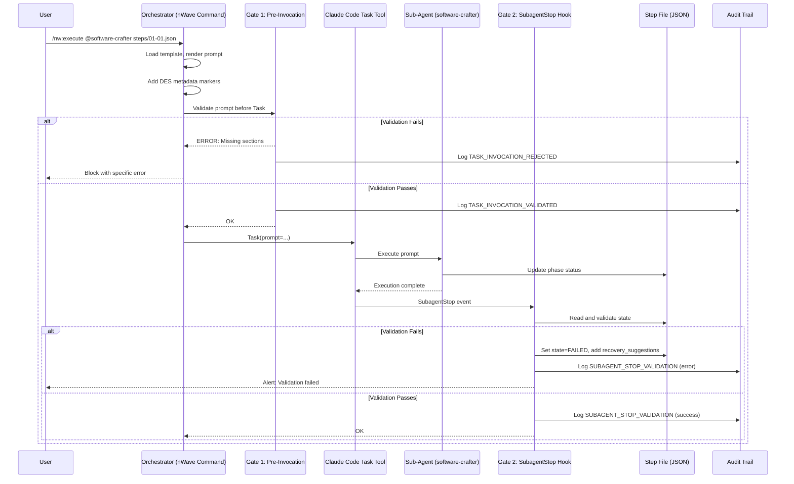
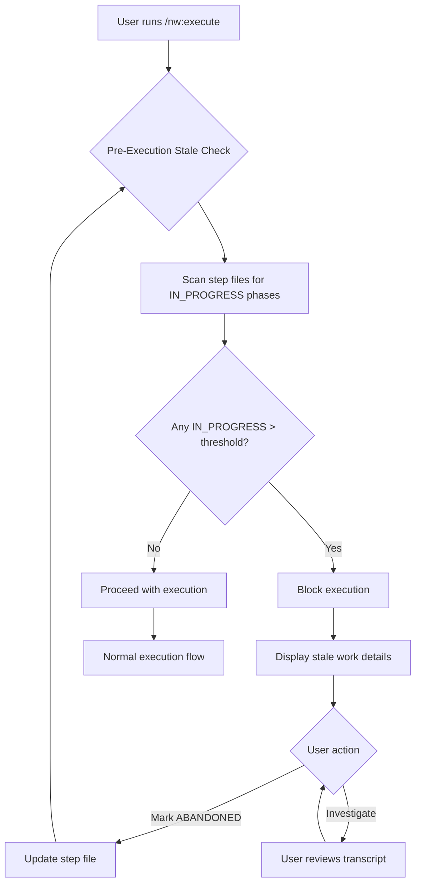
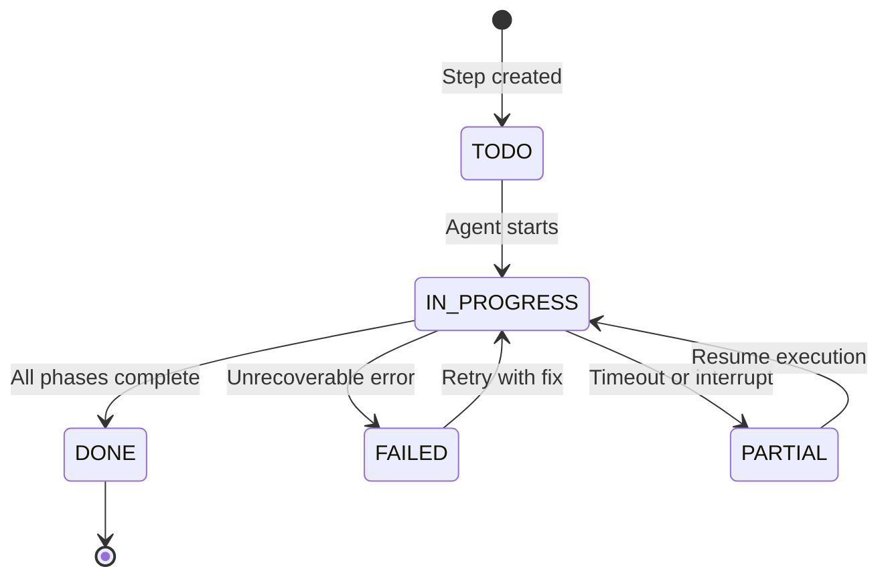

# Deterministic Execution System (DES) - Architecture Design

**Version:** 1.0
**Date:** 2026-01-22
**Author:** Morgan (Solution Architect)
**Status:** DESIGN Wave Deliverable
**Branch:** `determinism`

---

## 1. System Overview

### 1.1 Purpose

The Deterministic Execution System (DES) ensures reliable, verifiable execution of multi-step workflows in Claude Code. It guarantees that:

1. Every phase of the 14-phase TDD cycle is either executed or explicitly skipped with documentation
2. Sub-agents receive complete instructions (no context dilution)
3. Abandoned or incomplete work is detected immediately
4. A complete audit trail exists for compliance verification

### 1.2 Design Philosophy

| Principle | Description |
|-----------|-------------|
| **Simplicity First** | The simplest solution that meets requirements |
| **No Magic** | Explicit over implicit behavior |
| **Fail Safe** | Block execution on validation failure |
| **Observable** | Complete audit trail for debugging |
| **Recoverable** | Clear recovery path for every failure mode |
| **Portable** | Works on any system with Python 3.11+ |
| **Zero Dependencies** | Pure Python, no databases, no message queues, no daemons |

### 1.3 Critical Constraints

| Constraint | Impact | Mitigation |
|------------|--------|------------|
| **max_turns NOT available** | Cannot enforce turn limits programmatically | Prompt-based turn discipline with self-monitoring |
| **No mid-execution messages** | Cannot correct agent during execution | Front-loaded validation; complete prompts upfront |
| **SubagentStop hook only** | No pre-Task hook available | Orchestrator-level validation before Task invocation |
| **Session restart required** | Hook config changes need restart | Document in setup instructions |

---

## 2. Architecture Layers

```
+-----------------------------------------------------------------------------+
|                      DETERMINISTIC EXECUTION SYSTEM                          |
+-----------------------------------------------------------------------------+
|                                                                              |
|  +------------------------------------------------------------------------+  |
|  | LAYER 1: COMMAND-ORIGIN FILTERING                                      |  |
|  |------------------------------------------------------------------------|  |
|  | - Tag Task invocations with origin (command vs ad-hoc)                 |  |
|  | - Only command-origin tasks require validation                         |  |
|  | - Pass-through for non-command Task calls                              |  |
|  +------------------------------------------------------------------------+  |
|                                    |                                         |
|                                    v                                         |
|  +------------------------------------------------------------------------+  |
|  | LAYER 2: PROMPT TEMPLATE ENGINE                                        |  |
|  |------------------------------------------------------------------------|  |
|  | - Mandatory templates per command type                                 |  |
|  | - Template validation BEFORE Task invocation                           |  |
|  | - Required sections: TDD_14_PHASES, QUALITY_GATES, etc.                |  |
|  | - Machine-readable structure for validation                            |  |
|  +------------------------------------------------------------------------+  |
|                                    |                                         |
|                                    v                                         |
|  +------------------------------------------------------------------------+  |
|  | LAYER 3: EXECUTION LIFECYCLE MANAGEMENT                                |  |
|  |------------------------------------------------------------------------|  |
|  | - Prompt-based turn discipline (no max_turns available)                |  |
|  | - Boundary rules to prevent scope creep                                |  |
|  | - State machine for valid transitions                                  |  |
|  | - Session-scoped stale detection (pre-execution check)                 |  |
|  +------------------------------------------------------------------------+  |
|                                    |                                         |
|                                    v                                         |
|  +------------------------------------------------------------------------+  |
|  | LAYER 4: VALIDATION GATES                                              |  |
|  |------------------------------------------------------------------------|  |
|  | GATE 1: Pre-Invocation    -> Template completeness check               |  |
|  | GATE 2: SubagentStop Hook -> Post-execution state verification         |  |
|  | GATE 3: Pre-Commit Hook   -> Final validation before commit (existing) |  |
|  | GATE 4: Audit Trail       -> Immutable log of state transitions        |  |
|  +------------------------------------------------------------------------+  |
|                                                                              |
+-----------------------------------------------------------------------------+
```

---

## 3. Data Flow Diagrams

### 3.1 Command Execution Flow



### 3.2 Stale Execution Detection Flow



### 3.3 State Transition Flow



---

## 4. Component Responsibilities

### 4.1 Layer 1: Command Filter

**Purpose:** Distinguish between DES-managed and ad-hoc Task invocations

**Inputs:**
- Task prompt (string)

**Outputs:**
- Validation requirement decision (boolean)
- Extracted metadata (origin, step file path)

**Implementation:**
```python
def should_validate(prompt: str) -> bool:
    """Check if this Task invocation requires DES validation."""
    return "<!-- DES-VALIDATION: required -->" in prompt

def extract_metadata(prompt: str) -> dict:
    """Extract DES metadata from prompt."""
    origin = re.search(r'<!-- DES-ORIGIN: (.+?) -->', prompt)
    step_file = re.search(r'<!-- DES-STEP-FILE: (.+?) -->', prompt)
    return {
        "origin": origin.group(1) if origin else "ad-hoc",
        "step_file": step_file.group(1) if step_file else None,
        "requires_validation": should_validate(prompt)
    }
```

### 4.2 Layer 2: Template Engine

**Purpose:** Ensure prompts contain all mandatory sections

**Inputs:**
- Template file path
- Step file data
- Agent configuration

**Outputs:**
- Rendered prompt with DES markers
- Validation result (pass/fail with errors)

**Mandatory Sections:**
1. `DES_METADATA` - Origin, step file, validation flag
2. `AGENT_IDENTITY` - Who the agent is
3. `TASK_CONTEXT` - What they're working on
4. `TDD_14_PHASES` - Complete phase list with criteria
5. `QUALITY_GATES` - G1-G6 gate definitions
6. `OUTCOME_RECORDING` - How to record results
7. `BOUNDARY_RULES` - Scope limitations
8. `TIMEOUT_INSTRUCTION` - Turn discipline

### 4.3 Layer 3: Lifecycle Manager

**Purpose:** Manage execution state and prevent runaway execution

**Responsibilities:**
1. State machine enforcement
2. Prompt-based turn discipline
3. Session-scoped stale detection
4. Boundary rule specification

**State Machine:**
```yaml
states:
  TODO:
    transitions: [IN_PROGRESS]
  IN_PROGRESS:
    transitions: [DONE, FAILED, PARTIAL]
  DONE:
    terminal: true
  FAILED:
    transitions: [IN_PROGRESS]  # Retry
  PARTIAL:
    transitions: [IN_PROGRESS]  # Resume

phase_states:
  NOT_EXECUTED:
    transitions: [IN_PROGRESS]
  IN_PROGRESS:
    transitions: [EXECUTED, SKIPPED, FAILED]
  EXECUTED:
    requires: [outcome]
  SKIPPED:
    requires: [blocked_by]
```

### 4.4 Layer 4: Validation Gates

**Purpose:** Multi-point validation throughout execution lifecycle

| Gate | Trigger | Action |
|------|---------|--------|
| Gate 1 | Before Task invocation | Block if template incomplete |
| Gate 2 | SubagentStop hook | Detect abandoned/invalid phases |
| Gate 3 | Pre-commit hook | Final validation before git commit |
| Gate 4 | All events | Append to daily audit log |

---

## 5. Error Handling Strategy

### 5.1 Failure Mode Matrix

| Failure Mode | Detection | Recovery |
|--------------|-----------|----------|
| **Agent Crash** | IN_PROGRESS phases after SubagentStop | Reset phase to NOT_EXECUTED, preserve completed work |
| **Agent Stuck** | Self-monitoring via TIMEOUT_INSTRUCTION | Agent returns PARTIAL, recovery suggestions added |
| **Agent Runaway** | Git diff vs allowed_file_patterns | Warning logged, scope violation flagged |
| **Silent Completion** | All phases NOT_EXECUTED after completion | FAILED state with transcript review suggestion |
| **Template Error** | Pre-invocation validation | Block with specific missing section/phase |

### 5.2 Recovery Suggestions

Every failure automatically populates `recovery_suggestions` array:

```json
{
  "state": {
    "status": "FAILED",
    "failure_reason": "Phase GREEN_UNIT left IN_PROGRESS (abandoned)",
    "recovery_suggestions": [
      "Review agent transcript at /path/to/transcript.jsonl",
      "Reset GREEN_UNIT phase status to NOT_EXECUTED",
      "Run /nw:execute again to resume from GREEN_UNIT"
    ]
  }
}
```

---

## 6. Concurrency Handling

### 6.1 File Locking Strategy

For MVP, DES uses **session-scoped pre-execution check** instead of file locking:

1. Before `/nw:execute`, scan for IN_PROGRESS phases
2. Block execution if stale work found (> 30 min threshold)
3. User must resolve stale work before proceeding

**Rationale:**
- No persistent daemon required
- No database for lock coordination
- Simpler implementation
- Appropriate for single-user workflows (MVP)

### 6.2 Future Consideration (v2)

For parallel execution support, add:
- File-based advisory locks (`fcntl.flock`)
- Step file `locked_by` field with agent_id
- Lock acquisition timeout (30 seconds)

---

## 7. Audit Trail Design

### 7.1 Daily Log Rotation

Audit logs rotate daily to prevent unbounded growth:
- Pattern: `audit-YYYY-MM-DD.log`
- Location: Same directory as step files
- Format: JSONL (one JSON object per line)

### 7.2 Event Types

| Event | Description |
|-------|-------------|
| `TASK_INVOCATION_STARTED` | Task execution initiated |
| `TASK_INVOCATION_VALIDATED` | Pre-invocation validation passed |
| `TASK_INVOCATION_REJECTED` | Pre-invocation validation failed |
| `PHASE_STARTED` | TDD phase execution began |
| `PHASE_COMPLETED` | TDD phase completed (with outcome) |
| `PHASE_SKIPPED` | TDD phase skipped (with blocked_by) |
| `PHASE_FAILED` | TDD phase failed |
| `SUBAGENT_STOP_VALIDATION` | Post-execution validation result |
| `STALE_RESOLUTION` | User resolved stale execution |
| `COMMIT_VALIDATION_PASSED` | Pre-commit hook passed |
| `COMMIT_VALIDATION_FAILED` | Pre-commit hook failed |

### 7.3 Log Entry Schema

```json
{
  "timestamp": "2026-01-22T14:30:00.000Z",
  "event": "PHASE_COMPLETED",
  "step_file": "steps/01-01.json",
  "phase": "GREEN_UNIT",
  "outcome": "PASS",
  "duration_ms": 45000
}
```

---

## 8. Integration Points

### 8.1 Claude Code Hooks

```json
{
  "hooks": {
    "SubagentStop": [
      {
        "matcher": "*",
        "hooks": [
          {
            "type": "command",
            "command": "python nWave/hooks/post_subagent_validation.py",
            "timeout": 30
          }
        ]
      }
    ]
  }
}
```

### 8.2 nWave Commands

| Command | DES Integration |
|---------|-----------------|
| `/nw:execute` | Full validation (Gate 1, 2, 3, 4) |
| `/nw:develop` | Full validation for sub-tasks |
| `/nw:baseline` | Partial validation |
| `/nw:research` | No validation |
| `/nw:review` | No validation |

### 8.3 Pre-Commit Hook

Existing `pre_commit_tdd_phases.py` enhanced to:
1. Check daily audit logs for Gate 2 failures
2. Validate all phases EXECUTED or validly SKIPPED
3. Reject commits with DEFERRED blocked_by prefix

---

## 9. Performance Considerations

### 9.1 Validation Overhead

| Operation | Target | Measurement |
|-----------|--------|-------------|
| Pre-invocation validation | < 500ms | Time to parse and validate prompt |
| Post-execution validation | < 2s | Time to read step file and validate |
| Audit log write | < 100ms | Time to append JSONL entry |
| Stale check scan | < 1s | Time to scan step files |

### 9.2 Token Impact

DES adds prompt overhead for mandatory sections. Estimated:
- DES metadata markers: ~50 tokens
- TDD_14_PHASES section: ~400 tokens
- QUALITY_GATES section: ~150 tokens
- OUTCOME_RECORDING section: ~200 tokens
- BOUNDARY_RULES section: ~100 tokens
- TIMEOUT_INSTRUCTION section: ~150 tokens
- **Total overhead: ~1,050 tokens per step execution**

User explicitly deferred optimization: "For now let's not think about optimizing consumption."

---

## 10. Security Considerations

### 10.1 Step File Integrity

- Step files are user-editable (JSON format)
- DES validates structure but cannot prevent manual tampering
- Audit trail provides evidence of actual execution

### 10.2 Audit Trail Integrity

- Append-only by design (no delete/modify operations)
- File permissions: user-writable (standard)
- For strong integrity, consider SHA-256 chain (v2)

### 10.3 Prompt Injection

- DES markers use HTML comment syntax (`<!-- -->`)
- Markers are searched with exact match, not parsed
- Agent instructions cannot override DES validation

---

## 11. Deployment Model

### 11.1 Installation

DES requires no installation beyond:
1. Python 3.11+ (standard library only)
2. Claude Code with SubagentStop hook support
3. Configuration in `.claude/settings.local.json`

### 11.2 File Locations

```
project/
├── .claude/
│   └── settings.local.json      # Hook configuration
├── nWave/
│   ├── hooks/
│   │   ├── post_subagent_validation.py
│   │   ├── validate_prompt_template.py
│   │   └── pre_commit_tdd_phases.py
│   ├── templates/
│   │   └── prompt-templates/
│   │       ├── execute-step.template.md
│   │       └── _section-definitions.yaml
│   └── utils/
│       ├── audit.py
│       └── stale_detection.py
└── docs/
    └── feature/
        └── {project-id}/
            └── steps/
                ├── 01-01.json   # Step file
                ├── 01-02.json
                └── audit-2026-01-22.log  # Daily audit
```

---

## 12. Acceptance Criteria Traceability

| User Story | Architecture Component | Validated By |
|------------|----------------------|--------------|
| US-001 | Layer 1: Command Filter | Gate 1 |
| US-002 | Layer 2: Template Engine | Gate 1 |
| US-003 | Layer 4: SubagentStop Hook | Gate 2 |
| US-004 | Layer 4: Audit Trail | Gate 4 |
| US-005 | Error Handling Strategy | Gate 2 |
| US-006 | Layer 3: Turn Discipline | Prompt + Gate 2 |
| US-007 | Layer 3: Boundary Rules | Prompt + Gate 2 |
| US-008 | Layer 3: Stale Detection | Pre-execution check |
| US-009 | Template Engine | Educational notes |

---

## 13. Open Design Decisions

### 13.1 Resolved

| Decision | Resolution | Rationale |
|----------|------------|-----------|
| Q1: Hook context access | Use `agent_transcript_path` | Empirically verified - prompt in first line |
| Timeout mechanism | Prompt-based only | max_turns is CLI-only (not available) |
| Stale detection | Session-scoped check | Zero dependencies, no daemon |

### 13.2 Deferred to v2

| Decision | Default for v1 | Future Option |
|----------|----------------|---------------|
| Parallel execution | Sequential only | File locking + coordination |
| Template inheritance | No inheritance | Base templates with extends |
| Token optimization | Full overhead | Compressed sections |
| Audit chain integrity | Append-only | SHA-256 hash chain |

---

*Architecture designed by Morgan (solution-architect) during DESIGN wave.*
