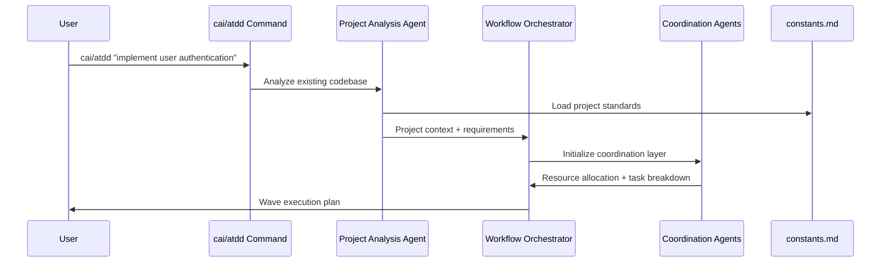
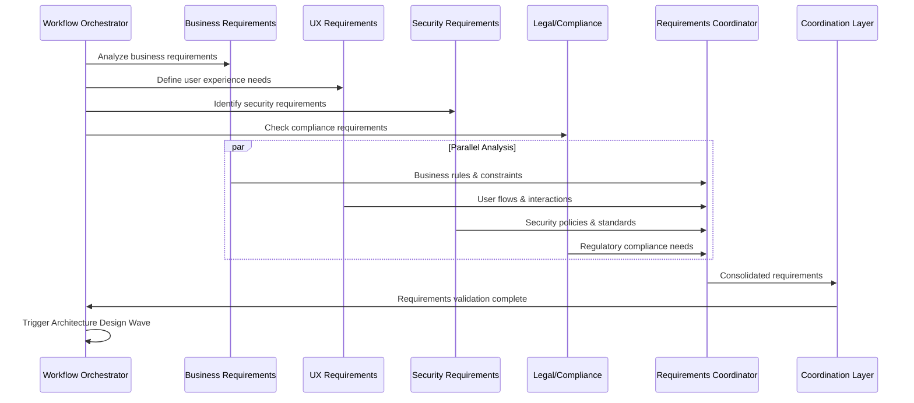
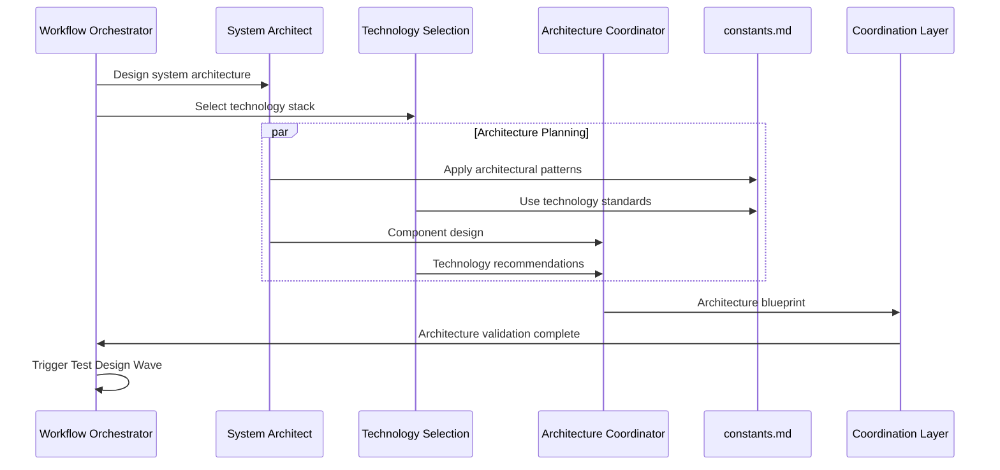
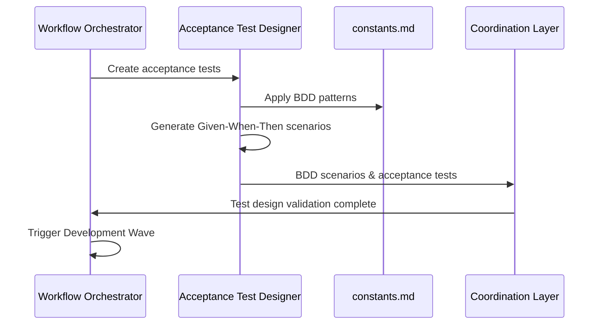
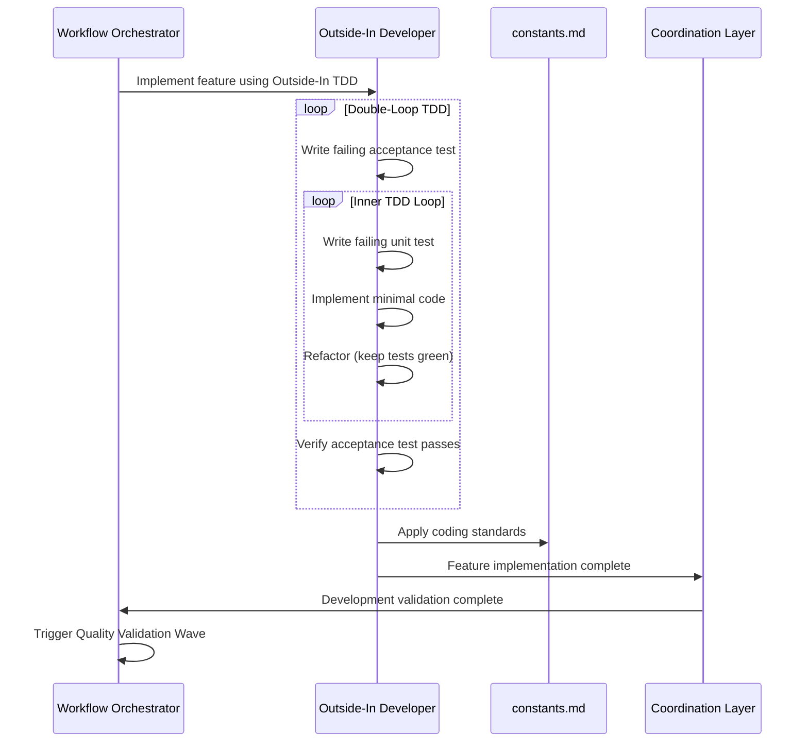
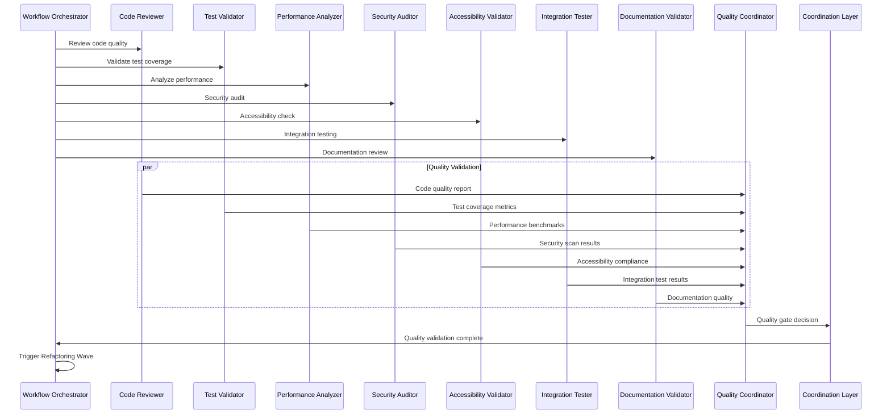
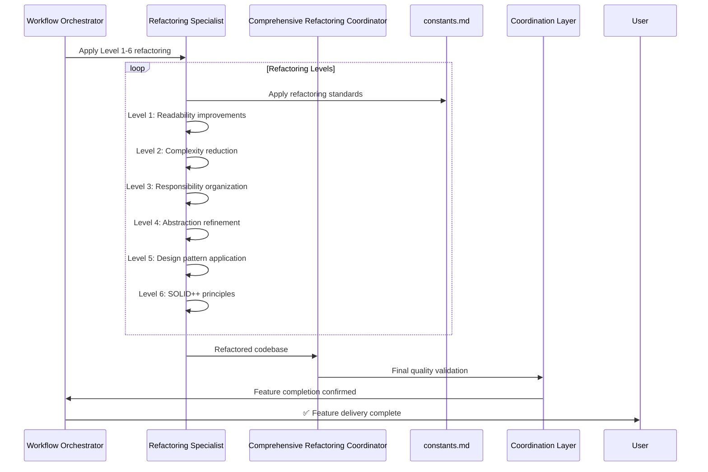

# AI-Craft Framework Workflow Coordination Diagram

## Complete ATDD Workflow with Agent Coordination

```mermaid
graph TB
    %% User Interaction Layer
    User[👤 User] --> CMD[🎯 cai/atdd "feature description"]
    
    %% Command Processing Layer
    CMD --> PA[🔍 Project Analysis Agent]
    PA --> |Analyzes existing codebase| WF[🌊 Workflow Orchestrator]
    
    %% Wave Processing Architecture
    WF --> |Initiates ATDD Waves| W1[🌊 Wave 1: Requirements Analysis]
    WF --> |Coordinates| W2[🌊 Wave 2: Architecture Design]
    WF --> |Orchestrates| W3[🌊 Wave 3: Test Design]
    WF --> |Manages| W4[🌊 Wave 4: Development]
    WF --> |Validates| W5[🌊 Wave 5: Quality Validation]
    WF --> |Optimizes| W6[🌊 Wave 6: Refactoring]
    
    %% Requirements Analysis Wave (Blue Family - 5 Agents)
    W1 --> BA[🟦 Business Requirements Analyst]
    W1 --> UX[🟦 UX Requirements Specialist]
    W1 --> SEC[🟦 Security Requirements Expert]
    W1 --> LEG[🟦 Legal & Compliance Advisor]
    W1 --> REQ[🟦 Requirements Coordinator]
    
    BA --> |Business rules & constraints| REQ
    UX --> |User experience requirements| REQ
    SEC --> |Security requirements| REQ
    LEG --> |Compliance requirements| REQ
    REQ --> |Consolidated requirements| W2
    
    %% Architecture Design Wave (Orange Family - 3 Agents)
    W2 --> SA[🟧 System Architect]
    W2 --> TS[🟧 Technology Selection Expert]
    W2 --> AC[🟧 Architecture Coordinator]
    
    SA --> |System design| AC
    TS --> |Technology stack| AC
    AC --> |Architecture blueprint| W3
    
    %% Test Design Wave (Red Family - 1 Agent)
    W3 --> ATD[❤️ Acceptance Test Designer]
    ATD --> |BDD scenarios & acceptance tests| W4
    
    %% Development Wave (Green Family - 1 Agent)
    W4 --> OID[🟢 Outside-In Developer]
    OID --> |Feature implementation| W5
    
    %% Quality Validation Wave (Red Family - 8 Agents)
    W5 --> CodeR[❤️ Code Reviewer]
    W5 --> TestV[❤️ Test Validator]
    W5 --> PerfA[❤️ Performance Analyzer]
    W5 --> SecA[❤️ Security Auditor]
    W5 --> AccV[❤️ Accessibility Validator]
    W5 --> IntT[❤️ Integration Tester]
    W5 --> DocV[❤️ Documentation Validator]
    W5 --> QC[❤️ Quality Coordinator]
    
    CodeR --> |Code quality report| QC
    TestV --> |Test coverage & quality| QC
    PerfA --> |Performance metrics| QC
    SecA --> |Security scan results| QC
    AccV --> |Accessibility compliance| QC
    IntT --> |Integration test results| QC
    DocV --> |Documentation quality| QC
    QC --> |Quality gate decision| W6
    
    %% Refactoring Wave (Blue Family - 2 Agents)
    W6 --> RefS[🔵 Refactoring Specialist]
    W6 --> CompR[🔵 Comprehensive Refactoring Coordinator]
    
    RefS --> |Level 1-6 refactoring| CompR
    CompR --> |Final quality validation| COMPLETE[✅ Feature Complete]
    
    %% Coordination Layer (Black Family - 11 Agents)
    subgraph COORD[⚫ Coordination Agents]
        PM[Project Manager]
        TC[Task Coordinator]
        PC[Progress Coordinator]
        DM[Dependency Manager]
        RM[Resource Manager]
        CM[Communication Manager]
        EM[Error Manager]
        BM[Backup Manager]
        VM[Version Manager]
        IM[Integration Manager]
        RC[Rollback Coordinator]
    end
    
    WF -.-> COORD
    COORD -.-> |Manages all waves| W1
    COORD -.-> |Coordinates| W2
    COORD -.-> |Orchestrates| W3
    COORD -.-> |Tracks progress| W4
    COORD -.-> |Validates quality| W5
    COORD -.-> |Ensures completion| W6
    
    %% Constants & Configuration
    subgraph CONFIG[📋 Centralized Configuration]
        CONST[constants.md]
        WORKFLOWS[Workflow Templates]
        PATTERNS[Best Practice Patterns]
        STANDARDS[Quality Standards]
    end
    
    CONFIG -.-> |Provides configuration to| COORD
    CONFIG -.-> |Standards for| W1
    CONFIG -.-> |Patterns for| W2
    CONFIG -.-> |Templates for| W3
    CONFIG -.-> |Guidelines for| W4
    CONFIG -.-> |Criteria for| W5
    CONFIG -.-> |Levels for| W6
    
    %% Legacy Agent Integration
    subgraph LEGACY[📦 Legacy Agents]
        L1[Deprecated Agent 1]
        L2[Deprecated Agent 2]
        L3[Migration Tools]
    end
    
    LEGACY -.-> |Migration support| COORD
    
    %% Output Artifacts
    COMPLETE --> ARTIFACTS[📊 Deliverables]
    
    subgraph ARTIFACTS[📊 Final Deliverables]
        FEAT[✅ Working Feature]
        TESTS[🧪 Complete Test Suite]
        DOCS[📖 Documentation]
        ARCH[🏗️ Architecture Updates]
        METRICS[📈 Quality Metrics]
    end

    %% Styling
    classDef blueFamily fill:#e1f5fe,stroke:#0277bd,stroke-width:2px
    classDef orangeFamily fill:#fff3e0,stroke:#ef6c00,stroke-width:2px
    classDef redFamily fill:#ffebee,stroke:#c62828,stroke-width:2px
    classDef greenFamily fill:#e8f5e8,stroke:#2e7d32,stroke-width:2px
    classDef blueRefactor fill:#e3f2fd,stroke:#1565c0,stroke-width:2px
    classDef blackFamily fill:#f5f5f5,stroke:#424242,stroke-width:2px
    classDef wave fill:#f0f4c3,stroke:#827717,stroke-width:3px
    classDef config fill:#fce4ec,stroke:#ad1457,stroke-width:2px
    classDef legacy fill:#efebe9,stroke:#5d4037,stroke-width:1px,stroke-dasharray: 5 5
    classDef output fill:#e0f2f1,stroke:#00695c,stroke-width:3px
    
    class BA,UX,SEC,LEG,REQ blueFamily
    class SA,TS,AC orangeFamily
    class ATD,CodeR,TestV,PerfA,SecA,AccV,IntT,DocV,QC redFamily
    class OID greenFamily
    class RefS,CompR blueRefactor
    class PM,TC,PC,DM,RM,CM,EM,BM,VM,IM,RC blackFamily
    class W1,W2,W3,W4,W5,W6,WF wave
    class CONFIG,CONST,WORKFLOWS,PATTERNS,STANDARDS config
    class LEGACY,L1,L2,L3 legacy
    class COMPLETE,ARTIFACTS,FEAT,TESTS,DOCS,ARCH,METRICS output
```

## Detailed Agent Interaction Flow

### Phase 1: Project Analysis & Wave Initialization



### Phase 2: Requirements Analysis Wave (Blue Family)



### Phase 3: Architecture Design Wave (Orange Family)



### Phase 4: Test Design Wave (Red Family)



### Phase 5: Development Wave (Green Family)



### Phase 6: Quality Validation Wave (Red Family)



### Phase 7: Refactoring Wave (Blue Family)



## Agent Communication Patterns

### 1. Wave-to-Wave Handoff Protocol
```
Wave N Output → Coordination Layer → Quality Gate → Wave N+1 Input
```

### 2. Intra-Wave Agent Coordination
```
Parallel Processing → Result Aggregation → Wave Coordinator → Next Wave
```

### 3. Cross-Wave Communication
```
Any Wave ↔ Coordination Layer ↔ constants.md ↔ All Other Waves
```

### 4. Error Handling & Rollback
```
Error Detection → Coordination Layer → Rollback Coordinator → Previous Stable State
```

### 5. Progress Tracking
```
Agent Progress → Progress Coordinator → User Feedback → Workflow Adjustment
```

## Key Coordination Principles

### 🎯 Single Responsibility Principle
Each agent has one specific expertise area and clear boundaries

### 🌊 Wave Processing Architecture  
Clean context isolation between phases with controlled handoffs

### 📋 Centralized Configuration
constants.md provides unified standards across all agents

### ⚫ Coordination Layer
11 coordination agents manage cross-cutting concerns

### 🔄 Continuous Feedback
Real-time progress tracking and quality validation

### 🛡️ Error Recovery
Comprehensive rollback and retry mechanisms

### 📊 Evidence-Based Decisions
All agent decisions backed by measurable criteria

---

This diagram shows how 33+ specialized agents work together in a coordinated ATDD workflow, ensuring comprehensive feature delivery with quality validation at every stage.