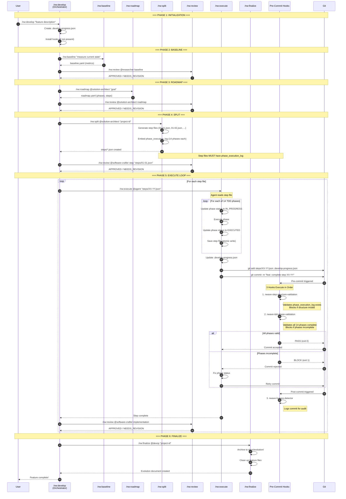

# nWave DEVELOP Workflow - Sequenza Temporale

## Diagramma Completo



## Ordine Temporale dei Hook

```
COMMIT TRIGGER
     │
     ▼
┌────────────────────────────────────────────────────────┐
│ PRE-COMMIT PHASE                                       │
├────────────────────────────────────────────────────────┤
│                                                        │
│  1. nwave-step-structure-validation                    │
│     ├─ Triggered by: files matching steps/*.json      │
│     ├─ Validates: phase_execution_log exists          │
│     ├─ Validates: All 14 phases present               │
│     └─ Exit 1 → BLOCKS commit if invalid              │
│                                                        │
│  2. nwave-tdd-phase-validation                         │
│     ├─ Triggered by: always_run=true                  │
│     ├─ Validates: All phases EXECUTED or SKIPPED      │
│     ├─ Validates: Progress file consistency           │
│     └─ Exit 1 → BLOCKS commit if incomplete           │
│                                                        │
└────────────────────────────────────────────────────────┘
     │
     ▼ (if all pass)
┌────────────────────────────────────────────────────────┐
│ COMMIT CREATED                                         │
└────────────────────────────────────────────────────────┘
     │
     ▼
┌────────────────────────────────────────────────────────┐
│ POST-COMMIT PHASE                                      │
├────────────────────────────────────────────────────────┤
│                                                        │
│  3. nwave-bypass-detector                              │
│     ├─ Logs commit hash, message, author              │
│     ├─ Records if --no-verify was used                │
│     └─ Never blocks (audit only)                      │
│                                                        │
└────────────────────────────────────────────────────────┘
```

## Flusso di Validazione Step File

```
┌─────────────────────┐
│    /nw:split        │
│   (generates)       │
└──────────┬──────────┘
           │
           ▼
┌─────────────────────────────────────────┐
│          STEP FILE (XX-YY.json)         │
├─────────────────────────────────────────┤
│  {                                      │
│    "task_id": "01-01",                  │
│    "tdd_cycle": {                       │
│      "phase_execution_log": [           │
│        {"phase_name": "PREPARE",        │
│         "status": "NOT_EXECUTED"},      │
│        ... (14 total)                   │
│      ]                                  │
│    }                                    │
│  }                                      │
└──────────┬──────────────────────────────┘
           │
           ▼
┌─────────────────────┐
│    /nw:execute      │
│   (updates phases)  │
└──────────┬──────────┘
           │
           ▼
┌─────────────────────────────────────────┐
│          STEP FILE (after execute)      │
├─────────────────────────────────────────┤
│  "phase_execution_log": [               │
│    {"phase_name": "PREPARE",            │
│     "status": "EXECUTED",               │
│     "outcome": "PASS"},                 │
│    ... (all 14 phases EXECUTED)         │
│  ]                                      │
└──────────┬──────────────────────────────┘
           │
           ▼
┌─────────────────────┐
│     git commit      │
└──────────┬──────────┘
           │
           ▼
┌─────────────────────────────────────────┐
│         PRE-COMMIT HOOKS                │
├─────────────────────────────────────────┤
│                                         │
│  ┌───────────────────────────────────┐  │
│  │ 1. STRUCTURE VALIDATION           │  │
│  │    ✓ phase_execution_log exists   │  │
│  │    ✓ 14 phases present            │  │
│  └───────────────────────────────────┘  │
│                 │                       │
│                 ▼                       │
│  ┌───────────────────────────────────┐  │
│  │ 2. PHASE VALIDATION               │  │
│  │    ✓ All phases EXECUTED/SKIPPED  │  │
│  │    ✓ No IN_PROGRESS phases        │  │
│  │    ✓ Progress file consistent     │  │
│  └───────────────────────────────────┘  │
│                                         │
└──────────┬──────────────────────────────┘
           │
           ▼
      COMMIT OK ✓
```

## Script Versions (v1.2.14)

| Script | Location | Purpose |
|--------|----------|---------|
| `install_nwave_target_hooks.py` | `~/.claude/scripts/` | Installa hooks nel progetto target |
| `validate_step_file.py` | `~/.claude/scripts/` | Valida struttura step dopo /nw:split |
| `nwave-step-structure-validator.py` | `{project}/scripts/hooks/` | Hook pre-commit per struttura |
| `nwave-tdd-validator.py` | `{project}/scripts/hooks/` | Hook pre-commit per fasi |
| `nwave-bypass-detector.py` | `{project}/scripts/hooks/` | Hook post-commit per audit |

## Gestione Errori

### Errore: Step file senza phase_execution_log

```
❌ docs/feature/auth/steps/01-01.json:
   • Missing phase_execution_log - step cannot track TDD phases

❌ nWave Structure: COMMIT BLOCKED
   Step files must have phase_execution_log with all 14 phases
   Run /nw:split to regenerate step files correctly
```

**Soluzione**: Rigenerare step files con `/nw:split`

### Errore: Fasi incomplete

```
❌ docs/feature/auth/steps/01-01.json:
   • REFACTOR_L2: Phase NOT_EXECUTED
   • REFACTOR_L3: Phase NOT_EXECUTED

❌ nWave TDD: COMMIT BLOCKED - Complete all 14 phases first
   Phases: PREPARE → RED → GREEN → REVIEW → REFACTOR → COMMIT
```

**Soluzione**: Completare tutte le fasi TDD prima del commit

### Errore: Progress file non sincronizzato

```
❌ Progress file issues:
   • Step 01-02 not tracked in progress file (current_step=01-01, completed=0)
   • ⚠️  Progress file not staged - run: git add .develop-progress.json
```

**Soluzione**: Aggiornare e stagare il progress file
