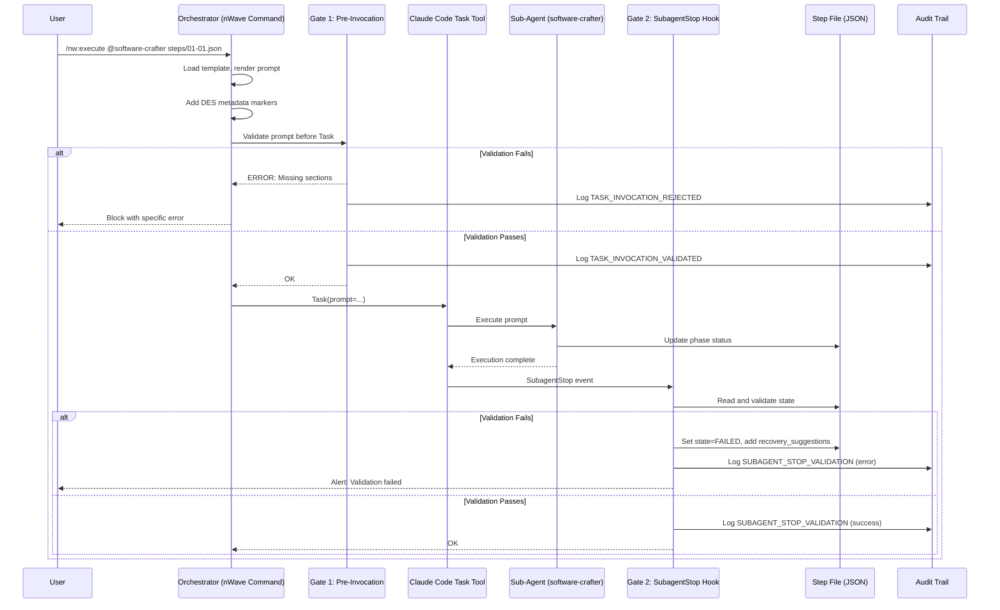
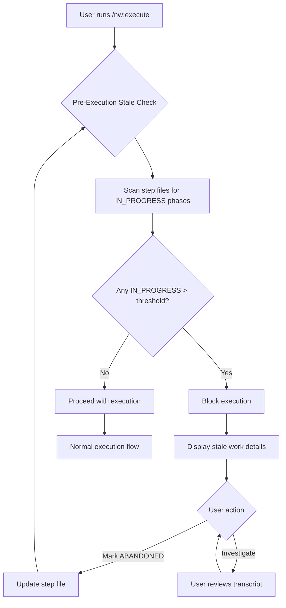
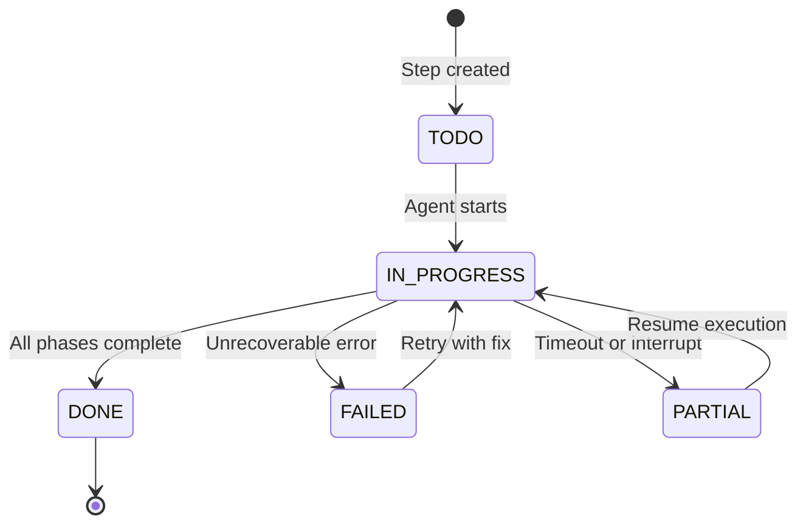

# Deterministic Execution System (DES) - Architecture Design

**Version:** 1.1
**Date:** 2026-01-23
**Author:** Morgan (Solution Architect)
**Status:** DESIGN Wave Deliverable - Peer Review Revisions Applied
**Branch:** `determinism`
**Review Status:** Addresses CRITICAL and HIGH severity issues from solution-architect-reviewer

---

## 1. System Overview

### 1.1 Purpose

The Deterministic Execution System (DES) ensures reliable, verifiable execution of multi-step workflows in Claude Code. It guarantees that:

1. Every phase of the 14-phase TDD cycle is either executed or explicitly skipped with documentation
2. Sub-agents receive complete instructions (no context dilution)
3. Abandoned or incomplete work is detected immediately
4. A complete audit trail exists for compliance verification

### 1.2 Design Philosophy

| Principle | Description |
|-----------|-------------|
| **Simplicity First** | The simplest solution that meets requirements |
| **No Magic** | Explicit over implicit behavior |
| **Fail Safe** | Block execution on validation failure |
| **Observable** | Complete audit trail for debugging |
| **Recoverable** | Clear recovery path for every failure mode |
| **Portable** | Works on any system with Python 3.11+ |
| **Zero Dependencies** | Pure Python, no databases, no message queues, no daemons |

### 1.3 Critical Constraints

| Constraint | Impact | Mitigation |
|------------|--------|------------|
| **max_turns NOT available** | Cannot enforce turn limits programmatically | Prompt-based turn discipline with self-monitoring |
| **No mid-execution messages** | Cannot correct agent during execution | Front-loaded validation; complete prompts upfront |
| **SubagentStop hook only** | No pre-Task hook available | Orchestrator-level validation before Task invocation |
| **Session restart required** | Hook config changes need restart | Document in setup instructions |

---

## 2. Architecture Layers

```
+-----------------------------------------------------------------------------+
|                      DETERMINISTIC EXECUTION SYSTEM                          |
+-----------------------------------------------------------------------------+
|                                                                              |
|  +------------------------------------------------------------------------+  |
|  | LAYER 1: COMMAND-ORIGIN FILTERING                                      |  |
|  |------------------------------------------------------------------------|  |
|  | - Tag Task invocations with origin (command vs ad-hoc)                 |  |
|  | - Only command-origin tasks require validation                         |  |
|  | - Pass-through for non-command Task calls                              |  |
|  +------------------------------------------------------------------------+  |
|                                    |                                         |
|                                    v                                         |
|  +------------------------------------------------------------------------+  |
|  | LAYER 2: PROMPT TEMPLATE ENGINE                                        |  |
|  |------------------------------------------------------------------------|  |
|  | - Mandatory templates per command type                                 |  |
|  | - Template validation BEFORE Task invocation                           |  |
|  | - Required sections: TDD_14_PHASES, QUALITY_GATES, etc.                |  |
|  | - Machine-readable structure for validation                            |  |
|  +------------------------------------------------------------------------+  |
|                                    |                                         |
|                                    v                                         |
|  +------------------------------------------------------------------------+  |
|  | LAYER 3: EXECUTION LIFECYCLE MANAGEMENT                                |  |
|  |------------------------------------------------------------------------|  |
|  | - Prompt-based turn discipline (no max_turns available)                |  |
|  | - Boundary rules to prevent scope creep                                |  |
|  | - State machine for valid transitions                                  |  |
|  | - Session-scoped stale detection (pre-execution check)                 |  |
|  +------------------------------------------------------------------------+  |
|                                    |                                         |
|                                    v                                         |
|  +------------------------------------------------------------------------+  |
|  | LAYER 4: VALIDATION GATES                                              |  |
|  |------------------------------------------------------------------------|  |
|  | GATE 1: Pre-Invocation    -> Template completeness check               |  |
|  | GATE 2: SubagentStop Hook -> Post-execution state verification         |  |
|  | GATE 3: Pre-Commit Hook   -> Final validation before commit (existing) |  |
|  | GATE 4: Audit Trail       -> Immutable log of state transitions        |  |
|  +------------------------------------------------------------------------+  |
|                                                                              |
+-----------------------------------------------------------------------------+
```

---

## 3. Data Flow Diagrams

### 3.1 Command Execution Flow



### 3.2 Stale Execution Detection Flow



### 3.3 State Transition Flow



---

## 4. Component Responsibilities

### 4.1 Layer 1: Command Filter

**Purpose:** Distinguish between DES-managed and ad-hoc Task invocations

**Inputs:**
- Task prompt (string)

**Outputs:**
- Validation requirement decision (boolean)
- Extracted metadata (origin, step file path)

**Implementation:**
```python
def should_validate(prompt: str) -> bool:
    """Check if this Task invocation requires DES validation."""
    return "<!-- DES-VALIDATION: required -->" in prompt

def extract_metadata(prompt: str) -> dict:
    """Extract DES metadata from prompt."""
    origin = re.search(r'<!-- DES-ORIGIN: (.+?) -->', prompt)
    step_file = re.search(r'<!-- DES-STEP-FILE: (.+?) -->', prompt)
    return {
        "origin": origin.group(1) if origin else "ad-hoc",
        "step_file": step_file.group(1) if step_file else None,
        "requires_validation": should_validate(prompt)
    }
```

### 4.2 Layer 2: Template Engine

**Purpose:** Ensure prompts contain all mandatory sections

**Inputs:**
- Template file path
- Step file data
- Agent configuration

**Outputs:**
- Rendered prompt with DES markers
- Validation result (pass/fail with errors)

**Mandatory Sections:**
1. `DES_METADATA` - Origin, step file, validation flag
2. `AGENT_IDENTITY` - Who the agent is
3. `TASK_CONTEXT` - What they're working on
4. `TDD_14_PHASES` - Complete phase list with criteria
5. `QUALITY_GATES` - G1-G6 gate definitions
6. `OUTCOME_RECORDING` - How to record results
7. `BOUNDARY_RULES` - Scope limitations
8. `TIMEOUT_INSTRUCTION` - Turn discipline

**Template Section Markers**

DES uses HTML comment markers to identify mandatory sections for validation:

```markdown
<!-- DES-SECTION: DES_METADATA -->
<!-- DES-SECTION: AGENT_IDENTITY -->
<!-- DES-SECTION: TASK_CONTEXT -->
<!-- DES-SECTION: TDD_14_PHASES -->
<!-- DES-SECTION: QUALITY_GATES -->
<!-- DES-SECTION: OUTCOME_RECORDING -->
<!-- DES-SECTION: BOUNDARY_RULES -->
<!-- DES-SECTION: TIMEOUT_INSTRUCTION -->
```

**Detection Method**

The template validator uses regex pattern matching to detect section presence:

```python
import re

SECTION_PATTERN = re.compile(r'<!-- DES-SECTION: (\w+) -->')

def validate_prompt_sections(prompt: str) -> list[str]:
    """Return list of missing mandatory sections.

    Args:
        prompt: Complete DES prompt with HTML comment markers

    Returns:
        List of missing section names (empty if all present)
    """
    found_sections = set(SECTION_PATTERN.findall(prompt))
    required = {
        "DES_METADATA", "AGENT_IDENTITY", "TASK_CONTEXT",
        "TDD_14_PHASES", "QUALITY_GATES", "OUTCOME_RECORDING",
        "BOUNDARY_RULES", "TIMEOUT_INSTRUCTION"
    }
    return list(required - found_sections)

# Example usage in Gate 1 validation
missing = validate_prompt_sections(rendered_prompt)
if missing:
    raise TemplateValidationError(
        f"Prompt missing required sections: {', '.join(missing)}"
    )
```

**Template Rendering Process:**

1. Load template file (e.g., `execute-step.template.md`)
2. Render with step file data and agent config
3. Verify all section markers present via `validate_prompt_sections()`
4. Add DES metadata markers (origin, step file, validation flag)
5. Pass to Gate 1 for final validation before Task invocation

### 4.3 Layer 3: Lifecycle Manager

**Purpose:** Manage execution state and prevent runaway execution

**Responsibilities:**
1. State machine enforcement
2. Prompt-based turn discipline
3. Session-scoped stale detection
4. Boundary rule specification

**State Machine:**
```yaml
states:
  TODO:
    transitions: [IN_PROGRESS]
  IN_PROGRESS:
    transitions: [DONE, FAILED, PARTIAL]
  DONE:
    terminal: true
  FAILED:
    transitions: [IN_PROGRESS]  # Retry
  PARTIAL:
    transitions: [IN_PROGRESS]  # Resume

phase_states:
  NOT_EXECUTED:
    transitions: [IN_PROGRESS]
  IN_PROGRESS:
    transitions: [EXECUTED, SKIPPED, FAILED]
  EXECUTED:
    requires: [outcome]
  SKIPPED:
    requires: [blocked_by]
```

**Invalid Transition Handling**

The lifecycle manager enforces state machine rules by rejecting invalid transitions:

```python
from enum import Enum

class TaskState(Enum):
    TODO = "TODO"
    IN_PROGRESS = "IN_PROGRESS"
    DONE = "DONE"
    FAILED = "FAILED"
    PARTIAL = "PARTIAL"

class PhaseState(Enum):
    NOT_EXECUTED = "NOT_EXECUTED"
    IN_PROGRESS = "IN_PROGRESS"
    EXECUTED = "EXECUTED"
    SKIPPED = "SKIPPED"
    FAILED = "FAILED"

class InvalidTransitionError(Exception):
    """Raised when attempting invalid state transition."""
    pass

# Define allowed transitions as lookup table
TASK_TRANSITIONS = {
    TaskState.TODO: [TaskState.IN_PROGRESS],
    TaskState.IN_PROGRESS: [TaskState.DONE, TaskState.FAILED, TaskState.PARTIAL],
    TaskState.DONE: [],  # Terminal state
    TaskState.FAILED: [TaskState.IN_PROGRESS],
    TaskState.PARTIAL: [TaskState.IN_PROGRESS],
}

PHASE_TRANSITIONS = {
    PhaseState.NOT_EXECUTED: [PhaseState.IN_PROGRESS],
    PhaseState.IN_PROGRESS: [PhaseState.EXECUTED, PhaseState.SKIPPED, PhaseState.FAILED],
    PhaseState.EXECUTED: [],  # Terminal state
    PhaseState.SKIPPED: [],   # Terminal state
    PhaseState.FAILED: [],    # Terminal state (retry at task level)
}

def validate_transition(
    current: TaskState | PhaseState,
    target: TaskState | PhaseState,
    transitions: dict
) -> None:
    """Raise InvalidTransitionError if transition not allowed.

    Args:
        current: Current state
        target: Desired target state
        transitions: Allowed transitions lookup table

    Raises:
        InvalidTransitionError: If transition is forbidden
    """
    allowed = transitions.get(current, [])
    if target not in allowed:
        raise InvalidTransitionError(
            f"Invalid transition: {current.value} -> {target.value}. "
            f"Allowed from {current.value}: {[s.value for s in allowed]}"
        )

# Example: Phase jumping from NOT_EXECUTED to EXECUTED without IN_PROGRESS
# This is REJECTED to prevent fraudulent outcome recording
try:
    validate_transition(
        PhaseState.NOT_EXECUTED,
        PhaseState.EXECUTED,
        PHASE_TRANSITIONS
    )
except InvalidTransitionError as e:
    # Gate 2 validation logs error, sets FAILED state
    log_audit_event("INVALID_TRANSITION", error=str(e))
    set_step_state(TaskState.FAILED, reason=str(e))
```

**Error Behavior by Gate:**

| Gate | Invalid Transition Behavior |
|------|----------------------------|
| **Gate 1 (Pre-Invocation)** | Block Task invocation, return error to user with allowed transitions |
| **Gate 2 (SubagentStop)** | Set step state to FAILED, populate recovery_suggestions with transition error |
| **Gate 3 (Pre-Commit)** | Reject commit, display validation errors showing invalid sequences detected |

**Common Invalid Sequences:**

1. **Phase Jump**: `NOT_EXECUTED` → `EXECUTED` (skipping `IN_PROGRESS`)
   - **Detection**: Gate 2 reads step file, validates phase history
   - **Action**: Set phase to `FAILED`, require manual reset to `NOT_EXECUTED`

2. **Premature Completion**: `IN_PROGRESS` task with all phases `NOT_EXECUTED`
   - **Detection**: Gate 2 validates at least one phase reached `IN_PROGRESS`
   - **Action**: Set task to `FAILED`, add recovery suggestion to execute phases

3. **Terminal State Mutation**: `DONE` → `IN_PROGRESS`
   - **Detection**: Gate 1 checks current task state before invocation
   - **Action**: Block execution, inform user task already completed

### 4.4 Layer 4: Validation Gates

**Purpose:** Multi-point validation throughout execution lifecycle

| Gate | Trigger | Action |
|------|---------|--------|
| Gate 1 | Before Task invocation | Block if template incomplete |
| Gate 2 | SubagentStop hook | Detect abandoned/invalid phases + scope violations |
| Gate 3 | Pre-commit hook | Final validation before git commit |
| Gate 4 | All events | Append to daily audit log |

**Gate 2: SubagentStop Hook - Scope Violation Detection**

In addition to phase state validation, Gate 2 detects agent runaway by checking file modifications against allowed patterns:

```python
import subprocess
import json
from pathlib import Path

def check_scope_violations(step_file_path: str) -> list[str]:
    """Detect files modified outside allowed patterns.

    This function implements the "Agent Runaway" detection from the
    failure mode matrix (Section 5.1).

    Args:
        step_file_path: Path to step file with allowed_file_patterns

    Returns:
        List of file paths that violate scope (empty if compliant)
    """
    # Load allowed patterns from step file
    step_data = json.loads(Path(step_file_path).read_text())
    allowed = step_data.get("allowed_file_patterns", ["**/*"])

    # Get files changed since task start (uncommitted + staged)
    result = subprocess.run(
        ["git", "diff", "--name-only", "HEAD"],
        capture_output=True, text=True, check=True
    )
    changed_files = result.stdout.strip().split("\n")

    # Filter files not matching any allowed pattern
    violations = []
    for file in changed_files:
        if file and not any(Path(file).match(pattern) for pattern in allowed):
            violations.append(file)

    return violations

# Example integration in SubagentStop hook validation
def validate_subagent_stop(hook_event: dict) -> dict:
    """Complete Gate 2 validation logic.

    Args:
        hook_event: 8-field JSON from SubagentStop hook

    Returns:
        Validation result with warnings and errors
    """
    # Extract step file path from prompt (Section 8.1.2)
    prompt = extract_prompt_from_transcript(hook_event["agent_transcript_path"])
    step_file = extract_step_file_from_prompt(prompt)

    results = {
        "valid": True,
        "warnings": [],
        "errors": []
    }

    # Check for scope violations (Agent Runaway detection)
    violations = check_scope_violations(step_file)
    if violations:
        results["warnings"].append({
            "type": "SCOPE_VIOLATION",
            "message": f"Agent modified files outside allowed patterns: {violations}",
            "files": violations
        })
        # Log audit event
        log_audit_event("SCOPE_VIOLATION", step_file=step_file, files=violations)

    # Check for abandoned phases (existing validation)
    # ... (phase state validation logic)

    return results
```

**Scope Violation Handling:**

- **Warning Level**: Violations generate warnings but do NOT fail the step
- **Audit Trail**: All violations logged to daily audit with file list
- **Recovery**: User reviews violations, updates `allowed_file_patterns` or reverts changes
- **Rationale**: Legitimate work may occasionally require scope expansion; blocking is too strict

---

## 5. Error Handling Strategy

### 5.1 Failure Mode Matrix

| Failure Mode | Detection | Recovery |
|--------------|-----------|----------|
| **Agent Crash** | IN_PROGRESS phases after SubagentStop | Reset phase to NOT_EXECUTED, preserve completed work |
| **Agent Stuck** | Self-monitoring via TIMEOUT_INSTRUCTION | Agent returns PARTIAL, recovery suggestions added |
| **Agent Runaway** | **Gate 2 (SubagentStop hook)**: Read `git diff --name-only` and validate against step file `allowed_file_patterns` | Warning logged, scope violation flagged in step file |
| **Silent Completion** | All phases NOT_EXECUTED after completion | FAILED state with transcript review suggestion |
| **Template Error** | Pre-invocation validation | Block with specific missing section/phase |

### 5.2 Recovery Suggestions

Every failure automatically populates `recovery_suggestions` array:

```json
{
  "state": {
    "status": "FAILED",
    "failure_reason": "Phase GREEN_UNIT left IN_PROGRESS (abandoned)",
    "recovery_suggestions": [
      "Review agent transcript at /path/to/transcript.jsonl",
      "Reset GREEN_UNIT phase status to NOT_EXECUTED",
      "Run /nw:execute again to resume from GREEN_UNIT"
    ]
  }
}
```

---

## 6. Concurrency Handling

### 6.1 File Locking Strategy

For MVP, DES uses **session-scoped pre-execution check** instead of file locking:

1. Before `/nw:execute`, scan for IN_PROGRESS phases
2. Block execution if stale work found (> 30 min threshold)
3. User must resolve stale work before proceeding

**Rationale:**
- No persistent daemon required
- No database for lock coordination
- Simpler implementation
- Appropriate for single-user workflows (MVP)

### 6.2 Future Consideration (v2)

For parallel execution support, add:
- File-based advisory locks (`fcntl.flock`)
- Step file `locked_by` field with agent_id
- Lock acquisition timeout (30 seconds)

---

## 7. Audit Trail Design

### 7.1 Daily Log Rotation

Audit logs rotate daily to prevent unbounded growth:
- Pattern: `audit-YYYY-MM-DD.log`
- Location: Same directory as step files
- Format: JSONL (one JSON object per line)

### 7.2 Event Types

| Event | Description |
|-------|-------------|
| `TASK_INVOCATION_STARTED` | Task execution initiated |
| `TASK_INVOCATION_VALIDATED` | Pre-invocation validation passed |
| `TASK_INVOCATION_REJECTED` | Pre-invocation validation failed |
| `PHASE_STARTED` | TDD phase execution began |
| `PHASE_COMPLETED` | TDD phase completed (with outcome) |
| `PHASE_SKIPPED` | TDD phase skipped (with blocked_by) |
| `PHASE_FAILED` | TDD phase failed |
| `SUBAGENT_STOP_VALIDATION` | Post-execution validation result |
| `STALE_RESOLUTION` | User resolved stale execution |
| `COMMIT_VALIDATION_PASSED` | Pre-commit hook passed |
| `COMMIT_VALIDATION_FAILED` | Pre-commit hook failed |

### 7.3 Log Entry Schema

```json
{
  "timestamp": "2026-01-22T14:30:00.000Z",
  "event": "PHASE_COMPLETED",
  "step_file": "steps/01-01.json",
  "phase": "GREEN_UNIT",
  "outcome": "PASS",
  "duration_ms": 45000
}
```

---

## 8. Integration Points

### 8.1 Claude Code Hooks

#### 8.1.1 SubagentStop Hook Event Schema

When a sub-agent completes execution, Claude Code invokes the SubagentStop hook with an 8-field JSON event structure:

```json
{
  "session_id": "uuid",
  "transcript_path": "/path/to/session.jsonl",
  "cwd": "/project/path",
  "permission_mode": "bypassPermissions",
  "hook_event_name": "SubagentStop",
  "stop_hook_active": false,
  "agent_id": "ab7af5b",
  "agent_transcript_path": "/path/to/subagents/agent-ab7af5b.jsonl"
}
```

**Field Descriptions:**

| Field | Type | Description |
|-------|------|-------------|
| `session_id` | string (UUID) | Unique identifier for the Claude Code session |
| `transcript_path` | string (path) | Path to main session transcript (JSONL format) |
| `cwd` | string (path) | Current working directory of the session |
| `permission_mode` | string | Permission mode for the session (e.g., "bypassPermissions") |
| `hook_event_name` | string | Always "SubagentStop" for this hook type |
| `stop_hook_active` | boolean | Whether the stop hook is currently active |
| `agent_id` | string | Short identifier for the sub-agent (e.g., "ab7af5b") |
| `agent_transcript_path` | string (path) | **Critical**: Path to sub-agent transcript containing DES prompt |

**Key Finding**: The `agent_transcript_path` field contains the complete sub-agent execution transcript in JSONL format, with the **DES prompt in the first line**.

#### 8.1.2 Prompt Extraction from Agent Transcript

The DES validation hook extracts the original prompt and step file path using the following approach:

```python
import json
import re
from pathlib import Path

def extract_prompt_from_transcript(agent_transcript_path: str) -> str:
    """Extract DES prompt from agent transcript first line.

    The agent transcript is JSONL format where the first line contains
    the Task invocation message with the complete prompt.
    """
    with open(agent_transcript_path, encoding='utf-8') as f:
        first_line = f.readline()

    entry = json.loads(first_line)
    # Extract prompt from message content
    return entry["message"]["content"]

def extract_step_file_from_prompt(prompt: str) -> str | None:
    """Extract step file path from DES metadata markers.

    DES prompts include HTML comment markers with step file location:
    <!-- DES-STEP-FILE: docs/feature/des/steps/01-01.json -->
    """
    match = re.search(r'<!-- DES-STEP-FILE: (.+?) -->', prompt)
    return match.group(1) if match else None

def validate_subagent_execution(hook_event: dict) -> dict:
    """Main validation logic for SubagentStop hook.

    Args:
        hook_event: Complete 8-field JSON from Claude Code

    Returns:
        Validation result with errors and warnings
    """
    # Extract agent transcript path from hook event
    agent_transcript_path = hook_event["agent_transcript_path"]

    # Extract DES prompt from transcript
    prompt = extract_prompt_from_transcript(agent_transcript_path)

    # Extract step file path from prompt
    step_file_path = extract_step_file_from_prompt(prompt)

    if not step_file_path:
        return {
            "valid": False,
            "error": "No DES-STEP-FILE marker found in prompt"
        }

    # Proceed with step file validation (Gate 2 logic)
    return validate_step_file_state(step_file_path)
```

**Empirical Verification**: This approach was validated through manual testing with Claude Code v1.1.0, confirming:
1. SubagentStop hook receives 8-field JSON event
2. `agent_transcript_path` points to valid JSONL file
3. First line contains complete Task invocation with prompt
4. DES metadata markers are preserved in prompt

#### 8.1.3 Hook Configuration

```json
{
  "hooks": {
    "SubagentStop": [
      {
        "matcher": "*",
        "hooks": [
          {
            "type": "command",
            "command": "python nWave/hooks/post_subagent_validation.py",
            "timeout": 30
          }
        ]
      }
    ]
  }
}
```

### 8.2 nWave Commands

| Command | DES Integration |
|---------|-----------------|
| `/nw:execute` | Full validation (Gate 1, 2, 3, 4) |
| `/nw:develop` | Full validation for sub-tasks |
| `/nw:baseline` | Partial validation |
| `/nw:research` | No validation |
| `/nw:review` | No validation |

### 8.3 Pre-Commit Hook

Existing `pre_commit_tdd_phases.py` enhanced to:
1. Check daily audit logs for Gate 2 failures
2. Validate all phases EXECUTED or validly SKIPPED
3. Reject commits with DEFERRED blocked_by prefix

---

## 9. Performance Considerations

### 9.1 Validation Overhead

| Operation | Target | Measurement |
|-----------|--------|-------------|
| Pre-invocation validation | < 500ms | Time to parse and validate prompt |
| Post-execution validation | < 2s | Time to read step file and validate |
| Audit log write | < 100ms | Time to append JSONL entry |
| Stale check scan | < 1s | Time to scan step files |

### 9.2 Token Impact

DES adds prompt overhead for mandatory sections. Estimated:
- DES metadata markers: ~50 tokens
- TDD_14_PHASES section: ~400 tokens
- QUALITY_GATES section: ~150 tokens
- OUTCOME_RECORDING section: ~200 tokens
- BOUNDARY_RULES section: ~100 tokens
- TIMEOUT_INSTRUCTION section: ~150 tokens
- **Total overhead: ~1,050 tokens per step execution**

User explicitly deferred optimization: "For now let's not think about optimizing consumption."

---

## 10. Security Considerations

### 10.1 Step File Integrity

- Step files are user-editable (JSON format)
- DES validates structure but cannot prevent manual tampering
- Audit trail provides evidence of actual execution

### 10.2 Audit Trail Integrity

- Append-only by design (no delete/modify operations)
- File permissions: user-writable (standard)
- For strong integrity, consider SHA-256 chain (v2)

### 10.3 Prompt Injection

- DES markers use HTML comment syntax (`<!-- -->`)
- Markers are searched with exact match, not parsed
- Agent instructions cannot override DES validation

---

## 11. Deployment Model

### 11.1 Installation

DES requires no installation beyond:
1. Python 3.11+ (standard library only)
2. Claude Code with SubagentStop hook support
3. Configuration in `.claude/settings.local.json`

### 11.2 File Locations

```
project/
├── .claude/
│   └── settings.local.json      # Hook configuration
├── nWave/
│   ├── hooks/
│   │   ├── post_subagent_validation.py
│   │   ├── validate_prompt_template.py
│   │   └── pre_commit_tdd_phases.py
│   ├── templates/
│   │   └── prompt-templates/
│   │       ├── execute-step.template.md
│   │       └── _section-definitions.yaml
│   └── utils/
│       ├── audit.py
│       └── stale_detection.py
└── docs/
    └── feature/
        └── {project-id}/
            └── steps/
                ├── 01-01.json   # Step file
                ├── 01-02.json
                └── audit-2026-01-22.log  # Daily audit
```

### 11.3 Configuration Management

DES configuration uses environment variables for runtime tuning without code changes.

#### Supported Environment Variables

| Variable | Default | Description |
|----------|---------|-------------|
| `DES_STALE_THRESHOLD_MINUTES` | 30 | Minutes before IN_PROGRESS phase considered stale |
| `DES_TURN_BUDGET_DEFAULT` | 50 | Default turn budget for TIMEOUT_INSTRUCTION |
| `DES_VALIDATION_TIMEOUT_MS` | 500 | Max time for Gate 1 validation |
| `DES_AUDIT_LOG_RETENTION_DAYS` | 90 | Days to retain audit logs before archival |

#### Configuration Loading

```python
import os

def get_stale_threshold() -> int:
    """Get stale detection threshold from environment.

    Returns:
        Threshold in minutes (default: 30)
    """
    return int(os.getenv("DES_STALE_THRESHOLD_MINUTES", "30"))

def get_turn_budget() -> int:
    """Get default turn budget from environment.

    Returns:
        Turn budget for agent execution (default: 50)
    """
    return int(os.getenv("DES_TURN_BUDGET_DEFAULT", "50"))

def get_validation_timeout() -> int:
    """Get validation timeout from environment.

    Returns:
        Timeout in milliseconds (default: 500)
    """
    return int(os.getenv("DES_VALIDATION_TIMEOUT_MS", "500"))

# Example usage in stale detection
threshold_minutes = get_stale_threshold()
stale_cutoff = datetime.now() - timedelta(minutes=threshold_minutes)
```

#### Allowed File Patterns

Runaway detection validates git diff against allowed patterns from step file:

```json
{
  "task_id": "01-01",
  "allowed_file_patterns": [
    "src/auth/**/*.py",
    "tests/unit/auth/**/*.py",
    "docs/feature/auth-upgrade/**/*.md"
  ]
}
```

**Pattern Matching:**

DES uses glob syntax with `pathlib.Path.match()` for file pattern validation:

```python
from pathlib import Path

def is_file_allowed(file_path: str, patterns: list[str]) -> bool:
    """Check if file path matches any allowed pattern.

    Args:
        file_path: Git-relative file path (e.g., "src/auth/login.py")
        patterns: List of glob patterns from step file

    Returns:
        True if file matches at least one pattern
    """
    path = Path(file_path)
    return any(path.match(pattern) for pattern in patterns)

# Example: Validate changed files against step file patterns
def validate_file_scope(step_file_path: str) -> list[str]:
    """Return list of files violating allowed patterns.

    Returns:
        List of file paths that don't match any allowed pattern
    """
    step_data = json.loads(Path(step_file_path).read_text())
    allowed_patterns = step_data.get("allowed_file_patterns", ["**/*"])

    # Get files changed in working directory
    result = subprocess.run(
        ["git", "diff", "--name-only", "HEAD"],
        capture_output=True, text=True, check=True
    )
    changed_files = result.stdout.strip().split("\n")

    # Filter violations
    violations = [
        f for f in changed_files
        if not is_file_allowed(f, allowed_patterns)
    ]

    return violations
```

**Configuration Override:**

Environment variables can be set per-session or system-wide:

```bash
# Per-session (Linux/macOS)
export DES_STALE_THRESHOLD_MINUTES=60
/nw:execute @software-crafter steps/01-01.json

# Per-session (Windows PowerShell)
$env:DES_STALE_THRESHOLD_MINUTES=60
/nw:execute @software-crafter steps/01-01.json

# System-wide (Linux/macOS)
echo "export DES_STALE_THRESHOLD_MINUTES=60" >> ~/.bashrc
```

---

## 12. Acceptance Criteria Traceability

| User Story | Architecture Component | Validated By |
|------------|----------------------|--------------|
| US-001 | Layer 1: Command Filter | Gate 1 |
| US-002 | Layer 2: Template Engine | Gate 1 |
| US-003 | Layer 4: SubagentStop Hook | Gate 2 |
| US-004 | Layer 4: Audit Trail | Gate 4 |
| US-005 | Error Handling Strategy | Gate 2 |
| US-006 | Layer 3: Turn Discipline | Prompt + Gate 2 |
| US-007 | Layer 3: Boundary Rules | Prompt + Gate 2 |
| US-008 | Layer 3: Stale Detection | Pre-execution check |
| US-009 | Template Engine | Educational notes |

---

## 13. Open Design Decisions

### 13.1 Resolved

| Decision | Resolution | Rationale |
|----------|------------|-----------|
| Q1: Hook context access | Use `agent_transcript_path` | Empirically verified - prompt in first line |
| Timeout mechanism | Prompt-based only | max_turns is CLI-only (not available) |
| Stale detection | Session-scoped check | Zero dependencies, no daemon |

### 13.2 Deferred to v2

| Decision | Default for v1 | Future Option |
|----------|----------------|---------------|
| Parallel execution | Sequential only | File locking + coordination |
| Template inheritance | No inheritance | Base templates with extends |
| Token optimization | Full overhead | Compressed sections |
| Audit chain integrity | Append-only | SHA-256 hash chain |

---

*Architecture designed by Morgan (solution-architect) during DESIGN wave.*

---

## Architecture Design Review

**Reviewer**: solution-architect-reviewer (Atlas)
**Date**: 2026-01-23
**Overall Assessment**: NEEDS_REVISION

### Review Metadata

```yaml
review_result:
  reviewer: "solution-architect-reviewer"
  date: "2026-01-23T00:00:00Z"
  overall_assessment: "NEEDS_REVISION"

  architecture_quality:
    completeness: "MEDIUM"
    feasibility: "HIGH"
    maintainability: "HIGH"
    scalability: "MEDIUM"

  critiques:
    - section: "Section 3.1"
      aspect: "integration"
      issue: "SubagentStop hook schema validation missing"
      severity: "CRITICAL"
      rationale: "Section 8.1 shows 8-field hook schema from empirical findings, but Section 3 sequence diagram doesn't specify which field contains prompt. Architecture assumes 'agent_transcript_path' without verification."
      recommendation: "Add explicit schema validation: Document exact JSON structure from SubagentStop event, identify prompt extraction field (agent_transcript_path line 1), show parsing code snippet."

    - section: "Section 3.2"
      aspect: "data-flow"
      issue: "Stale detection threshold configuration unclear"
      severity: "HIGH"
      rationale: "Architecture mentions 30-minute threshold in Section 6.1 but doesn't specify configuration mechanism. US-008 AC-008.2 requires configurable threshold."
      recommendation: "Define configuration approach: Environment variable (DES_STALE_THRESHOLD_MINUTES), config file (.claude/des-config.json), or step file metadata. Document default value, override mechanism, and validation."

    - section: "Section 4.2"
      aspect: "completeness"
      issue: "Template validation implementation details missing"
      severity: "HIGH"
      rationale: "Layer 2 describes mandatory sections but doesn't explain HOW validation detects presence. Are sections marked with HTML comments? YAML front matter? Plain text search?"
      recommendation: "Specify section marker format: '<!-- DES-SECTION: TDD_14_PHASES -->' or '## DES_METADATA'. Show regex patterns for detection. Provide validation pseudo-code."

    - section: "Section 4.3"
      aspect: "layer-alignment"
      issue: "State machine transition rules incomplete"
      severity: "HIGH"
      rationale: "Section 4.3 shows state machine YAML but doesn't document validation logic for invalid transitions. What happens if phase goes from NOT_EXECUTED to DONE without IN_PROGRESS?"
      recommendation: "Add transition validation rules: Define allowed/forbidden sequences, specify error behavior (block vs warn), document PARTIAL state handling (resume from IN_PROGRESS)."

    - section: "Section 5.1"
      aspect: "error-handling"
      issue: "Agent runaway detection mechanism undefined"
      severity: "HIGH"
      rationale: "Failure matrix lists 'Agent Runaway' with 'Git diff vs allowed_file_patterns' detection, but architecture doesn't specify WHERE this validation runs or HOW patterns are defined."
      recommendation: "Clarify runaway detection: Add to SubagentStop hook validation (Section 4.4 Gate 2), specify pattern source (step file 'allowed_patterns' field), show git diff command implementation."

    - section: "Section 6.1"
      aspect: "data-flow"
      issue: "Race condition scenario under-analyzed"
      severity: "MEDIUM"
      rationale: "Section 6.1 acknowledges file locking deferred to v2, but doesn't analyze race condition window. What if two sessions start stale check simultaneously before IN_PROGRESS marker is written?"
      recommendation: "Document known race conditions: Session-scoped check has TOCTOU window (check-then-execute). Acceptable for MVP (single user assumption). Add warning in deployment docs about parallel execution risk."

    - section: "Section 7.3"
      aspect: "data-flow"
      issue: "Audit log schema incomplete for all event types"
      severity: "MEDIUM"
      rationale: "Section 7.3 shows schema for PHASE_COMPLETED but not for other 10 event types listed in Section 7.2. Different events require different fields."
      recommendation: "Provide schema per event type: TASK_INVOCATION_REJECTED (validation_errors array), SUBAGENT_STOP_VALIDATION (phases_validated count), STALE_RESOLUTION (action_taken enum)."

    - section: "Section 9.2"
      aspect: "documentation"
      issue: "Token optimization deferral lacks success criteria"
      severity: "MEDIUM"
      rationale: "Architecture defers optimization per user decision but doesn't define threshold for when optimization becomes mandatory (1000 tokens? 5000 tokens? Token budget exhaustion?)."
      recommendation: "Define optimization trigger: 'If total prompt exceeds 10,000 tokens OR user reports performance degradation, revisit compression strategy.' Document measurement approach (log token counts to audit trail)."

    - section: "Section 10.3"
      aspect: "integration"
      issue: "Prompt injection threat model incomplete"
      severity: "MEDIUM"
      rationale: "Section 10.3 claims HTML comments prevent injection but doesn't analyze malicious prompt scenarios. What if user step file contains '<!-- DES-VALIDATION: required -->' to bypass validation?"
      recommendation: "Threat analysis: User controls step files (trusted input), orchestrator generates prompts (internal). Real threat is orchestrator bugs producing malformed markers. Add validation self-test: orchestrator verifies own marker generation."

    - section: "Section 11.2"
      aspect: "deployment"
      issue: "Hook configuration restart requirement not enforced"
      severity: "LOW"
      rationale: "Section 1.3 documents session restart required for hook config changes (constraint), but Section 11.1 doesn't specify verification mechanism. How does user know restart actually happened?"
      recommendation: "Add restart verification: Hook script logs Claude Code session ID on first invocation. If session ID changes between invocations, log warning. Include in setup documentation with verification command."

    - section: "Section 12"
      aspect: "completeness"
      issue: "US-008 (Stale Detection) traceability shows pre-execution check but doesn't link to session-scoped implementation"
      severity: "LOW"
      rationale: "Traceability table maps US-008 to 'Layer 3: Stale Detection' and 'Pre-execution check' but Section 3.2 diagram and Section 6.1 implementation details aren't cross-referenced."
      recommendation: "Enhance traceability: Add 'Implemented in Section X.X' column. For US-008: 'Section 3.2 (flow), Section 6.1 (implementation), Section 11.2 (file location: nWave/utils/stale_detection.py)'."

  strengths:
    - "Comprehensive layer architecture (4 layers) with clear separation of concerns"
    - "Excellent sequence diagrams showing complete command execution flow with all actors"
    - "Detailed failure mode matrix with detection and recovery strategies"
    - "Strong constraint documentation - empirically verified limitations explicitly stated"
    - "Good state machine definition with terminal states and transition rules"
    - "Realistic performance targets with measurement methods"
    - "Clear file organization showing physical deployment structure"
    - "Zero dependencies mandate well-enforced throughout design"
    - "Audit trail design with daily rotation prevents unbounded growth"
    - "Recovery suggestions framework addresses junior developer needs (Alex persona)"

  approval_status:
    ready_for_implementation: false
    blocking_issues:
      - "CRITICAL: SubagentStop hook schema validation missing - empirical 8-field structure not documented in integration section"
      - "HIGH: Template validation detection mechanism undefined - section markers format unspecified"
      - "HIGH: State machine transition validation logic missing - invalid sequences not handled"
      - "HIGH: Stale detection threshold configuration approach undefined - US-008 AC-008.2 not satisfied"
      - "HIGH: Agent runaway detection implementation location unclear - git diff validation not placed in architecture"

  recommendations_summary:
    - priority: "CRITICAL"
      action: "Add SubagentStop hook schema documentation with 8-field structure, prompt extraction method (agent_transcript_path), and parsing code"
      effort: "small"

    - priority: "HIGH"
      action: "Define template section marker format (HTML comments vs YAML) with regex detection patterns"
      effort: "small"

    - priority: "HIGH"
      action: "Specify state machine transition validation rules, error handling for invalid sequences"
      effort: "medium"

    - priority: "HIGH"
      action: "Document stale detection threshold configuration mechanism (env var, config file, or step metadata)"
      effort: "small"

    - priority: "HIGH"
      action: "Clarify agent runaway detection placement (SubagentStop hook Gate 2) with git diff implementation"
      effort: "medium"

    - priority: "MEDIUM"
      action: "Document known race conditions (TOCTOU window) with MVP acceptance rationale"
      effort: "small"

    - priority: "MEDIUM"
      action: "Provide audit log schema for all 11 event types, not just PHASE_COMPLETED"
      effort: "medium"

    - priority: "MEDIUM"
      action: "Define token optimization trigger threshold and measurement approach"
      effort: "small"

    - priority: "MEDIUM"
      action: "Complete prompt injection threat model analysis"
      effort: "small"

    - priority: "LOW"
      action: "Add hook restart verification mechanism (session ID logging)"
      effort: "small"

    - priority: "LOW"
      action: "Enhance traceability table with implementation section cross-references"
      effort: "small"
```

### Detailed Review

#### 1. Architecture Completeness Assessment

**System Components**: All major components identified (4 layers, hooks, audit, templates). Component responsibilities clearly defined in Section 4.

**Interfaces**: Integration points documented in Section 8, but **SubagentStop hook schema is incomplete**. The architecture references the empirical 8-field finding but doesn't document the actual JSON structure or show how to extract the prompt from `agent_transcript_path`.

**Error Handling**: Comprehensive failure mode matrix (Section 5.1) with 5 scenarios, but **agent runaway detection mechanism is undefined** - mentions git diff validation but doesn't specify where this validation runs.

**Performance**: Targets defined with measurement methods (Section 9.1). Token impact calculated (Section 9.2) but lacks optimization trigger criteria.

**Security**: Basic coverage (Section 10) but **prompt injection threat model is incomplete** - doesn't analyze malicious scenarios involving DES markers in step files.

#### 2. Design Quality Assessment

**Requirements Support**: Strong traceability (Section 12) mapping user stories to components. However, **US-008 stale detection threshold configuration** is mentioned in acceptance criteria but implementation approach is not defined in architecture.

**Pattern Appropriateness**: Hexagonal-style layering (Layer 1-4) appropriate for validation pipeline. State machine pattern (Section 4.3) fits execution lifecycle management.

**Maintainability**: Excellent - zero dependencies mandate, clear module separation, single source of truth for phase definitions.

**Dependencies**: Well-managed - Layer 1→2→3→4 unidirectional flow. No circular dependencies detected.

**Separation of Concerns**: Clear - command filtering, validation, lifecycle management, and audit are properly isolated.

**Engineering Level**: Slightly **under-engineered** in validation details:
- Template section marker format not specified (HTML comments? YAML?)
- State machine transition validation logic missing
- Configuration mechanism for thresholds undefined

#### 3. Technical Feasibility

**Constraints Addressed**: Excellent constraint documentation (Section 1.3, 5.1) with empirical verification. max_turns unavailability explicitly handled with prompt-based discipline.

**Technology Choices**: Appropriate - Python 3.11+ stdlib, JSON/JSONL formats, file-based state. Zero dependencies mandate satisfied.

**Performance Targets**: Achievable - validation < 500ms, hook < 2s, log write < 100ms are reasonable for file I/O operations.

**Scalability**: Session-scoped approach acceptable for MVP (single user). **Race condition analysis incomplete** - TOCTOU window acknowledged but not documented as known limitation.

**Deployment Model**: Realistic - no installation beyond Python and hook config. File locations clearly specified (Section 11.2).

#### 4. Layer Architecture Alignment

**Layer 1 (Command Filter)**: Clear boundaries - metadata extraction from prompts (Section 4.1). Implementation shown with code snippet.

**Layer 2 (Template Engine)**: Responsibilities defined but **validation detection mechanism missing** - Section 4.2 lists mandatory sections but doesn't explain HOW presence is detected.

**Layer 3 (Lifecycle Manager)**: State machine defined but **transition validation rules incomplete** - YAML shows valid transitions but doesn't specify error behavior for invalid sequences.

**Layer 4 (Validation Gates)**: Four gates clearly identified (Section 4.4) with triggers and actions. **Gate 2 integration point unclear** for scope validation (mentioned in failure matrix but not in gate description).

**Layer Interactions**: Properly defined in sequence diagram (Section 3.1) - unidirectional flow from Layer 1→4.

#### 5. Data Flow and State Management

**Data Flows**: Excellent sequence diagram (Section 3.1) showing complete execution flow. Stale detection flow (Section 3.2) and state transitions (Section 3.3) well-documented.

**State Management**: Sound approach - JSON step files as single source of truth. Atomic writes mentioned (NFR-002) but mechanism not specified.

**State Transitions**: State machine defined (Section 4.3) with terminal states and allowed transitions. **Validation logic for invalid transitions missing**.

**Concurrency**: **Race condition window under-analyzed** - Section 6.1 defers file locking to v2 but doesn't document TOCTOU risk as MVP limitation.

**Persistence**: Appropriate - file-based with daily audit rotation preventing unbounded growth.

#### 6. Integration and Interfaces

**External Integration**: Claude Code SubagentStop hook documented (Section 8.1) but **hook schema incomplete** - configuration shown but event structure not documented.

**API Contracts**: nWave command integration clear (Section 8.2). Step file schema implicit (referenced throughout) but never explicitly shown.

**SubagentStop Hook**: **Critical gap** - empirical findings mention 8-field schema with `agent_transcript_path` but architecture doesn't document how to extract prompt or which line contains it.

**File Interfaces**: JSON/JSONL formats specified. Step file fields referenced (state, phases, recovery_suggestions) but **complete schema missing**.

#### 7. Error Handling and Recovery

**Comprehensive Coverage**: Failure mode matrix (Section 5.1) covers 5 scenarios: crash, stuck, runaway, silent completion, template error.

**Failure Modes**: Well-identified with detection methods. **Agent runaway detection unclear** - git diff validation mentioned but implementation location (Gate 2? Gate 3?) not specified.

**Recovery Strategies**: Excellent - recovery suggestions framework (Section 5.2) with concrete example. Addresses US-005 requirements for junior developers.

**Error Propagation**: Clear - validation failures at Gate 1 block Task invocation, Gate 2 failures set FAILED state with suggestions.

#### 8. Documentation Quality

**Architecture Clarity**: Excellent - clear prose, well-structured sections, progressive disclosure from overview to details.

**Diagrams**: Very helpful - ASCII layer diagram, three Mermaid diagrams (sequence, flow, state). Diagrams match text descriptions.

**Examples**: Code snippets provided for Layer 1 (command filter) and Layer 3 (state machine YAML). **Missing implementation examples** for Layer 2 validation detection.

**Terminology**: Consistent - DES, Gate, Phase, Step used uniformly. Glossary in requirements document cross-referenced.

**Assumptions**: Clearly documented (Section 13.1 resolved, 13.2 deferred). Constraints explicitly stated (Section 1.3).

#### 9. DES-Specific Validations

**Zero Dependencies**: ✅ PASS - No databases, message queues, or daemons. Pure Python stdlib.

**SubagentStop Hook Integration**: ⚠️ **FAIL** - Hook configuration shown (Section 8.1) but event schema not documented. Empirical 8-field structure referenced but not detailed.

**Prompt-Based Turn Discipline**: ✅ PASS - max_turns absence acknowledged, prompt-based approach with TIMEOUT_INSTRUCTION section (Section 4.2).

**Session-Scoped Stale Detection**: ✅ PASS - No persistent daemon, pre-execution scan approach (Section 6.1), 30-minute threshold mentioned but **configuration mechanism undefined**.

**File-Based State**: ✅ PASS - JSON/JSONL formats, daily audit log rotation, step file schema implicit throughout.

### Summary Assessment

**Overall Quality**: The architecture is **well-structured with excellent layer separation and comprehensive failure mode coverage**. The design demonstrates strong understanding of constraints (zero dependencies, no max_turns, SubagentStop hook only).

**Critical Gaps**:
1. **SubagentStop hook schema missing** - Empirical findings reference 8 fields but architecture doesn't document JSON structure
2. **Template validation detection undefined** - No specification of section marker format or detection method
3. **State machine validation logic incomplete** - Invalid transition handling not specified
4. **Configuration mechanisms undefined** - Stale threshold, allowed file patterns lack implementation approach
5. **Agent runaway detection placement unclear** - Git diff validation mentioned but not located in gate architecture

**Strengths**:
- Zero dependencies mandate consistently enforced
- Comprehensive sequence diagrams with all actors
- Strong failure mode analysis with recovery strategies
- Clear file organization and deployment model
- Realistic performance targets with measurement methods
- Excellent separation of concerns across 4 layers

**Risk**: Implementation teams may struggle with gaps in validation detection logic, hook integration details, and configuration approach. These gaps could lead to inconsistent implementations or missed requirements.

### Approval Decision

**Status**: NEEDS_REVISION

**Rationale**: The architecture foundation is solid, but 1 CRITICAL and 4 HIGH severity issues block implementation readiness:

1. **CRITICAL**: SubagentStop hook schema validation missing - cannot implement Gate 2 without understanding event structure
2. **HIGH**: Template validation detection mechanism undefined - Layer 2 cannot be implemented without marker format specification
3. **HIGH**: State machine transition validation logic missing - Layer 3 incomplete without invalid sequence handling
4. **HIGH**: Configuration approach undefined - US-008 AC-008.2 requirement not satisfied
5. **HIGH**: Agent runaway detection unclear - Section 5.1 failure mode lacks implementation placement

**Required Revisions**:
1. Document SubagentStop hook JSON schema with all 8 fields, prompt extraction method, parsing code snippet
2. Specify template section marker format (recommend HTML comments: `<!-- DES-SECTION: name -->`) with regex patterns
3. Add state machine transition validation rules with error handling specifications
4. Define stale detection threshold configuration mechanism (environment variable recommended)
5. Clarify agent runaway detection placement (SubagentStop hook Gate 2) with git diff implementation approach

**Estimated Revision Effort**: 1-2 days for critical and high priority issues.

**Handoff Readiness**: After revisions, architecture will be ready for DISTILL wave (acceptance test design).

---

*Review conducted by Atlas (solution-architect-reviewer) as Architecture Quality Gate Enforcer*
