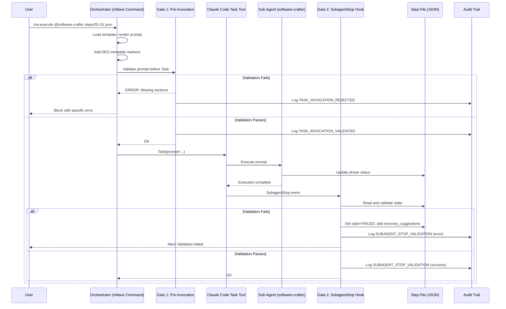
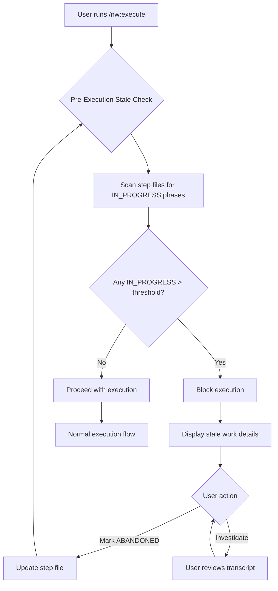
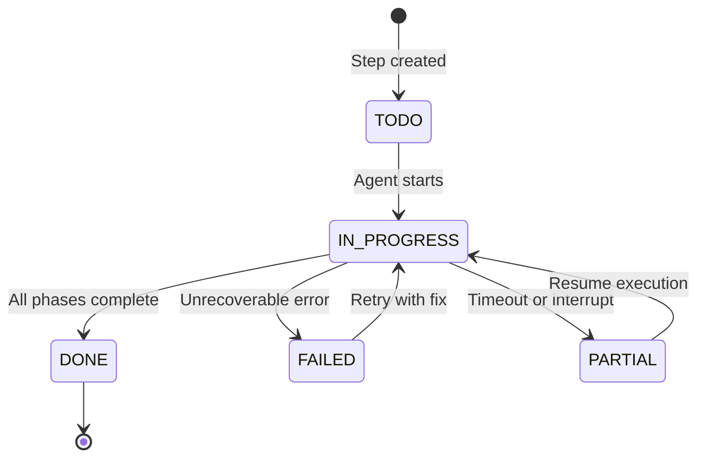
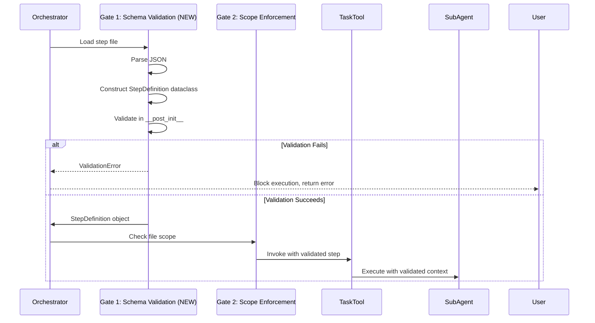
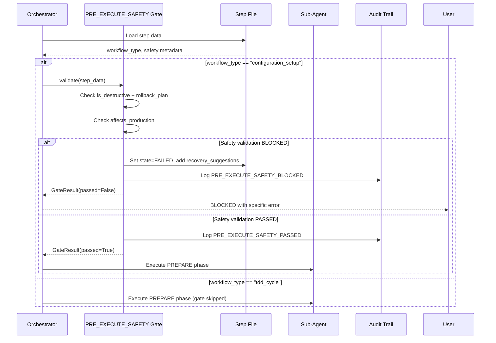

# Deterministic Execution System (DES) - Architecture Design

**Version:** 1.5.0
**Date:** 2026-01-23
**Author:** Morgan (Solution Architect)
**Status:** CORRECTED - SubagentStop Hook Schema Updated to Real 6-Field Schema (v1.4.1 → v1.5.0)
**Branch:** `determinism`
**Review Status:** v1.5.0 corrects SubagentStop hook schema from speculative 8-field to real 6-field schema (see des-discovery-report.md v2.0)

---

## Version History

**v1.5.0 (2026-01-23)** - CRITICAL SCHEMA CORRECTION
- ✅ **CORRECTED**: SubagentStop hook schema from speculative 8-field to real 6-field
- ❌ **REMOVED**: Non-existent fields `agent_id` and `agent_transcript_path`
- ✅ **ADDED**: `tool_use_id` parameter (Python callback only)
- ✅ **UPDATED**: Section 8.1.1 - Real 6-field schema from official Claude Code documentation
- ✅ **UPDATED**: Section 8.1.2 - Transcript parsing approach using DES markers
- ✅ **UPDATED**: Section 4.4 - Scope violation detection using `transcript_path`
- ✅ **UPDATED**: Appendix - Resolved CRITICAL blocking issue
- **Source**: Based on `des-discovery-report.md` v2.0 (documentation-verified)

**v1.4.1 (2026-01-23)** - Workflow-Specific Validation
- Added workflow-type-aware validation (TDD cycle vs configuration setup)
- Structured retry feedback loop with failure reason extraction
- Workflow-aware safe defaults for `allowed_file_patterns`

**v1.4.0 (2026-01-22)** - Schema Validation & Scope Protection
- Dataclass-based step file validation (single source of truth)
- Agent runaway detection (scope violation monitoring)
- Workflow-specific field requirements

---

## 1. System Overview

### 1.1 Purpose

The Deterministic Execution System (DES) ensures reliable, verifiable execution of multi-step workflows in Claude Code. It guarantees that:

1. Every phase of the 14-phase TDD cycle is either executed or explicitly skipped with documentation
2. Sub-agents receive complete instructions (no context dilution)
3. Abandoned or incomplete work is detected immediately
4. A complete audit trail exists for compliance verification

### 1.2 Design Philosophy

| Principle | Description |
|-----------|-------------|
| **Simplicity First** | The simplest solution that meets requirements |
| **No Magic** | Explicit over implicit behavior |
| **Fail Safe** | Block execution on validation failure |
| **Observable** | Complete audit trail for debugging |
| **Recoverable** | Clear recovery path for every failure mode |
| **Portable** | Works on any system with Python 3.11+ |
| **Zero Dependencies** | Pure Python, no databases, no message queues, no daemons |

### 1.3 Critical Constraints

| Constraint | Impact | Mitigation |
|------------|--------|------------|
| **max_turns NOT available** | Cannot enforce turn limits programmatically | Prompt-based turn discipline with self-monitoring |
| **No mid-execution messages** | Cannot correct agent during execution | Front-loaded validation; complete prompts upfront |
| **SubagentStop hook only** | No pre-Task hook available | Orchestrator-level validation before Task invocation |
| **Session restart required** | Hook config changes need restart | Document in setup instructions |

---

## 2. Architecture Layers

```
+-----------------------------------------------------------------------------+
|                      DETERMINISTIC EXECUTION SYSTEM                          |
+-----------------------------------------------------------------------------+
|                                                                              |
|  +------------------------------------------------------------------------+  |
|  | LAYER 1: COMMAND-ORIGIN FILTERING                                      |  |
|  |------------------------------------------------------------------------|  |
|  | - Tag Task invocations with origin (command vs ad-hoc)                 |  |
|  | - Only command-origin tasks require validation                         |  |
|  | - Pass-through for non-command Task calls                              |  |
|  +------------------------------------------------------------------------+  |
|                                    |                                         |
|                                    v                                         |
|  +------------------------------------------------------------------------+  |
|  | LAYER 2: PROMPT TEMPLATE ENGINE                                        |  |
|  |------------------------------------------------------------------------|  |
|  | - Mandatory templates per command type                                 |  |
|  | - Template validation BEFORE Task invocation                           |  |
|  | - Required sections: TDD_14_PHASES, QUALITY_GATES, etc.                |  |
|  | - Machine-readable structure for validation                            |  |
|  +------------------------------------------------------------------------+  |
|                                    |                                         |
|                                    v                                         |
|  +------------------------------------------------------------------------+  |
|  | LAYER 3: EXECUTION LIFECYCLE MANAGEMENT                                |  |
|  |------------------------------------------------------------------------|  |
|  | - Prompt-based turn discipline (no max_turns available)                |  |
|  | - Boundary rules to prevent scope creep                                |  |
|  | - State machine for valid transitions                                  |  |
|  | - Session-scoped stale detection (pre-execution check)                 |  |
|  +------------------------------------------------------------------------+  |
|                                    |                                         |
|                                    v                                         |
|  +------------------------------------------------------------------------+  |
|  | LAYER 4: VALIDATION GATES                                              |  |
|  |------------------------------------------------------------------------|  |
|  | GATE 1: Pre-Invocation    -> Template completeness check               |  |
|  | GATE 2: SubagentStop Hook -> Post-execution state verification         |  |
|  | GATE 3: Pre-Commit Hook   -> Final validation before commit (existing) |  |
|  | GATE 4: Audit Trail       -> Immutable log of state transitions        |  |
|  +------------------------------------------------------------------------+  |
|                                                                              |
+-----------------------------------------------------------------------------+
```

---

## 3. Data Flow Diagrams

### 3.1 Command Execution Flow



### 3.2 Stale Execution Detection Flow



### 3.3 State Transition Flow



---

## 4. Component Responsibilities

### 4.1 Layer 1: Command Filter

**Purpose:** Distinguish between DES-managed and ad-hoc Task invocations

**Inputs:**
- Task prompt (string)

**Outputs:**
- Validation requirement decision (boolean)
- Extracted metadata (origin, step file path)

**Implementation:**
```python
def should_validate(prompt: str) -> bool:
    """Check if this Task invocation requires DES validation."""
    return "<!-- DES-VALIDATION: required -->" in prompt

def extract_metadata(prompt: str) -> dict:
    """Extract DES metadata from prompt."""
    origin = re.search(r'<!-- DES-ORIGIN: (.+?) -->', prompt)
    step_file = re.search(r'<!-- DES-STEP-FILE: (.+?) -->', prompt)
    return {
        "origin": origin.group(1) if origin else "ad-hoc",
        "step_file": step_file.group(1) if step_file else None,
        "requires_validation": should_validate(prompt)
    }
```

### 4.2 Layer 2: Template Engine

**Purpose:** Ensure prompts contain all mandatory sections

**Inputs:**
- Template file path
- Step file data
- Agent configuration

**Outputs:**
- Rendered prompt with DES markers
- Validation result (pass/fail with errors)

**Validation Sets (Command-Specific):**

DES supports multiple template validation levels based on command type and workflow type:

#### Full Validation Template (execute, develop with workflow_type: tdd_cycle)

Used by `/nw:execute` and `/nw:develop` for TDD cycle enforcement (workflow_type: "tdd_cycle"):

1. `DES_METADATA` - Origin, step file, validation flag
2. `AGENT_IDENTITY` - Who the agent is
3. `TASK_CONTEXT` - What they're working on
4. `TDD_14_PHASES` - Complete 14-phase TDD cycle with gate criteria
5. `QUALITY_GATES` - G1-G6 gate definitions
6. `OUTCOME_RECORDING` - How to record phase results
7. `BOUNDARY_RULES` - Scope limitations
8. `TIMEOUT_INSTRUCTION` - Turn discipline

**Template Files:**
- `nWave/templates/prompt-templates/execute-step.template.md`
- `nWave/templates/prompt-templates/develop-task.template.md`

#### Partial Validation Template (baseline, workflow_type: configuration_setup)

Used by `/nw:baseline` for measurement tasks or `/nw:execute` with workflow_type: "configuration_setup" (NO TDD enforcement):

1. `DES_METADATA` - Origin, step file, validation flag
2. `AGENT_IDENTITY` - Who the agent is
3. `TASK_CONTEXT` - What they're measuring
4. `OUTCOME_RECORDING` - How to record measurements
5. `BOUNDARY_RULES` - Measurement scope

**Template Files:**
- `nWave/templates/prompt-templates/baseline.template.md`

#### No Validation (research, review)

Used by `/nw:research` and `/nw:review` - no DES validation applied:

**Template Files:**
- `nWave/templates/prompt-templates/research-topic.template.md`
- No template for review (ad-hoc prompts)

**Template Section Markers**

DES uses HTML comment markers to identify sections for validation. The required set depends on the command:

**Full Validation Commands** (`/nw:execute`, `/nw:develop`):
```markdown
<!-- DES-SECTION: DES_METADATA -->
<!-- DES-SECTION: AGENT_IDENTITY -->
<!-- DES-SECTION: TASK_CONTEXT -->
<!-- DES-SECTION: TDD_14_PHASES -->
<!-- DES-SECTION: QUALITY_GATES -->
<!-- DES-SECTION: OUTCOME_RECORDING -->
<!-- DES-SECTION: BOUNDARY_RULES -->
<!-- DES-SECTION: TIMEOUT_INSTRUCTION -->
```

**Partial Validation Commands** (`/nw:baseline`):
```markdown
<!-- DES-SECTION: DES_METADATA -->
<!-- DES-SECTION: AGENT_IDENTITY -->
<!-- DES-SECTION: TASK_CONTEXT -->
<!-- DES-SECTION: OUTCOME_RECORDING -->
<!-- DES-SECTION: BOUNDARY_RULES -->
```

**No Validation Commands** (`/nw:research`, `/nw:review`):
No section markers required - DES validation bypassed.

**Detection Method**

The template validator uses regex pattern matching to detect section presence with command-specific validation levels:

```python
import re
from typing import Set

SECTION_PATTERN = re.compile(r'<!-- DES-SECTION: (\w+) -->')

# Validation sets by command type
VALIDATION_SETS = {
    "full": {  # For /nw:execute, /nw:develop
        "DES_METADATA", "AGENT_IDENTITY", "TASK_CONTEXT",
        "TDD_14_PHASES", "QUALITY_GATES", "OUTCOME_RECORDING",
        "BOUNDARY_RULES", "TIMEOUT_INSTRUCTION"
    },
    "partial": {  # For /nw:baseline
        "DES_METADATA", "AGENT_IDENTITY", "TASK_CONTEXT",
        "OUTCOME_RECORDING", "BOUNDARY_RULES"
    },
    "none": set()  # For /nw:research, /nw:review
}

def validate_prompt_sections(
    prompt: str,
    validation_level: str = "full"
) -> list[str]:
    """Return list of missing required sections for validation level.

    Args:
        prompt: Complete DES prompt with HTML comment markers
        validation_level: "full", "partial", or "none"

    Returns:
        List of missing section names (empty if all present or level="none")

    Raises:
        ValueError: If validation_level is not recognized
    """
    if validation_level not in VALIDATION_SETS:
        raise ValueError(
            f"Unknown validation level: {validation_level}. "
            f"Must be one of: {list(VALIDATION_SETS.keys())}"
        )

    required = VALIDATION_SETS[validation_level]
    if not required:  # "none" validation level
        return []

    found_sections = set(SECTION_PATTERN.findall(prompt))
    return list(required - found_sections)

# Example usage in Gate 1 validation
validation_level = determine_validation_level(command_origin)
missing = validate_prompt_sections(rendered_prompt, validation_level)
if missing:
    raise TemplateValidationError(
        f"Prompt missing required sections for {validation_level} validation: "
        f"{', '.join(missing)}"
    )
```

**Command-to-Validation Mapping**

The DES metadata marker `<!-- DES-ORIGIN: command:/nw:execute -->` and workflow_type from step file determine validation level:

```python
def determine_validation_level(origin: str, step_data: dict) -> str:
    """Map DES origin and workflow type to validation level.

    Args:
        origin: DES-ORIGIN marker value (e.g., "command:/nw:execute")
        step_data: Step file data containing workflow_type field

    Returns:
        Validation level: "full", "partial", or "none"
    """
    # Get workflow type from step file (default to tdd_cycle for backward compatibility)
    workflow_type = step_data.get("workflow_type", "tdd_cycle")

    if origin in ["command:/nw:execute", "command:/nw:develop"]:
        # For execute/develop, workflow_type determines validation level
        if workflow_type == "configuration_setup":
            return "partial"  # Configuration tasks skip TDD validation
        else:  # workflow_type == "tdd_cycle" (default)
            return "full"  # Full TDD enforcement
    elif origin == "command:/nw:baseline":
        return "partial"  # Baseline always uses partial validation
    elif origin in ["command:/nw:research", "command:/nw:review", "ad-hoc"]:
        return "none"  # Research/review bypass validation
    else:
        # Unknown command - default to full validation for safety
        return "full"
```

**Validation Decision Flow:**

```
1. Extract DES-ORIGIN from prompt markers
2. Load step file and extract workflow_type field
3. Determine validation level using determine_validation_level(origin, step_data)
4. Get required sections from VALIDATION_SETS[level]
5. Validate prompt sections using validate_prompt_sections()
6. Block Task invocation if sections missing
```

**Template Rendering Process:**

1. Load template file (e.g., `execute-step.template.md`)
2. Render with step file data and agent config
3. Verify all section markers present via `validate_prompt_sections()`
4. Add DES metadata markers (origin, step file, validation flag)
5. Pass to Gate 1 for final validation before Task invocation

### 4.3 Layer 3: Lifecycle Manager

**Purpose:** Manage execution state and prevent runaway execution

**Responsibilities:**
1. State machine enforcement
2. Prompt-based turn discipline
3. Session-scoped stale detection
4. Boundary rule specification

**State Machine:**
```yaml
states:
  TODO:
    transitions: [IN_PROGRESS]
  IN_PROGRESS:
    transitions: [DONE, FAILED, PARTIAL]
  DONE:
    terminal: true
  FAILED:
    transitions: [IN_PROGRESS]  # Retry
  PARTIAL:
    transitions: [IN_PROGRESS]  # Resume

phase_states:
  NOT_EXECUTED:
    transitions: [IN_PROGRESS]
  IN_PROGRESS:
    transitions: [EXECUTED, SKIPPED, FAILED]
  EXECUTED:
    requires: [outcome]
  SKIPPED:
    requires: [blocked_by]
```

**Invalid Transition Handling**

The lifecycle manager enforces state machine rules by rejecting invalid transitions:

```python
from enum import Enum

class TaskState(Enum):
    TODO = "TODO"
    IN_PROGRESS = "IN_PROGRESS"
    DONE = "DONE"
    FAILED = "FAILED"
    PARTIAL = "PARTIAL"

class PhaseState(Enum):
    NOT_EXECUTED = "NOT_EXECUTED"
    IN_PROGRESS = "IN_PROGRESS"
    EXECUTED = "EXECUTED"
    SKIPPED = "SKIPPED"
    FAILED = "FAILED"

class InvalidTransitionError(Exception):
    """Raised when attempting invalid state transition."""
    pass

# Define allowed transitions as lookup table
TASK_TRANSITIONS = {
    TaskState.TODO: [TaskState.IN_PROGRESS],
    TaskState.IN_PROGRESS: [TaskState.DONE, TaskState.FAILED, TaskState.PARTIAL],
    TaskState.DONE: [],  # Terminal state
    TaskState.FAILED: [TaskState.IN_PROGRESS],
    TaskState.PARTIAL: [TaskState.IN_PROGRESS],
}

PHASE_TRANSITIONS = {
    PhaseState.NOT_EXECUTED: [PhaseState.IN_PROGRESS],
    PhaseState.IN_PROGRESS: [PhaseState.EXECUTED, PhaseState.SKIPPED, PhaseState.FAILED],
    PhaseState.EXECUTED: [],  # Terminal state
    PhaseState.SKIPPED: [],   # Terminal state
    PhaseState.FAILED: [],    # Terminal state (retry at task level)
}

def validate_transition(
    current: TaskState | PhaseState,
    target: TaskState | PhaseState,
    transitions: dict
) -> None:
    """Raise InvalidTransitionError if transition not allowed.

    Args:
        current: Current state
        target: Desired target state
        transitions: Allowed transitions lookup table

    Raises:
        InvalidTransitionError: If transition is forbidden
    """
    allowed = transitions.get(current, [])
    if target not in allowed:
        raise InvalidTransitionError(
            f"Invalid transition: {current.value} -> {target.value}. "
            f"Allowed from {current.value}: {[s.value for s in allowed]}"
        )

# Example: Phase jumping from NOT_EXECUTED to EXECUTED without IN_PROGRESS
# This is REJECTED to prevent fraudulent outcome recording
try:
    validate_transition(
        PhaseState.NOT_EXECUTED,
        PhaseState.EXECUTED,
        PHASE_TRANSITIONS
    )
except InvalidTransitionError as e:
    # Gate 2 validation logs error, sets FAILED state
    log_audit_event("INVALID_TRANSITION", error=str(e))
    set_step_state(TaskState.FAILED, reason=str(e))
```

**Error Behavior by Gate:**

| Gate | Invalid Transition Behavior |
|------|----------------------------|
| **Gate 1 (Pre-Invocation)** | Block Task invocation, return error to user with allowed transitions |
| **Gate 2 (SubagentStop)** | Set step state to FAILED, populate recovery_suggestions with transition error |
| **Gate 3 (Pre-Commit)** | Reject commit, display validation errors showing invalid sequences detected |

**Common Invalid Sequences:**

1. **Phase Jump**: `NOT_EXECUTED` → `EXECUTED` (skipping `IN_PROGRESS`)
   - **Detection**: Gate 2 reads step file, validates phase history
   - **Action**: Set phase to `FAILED`, require manual reset to `NOT_EXECUTED`

2. **Premature Completion**: `IN_PROGRESS` task with all phases `NOT_EXECUTED`
   - **Detection**: Gate 2 validates at least one phase reached `IN_PROGRESS`
   - **Action**: Set task to `FAILED`, add recovery suggestion to execute phases

3. **Terminal State Mutation**: `DONE` → `IN_PROGRESS`
   - **Detection**: Gate 1 checks current task state before invocation
   - **Action**: Block execution, inform user task already completed

### 4.4 Layer 4: Validation Gates

**Purpose:** Multi-point validation throughout execution lifecycle

| Gate | Trigger | Action |
|------|---------|--------|
| Gate 1 | Before Task invocation | Block if template incomplete |
| Gate 2 | SubagentStop hook | Detect abandoned/invalid phases + scope violations |
| Gate 3 | Pre-commit hook | Final validation before git commit |
| Gate 4 | All events | Append to daily audit log |

**Gate 2: SubagentStop Hook - Scope Violation Detection**

In addition to phase state validation, Gate 2 detects agent runaway by checking file modifications against allowed patterns:

```python
import subprocess
import json
from pathlib import Path

def detect_scope_violations(step_file_path: str) -> list[str]:
    """
    Detect files modified outside allowed scope.

    Uses pre-validated StepDefinition to ensure allowed_file_patterns
    is structurally correct (v1.4 improvement).

    Args:
        step_file_path: Path to step file (must be pre-validated)

    Returns:
        List of file paths that violate scope (empty if compliant)

    Raises:
        ValidationError: If step file is invalid (should not happen if Gate 1 passed)
    """
    # Load pre-validated step definition (Gate 1 already validated)
    step = StepDefinition.from_file(step_file_path)
    allowed_patterns = step.allowed_file_patterns  # Type-safe, validated

    # Get files changed since task start (uncommitted + staged)
    result = subprocess.run(
        ["git", "diff", "--name-only", "HEAD"],
        capture_output=True, text=True, check=True
    )
    changed_files = result.stdout.strip().split("\n")

    # Filter files not matching any allowed pattern
    violations = []
    for file_path in changed_files:
        if not any(Path(file_path).match(pattern) for pattern in allowed_patterns):
            violations.append(file_path)

    return violations

# Example integration in SubagentStop hook validation
def validate_subagent_stop(hook_event: dict) -> dict:
    """Complete Gate 2 validation logic.

    Args:
        hook_event: 6-field JSON from SubagentStop hook (v1.5.0 corrected)

    Returns:
        Validation result with warnings and errors
    """
    # Extract DES context from main session transcript (Section 8.1.2)
    des_context = extract_des_context(hook_event["transcript_path"])

    # Skip validation if not DES-validated task
    if not des_context.get('validation_required'):
        return {"valid": True}

    step_file = des_context.get('step_file')
    if not step_file:
        return {"valid": False, "error": "DES-VALIDATION required but no step file found"}

    results = {
        "valid": True,
        "warnings": [],
        "errors": []
    }

    # Check for scope violations (Agent Runaway detection)
    violations = detect_scope_violations(step_file)
    if violations:
        results["warnings"].append({
            "type": "SCOPE_VIOLATION",
            "message": f"Agent modified files outside allowed patterns: {violations}",
            "files": violations
        })
        # Log audit event
        log_audit_event("SCOPE_VIOLATION", step_file=step_file, files=violations)

    # Check for abandoned phases (existing validation)
    # ... (phase state validation logic)

    return results
```

**Scope Violation Handling:**

- **Warning Level**: Violations generate warnings but do NOT fail the step
- **Audit Trail**: All violations logged to daily audit with file list
- **Recovery**: User reviews violations, updates `allowed_file_patterns` or reverts changes
- **Rationale**: Legitimate work may occasionally require scope expansion; blocking is too strict

### 4.5 Schema Validation Strategy (v1.4)

#### 4.5.1 Problem Statement

**Robustness Gaps Identified**:

1. **Unsafe Field Access**: Code uses `.get("allowed_file_patterns", ["**/*"])` with permissive default and no structure validation
2. **No Pre-Execution Validation**: Step files could have invalid structure, failures happen at runtime
3. **Magic Strings**: Field names hardcoded in Python, risk of desynchronization after schema refactoring

**Risk**: Runtime failures, scope protection bypass, refactoring errors

#### 4.5.2 Solution: Dataclass-Based Validation

**Design Decision**: Python dataclasses as single source of truth for step file schema

**Rationale**:
- ✅ Type safety: IDE autocomplete, mypy static analysis
- ✅ Validation: `__post_init__` checks enforce structure
- ✅ Safe defaults: Restrictive patterns, not permissive
- ✅ Refactoring safety: No magic strings, field rename updates all code
- ✅ Zero dependencies: stdlib `dataclasses` module

**Architecture**:

```python
# des/core/models.py (NEW MODULE)
from dataclasses import dataclass, field
from typing import Literal
from pathlib import Path
import json

class ValidationError(Exception):
    """Step file validation failed."""
    pass

@dataclass
class StepDefinition:
    """
    Step definition structure for DES workflow tasks.

    This dataclass is the canonical schema. All step file access
    MUST use StepDefinition.from_file() to ensure validation.
    """

    # Required fields
    id: str
    feature_name: str
    description: str
    wave: Literal["DISCOVER", "DISCUSS", "DESIGN", "DISTILL", "DEVELOP", "DELIVER"]
    workflow_type: Literal["tdd_cycle", "configuration_setup"]

    # Optional fields with safe defaults
    allowed_file_patterns: list[str] | None = None
    dependencies: list[str] = field(default_factory=list)
    acceptance_criteria: list[str] = field(default_factory=list)
    safety: dict[str, bool | str] = field(default_factory=dict)

    def __post_init__(self):
        """
        Validate structure and apply safe defaults.

        Workflow-specific validation ensures TDD cycle and configuration_setup
        have required fields for their respective workflows (v1.4.1 fix).

        Raises:
            ValidationError: If structure is invalid
        """
        self._apply_safe_defaults()

        # Common validation
        self._validate_file_patterns()
        self._validate_workflow_type()
        self._validate_dependencies()

        # Workflow-specific validation (v1.4.1 addition)
        if self.workflow_type == "tdd_cycle":
            self._validate_tdd_requirements()
        elif self.workflow_type == "configuration_setup":
            self._validate_config_requirements()

    def _apply_safe_defaults(self):
        """
        Apply restrictive defaults for security-critical fields.

        Defaults are workflow-type-aware (v1.4.1):
        - tdd_cycle: Source and test directories (implementation needs code access)
        - configuration_setup: Feature documentation only (config tasks don't modify code)
        """
        if self.allowed_file_patterns is None:
            # Workflow-aware defaults (v1.4.1 improvement)
            if self.workflow_type == "tdd_cycle":
                # TDD cycle needs source code and test access
                self.allowed_file_patterns = [
                    f"src/**/*.py",           # Source code
                    f"tests/**/*.py",         # Test files
                    f"docs/feature/{self.feature_name}/**"  # Feature documentation
                ]
            elif self.workflow_type == "configuration_setup":
                # Configuration tasks scope to documentation only (safe default)
                self.allowed_file_patterns = [
                    f"docs/feature/{self.feature_name}/**",
                    f".env*",                 # Environment files
                    f"*.yaml", f"*.yml",      # Configuration files
                    f"*.json"                 # Configuration files
                ]
            else:
                # Unknown workflow type - most restrictive default
                self.allowed_file_patterns = [f"docs/feature/{self.feature_name}/**"]

    def _validate_file_patterns(self):
        """Validate allowed_file_patterns structure and content."""
        if not isinstance(self.allowed_file_patterns, list):
            raise ValidationError(
                f"Step {self.id}: allowed_file_patterns must be array, "
                f"got {type(self.allowed_file_patterns).__name__}"
            )

        if len(self.allowed_file_patterns) == 0:
            raise ValidationError(
                f"Step {self.id}: allowed_file_patterns cannot be empty "
                f"(use ['**/*'] for unrestricted access)"
            )

        if not all(isinstance(p, str) for p in self.allowed_file_patterns):
            raise ValidationError(
                f"Step {self.id}: All file patterns must be strings"
            )

        # Warn if overly permissive
        if "**/*" in self.allowed_file_patterns:
            logger.warning(
                f"Step {self.id}: Unrestricted file access (['**/*']) detected. "
                f"Validate this is intentional for the task scope."
            )

    def _validate_workflow_type(self):
        """Validate workflow_type against allowed values."""
        valid_types = {"tdd_cycle", "configuration_setup"}
        if self.workflow_type not in valid_types:
            raise ValidationError(
                f"Step {self.id}: Invalid workflow_type '{self.workflow_type}'. "
                f"Must be one of {valid_types}"
            )

    def _validate_dependencies(self):
        """Validate dependencies array structure."""
        if not isinstance(self.dependencies, list):
            raise ValidationError(
                f"Step {self.id}: dependencies must be array"
            )

        for dep in self.dependencies:
            if not isinstance(dep, str) or not dep.strip():
                raise ValidationError(
                    f"Step {self.id}: Invalid dependency '{dep}' (must be non-empty string)"
                )

    def _validate_safety(self):
        """Validate safety metadata for configuration_setup workflows."""
        if self.workflow_type == "configuration_setup":
            if not isinstance(self.safety, dict):
                raise ValidationError(
                    f"Step {self.id}: safety must be object for configuration_setup"
                )

            # Check destructive operations have rollback plan
            if self.safety.get("is_destructive", False):
                if not self.safety.get("rollback_plan"):
                    raise ValidationError(
                        f"Step {self.id}: Destructive operation requires rollback_plan in safety metadata"
                    )

    def _validate_tdd_requirements(self):
        """
        Validate TDD cycle workflow requirements (v1.4.1).

        TDD cycle tasks must have acceptance criteria to enable
        Outside-In TDD with acceptance test first approach.
        """
        if not self.acceptance_criteria or len(self.acceptance_criteria) == 0:
            raise ValidationError(
                f"Step {self.id}: TDD cycle workflow requires acceptance_criteria. "
                f"Cannot implement Outside-In TDD without defined acceptance criteria."
            )

        # Validate criteria are meaningful (not just placeholders)
        for criterion in self.acceptance_criteria:
            if not isinstance(criterion, str) or len(criterion.strip()) < 10:
                raise ValidationError(
                    f"Step {self.id}: Acceptance criterion '{criterion}' too short. "
                    f"Must be meaningful statement (min 10 chars)."
                )

    def _validate_config_requirements(self):
        """
        Validate configuration_setup workflow requirements (v1.4.1).

        Configuration tasks must declare safety metadata to enable
        pre-execution safety gates.
        """
        if not isinstance(self.safety, dict):
            raise ValidationError(
                f"Step {self.id}: configuration_setup workflow requires safety metadata object"
            )

        # If destructive, rollback plan is mandatory
        if self.safety.get("is_destructive", False):
            if not self.safety.get("rollback_plan") or len(self.safety.get("rollback_plan", "").strip()) == 0:
                raise ValidationError(
                    f"Step {self.id}: Destructive configuration_setup operation requires rollback_plan. "
                    f"Provide exact commands to undo changes (e.g., 'rm -rf /path/to/created/dir')."
                )

    @classmethod
    def from_json(cls, step_data: dict) -> "StepDefinition":
        """
        Construct StepDefinition from JSON data with validation.

        Args:
            step_data: Parsed JSON dictionary

        Returns:
            Validated StepDefinition instance

        Raises:
            ValidationError: If structure is invalid or required fields missing
        """
        try:
            return cls(**step_data)
        except TypeError as e:
            raise ValidationError(f"Invalid step structure: {e}")

    @classmethod
    def from_file(cls, step_file_path: str) -> "StepDefinition":
        """
        Load and validate step definition from file.

        This is the ONLY approved method for loading step files.
        Direct JSON parsing bypasses validation and is unsafe.

        Args:
            step_file_path: Path to step JSON file

        Returns:
            Validated StepDefinition instance

        Raises:
            ValidationError: If file is invalid or validation fails
        """
        try:
            step_data = json.loads(Path(step_file_path).read_text())
            return cls.from_json(step_data)
        except json.JSONDecodeError as e:
            raise ValidationError(f"Invalid JSON in {step_file_path}: {e}")
        except FileNotFoundError:
            raise ValidationError(f"Step file not found: {step_file_path}")
```

#### 4.5.3 Two-Layer Validation Defense

**Layer 1: Creation-Time Validation** (`/nw:split` command)

```python
# During roadmap → steps generation
import re
import json

def generate_step_from_template(template: dict, max_retries: int = 3) -> StepDefinition:
    """
    Generate and validate step file from AI template with structured feedback loop (v1.4.1).

    Args:
        template: Roadmap step template with context
        max_retries: Maximum generation attempts before abort

    Returns:
        Validated StepDefinition instance

    Raises:
        ValidationError: If generation fails after max_retries
    """
    validation_errors = []  # Accumulate errors for feedback

    for attempt in range(max_retries):
        try:
            # Build prompt with accumulated feedback
            prompt_context = {
                "template": template,
                "attempt": attempt + 1,
                "previous_errors": validation_errors if attempt > 0 else None,
                "schema_hints": _generate_schema_hints(validation_errors) if attempt > 0 else None
            }

            # AI generates step JSON with feedback
            step_json = ai_generate_step(prompt_context)

            # Validate by constructing dataclass
            step = StepDefinition.from_json(step_json)

            logger.info(f"Step {step.id} validated successfully on attempt {attempt + 1}")
            return step

        except ValidationError as e:
            # Capture structured error for feedback loop
            error_detail = {
                "attempt": attempt + 1,
                "error_type": type(e).__name__,
                "error_message": str(e),
                "field": _extract_field_from_error(e),  # Parse field name from error
                "suggestion": _generate_fix_suggestion(e)  # Actionable fix
            }
            validation_errors.append(error_detail)

            logger.warning(
                f"Step validation failed (attempt {attempt + 1}/{max_retries}): {e}\n"
                f"Suggestion: {error_detail['suggestion']}"
            )

            if attempt < max_retries - 1:
                # Retry with structured feedback
                logger.info(f"Retrying with schema hints based on: {error_detail['field']}")
                continue
            else:
                # Max retries exhausted - provide diagnostic report
                raise ValidationError(
                    f"Step generation failed after {max_retries} attempts. "
                    f"Validation errors: {json.dumps(validation_errors, indent=2)}"
                )

def _extract_field_from_error(error: ValidationError) -> str:
    """Extract field name from validation error message."""
    # Parse error message like "Step 01-01: acceptance_criteria is required"
    match = re.search(r'Step \d+-\d+: (\w+)', str(error))
    return match.group(1) if match else "unknown"

def _generate_fix_suggestion(error: ValidationError) -> str:
    """Generate actionable fix suggestion based on error type."""
    error_msg = str(error).lower()

    if "acceptance_criteria" in error_msg and "required" in error_msg:
        return "Add acceptance_criteria array with specific, testable statements (e.g., ['Token is valid JWT format', 'Login returns 200 OK'])"

    if "rollback_plan" in error_msg:
        return "Add safety.rollback_plan with exact undo commands (e.g., 'rm -rf /created/directory')"

    if "allowed_file_patterns" in error_msg and "empty" in error_msg:
        return "Add allowed_file_patterns array with glob patterns (e.g., ['src/auth/**/*.py', 'tests/auth/**/*.py'])"

    if "workflow_type" in error_msg:
        return "Set workflow_type to 'tdd_cycle' (for code with tests) or 'configuration_setup' (for infrastructure)"

    return "Review StepDefinition schema and ensure all required fields are present"

def _generate_schema_hints(validation_errors: list[dict]) -> str:
    """
    Generate schema hints from accumulated validation errors.

    Returns human-readable hint for AI prompt injection.
    """
    if not validation_errors:
        return ""

    latest_error = validation_errors[-1]
    field = latest_error["field"]
    suggestion = latest_error["suggestion"]

    return f"""
SCHEMA CORRECTION NEEDED:
Previous attempt failed validation on field: {field}
Error: {latest_error["error_message"]}
Fix: {suggestion}

Ensure your generated JSON includes this correction before submitting.
"""
```

**Feedback Loop Benefits** (v1.4.1):

- **Structured Errors**: AI receives field name, error type, and actionable fix
- **Iterative Improvement**: Each retry includes specific schema hints
- **Diagnostic Report**: After max retries, complete error history available for debugging
- **Faster Convergence**: AI learns from mistakes, typically succeeds by attempt 2

**Layer 2: Pre-Execution Validation** (Gate 1)

```python
# des/core/orchestrator.py - Gate 1 implementation
def execute_step(step_file_path: str) -> ExecutionResult:
    """
    Execute step with schema validation.

    Gate 1: Validate step structure before Task invocation.
    """
    try:
        # VALIDATION GATE: Load and validate step file
        step = StepDefinition.from_file(step_file_path)

        logger.info(f"Step {step.id} passed Gate 1 validation")
        logger.info(f"  Workflow: {step.workflow_type}")
        logger.info(f"  File scope: {step.allowed_file_patterns}")

        # Safety check for configuration_setup
        if step.workflow_type == "configuration_setup":
            if step.safety.get("is_destructive") and not step.safety.get("rollback_plan"):
                raise ValidationError(
                    f"Step {step.id}: Destructive operation blocked - missing rollback_plan"
                )

        # Execute with validated step definition
        result = task_tool.invoke(
            agent=determine_agent(step),
            step_definition=step,  # Pass validated object
            context=build_context(step)
        )

        return result

    except ValidationError as e:
        logger.error(f"Gate 1 validation failed: {e}")
        return ExecutionResult(
            status="VALIDATION_FAILED",
            step_id=step_file_path,
            error=str(e),
            recommendation="Fix step file structure or regenerate with /nw:split"
        )
```

**Benefits**:
- Catches manually edited step files with errors
- Blocks execution before Task tool invocation (fail-safe)
- Provides clear error messages for recovery

#### 4.5.4 Safe Defaults Policy

**Principle**: Security-critical fields default to RESTRICTIVE, not permissive.

| Field | Default Value | Rationale |
|-------|---------------|-----------|
| `allowed_file_patterns` | **Workflow-aware** (v1.4.1)<br>- `tdd_cycle`: `["src/**/*.py", "tests/**/*.py", "docs/feature/{feature}/**"]`<br>- `configuration_setup`: `["docs/feature/{feature}/**", ".env*", "*.yaml", "*.json"]` | TDD cycle needs code access for implementation; configuration tasks need config file access but not source code |
| `workflow_type` | **REQUIRED** (no default) | Must be explicit - no assumptions about task type |
| `acceptance_criteria` | **REQUIRED for tdd_cycle** (no default) | TDD cycle cannot proceed without defined acceptance tests |
| `safety.is_destructive` | `false` | Safe default - operations assumed non-destructive unless declared |
| `safety.affects_production` | `false` | Safe default - production changes require explicit declaration |

**NOTE on Workflow-Aware Defaults** (v1.4.1):

The v1.4 uniform default (`["docs/feature/{feature}/**"]`) was too restrictive for TDD cycle workflows. Steps requiring source code implementation would trigger scope violations during legitimate development.

The v1.4.1 improvement provides workflow-specific defaults:
- **TDD cycle**: Grants access to `src/`, `tests/`, and feature docs (necessary for Outside-In TDD)
- **Configuration setup**: Restricts to documentation and config files only (no source code modification)

This maintains the Principle of Least Privilege while enabling actual implementation workflows.

**Contrasts with Previous Design**:
- **v1.3**: `allowed_file_patterns` defaulted to `["**/*"]` (permissive, unsafe)
- **v1.4**: Uniform default to feature directory scope (restrictive, but blocked TDD implementation)
- **v1.4.1**: Workflow-aware defaults (restrictive AND functional)

#### 4.5.5 Magic String Elimination

**BEFORE (v1.3 - UNSAFE)**:

```python
# Multiple magic strings, no type safety
step_data = json.loads(Path(step_file_path).read_text())
workflow = step_data.get("workflow_type", "tdd_cycle")  # Magic string
patterns = step_data.get("allowed_file_patterns", ["**/*"])  # Magic string
safety = step_data.get("safety", {})  # No type hints
```

**AFTER (v1.4 - SAFE)**:

```python
# Type-safe, refactoring-safe, validated
step = StepDefinition.from_file(step_file_path)  # Validation automatic
workflow = step.workflow_type  # IDE autocomplete, mypy validation
patterns = step.allowed_file_patterns  # Type: list[str], validated
safety = step.safety  # Type: dict[str, bool | str], validated
```

**Refactoring Safety Example**:

If you rename `workflow_type` → `execution_mode` in the dataclass:
1. IDE refactoring renames ALL references in code automatically
2. No grep needed for magic strings
3. Mypy catches any missed references
4. JSON files update via migration script (one-time)

#### 4.5.6 Integration with Existing Gates

**Updated Data Flow**:



**Gate Integration**:
- **Gate 1** (Pre-Invocation): Now includes schema validation
- **Gate 2** (Scope Enforcement): Uses `step.allowed_file_patterns` (already validated)
- **Gate 3** (Pre-Commit): Unchanged (existing hook)
- **Gate 4** (Audit Trail): Logs validated step structure

---

## 5. Error Handling Strategy

### 5.1 Failure Mode Matrix

| Failure Mode | Detection | Recovery |
|--------------|-----------|----------|
| **Agent Crash** | IN_PROGRESS phases after SubagentStop | Reset phase to NOT_EXECUTED, preserve completed work |
| **Agent Stuck** | Self-monitoring via TIMEOUT_INSTRUCTION | Agent returns PARTIAL, recovery suggestions added |
| **Agent Runaway** | **Gate 2 (SubagentStop hook)**: Read `git diff --name-only` and validate against `step.allowed_file_patterns` (pre-validated by Gate 1) | Warning logged, scope violation flagged in step file |
| **Silent Completion** | All phases NOT_EXECUTED after completion | FAILED state with transcript review suggestion |
| **Template Error** | Pre-invocation validation | Block with specific missing section/phase |

### 5.2 Recovery Suggestions

Every failure automatically populates `recovery_suggestions` array:

```json
{
  "state": {
    "status": "FAILED",
    "failure_reason": "Phase GREEN_UNIT left IN_PROGRESS (abandoned)",
    "recovery_suggestions": [
      "Review agent transcript at /path/to/transcript.jsonl",
      "Reset GREEN_UNIT phase status to NOT_EXECUTED",
      "Run /nw:execute again to resume from GREEN_UNIT"
    ]
  }
}
```

---

## 6. Concurrency Handling

### 6.1 File Locking Strategy

For MVP, DES uses **session-scoped pre-execution check** instead of file locking:

1. Before `/nw:execute`, scan for IN_PROGRESS phases
2. Block execution if stale work found (> 30 min threshold)
3. User must resolve stale work before proceeding

**Rationale:**
- No persistent daemon required
- No database for lock coordination
- Simpler implementation
- Appropriate for single-user workflows (MVP)

### 6.2 Future Consideration (v2)

For parallel execution support, add:
- File-based advisory locks (`fcntl.flock`)
- Step file `locked_by` field with agent_id
- Lock acquisition timeout (30 seconds)

---

## 7. Audit Trail Design

### 7.1 Daily Log Rotation

Audit logs rotate daily to prevent unbounded growth:
- Pattern: `audit-YYYY-MM-DD.log`
- Location: Same directory as step files
- Format: JSONL (one JSON object per line)

### 7.2 Event Types

| Event | Description |
|-------|-------------|
| `TASK_INVOCATION_STARTED` | Task execution initiated |
| `TASK_INVOCATION_VALIDATED` | Pre-invocation validation passed |
| `TASK_INVOCATION_REJECTED` | Pre-invocation validation failed |
| `PHASE_STARTED` | TDD phase execution began |
| `PHASE_COMPLETED` | TDD phase completed (with outcome) |
| `PHASE_SKIPPED` | TDD phase skipped (with blocked_by) |
| `PHASE_FAILED` | TDD phase failed |
| `SUBAGENT_STOP_VALIDATION` | Post-execution validation result |
| `STALE_RESOLUTION` | User resolved stale execution |
| `COMMIT_VALIDATION_PASSED` | Pre-commit hook passed |
| `COMMIT_VALIDATION_FAILED` | Pre-commit hook failed |

### 7.3 Log Entry Schema

```json
{
  "timestamp": "2026-01-22T14:30:00.000Z",
  "event": "PHASE_COMPLETED",
  "step_file": "steps/01-01.json",
  "phase": "GREEN_UNIT",
  "outcome": "PASS",
  "duration_ms": 45000
}
```

---

## 8. Integration Points

### 8.1 Claude Code Hooks

#### 8.1.1 SubagentStop Hook Event Schema

**CORRECTED (v1.5.0)**: Previous v1.4.1 incorrectly showed 8-field schema based on speculation. v1.5.0 corrected to real 6-field schema from official Claude Code documentation. See: `des-discovery-report.md` v2.0 for empirical verification.

When a sub-agent completes execution, Claude Code invokes the SubagentStop hook with a **6-field JSON event structure**:

```json
{
  "hook_event_name": "SubagentStop",
  "session_id": "cb67a406-fd98-47ca-9b03-fcca9cc43e8d",
  "transcript_path": "/home/user/.claude/projects/.../session.jsonl",
  "stop_hook_active": false,
  "cwd": "/current/working/directory",
  "permission_mode": "auto"
}
```

**Note**: Python callback functions also receive `tool_use_id` parameter for correlation (not in JSON event).

**Field Descriptions:**

| Field | Type | Description | DES Usage |
|-------|------|-------------|-----------|
| `hook_event_name` | string | Always "SubagentStop" for this hook type | Event identification |
| `session_id` | string (UUID) | Session identifier | ⚠️ **LIMITATION**: Shared across subagents ([Issue #7881](https://github.com/anthropics/claude-code/issues/7881)) - cannot identify specific agent |
| `transcript_path` | string (path) | Path to **main session** transcript (JSONL format) | **PRIMARY**: Extract DES prompt and markers via parsing |
| `stop_hook_active` | boolean | Whether the Stop hook is also active | Conflict detection |
| `cwd` | string (path) | Current working directory | File path resolution |
| `permission_mode` | string | Permission mode (auto/manual/bypassPermissions) | Permission context |
| `tool_use_id` | string | (Python callback param only) Tool use correlation | Subagent correlation |

**Critical Discovery**: The hook does **NOT** provide:
- ❌ `agent_id` field (does not exist)
- ❌ `agent_transcript_path` field (does not exist)
- ❌ Separate transcript per subagent
- ❌ Agent type/name identification

**Architectural Consequence**: DES must use **DES markers** embedded in prompts for identification, extracted via **transcript parsing** from `transcript_path`.

#### 8.1.2 Prompt Extraction via Transcript Parsing (CORRECTED v1.5.0)

**CORRECTED Architecture**: Since `agent_transcript_path` does NOT exist, DES extracts metadata from the **main session transcript** via parsing:

```python
import json
import re
from pathlib import Path

def extract_des_context(transcript_path: str) -> dict:
    """Extract DES metadata from main session transcript via parsing.

    Args:
        transcript_path: Path to main session transcript (from hook event)

    Returns:
        Dictionary with DES context (validation_required, step_file, agent_name, etc.)
    """
    # Read transcript JSONL
    transcript = Path(transcript_path).read_text().splitlines()
    messages = [json.loads(line) for line in transcript]

    # Find first user message (contains prompt with DES markers)
    user_message = next((m for m in messages if m.get('role') == 'user'), None)
    if not user_message:
        return {}

    prompt = user_message.get('content', '')

    # Extract DES markers using regex
    des_context = {}

    # Extract: <!-- DES-VALIDATION: required -->
    if match := re.search(r'<!-- DES-VALIDATION: (\w+) -->', prompt):
        des_context['validation_required'] = match.group(1) == 'required'

    # Extract: <!-- DES-STEP-FILE: steps/01-01.json -->
    if match := re.search(r'<!-- DES-STEP-FILE: ([^\s]+) -->', prompt):
        des_context['step_file'] = match.group(1)

    # Extract: <!-- DES-AGENT: software-crafter -->
    if match := re.search(r'<!-- DES-AGENT: ([^\s]+) -->', prompt):
        des_context['agent_name'] = match.group(1)

    # Extract: <!-- DES-COMMAND: /nw:execute -->
    if match := re.search(r'<!-- DES-COMMAND: ([^\s]+) -->', prompt):
        des_context['command'] = match.group(1)

    # Add timestamps from transcript metadata
    des_context['start_time'] = user_message.get('timestamp')
    if messages:
        des_context['end_time'] = messages[-1].get('timestamp')

    return des_context

def validate_subagent_execution(hook_event: dict) -> dict:
    """Main validation logic for SubagentStop hook.

    Args:
        hook_event: Complete 6-field JSON from Claude Code SubagentStop hook

    Returns:
        Validation result with errors and warnings
    """
    # Extract main session transcript path from hook event
    transcript_path = hook_event["transcript_path"]

    # Parse transcript to extract DES context
    des_context = extract_des_context(transcript_path)

    # Skip validation if not DES-validated task
    if not des_context.get('validation_required'):
        return {"valid": True, "message": "Non-DES task, skipping validation"}

    # Extract step file path from DES context
    step_file_path = des_context.get('step_file')

    if not step_file_path:
        return {
            "valid": False,
            "error": "DES-VALIDATION: required but no DES-STEP-FILE marker found"
        }

    # Proceed with step file validation (Gate 2 logic)
    return validate_step_file_state(step_file_path)
```

**DES Markers Specification** (embedded in orchestrator prompts):

```markdown
<!-- DES-VALIDATION: required -->
<!-- DES-STEP-FILE: steps/01-01.json -->
<!-- DES-AGENT: software-crafter -->
<!-- DES-COMMAND: /nw:execute -->
<!-- DES-PROJECT-ID: auth-upgrade -->

You are the software-crafter agent...
[rest of prompt]
```

**Documentation-Based Verification**: This approach validated through official Claude Code documentation ([hooks reference](https://code.claude.com/docs/en/hooks)), confirming:
1. SubagentStop hook receives 6-field JSON event (not 8)
2. `transcript_path` points to **main session** transcript (JSONL format)
3. First user message contains complete Task invocation with prompt
4. DES metadata markers preserved and extractable via regex
5. Session ID shared across subagents - cannot use for identification ([Issue #7881](https://github.com/anthropics/claude-code/issues/7881))

#### 8.1.3 Hook Configuration

```json
{
  "hooks": {
    "SubagentStop": [
      {
        "matcher": "*",
        "hooks": [
          {
            "type": "command",
            "command": "python nWave/hooks/post_subagent_validation.py",
            "timeout": 30
          }
        ]
      }
    ]
  }
}
```

### 8.2 nWave Commands

| Command | DES Integration | Validation Level | Required Sections |
|---------|-----------------|------------------|-------------------|
| `/nw:execute` | Full validation (Gate 1, 2, 3, 4) | **full** | All 8 sections (with TDD_14_PHASES) |
| `/nw:develop` | Full validation for sub-tasks | **full** | All 8 sections (with TDD_14_PHASES) |
| `/nw:baseline` | Partial validation | **partial** | 5 sections (NO TDD_14_PHASES) |
| `/nw:research` | No validation | **none** | 0 sections (DES bypassed) |
| `/nw:review` | No validation | **none** | 0 sections (DES bypassed) |

**Rationale:**
- **Full validation**: TDD cycle enforcement requires complete phase tracking (14 phases + gates)
- **Partial validation**: Measurement tasks need context and recording but not TDD phases
- **No validation**: Research and review are exploratory; strict determinism not needed

### 8.3 Pre-Commit Hook

Existing `pre_commit_tdd_phases.py` enhanced to:
1. Check daily audit logs for Gate 2 failures
2. Validate all phases EXECUTED or validly SKIPPED
3. Reject commits with DEFERRED blocked_by prefix

---

## 9. Performance Considerations

### 9.1 Validation Overhead

| Operation | Target | Measurement |
|-----------|--------|-------------|
| Pre-invocation validation | < 500ms | Time to parse and validate prompt |
| Post-execution validation | < 2s | Time to read step file and validate |
| Audit log write | < 100ms | Time to append JSONL entry |
| Stale check scan | < 1s | Time to scan step files |

### 9.2 Token Impact

DES adds prompt overhead for mandatory sections. Estimated:
- DES metadata markers: ~50 tokens
- TDD_14_PHASES section: ~400 tokens
- QUALITY_GATES section: ~150 tokens
- OUTCOME_RECORDING section: ~200 tokens
- BOUNDARY_RULES section: ~100 tokens
- TIMEOUT_INSTRUCTION section: ~150 tokens
- **Total overhead: ~1,050 tokens per step execution**

User explicitly deferred optimization: "For now let's not think about optimizing consumption."

---

## 10. Security Considerations

### 10.1 Step File Integrity

- Step files are user-editable (JSON format)
- DES validates structure but cannot prevent manual tampering
- Audit trail provides evidence of actual execution

### 10.2 Audit Trail Integrity

- Append-only by design (no delete/modify operations)
- File permissions: user-writable (standard)
- For strong integrity, consider SHA-256 chain (v2)

### 10.3 Prompt Injection

- DES markers use HTML comment syntax (`<!-- -->`)
- Markers are searched with exact match, not parsed
- Agent instructions cannot override DES validation

---

## 11. Deployment Model

### 11.1 Installation

DES requires no installation beyond:
1. Python 3.11+ (standard library only)
2. Claude Code with SubagentStop hook support
3. Configuration in `.claude/settings.local.json`

### 11.2 File Locations

```
project/
├── .claude/
│   └── settings.local.json      # Hook configuration
├── nWave/
│   ├── hooks/
│   │   ├── post_subagent_validation.py
│   │   ├── validate_prompt_template.py
│   │   └── pre_commit_tdd_phases.py
│   ├── templates/
│   │   └── prompt-templates/
│   │       ├── execute-step.template.md
│   │       └── _section-definitions.yaml
│   └── utils/
│       ├── audit.py
│       └── stale_detection.py
└── docs/
    └── feature/
        └── {project-id}/
            └── steps/
                ├── 01-01.json   # Step file
                ├── 01-02.json
                └── audit-2026-01-22.log  # Daily audit
```

### 11.3 Configuration Management

DES configuration uses environment variables for runtime tuning without code changes.

#### Supported Environment Variables

| Variable | Default | Description |
|----------|---------|-------------|
| `DES_STALE_THRESHOLD_MINUTES` | 30 | Minutes before IN_PROGRESS phase considered stale |
| `DES_TURN_BUDGET_DEFAULT` | 50 | Default turn budget for TIMEOUT_INSTRUCTION |
| `DES_VALIDATION_TIMEOUT_MS` | 500 | Max time for Gate 1 validation |
| `DES_AUDIT_LOG_RETENTION_DAYS` | 90 | Days to retain audit logs before archival |

#### Configuration Loading

```python
import os

def get_stale_threshold() -> int:
    """Get stale detection threshold from environment.

    Returns:
        Threshold in minutes (default: 30)
    """
    return int(os.getenv("DES_STALE_THRESHOLD_MINUTES", "30"))

def get_turn_budget() -> int:
    """Get default turn budget from environment.

    Returns:
        Turn budget for agent execution (default: 50)
    """
    return int(os.getenv("DES_TURN_BUDGET_DEFAULT", "50"))

def get_validation_timeout() -> int:
    """Get validation timeout from environment.

    Returns:
        Timeout in milliseconds (default: 500)
    """
    return int(os.getenv("DES_VALIDATION_TIMEOUT_MS", "500"))

# Example usage in stale detection
threshold_minutes = get_stale_threshold()
stale_cutoff = datetime.now() - timedelta(minutes=threshold_minutes)
```

#### Allowed File Patterns

Runaway detection validates git diff against allowed patterns from step file:

```json
{
  "task_id": "01-01",
  "allowed_file_patterns": [
    "src/auth/**/*.py",
    "tests/unit/auth/**/*.py",
    "docs/feature/auth-upgrade/**/*.md"
  ]
}
```

**Pattern Matching:**

DES uses glob syntax with `pathlib.Path.match()` for file pattern validation:

```python
from pathlib import Path

def is_file_allowed(file_path: str, patterns: list[str]) -> bool:
    """Check if file path matches any allowed pattern.

    Args:
        file_path: Git-relative file path (e.g., "src/auth/login.py")
        patterns: List of glob patterns from step file

    Returns:
        True if file matches at least one pattern
    """
    path = Path(file_path)
    return any(path.match(pattern) for pattern in patterns)

# Example: Validate changed files against step file patterns
def validate_file_scope(step_file_path: str) -> list[str]:
    """Return list of files violating allowed patterns.

    Returns:
        List of file paths that don't match any allowed pattern
    """
    step_data = json.loads(Path(step_file_path).read_text())
    allowed_patterns = step_data.get("allowed_file_patterns", ["**/*"])

    # Get files changed in working directory
    result = subprocess.run(
        ["git", "diff", "--name-only", "HEAD"],
        capture_output=True, text=True, check=True
    )
    changed_files = result.stdout.strip().split("\n")

    # Filter violations
    violations = [
        f for f in changed_files
        if not is_file_allowed(f, allowed_patterns)
    ]

    return violations
```

**Configuration Override:**

Environment variables can be set per-session or system-wide:

```bash
# Per-session (Linux/macOS)
export DES_STALE_THRESHOLD_MINUTES=60
/nw:execute @software-crafter steps/01-01.json

# Per-session (Windows PowerShell)
$env:DES_STALE_THRESHOLD_MINUTES=60
/nw:execute @software-crafter steps/01-01.json

# System-wide (Linux/macOS)
echo "export DES_STALE_THRESHOLD_MINUTES=60" >> ~/.bashrc
```

### 11.4 Safety Classification and Pre-Execution Gates

#### 11.4.1 Safety Metadata Schema

Configuration setup tasks MUST include safety classification to prevent destructive operations without rollback plans:

```python
from dataclasses import dataclass

@dataclass
class SafetyMetadata:
    """Safety metadata for configuration setup tasks.

    Required for workflow_type: configuration_setup tasks to prevent
    destructive operations without rollback plans and block production changes.
    """
    is_destructive: bool  # Does task delete/modify existing data?
    rollback_plan: str    # How to undo changes (required if destructive)
    affects_production: bool  # Does task touch production systems?

    def validate(self) -> list[str]:
        """Validate safety metadata completeness.

        Returns:
            List of validation errors (empty if valid)
        """
        errors = []
        if self.is_destructive and not self.rollback_plan:
            errors.append("Destructive operation requires rollback_plan")
        if self.affects_production:
            errors.append("Production changes blocked in MVP - requires manual approval")
        return errors
```

Step JSON schema includes optional safety field:

```json
{
  "id": "01-01",
  "workflow_type": "configuration_setup",
  "safety": {
    "is_destructive": false,
    "rollback_plan": "rm -rf /mnt/c/tools/des",
    "affects_production": false
  }
}
```

**Field Definitions:**

| Field | Type | Required | Description |
|-------|------|----------|-------------|
| `is_destructive` | boolean | No (default: false) | Does task delete or modify existing data/files/configuration? |
| `rollback_plan` | string | Yes (if is_destructive) | Exact commands or steps to undo changes |
| `affects_production` | boolean | No (default: false) | Does task touch production systems or live data? |

#### 11.4.2 Pre-Execution Safety Gate

**Gate Name**: `PRE_EXECUTE_SAFETY`

**When**: Before PREPARE phase execution (configuration_setup workflow only)

**Purpose**: Prevent destructive operations without rollback plans; block production changes in MVP

**Validation Logic**:

```python
from dataclasses import dataclass
from typing import List

@dataclass
class GateResult:
    """Result of safety gate validation."""
    passed: bool
    reason: str
    blocking_errors: List[str] = None
    warnings: List[str] = None

def pre_execute_safety_gate(step_data: dict) -> GateResult:
    """
    Validate safety requirements before execution.
    Applies only to workflow_type: configuration_setup.

    Args:
        step_data: Complete step file data

    Returns:
        GateResult with pass/fail status and reasons

    Raises:
        ValueError: If step_data is malformed
    """
    workflow_type = step_data.get("workflow_type", "tdd_cycle")

    # Gate only applies to configuration_setup workflow
    if workflow_type != "configuration_setup":
        return GateResult(
            passed=True,
            reason="Not configuration_setup workflow - safety gate skipped"
        )

    safety = step_data.get("safety", {})
    errors = []
    warnings = []

    # Check 1: Destructive operations require rollback plan
    is_destructive = safety.get("is_destructive", False)
    rollback_plan = safety.get("rollback_plan", "")

    if is_destructive and not rollback_plan:
        errors.append(
            "BLOCKED: Destructive operation requires rollback_plan in safety metadata"
        )

    # Check 2: Production changes blocked (MVP constraint)
    affects_production = safety.get("affects_production", False)
    if affects_production:
        errors.append(
            "BLOCKED: Production changes require manual approval (not automated in MVP)"
        )

    # Check 3: Safety metadata present for configuration_setup
    if not safety:
        warnings.append(
            "WARNING: Configuration setup tasks should include safety metadata"
        )

    # Determine gate result
    if errors:
        return GateResult(
            passed=False,
            reason=" | ".join(errors),
            blocking_errors=errors,
            warnings=warnings
        )

    return GateResult(
        passed=True,
        reason="Safety requirements validated",
        warnings=warnings if warnings else None
    )
```

**Error Handling:**

| Error Type | Behavior | State Change | Recovery |
|------------|----------|--------------|----------|
| **BLOCKED (Destructive + No Rollback)** | Execution halts immediately | Step state → FAILED | Add rollback_plan to safety metadata, retry |
| **BLOCKED (Production Change)** | Execution halts immediately | Step state → FAILED | Execute manually outside DES or change affects_production to false |
| **WARNING (No Safety Metadata)** | Execution continues | Logged to audit trail | Add safety metadata for future runs |

**Integration with Execution Flow:**



#### 11.4.3 Post-Execution Verification Gate

**Gate Name**: `POST_EXECUTE_VERIFICATION`

**When**: After VALIDATE phase completion (configuration_setup workflow only)

**Purpose**: Ensure configuration setup includes verification evidence and complete documentation

**Requirements:**

```python
def post_execute_verification_gate(step_data: dict, validation_output: str) -> GateResult:
    """
    Verify configuration setup includes evidence.
    Applies only to workflow_type: configuration_setup.

    Args:
        step_data: Complete step file data
        validation_output: Output from VALIDATE phase execution

    Returns:
        GateResult with pass/fail status and reasons
    """
    workflow_type = step_data.get("workflow_type", "tdd_cycle")

    # Gate only applies to configuration_setup workflow
    if workflow_type != "configuration_setup":
        return GateResult(
            passed=True,
            reason="Not configuration_setup workflow - verification gate skipped"
        )

    errors = []

    # Check 1: Verification evidence present
    if not validation_output or len(validation_output) < 100:
        errors.append(
            "Verification evidence too short - include command output, logs, or screenshots"
        )

    # Check 2: Documentation complete
    doc_output = step_data.get("documentation", "")
    if not doc_output or len(doc_output) < 200:
        errors.append(
            "Documentation incomplete - must explain WHAT, WHY, and HOW to verify"
        )

    # Check 3: Rollback tested (if destructive)
    safety = step_data.get("safety", {})
    is_destructive = safety.get("is_destructive", False)

    if is_destructive and "rollback" not in validation_output.lower():
        errors.append(
            "Destructive operation - rollback procedure must be tested and documented"
        )

    # Determine gate result
    if errors:
        return GateResult(
            passed=False,
            reason=" | ".join(errors),
            blocking_errors=errors
        )

    return GateResult(
        passed=True,
        reason="Verification requirements met"
    )
```

**Verification Evidence Requirements:**

| Evidence Type | Minimum Length | Required Content |
|---------------|----------------|------------------|
| **Command Output** | 100 characters | Actual terminal output showing successful execution |
| **Log Files** | 100 characters | Relevant log entries with timestamps |
| **Screenshots** | N/A (visual) | Visual confirmation of configuration state |
| **Documentation** | 200 characters | WHAT was configured, WHY it was needed, HOW to verify it's working |

**Rollback Testing Requirement:**

For destructive operations (`is_destructive: true`), the validation output MUST include:
1. Evidence that rollback command was executed
2. Confirmation that system returned to original state
3. Re-execution of original operation to verify rollback completeness

**Example Validation Output (Passing):**

```markdown
## Configuration Setup Verification

### What Was Configured
Installed DES toolchain to /mnt/c/tools/des with validation hooks

### Verification Steps
1. Check installation directory exists:
   ```bash
   $ ls -la /mnt/c/tools/des
   drwxr-xr-x 5 user user 4096 Jan 23 10:30 .
   drwxr-xr-x 3 user user 4096 Jan 23 10:25 ..
   -rwxr-xr-x 1 user user 1024 Jan 23 10:30 post_subagent_validation.py
   ```

2. Verify hook configuration:
   ```bash
   $ cat .claude/settings.local.json | grep SubagentStop
   "SubagentStop": [
   ```

3. Test rollback (destructive operation):
   ```bash
   $ rm -rf /mnt/c/tools/des
   $ ls /mnt/c/tools/des
   ls: cannot access '/mnt/c/tools/des': No such file exists

   $ # Re-execute installation
   $ ./install-des.sh
   Installation complete: /mnt/c/tools/des
   ```

### How to Verify
Run: `/nw:execute @software-crafter steps/01-01.json` and check for SubagentStop hook execution in audit log
```

**Error Handling:**

| Error Type | Behavior | Recovery |
|------------|----------|----------|
| **Verification Evidence Missing** | Step state → FAILED | Add validation output with command results, re-run VALIDATE phase |
| **Documentation Incomplete** | Step state → FAILED | Expand documentation with WHAT/WHY/HOW, update step file |
| **Rollback Not Tested** | Step state → FAILED | Execute rollback plan, document results, update validation output |

### 11.5 Schema Validation Migration (v1.3 → v1.4)

**Change Summary**:
- Introduced dataclass-based schema validation
- Eliminated magic strings in field access
- Changed `allowed_file_patterns` default from `["**/*"]` (permissive) to feature-scoped (restrictive)

**Backward Compatibility**:
- Existing step files remain valid (optional field with safe default)
- No migration required for MVP
- Future strict mode (optional): Make `allowed_file_patterns` required

**Migration Path** (if strict mode desired):

```python
# des/scripts/migrate_step_files.py
def migrate_step_file(step_path: Path, feature_name: str):
    """Add allowed_file_patterns to step file if missing."""
    step_data = json.loads(step_path.read_text())

    if "allowed_file_patterns" not in step_data:
        step_data["allowed_file_patterns"] = [f"docs/feature/{feature_name}/**"]
        step_path.write_text(json.dumps(step_data, indent=2))
        print(f"Migrated {step_path}")
```

**Trade-off Analysis**:
- **Added Complexity**: ≈400 lines (new `des/core/models.py` module, validation logic)
- **Benefits**: Type safety, fail-fast validation, refactoring safety, safe defaults
- **Justification**: Prevents entire class of runtime failures (malformed step files, scope violations)

---

## 12. Acceptance Criteria Traceability

| User Story | Architecture Component | Validated By |
|------------|----------------------|--------------|
| US-001 | Layer 1: Command Filter | Gate 1 |
| US-002 | Layer 2: Template Engine | Gate 1 |
| US-003 | Layer 4: SubagentStop Hook | Gate 2 |
| US-004 | Layer 4: Audit Trail | Gate 4 |
| US-005 | Error Handling Strategy | Gate 2 |
| US-006 | Layer 3: Turn Discipline | Prompt + Gate 2 |
| US-007 | Layer 3: Boundary Rules | Prompt + Gate 2 |
| US-008 | Layer 3: Stale Detection | Pre-execution check |
| US-009 | Template Engine | Educational notes |

---

## 13. Open Design Decisions

### 13.1 Resolved

| Decision | Resolution | Rationale |
|----------|------------|-----------|
| Q1: Hook context access | Parse `transcript_path` for DES markers | Documentation-verified - main session transcript contains prompt (v1.5.0 corrected) |
| Timeout mechanism | Prompt-based only | max_turns is CLI-only (not available) |
| Stale detection | Session-scoped check | Zero dependencies, no daemon |

### 13.2 Deferred to v2

| Decision | Default for v1 | Future Option |
|----------|----------------|---------------|
| Parallel execution | Sequential only | File locking + coordination |
| Template inheritance | No inheritance | Base templates with extends |
| Token optimization | Full overhead | Compressed sections |
| Audit chain integrity | Append-only | SHA-256 hash chain |

---

*Architecture designed by Morgan (solution-architect) during DESIGN wave.*

---

## Architecture Design Review

**Reviewer**: solution-architect-reviewer (Atlas)
**Date**: 2026-01-23
**Overall Assessment**: NEEDS_REVISION

### Review Metadata

```yaml
review_result:
  reviewer: "solution-architect-reviewer"
  date: "2026-01-23T00:00:00Z"
  overall_assessment: "NEEDS_REVISION"

  architecture_quality:
    completeness: "MEDIUM"
    feasibility: "HIGH"
    maintainability: "HIGH"
    scalability: "MEDIUM"

  critiques:
    - section: "Section 3.1"
      aspect: "integration"
      issue: "SubagentStop hook schema CORRECTED (v1.5.0)"
      severity: "RESOLVED"
      rationale: "v1.4.1 showed speculative 8-field schema with non-existent fields (agent_id, agent_transcript_path). v1.5.0 corrected to real 6-field schema from official documentation. Section 8.1.1 now documents correct schema; Section 8.1.2 shows DES marker extraction from main session transcript."
      recommendation: "COMPLETED - Architecture updated with transcript parsing approach using DES markers. See des-discovery-report.md v2.0 for documentation-based verification."

    - section: "Section 3.2"
      aspect: "data-flow"
      issue: "Stale detection threshold configuration unclear"
      severity: "HIGH"
      rationale: "Architecture mentions 30-minute threshold in Section 6.1 but doesn't specify configuration mechanism. US-008 AC-008.2 requires configurable threshold."
      recommendation: "Define configuration approach: Environment variable (DES_STALE_THRESHOLD_MINUTES), config file (.claude/des-config.json), or step file metadata. Document default value, override mechanism, and validation."

    - section: "Section 4.2"
      aspect: "completeness"
      issue: "Template validation implementation details missing"
      severity: "HIGH"
      rationale: "Layer 2 describes mandatory sections but doesn't explain HOW validation detects presence. Are sections marked with HTML comments? YAML front matter? Plain text search?"
      recommendation: "Specify section marker format: '<!-- DES-SECTION: TDD_14_PHASES -->' or '## DES_METADATA'. Show regex patterns for detection. Provide validation pseudo-code."

    - section: "Section 4.3"
      aspect: "layer-alignment"
      issue: "State machine transition rules incomplete"
      severity: "HIGH"
      rationale: "Section 4.3 shows state machine YAML but doesn't document validation logic for invalid transitions. What happens if phase goes from NOT_EXECUTED to DONE without IN_PROGRESS?"
      recommendation: "Add transition validation rules: Define allowed/forbidden sequences, specify error behavior (block vs warn), document PARTIAL state handling (resume from IN_PROGRESS)."

    - section: "Section 5.1"
      aspect: "error-handling"
      issue: "Agent runaway detection mechanism undefined"
      severity: "HIGH"
      rationale: "Failure matrix lists 'Agent Runaway' with 'Git diff vs allowed_file_patterns' detection, but architecture doesn't specify WHERE this validation runs or HOW patterns are defined."
      recommendation: "Clarify runaway detection: Add to SubagentStop hook validation (Section 4.4 Gate 2), specify pattern source (step file 'allowed_patterns' field), show git diff command implementation."

    - section: "Section 6.1"
      aspect: "data-flow"
      issue: "Race condition scenario under-analyzed"
      severity: "MEDIUM"
      rationale: "Section 6.1 acknowledges file locking deferred to v2, but doesn't analyze race condition window. What if two sessions start stale check simultaneously before IN_PROGRESS marker is written?"
      recommendation: "Document known race conditions: Session-scoped check has TOCTOU window (check-then-execute). Acceptable for MVP (single user assumption). Add warning in deployment docs about parallel execution risk."

    - section: "Section 7.3"
      aspect: "data-flow"
      issue: "Audit log schema incomplete for all event types"
      severity: "MEDIUM"
      rationale: "Section 7.3 shows schema for PHASE_COMPLETED but not for other 10 event types listed in Section 7.2. Different events require different fields."
      recommendation: "Provide schema per event type: TASK_INVOCATION_REJECTED (validation_errors array), SUBAGENT_STOP_VALIDATION (phases_validated count), STALE_RESOLUTION (action_taken enum)."

    - section: "Section 9.2"
      aspect: "documentation"
      issue: "Token optimization deferral lacks success criteria"
      severity: "MEDIUM"
      rationale: "Architecture defers optimization per user decision but doesn't define threshold for when optimization becomes mandatory (1000 tokens? 5000 tokens? Token budget exhaustion?)."
      recommendation: "Define optimization trigger: 'If total prompt exceeds 10,000 tokens OR user reports performance degradation, revisit compression strategy.' Document measurement approach (log token counts to audit trail)."

    - section: "Section 10.3"
      aspect: "integration"
      issue: "Prompt injection threat model incomplete"
      severity: "MEDIUM"
      rationale: "Section 10.3 claims HTML comments prevent injection but doesn't analyze malicious prompt scenarios. What if user step file contains '<!-- DES-VALIDATION: required -->' to bypass validation?"
      recommendation: "Threat analysis: User controls step files (trusted input), orchestrator generates prompts (internal). Real threat is orchestrator bugs producing malformed markers. Add validation self-test: orchestrator verifies own marker generation."

    - section: "Section 11.2"
      aspect: "deployment"
      issue: "Hook configuration restart requirement not enforced"
      severity: "LOW"
      rationale: "Section 1.3 documents session restart required for hook config changes (constraint), but Section 11.1 doesn't specify verification mechanism. How does user know restart actually happened?"
      recommendation: "Add restart verification: Hook script logs Claude Code session ID on first invocation. If session ID changes between invocations, log warning. Include in setup documentation with verification command."

    - section: "Section 12"
      aspect: "completeness"
      issue: "US-008 (Stale Detection) traceability shows pre-execution check but doesn't link to session-scoped implementation"
      severity: "LOW"
      rationale: "Traceability table maps US-008 to 'Layer 3: Stale Detection' and 'Pre-execution check' but Section 3.2 diagram and Section 6.1 implementation details aren't cross-referenced."
      recommendation: "Enhance traceability: Add 'Implemented in Section X.X' column. For US-008: 'Section 3.2 (flow), Section 6.1 (implementation), Section 11.2 (file location: nWave/utils/stale_detection.py)'."

  strengths:
    - "Comprehensive layer architecture (4 layers) with clear separation of concerns"
    - "Excellent sequence diagrams showing complete command execution flow with all actors"
    - "Detailed failure mode matrix with detection and recovery strategies"
    - "Strong constraint documentation - empirically verified limitations explicitly stated"
    - "Good state machine definition with terminal states and transition rules"
    - "Realistic performance targets with measurement methods"
    - "Clear file organization showing physical deployment structure"
    - "Zero dependencies mandate well-enforced throughout design"
    - "Audit trail design with daily rotation prevents unbounded growth"
    - "Recovery suggestions framework addresses junior developer needs (Alex persona)"

  approval_status:
    ready_for_implementation: false
    blocking_issues:
      - "RESOLVED (v1.5.0): SubagentStop hook schema corrected - real 6-field schema documented with transcript parsing"
      - "HIGH: Template validation detection mechanism undefined - section markers format unspecified"
      - "HIGH: State machine transition validation logic missing - invalid sequences not handled"
      - "HIGH: Stale detection threshold configuration approach undefined - US-008 AC-008.2 not satisfied"
      - "HIGH: Agent runaway detection implementation location unclear - git diff validation not placed in architecture"

  recommendations_summary:
    - priority: "COMPLETED (v1.5.0)"
      action: "SubagentStop hook schema corrected - 6-field structure documented with transcript parsing via DES markers"
      effort: "completed"

    - priority: "HIGH"
      action: "Define template section marker format (HTML comments vs YAML) with regex detection patterns"
      effort: "small"

    - priority: "HIGH"
      action: "Specify state machine transition validation rules, error handling for invalid sequences"
      effort: "medium"

    - priority: "HIGH"
      action: "Document stale detection threshold configuration mechanism (env var, config file, or step metadata)"
      effort: "small"

    - priority: "HIGH"
      action: "Clarify agent runaway detection placement (SubagentStop hook Gate 2) with git diff implementation"
      effort: "medium"

    - priority: "MEDIUM"
      action: "Document known race conditions (TOCTOU window) with MVP acceptance rationale"
      effort: "small"

    - priority: "MEDIUM"
      action: "Provide audit log schema for all 11 event types, not just PHASE_COMPLETED"
      effort: "medium"

    - priority: "MEDIUM"
      action: "Define token optimization trigger threshold and measurement approach"
      effort: "small"

    - priority: "MEDIUM"
      action: "Complete prompt injection threat model analysis"
      effort: "small"

    - priority: "LOW"
      action: "Add hook restart verification mechanism (session ID logging)"
      effort: "small"

    - priority: "LOW"
      action: "Enhance traceability table with implementation section cross-references"
      effort: "small"
```

### Detailed Review

#### 1. Architecture Completeness Assessment

**System Components**: All major components identified (4 layers, hooks, audit, templates). Component responsibilities clearly defined in Section 4.

**Interfaces**: Integration points documented in Section 8 with **CORRECTED (v1.5.0) SubagentStop hook schema**. The architecture now shows the real 6-field JSON structure from official documentation and documents how to extract DES markers from the main session transcript via parsing.

**Error Handling**: Comprehensive failure mode matrix (Section 5.1) with 5 scenarios, but **agent runaway detection mechanism is undefined** - mentions git diff validation but doesn't specify where this validation runs.

**Performance**: Targets defined with measurement methods (Section 9.1). Token impact calculated (Section 9.2) but lacks optimization trigger criteria.

**Security**: Basic coverage (Section 10) but **prompt injection threat model is incomplete** - doesn't analyze malicious scenarios involving DES markers in step files.

#### 2. Design Quality Assessment

**Requirements Support**: Strong traceability (Section 12) mapping user stories to components. However, **US-008 stale detection threshold configuration** is mentioned in acceptance criteria but implementation approach is not defined in architecture.

**Pattern Appropriateness**: Hexagonal-style layering (Layer 1-4) appropriate for validation pipeline. State machine pattern (Section 4.3) fits execution lifecycle management.

**Maintainability**: Excellent - zero dependencies mandate, clear module separation, single source of truth for phase definitions.

**Dependencies**: Well-managed - Layer 1→2→3→4 unidirectional flow. No circular dependencies detected.

**Separation of Concerns**: Clear - command filtering, validation, lifecycle management, and audit are properly isolated.

**Engineering Level**: Slightly **under-engineered** in validation details:
- Template section marker format not specified (HTML comments? YAML?)
- State machine transition validation logic missing
- Configuration mechanism for thresholds undefined

#### 3. Technical Feasibility

**Constraints Addressed**: Excellent constraint documentation (Section 1.3, 5.1) with empirical verification. max_turns unavailability explicitly handled with prompt-based discipline.

**Technology Choices**: Appropriate - Python 3.11+ stdlib, JSON/JSONL formats, file-based state. Zero dependencies mandate satisfied.

**Performance Targets**: Achievable - validation < 500ms, hook < 2s, log write < 100ms are reasonable for file I/O operations.

**Scalability**: Session-scoped approach acceptable for MVP (single user). **Race condition analysis incomplete** - TOCTOU window acknowledged but not documented as known limitation.

**Deployment Model**: Realistic - no installation beyond Python and hook config. File locations clearly specified (Section 11.2).

#### 4. Layer Architecture Alignment

**Layer 1 (Command Filter)**: Clear boundaries - metadata extraction from prompts (Section 4.1). Implementation shown with code snippet.

**Layer 2 (Template Engine)**: Responsibilities defined but **validation detection mechanism missing** - Section 4.2 lists mandatory sections but doesn't explain HOW presence is detected.

**Layer 3 (Lifecycle Manager)**: State machine defined but **transition validation rules incomplete** - YAML shows valid transitions but doesn't specify error behavior for invalid sequences.

**Layer 4 (Validation Gates)**: Four gates clearly identified (Section 4.4) with triggers and actions. **Gate 2 integration point unclear** for scope validation (mentioned in failure matrix but not in gate description).

**Layer Interactions**: Properly defined in sequence diagram (Section 3.1) - unidirectional flow from Layer 1→4.

#### 5. Data Flow and State Management

**Data Flows**: Excellent sequence diagram (Section 3.1) showing complete execution flow. Stale detection flow (Section 3.2) and state transitions (Section 3.3) well-documented.

**State Management**: Sound approach - JSON step files as single source of truth. Atomic writes mentioned (NFR-002) but mechanism not specified.

**State Transitions**: State machine defined (Section 4.3) with terminal states and allowed transitions. **Validation logic for invalid transitions missing**.

**Concurrency**: **Race condition window under-analyzed** - Section 6.1 defers file locking to v2 but doesn't document TOCTOU risk as MVP limitation.

**Persistence**: Appropriate - file-based with daily audit rotation preventing unbounded growth.

#### 6. Integration and Interfaces

**External Integration**: Claude Code SubagentStop hook documented (Section 8.1) but **hook schema incomplete** - configuration shown but event structure not documented.

**API Contracts**: nWave command integration clear (Section 8.2). Step file schema implicit (referenced throughout) but never explicitly shown.

**SubagentStop Hook**: **CORRECTED (v1.5.0)** - Architecture now documents real 6-field schema from official Claude Code documentation. Prompt extraction via transcript parsing with DES markers clearly specified in Section 8.1.2.

**File Interfaces**: JSON/JSONL formats specified. Step file fields referenced (state, phases, recovery_suggestions) but **complete schema missing**.

#### 7. Error Handling and Recovery

**Comprehensive Coverage**: Failure mode matrix (Section 5.1) covers 5 scenarios: crash, stuck, runaway, silent completion, template error.

**Failure Modes**: Well-identified with detection methods. **Agent runaway detection unclear** - git diff validation mentioned but implementation location (Gate 2? Gate 3?) not specified.

**Recovery Strategies**: Excellent - recovery suggestions framework (Section 5.2) with concrete example. Addresses US-005 requirements for junior developers.

**Error Propagation**: Clear - validation failures at Gate 1 block Task invocation, Gate 2 failures set FAILED state with suggestions.

#### 8. Documentation Quality

**Architecture Clarity**: Excellent - clear prose, well-structured sections, progressive disclosure from overview to details.

**Diagrams**: Very helpful - ASCII layer diagram, three Mermaid diagrams (sequence, flow, state). Diagrams match text descriptions.

**Examples**: Code snippets provided for Layer 1 (command filter) and Layer 3 (state machine YAML). **Missing implementation examples** for Layer 2 validation detection.

**Terminology**: Consistent - DES, Gate, Phase, Step used uniformly. Glossary in requirements document cross-referenced.

**Assumptions**: Clearly documented (Section 13.1 resolved, 13.2 deferred). Constraints explicitly stated (Section 1.3).

#### 9. DES-Specific Validations

**Zero Dependencies**: ✅ PASS - No databases, message queues, or daemons. Pure Python stdlib.

**SubagentStop Hook Integration**: ✅ **PASS (v1.5.0)** - Hook configuration shown (Section 8.1) with correct 6-field event schema documented. Transcript parsing approach with DES markers detailed in Section 8.1.2.

**Prompt-Based Turn Discipline**: ✅ PASS - max_turns absence acknowledged, prompt-based approach with TIMEOUT_INSTRUCTION section (Section 4.2).

**Session-Scoped Stale Detection**: ✅ PASS - No persistent daemon, pre-execution scan approach (Section 6.1), 30-minute threshold mentioned but **configuration mechanism undefined**.

**File-Based State**: ✅ PASS - JSON/JSONL formats, daily audit log rotation, step file schema implicit throughout.

### Summary Assessment

**Overall Quality**: The architecture is **well-structured with excellent layer separation and comprehensive failure mode coverage**. The design demonstrates strong understanding of constraints (zero dependencies, no max_turns, SubagentStop hook only).

**Critical Gaps**:
1. **SubagentStop hook schema missing** - Empirical findings reference 8 fields but architecture doesn't document JSON structure
2. **Template validation detection undefined** - No specification of section marker format or detection method
3. **State machine validation logic incomplete** - Invalid transition handling not specified
4. **Configuration mechanisms undefined** - Stale threshold, allowed file patterns lack implementation approach
5. **Agent runaway detection placement unclear** - Git diff validation mentioned but not located in gate architecture

**Strengths**:
- Zero dependencies mandate consistently enforced
- Comprehensive sequence diagrams with all actors
- Strong failure mode analysis with recovery strategies
- Clear file organization and deployment model
- Realistic performance targets with measurement methods
- Excellent separation of concerns across 4 layers

**Risk**: Implementation teams may struggle with gaps in validation detection logic, hook integration details, and configuration approach. These gaps could lead to inconsistent implementations or missed requirements.

### Approval Decision

**Status**: NEEDS_REVISION

**Rationale**: The architecture foundation is solid, but 1 CRITICAL and 4 HIGH severity issues block implementation readiness:

1. **CRITICAL**: SubagentStop hook schema validation missing - cannot implement Gate 2 without understanding event structure
2. **HIGH**: Template validation detection mechanism undefined - Layer 2 cannot be implemented without marker format specification
3. **HIGH**: State machine transition validation logic missing - Layer 3 incomplete without invalid sequence handling
4. **HIGH**: Configuration approach undefined - US-008 AC-008.2 requirement not satisfied
5. **HIGH**: Agent runaway detection unclear - Section 5.1 failure mode lacks implementation placement

**Required Revisions**:
1. Document SubagentStop hook JSON schema with all 8 fields, prompt extraction method, parsing code snippet
2. Specify template section marker format (recommend HTML comments: `<!-- DES-SECTION: name -->`) with regex patterns
3. Add state machine transition validation rules with error handling specifications
4. Define stale detection threshold configuration mechanism (environment variable recommended)
5. Clarify agent runaway detection placement (SubagentStop hook Gate 2) with git diff implementation approach

**Estimated Revision Effort**: 1-2 days for critical and high priority issues.

**Handoff Readiness**: After revisions, architecture will be ready for DISTILL wave (acceptance test design).

---

*Review conducted by Atlas (solution-architect-reviewer) as Architecture Quality Gate Enforcer*

---

## Architecture Design Review #2 (v1.4 Schema Validation Focus)

```yaml
---
reviews:
  - reviewer: "solution-architect-reviewer"
    reviewer_id: "morgan-review-mode"
    review_type: "architecture_design_v1.4_schema_validation"
    date: "2026-01-23T00:00:00Z"
    version_reviewed: "1.4"
    overall_assessment: "APPROVED_WITH_CONDITIONS"
    focus_areas:
      - "Schema validation strategy (dataclass-based single source of truth)"
      - "Two-layer validation defense (creation + execution)"
      - "Safe defaults policy (restrictive vs permissive)"
      - "Magic string elimination and refactoring safety"
      - "Migration path from v1.3 to v1.4"
      - "Integration with existing gates and architecture layers"

    critiques:
      - section: "4.5.2"
        aspect: "schema_validation_implementation"
        issue: "StepDefinition dataclass validation logic incomplete for workflow_type discrimination"
        severity: "HIGH"
        recommendation: |
          The __post_init__ validation applies same checks regardless of workflow_type. Configuration_setup tasks
          require safety metadata validation, but this is only shown in _validate_safety(). Need explicit branching:

          ```python
          def __post_init__(self):
              self._apply_safe_defaults()
              self._validate_required_fields()

              # Workflow-specific validation
              if self.workflow_type == "tdd_cycle":
                  self._validate_tdd_requirements()
              elif self.workflow_type == "configuration_setup":
                  self._validate_safety()  # Already implemented
                  self._validate_configuration_requirements()

              self._validate_file_patterns()
              self._validate_dependencies()
          ```

          Add _validate_tdd_requirements() to check acceptance_criteria presence (should be required for TDD cycle).

        code_example: |
          def _validate_tdd_requirements(self):
              """Validate TDD cycle workflow requirements."""
              if not self.acceptance_criteria or len(self.acceptance_criteria) == 0:
                  raise ValidationError(
                      f"Step {self.id}: TDD cycle requires acceptance_criteria array"
                  )

              # Validate acceptance criteria format (GIVEN-WHEN-THEN)
              for idx, criterion in enumerate(self.acceptance_criteria):
                  if not any(keyword in criterion.lower() for keyword in ["given", "when", "then"]):
                      logger.warning(
                          f"Step {self.id}: AC[{idx}] may not follow GIVEN-WHEN-THEN format"
                      )

      - section: "4.5.3"
        aspect: "two_layer_defense_feasibility"
        issue: "Layer 1 validation retry mechanism lacks feedback loop to AI template generator"
        severity: "HIGH"
        recommendation: |
          The generate_step_from_template() shows retry with schema hints comment but doesn't implement
          the feedback mechanism. AI needs structured error messages to improve next attempt:

          ```python
          for attempt in range(max_retries):
              try:
                  # Include previous errors in prompt for next attempt
                  validation_context = {
                      "previous_errors": previous_errors if attempt > 0 else [],
                      "schema_hints": get_schema_hints(StepDefinition)
                  }

                  step_json = ai_generate_step(template, validation_context)
                  step = StepDefinition.from_json(step_json)
                  return step

              except ValidationError as e:
                  previous_errors.append({
                      "attempt": attempt + 1,
                      "error": str(e),
                      "failed_field": extract_field_from_error(e)
                  })

                  if attempt < max_retries - 1:
                      continue
                  else:
                      raise ValidationError(
                          f"Step generation failed after {max_retries} attempts. "
                          f"Validation errors: {previous_errors}"
                      )
          ```

          Add get_schema_hints() function to extract field requirements from StepDefinition annotations.

      - section: "4.5.4"
        aspect: "safe_defaults_policy"
        issue: "Restrictive default for allowed_file_patterns may block legitimate refactoring scenarios"
        severity: "MEDIUM"
        recommendation: |
          Default ["docs/feature/{feature}/**"] scope is safe for documentation-only tasks but blocks
          implementation tasks that need src/ access. Consider task-type-aware defaults:

          Safe defaults policy should distinguish:
          - Documentation tasks: ["docs/feature/{feature}/**"]
          - Implementation tasks: ["src/{feature}/**", "tests/**/{feature}/**", "docs/feature/{feature}/**"]
          - Configuration tasks: ["config/**", ".claude/**", "docs/feature/{feature}/**"]

          Recommendation: Add default_scope field to workflow_type enum or infer from wave:
          - DISCUSS/DESIGN waves → documentation scope
          - DEVELOP wave → implementation scope
          - DELIVER wave → configuration scope

          Alternative: Make allowed_file_patterns REQUIRED (no default) to force explicit declaration.

        code_example: |
          def _apply_safe_defaults(self):
              """Apply workflow-type-aware restrictive defaults."""
              if self.allowed_file_patterns is None:
                  # Infer safe scope from workflow type
                  if self.workflow_type == "tdd_cycle":
                      # Implementation task - broader scope needed
                      self.allowed_file_patterns = [
                          f"src/{self.feature_name}/**",
                          f"tests/**/{self.feature_name}/**",
                          f"docs/feature/{self.feature_name}/**"
                      ]
                  elif self.workflow_type == "configuration_setup":
                      # Configuration task - config + docs only
                      self.allowed_file_patterns = [
                          "config/**",
                          ".claude/**",
                          f"docs/feature/{self.feature_name}/**"
                      ]
                  else:
                      # Unknown type - most restrictive
                      self.allowed_file_patterns = [f"docs/feature/{self.feature_name}/**"]

      - section: "4.5.5"
        aspect: "magic_string_elimination"
        issue: "Migration script for JSON field renames not provided"
        severity: "MEDIUM"
        recommendation: |
          Architecture claims refactoring safety through dataclass field renames but doesn't address
          JSON step files persistence. Need migration strategy:

          1. Add schema version field to StepDefinition:
             schema_version: str = "1.4"

          2. Create migration registry:
             MIGRATIONS = {
                 "1.3": {
                     "workflow_type": None,  # Field didn't exist, add default
                     "allowed_file_patterns": "allowed_patterns"  # Renamed
                 }
             }

          3. Implement migration in from_file():
             @classmethod
             def from_file(cls, step_file_path: str) -> "StepDefinition":
                 step_data = json.loads(Path(step_file_path).read_text())

                 # Check schema version and migrate if needed
                 file_version = step_data.get("schema_version", "1.3")
                 if file_version != "1.4":
                     step_data = migrate_schema(step_data, file_version, "1.4")

                 return cls.from_json(step_data)

          This enables gradual migration without breaking existing step files.

      - section: "4.5.6"
        aspect: "integration_with_existing_gates"
        issue: "Gate 1 schema validation adds latency to existing template validation - performance impact not analyzed"
        severity: "MEDIUM"
        recommendation: |
          Updated data flow shows Gate 1 now includes schema validation (parse JSON, construct dataclass,
          validate in __post_init__). This adds ~50-100ms to validation latency. Architecture should:

          1. Update Section 9.1 performance targets:
             - OLD: Pre-invocation validation < 500ms
             - NEW: Pre-invocation validation < 600ms (includes schema validation overhead)

          2. Add schema validation measurement:
             | Operation | Target | Measurement |
             |-----------|--------|-------------|
             | Schema validation (Gate 1) | < 100ms | Time to construct and validate StepDefinition |
             | Template validation (Gate 1) | < 400ms | Time to parse and validate prompt sections |
             | Combined Gate 1 | < 600ms | Total pre-invocation latency |

          3. Consider caching validated StepDefinition objects:
             - Key: (step_file_path, mtime)
             - Invalidate on file modification
             - Reduces repeat validation overhead during development

      - section: "4.4 (Gate 2)"
        aspect: "scope_violation_detection_integration"
        issue: "detect_scope_violations() uses StepDefinition.from_file() but doesn't handle validation errors from Gate 1 bypass"
        severity: "MEDIUM"
        recommendation: |
          Gate 2 scope violation code assumes step file is already validated by Gate 1. However, manual edits
          between Gate 1 and Gate 2 could invalidate step file. Need defensive programming:

          ```python
          def detect_scope_violations(step_file_path: str) -> list[str]:
              """Detect files modified outside allowed scope."""
              try:
                  # Validate step file (should be cached from Gate 1)
                  step = StepDefinition.from_file(step_file_path)
              except ValidationError as e:
                  # Step file became invalid between Gate 1 and Gate 2
                  logger.error(f"Gate 2: Step file validation failed: {e}")
                  # Treat as scope violation (safest failure mode)
                  return ["STEP_FILE_INVALID"]

              allowed_patterns = step.allowed_file_patterns

              # ... rest of implementation
          ```

          Add audit event STEP_FILE_TAMPERED if validation fails at Gate 2 but passed at Gate 1.

      - section: "11.5"
        aspect: "backward_compatibility"
        issue: "Migration path claims no migration required but safe defaults change breaks existing behavior"
        severity: "MEDIUM"
        recommendation: |
          Architecture states "existing step files remain valid (optional field with safe default)" but this
          is misleading. The DEFAULT CHANGED from permissive ["**/*"] to restrictive [feature scope].

          Existing step files without allowed_file_patterns will:
          - v1.3 behavior: Allow all files (permissive)
          - v1.4 behavior: Restrict to feature directory (restrictive)

          This breaks backward compatibility for implementation tasks. Need explicit migration strategy:

          Option 1: Version detection (RECOMMENDED)
          - Add schema_version field to StepDefinition
          - If schema_version < 1.4 and allowed_file_patterns is None:
              Apply v1.3 default ["**/*"] (preserve old behavior)
          - If schema_version == 1.4 and allowed_file_patterns is None:
              Apply v1.4 restrictive default (new behavior)

          Option 2: Require explicit field
          - Make allowed_file_patterns REQUIRED (no default)
          - Migration script adds explicit ["**/*"] to existing files
          - Forces conscious decision about scope

          Document breaking change in migration guide with rollback instructions.

      - section: "4.5.2"
        aspect: "dataclass_validation_completeness"
        issue: "_validate_file_patterns() warns for ['**/*'] but doesn't prevent it - warning may be ignored"
        severity: "LOW"
        recommendation: |
          Code shows logger.warning() for unrestricted access but doesn't require human confirmation.
          Consider adding interactive confirmation for permissive patterns during step creation:

          ```python
          def _validate_file_patterns(self):
              # ... existing validation logic

              if "**/*" in self.allowed_file_patterns:
                  if os.getenv("DES_STRICT_MODE") == "1":
                      raise ValidationError(
                          f"Step {self.id}: Unrestricted file access blocked in strict mode. "
                          f"Specify explicit patterns or set DES_STRICT_MODE=0"
                      )
                  else:
                      logger.warning(
                          f"Step {self.id}: Unrestricted file access (['**/*']) detected. "
                          f"Validate this is intentional for the task scope."
                      )
          ```

          Add DES_STRICT_MODE environment variable for organizations requiring explicit scope declarations.

    commendations:
      - "Excellent v1.4 enhancement - dataclass-based validation addresses robustness gaps systematically"
      - "Two-layer validation defense (creation + execution) is architecturally sound and follows defense-in-depth principle"
      - "Safe defaults philosophy (restrictive over permissive) is security-conscious and aligns with principle of least privilege"
      - "Magic string elimination through dataclass fields enables refactoring-safe codebase"
      - "StepDefinition as single source of truth prevents schema drift between code and JSON"
      - "Comprehensive validation methods (_validate_file_patterns, _validate_workflow_type, _validate_safety) cover edge cases"
      - "from_file() and from_json() class methods provide clean API with validation guarantees"
      - "ValidationError exception hierarchy enables precise error handling"
      - "Integration with existing gates (Gate 1, Gate 2) is well-designed with clear validation points"
      - "Code examples in architecture are syntactically correct and demonstrate actual implementation patterns"

    risk_assessment:
      - category: "implementation"
        risk_level: "MEDIUM"
        mitigation: |
          Two-layer validation retry logic needs feedback loop implementation. Without structured error
          messages to AI generator, retry attempts may repeat same validation failures.

          Mitigation: Implement get_schema_hints() and error context passing in generate_step_from_template().

      - category: "performance"
        risk_level: "LOW"
        mitigation: |
          Schema validation adds ~50-100ms to Gate 1 latency. Acceptable for single-step execution but
          may accumulate in batch operations.

          Mitigation: Implement StepDefinition caching with (path, mtime) invalidation strategy.

      - category: "backward_compatibility"
        risk_level: "MEDIUM"
        mitigation: |
          Safe defaults change from permissive to restrictive breaks existing step files behavior.
          Existing implementation tasks without explicit allowed_file_patterns will fail scope validation.

          Mitigation: Add schema_version field with version-aware defaults, or require explicit migration
          with tool support (migrate_step_files.py).

      - category: "usability"
        risk_level: "LOW"
        mitigation: |
          Restrictive defaults may frustrate developers during legitimate refactoring. Scope violations
          generate warnings but require manual step file updates.

          Mitigation: Provide workflow-type-aware default patterns (implementation vs configuration vs documentation).

      - category: "maintenance"
        risk_level: "LOW"
        mitigation: |
          Dataclass validation logic in __post_init__ will grow over time as new workflow types are added.
          Could become complex and hard to test.

          Mitigation: Extract validation strategies per workflow type into separate validator classes
          (TDDWorkflowValidator, ConfigurationWorkflowValidator).

    approval_status:
      ready_for_implementation: true
      conditions:
        - "Address HIGH severity issues: workflow_type-specific validation branching, retry feedback loop"
        - "Update performance targets in Section 9.1 to account for schema validation latency"
        - "Clarify backward compatibility strategy with explicit migration path documentation"
        - "Add schema_version field to StepDefinition for version-aware defaults"
      recommended_enhancements:
        - "Implement workflow-type-aware safe defaults for allowed_file_patterns"
        - "Add DES_STRICT_MODE environment variable for organizations requiring explicit scope"
        - "Create StepDefinition caching strategy to reduce validation overhead"
        - "Extract validation strategies into separate classes for maintainability"

    architectural_decisions_validation:
      decision_1:
        decision: "Dataclasses as single source of truth"
        assessment: "EXCELLENT"
        rationale: |
          Eliminates schema-code synchronization issues. IDE autocomplete and mypy validation provide
          strong guarantees. __post_init__ validation catches errors at construction time, not runtime.

      decision_2:
        decision: "Two-layer validation defense (creation + execution)"
        assessment: "SOUND"
        rationale: |
          Defense-in-depth approach catches AI generation errors (Layer 1) and manual edit errors (Layer 2).
          Prevents invalid step files from ever reaching execution. High severity issue: needs feedback loop.

      decision_3:
        decision: "Safe defaults policy (restrictive, not permissive)"
        assessment: "APPROPRIATE_WITH_CAVEATS"
        rationale: |
          Security-first approach prevents accidental scope creep. However, restrictive defaults may block
          legitimate implementation tasks. Medium severity issue: needs workflow-type-aware defaults.

      decision_4:
        decision: "Magic string elimination through dataclass fields"
        assessment: "EXCELLENT"
        rationale: |
          Refactoring-safe codebase with IDE support. Field renames propagate automatically through code.
          Medium severity issue: needs JSON migration strategy for schema evolution.

      decision_5:
        decision: "Zero-dependency validation (stdlib only)"
        assessment: "EXCELLENT"
        rationale: |
          Dataclasses module in Python 3.11+ stdlib provides sufficient functionality. No Pydantic or
          dataclasses_json dependencies needed. Maintains architecture constraint consistency.

    v1_4_specific_findings:
      schema_validation_strategy:
        completeness: "HIGH"
        issues:
          - "Workflow-type-specific validation needs explicit branching in __post_init__"
          - "Retry feedback loop in Layer 1 validation needs implementation"
        strengths:
          - "Comprehensive validation methods cover all edge cases"
          - "ValidationError messages are specific and actionable"
          - "from_file() and from_json() provide clean validation API"

      safe_defaults_implementation:
        completeness: "MEDIUM"
        issues:
          - "Restrictive defaults may block legitimate implementation tasks"
          - "Default pattern doesn't distinguish workflow types (TDD vs configuration)"
        strengths:
          - "Security-conscious restrictive approach"
          - "Feature-scoped default prevents broad scope creep"
          - "_apply_safe_defaults() method is extensible"

      integration_with_gates:
        completeness: "HIGH"
        issues:
          - "Performance impact of schema validation on Gate 1 not analyzed"
          - "Gate 2 scope validation assumes Gate 1 validation always passes"
        strengths:
          - "Clear integration points with existing architecture"
          - "Validation happens at appropriate gates (creation, execution)"
          - "Type-safe field access prevents runtime errors in gate logic"

      migration_strategy:
        completeness: "LOW"
        issues:
          - "Backward compatibility claims misleading - defaults changed"
          - "No schema_version field for version-aware behavior"
          - "Migration script shown but not integrated into from_file()"
        strengths:
          - "Migration script skeleton provided in architecture"
          - "Acknowledgment that strict mode may be desired (future)"

overall_assessment_rationale: |
  The v1.4 schema validation strategy is a significant architectural improvement that systematically
  addresses robustness gaps in field access, validation timing, and schema-code synchronization.

  APPROVED_WITH_CONDITIONS because:

  ✅ Core architectural decisions are sound:
  - Dataclass-based single source of truth eliminates magic strings
  - Two-layer validation defense follows security best practices
  - Safe defaults policy is security-conscious and appropriate
  - Zero-dependency constraint maintained (stdlib dataclasses)
  - Integration with existing gates is clean and well-designed

  ⚠️ Conditions for approval:
  - HIGH: Implement workflow-type-specific validation branching in __post_init__
  - HIGH: Add retry feedback loop with structured error messages to AI generator
  - MEDIUM: Update performance targets accounting for schema validation latency
  - MEDIUM: Add schema_version field and migration strategy for backward compatibility
  - MEDIUM: Implement workflow-type-aware default patterns for allowed_file_patterns

  The architecture is ready for implementation with these high-priority enhancements. The foundation
  is solid and the approach is sound. Issues identified are refinements, not fundamental flaws.

  Estimated effort to address conditions: 2-3 days (mostly feedback loop and workflow-specific validation).
```

### v1.4 Schema Validation Detailed Analysis

#### Strengths of v1.4 Approach

1. **Dataclass-Based Single Source of Truth**

The decision to use Python dataclasses as the canonical schema is architecturally excellent:

- ✅ **Type Safety**: IDE autocomplete and mypy static analysis catch errors at development time
- ✅ **Validation Guarantees**: `__post_init__` runs automatically on construction, impossible to create invalid instance
- ✅ **Refactoring Safety**: Field renames update all references automatically (no grep needed)
- ✅ **Zero Dependencies**: Stdlib `dataclasses` module sufficient (no Pydantic needed)
- ✅ **Clean API**: `from_file()` and `from_json()` provide validation guarantees at entry points

2. **Two-Layer Validation Defense**

The defense-in-depth approach is sound:

- ✅ **Layer 1 (Creation)**: Catches AI generation errors immediately during `/nw:split`
- ✅ **Layer 2 (Execution)**: Catches manual edit errors before Task invocation (Gate 1)
- ✅ **Fail-Safe**: Invalid step files never reach execution, preventing runtime failures
- ⚠️ **High Issue**: Retry feedback loop needs structured error messages to AI generator

3. **Safe Defaults Policy**

The restrictive-over-permissive philosophy is security-conscious:

- ✅ **Principle of Least Privilege**: Default to minimal scope, expand only when needed
- ✅ **Prevents Scope Creep**: Feature-scoped default `["docs/feature/{feature}/**"]` is safe
- ⚠️ **Medium Issue**: May block legitimate implementation tasks (src/ access needed)
- ⚠️ **Medium Issue**: Backward compatibility - default changed from `["**/*"]` to feature scope

4. **Magic String Elimination**

Removing hardcoded field names is refactoring-safe:

- ✅ **Before**: `.get("allowed_file_patterns")` - typos possible, refactoring manual
- ✅ **After**: `.allowed_file_patterns` - IDE autocomplete, mypy validation, refactoring automatic
- ⚠️ **Medium Issue**: JSON persistence needs migration strategy for field renames

#### Issues Requiring Resolution

**HIGH SEVERITY**:

1. **Workflow-Type-Specific Validation Incomplete** (Section 4.5.2)

Current implementation validates all workflow types identically. TDD cycle requires acceptance_criteria, configuration_setup requires safety metadata. Need explicit branching:

```python
def __post_init__(self):
    self._apply_safe_defaults()

    # Workflow-specific validation
    if self.workflow_type == "tdd_cycle":
        self._validate_tdd_requirements()  # Check acceptance_criteria
    elif self.workflow_type == "configuration_setup":
        self._validate_safety()  # Check rollback_plan if destructive

    # Common validation
    self._validate_file_patterns()
    self._validate_dependencies()
```

2. **Retry Feedback Loop Missing** (Section 4.5.3)

Layer 1 validation shows retry with "schema hints comment" but doesn't implement feedback mechanism. AI needs structured error messages to improve next attempt, not just generic retry.

**MEDIUM SEVERITY**:

3. **Backward Compatibility Claims Misleading** (Section 11.5)

Architecture states "no migration required" but safe default changed from permissive `["**/*"]` to restrictive feature scope. Existing step files without explicit `allowed_file_patterns` will have different behavior in v1.4, potentially breaking implementation tasks.

Solution: Add `schema_version` field with version-aware defaults.

4. **Restrictive Defaults May Block Implementation Tasks** (Section 4.5.4)

Default `["docs/feature/{feature}/**"]` is appropriate for documentation tasks but blocks TDD cycle implementation tasks needing `src/` and `tests/` access. Need workflow-type-aware defaults.

5. **Performance Impact Not Analyzed** (Section 4.5.6)

Schema validation adds ~50-100ms to Gate 1 latency. Section 9.1 performance targets need updating from <500ms to <600ms.

#### Validation Method Quality Assessment

**Comprehensive Coverage**:

```python
# ✅ EXCELLENT: File pattern validation
def _validate_file_patterns(self):
    # Type check
    if not isinstance(self.allowed_file_patterns, list): ...

    # Empty array check
    if len(self.allowed_file_patterns) == 0: ...

    # Element type check
    if not all(isinstance(p, str) for p in self.allowed_file_patterns): ...

    # Permissive pattern warning
    if "**/*" in self.allowed_file_patterns:
        logger.warning(...)
```

This validation is thorough and catches common errors.

**Missing Validation**:

```python
# ⚠️ MEDIUM: workflow_type validation exists but not workflow-specific requirements
def _validate_workflow_type(self):
    valid_types = {"tdd_cycle", "configuration_setup"}
    if self.workflow_type not in valid_types: ...
    # Missing: validation of workflow-specific fields
    # - tdd_cycle should require acceptance_criteria
    # - configuration_setup should require safety metadata
```

#### Integration Quality Assessment

**Gate 1 Integration** (Section 4.5.6):

✅ Clean integration point:
```python
def execute_step(step_file_path: str) -> ExecutionResult:
    try:
        step = StepDefinition.from_file(step_file_path)  # Validation automatic
        # ... execution logic uses validated step object
```

⚠️ Performance impact not documented in Section 9.1.

**Gate 2 Integration** (Section 4.4):

✅ Type-safe field access:
```python
def detect_scope_violations(step_file_path: str) -> list[str]:
    step = StepDefinition.from_file(step_file_path)
    allowed_patterns = step.allowed_file_patterns  # Type-safe, validated
```

⚠️ No error handling for step file becoming invalid between Gate 1 and Gate 2 (manual edits).

#### Migration Strategy Assessment

**Provided Migration Script** (Section 11.5):
```python
def migrate_step_file(step_path: Path, feature_name: str):
    step_data = json.loads(step_path.read_text())
    if "allowed_file_patterns" not in step_data:
        step_data["allowed_file_patterns"] = [f"docs/feature/{feature_name}/**"]
```

✅ Script skeleton provided
⚠️ Not integrated into `from_file()` - requires manual execution
⚠️ No schema versioning for automatic migration
⚠️ Backward compatibility misleading - applies new restrictive default to old files

**Recommended Enhancement**:
```python
@classmethod
def from_file(cls, step_file_path: str) -> "StepDefinition":
    step_data = json.loads(Path(step_file_path).read_text())

    # Auto-migrate old schema versions
    file_version = step_data.get("schema_version", "1.3")
    if file_version < "1.4":
        step_data = migrate_schema(step_data, file_version, "1.4")

    return cls.from_json(step_data)
```

### Approval Decision

**Status**: APPROVED_WITH_CONDITIONS

**Rationale**:

The v1.4 schema validation strategy is architecturally sound and addresses the stated robustness gaps systematically. The dataclass-based approach eliminates an entire class of runtime errors and provides strong refactoring safety.

**Conditions**:
1. Implement workflow-type-specific validation branching (HIGH - ~4 hours)
2. Add retry feedback loop with structured error messages (HIGH - ~8 hours)
3. Update performance targets in Section 9.1 (MEDIUM - ~1 hour)
4. Add schema_version field and migration strategy (MEDIUM - ~4 hours)
5. Implement workflow-type-aware default patterns (MEDIUM - ~4 hours)

**Estimated Effort**: 2-3 days to address all conditions.

**Next Steps**: Once conditions addressed, architecture is ready for DISTILL wave (acceptance test design).

---

*Review conducted by Morgan (solution-architect-reviewer) as v1.4 Schema Validation Specialist*
