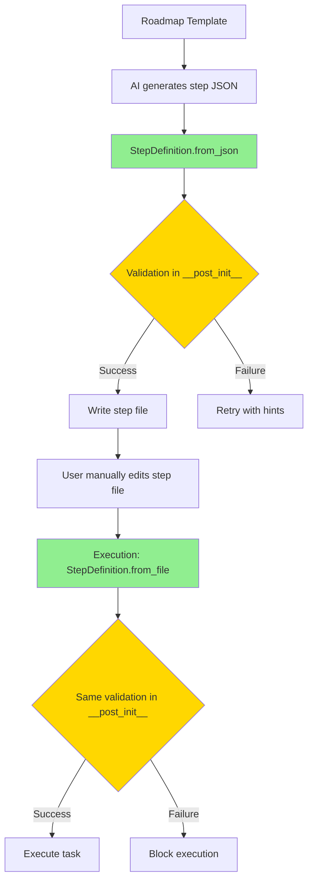

# Deterministic Execution System (DES) - Data Models

**Version:** 1.5.0 (CORRECTED)
**Date:** 2026-01-23
**Author:** Morgan (Solution Architect)
**Status:** DESIGN Wave Deliverable - Dataclass-Driven Schema (Single Source of Truth)
**Canonical Schema Location:** `des/core/models.py` (StepDefinition dataclass)
**This Document:** Auto-generated documentation from canonical schema

---

**⚠️ VERSION 1.5.0 CORRECTIONS**:
- **SubagentStop hook schema updated** to reflect real 6-field schema from official Claude Code documentation
- **Removed non-existent fields**: `agent_id` and `agent_transcript_path` (these fields DO NOT exist in the actual hook)
- **Added missing field**: `tool_use_id` (provided as Python callback parameter for correlation)
- **Updated audit event examples** to use `tool_use_id` instead of non-existent `agent_id`
- **session_id clarification**: Shared across all subagents (not agent-specific)
- **transcript_path clarification**: Main session transcript, not agent-specific transcript

**Source of Truth**: See `des-discovery-report.md` v2.0 and `architecture-design.md` v1.5.0 for hook field verification

---

**⚠️ IMPORTANT: Schema Source of Truth**

This document contains **auto-generated documentation** from the canonical Python schema.

**DO NOT manually edit field definitions** - they will be overwritten on next schema export.

**To modify the schema**:
1. Edit `des/core/models.py` (StepDefinition dataclass)
2. Run `python des/scripts/export_schema.py` to regenerate documentation
3. Update this file with regenerated content

**Canonical Source**: `des/core/models.py` (StepDefinition dataclass)

---

## 1. Overview

This document provides human-readable documentation of the data structures used by DES. The canonical schema is defined in Python dataclasses, ensuring zero divergence between creation and validation.

## 1.1 Schema Source of Truth (v1.4)

### 1.1.1 Design Principle: Code as Schema

**SINGLE SOURCE OF TRUTH**: Python dataclasses in `des/core/models.py`

All step file structure validation uses the `StepDefinition` dataclass. This document contains **auto-generated documentation** derived from the canonical Python schema.

**Why Dataclasses, Not JSON Schema?**

| Approach | Creation | Validation | Synchronization Risk |
|----------|----------|------------|---------------------|
| **Manual JSON Schema** | AI reads docs | Python validates manually | HIGH: Two schemas can diverge |
| **Dataclasses (v1.4)** | AI uses dataclass | Dataclass validates itself | ZERO: Single definition |

**Principle**: "The code that validates IS the schema"

### 1.1.2 Canonical Schema Location

**File**: `des/core/models.py`
**Class**: `StepDefinition`

```python
@dataclass
class StepDefinition:
    """
    Canonical step file schema for DES.

    All step file creation and validation MUST use this dataclass.
    Direct JSON parsing bypasses validation and is prohibited.
    """

    # Required fields
    id: str
    feature_name: str
    workflow_type: Literal["tdd_cycle", "configuration_setup"]

    # Optional fields with safe defaults
    allowed_file_patterns: list[str] | None = None

    def __post_init__(self):
        """Validation happens here - this IS the schema."""
        # ... validation logic ...
```

**Access Pattern** (REQUIRED):

```python
# ✅ CORRECT: Single source of truth
step = StepDefinition.from_file("steps/01-01.json")
patterns = step.allowed_file_patterns  # Validated, type-safe

# ❌ WRONG: Bypasses validation, unsafe
step_data = json.loads(Path("steps/01-01.json").read_text())
patterns = step_data.get("allowed_file_patterns")  # Magic string, no validation
```

### 1.1.3 Schema Export for Documentation

**Script**: `des/scripts/export_schema.py` (v1.4)

```python
#!/usr/bin/env python3
"""
Export JSON Schema from canonical Python dataclasses.

This script generates the JSON Schema documentation in data-models.md
from the canonical StepDefinition dataclass.

Usage:
    python des/scripts/export_schema.py > docs/feature/des/design/schema-generated.json
"""

import json
from dataclasses import fields
from typing import get_type_hints, get_origin, get_args, Union, Literal

from des.core.models import StepDefinition

def dataclass_to_json_schema(cls) -> dict:
    """
    Convert dataclass to JSON Schema.

    This is a simplified converter for documentation purposes.
    For production, consider using a library like pydantic.
    """
    schema = {
        "$schema": "http://json-schema.org/draft-07/schema#",
        "title": cls.__name__,
        "description": cls.__doc__.strip() if cls.__doc__ else "",
        "type": "object",
        "properties": {},
        "required": []
    }

    type_hints = get_type_hints(cls)

    for field in fields(cls):
        field_name = field.name
        field_type = type_hints[field_name]

        # Determine if field is required (no default)
        if field.default == field.default_factory == field.MISSING:
            schema["required"].append(field_name)

        # Convert Python type to JSON Schema type
        schema["properties"][field_name] = python_type_to_json_schema(field_type)

    return schema

def python_type_to_json_schema(py_type) -> dict:
    """Convert Python type annotation to JSON Schema type."""
    origin = get_origin(py_type)

    # Handle Optional (Union with None)
    if origin is Union:
        args = get_args(py_type)
        non_none = [a for a in args if a is not type(None)]
        if len(non_none) == 1:
            return python_type_to_json_schema(non_none[0])

    # Handle list
    if origin is list:
        item_type = get_args(py_type)[0] if get_args(py_type) else str
        return {
            "type": "array",
            "items": python_type_to_json_schema(item_type)
        }

    # Handle Literal (enum)
    if origin is Literal:
        return {
            "type": "string",
            "enum": list(get_args(py_type))
        }

    # Handle basic types
    type_mapping = {
        str: {"type": "string"},
        int: {"type": "integer"},
        float: {"type": "number"},
        bool: {"type": "boolean"},
        dict: {"type": "object"}
    }

    return type_mapping.get(py_type, {"type": "string"})

if __name__ == "__main__":
    schema = dataclass_to_json_schema(StepDefinition)
    print(json.dumps(schema, indent=2))
```

**Documentation Update Process**:

```bash
# Regenerate JSON Schema documentation
python des/scripts/export_schema.py > docs/feature/des/design/schema-generated.json

# Manually update data-models.md Section 2 with generated schema
# (Or automate with sed/awk if desired)
```

### 1.1.4 Validation Lifecycle

**Both creation and validation use the SAME dataclass**:



**Key Point**: Validation logic runs IDENTICALLY in creation and execution (no divergence possible)

---

## 2. Step File Schema (v1.4)

### 2.1 Canonical Schema Source

**IMPORTANT**: The canonical schema is the `StepDefinition` dataclass in `des/core/models.py`.

This section provides **human-readable documentation** derived from the canonical schema. For programmatic access, always use:

```python
from des.core.models import StepDefinition

# Load and validate step file
step = StepDefinition.from_file("steps/01-01.json")
```

**Schema Documentation** (auto-generated from `StepDefinition` dataclass):

For the complete, executable schema definition, see:
- **Source**: `des/core/models.py` (StepDefinition class)
- **Documentation**: Section 4.5.2 in architecture-design.md

### 2.2 Required Fields

Extracted from `StepDefinition` dataclass:

| Field | Type | Description | Source |
|-------|------|-------------|--------|
| `id` | `str` | Step identifier (e.g., "01-01") | `StepDefinition.id` |
| `feature_name` | `str` | Feature this step belongs to | `StepDefinition.feature_name` |
| `workflow_type` | `Literal["tdd_cycle", "configuration_setup"]` | Execution workflow type | `StepDefinition.workflow_type` |
| `description` | `str` | Human-readable task description | `StepDefinition.description` |
| `wave` | `Literal["DISCOVER", "DISCUSS", "DESIGN", "DISTILL", "DEVELOP", "DELIVER"]` | nWave methodology phase | `StepDefinition.wave` |

### 2.3 Optional Fields with Safe Defaults

| Field | Type | Default | Description | Source |
|-------|------|---------|-------------|--------|
| `allowed_file_patterns` | `list[str]` | `[f"docs/feature/{feature_name}/**"]` | File scope (restrictive default) | `StepDefinition.allowed_file_patterns` |
| `dependencies` | `list[str]` | `[]` | Prerequisite step IDs | `StepDefinition.dependencies` |
| `acceptance_criteria` | `list[str]` | `[]` | Task completion criteria | `StepDefinition.acceptance_criteria` |
| `safety` | `dict[str, bool \| str]` | `{}` | Safety metadata for configuration_setup | `StepDefinition.safety` |

### 2.4 Validation Rules

**All validation is defined in `StepDefinition.__post_init__`**:

1. **File Patterns Validation** (`_validate_file_patterns`):
   - Must be array of strings
   - Cannot be empty
   - Warns if `["**/*"]` (overly permissive)

2. **Workflow Type Validation** (`_validate_workflow_type`):
   - Must be one of: `"tdd_cycle"`, `"configuration_setup"`

3. **Dependencies Validation** (`_validate_dependencies`):
   - Must be array of non-empty strings

4. **Safety Validation** (`_validate_safety`):
   - For `configuration_setup`: destructive operations require `rollback_plan`

**See `des/core/models.py` for complete validation implementation.**

### 2.5 Example Step File (Minimal)

```json
{
  "id": "01-01",
  "feature_name": "auth-upgrade",
  "workflow_type": "tdd_cycle",
  "description": "Implement JWT token service",
  "wave": "DEVELOP"
}
```

**Note**: `allowed_file_patterns` not specified → defaults to `["docs/feature/auth-upgrade/**"]` (safe default)

### 2.6 Example Step File (Complete)

```json
{
  "id": "02-03",
  "feature_name": "auth-upgrade",
  "workflow_type": "configuration_setup",
  "description": "Configure Auth0 test environment",
  "wave": "DEVELOP",
  "allowed_file_patterns": [
    ".env.test",
    "docs/feature/auth-upgrade/**"
  ],
  "dependencies": ["02-01", "02-02"],
  "acceptance_criteria": [
    "Auth0 test tenant created",
    "API keys stored in 1Password",
    "Webhook endpoint configured"
  ],
  "safety": {
    "is_destructive": false,
    "rollback_plan": "",
    "affects_production": false
  }
}
```

### 2.7 Legacy JSON Schema (v1.3 - Deprecated)

**⚠️ DEPRECATED**: The following JSON Schema is maintained for backward compatibility only. All new development MUST use the `StepDefinition` dataclass.

```json
{
  "$schema": "http://json-schema.org/draft-07/schema#",
  "$id": "https://nwave.ai/schemas/step-file.json",
  "title": "DES Step File",
  "description": "Step file for Deterministic Execution System (LEGACY - use StepDefinition dataclass)",
  "type": "object",
  "required": ["schema_version", "task_id", "project_id", "state"],
  "properties": {
    "schema_version": {
      "type": "string",
      "const": "1.4",
      "description": "Schema version for compatibility checking"
    },
    "workflow_type": {
      "type": "string",
      "enum": ["tdd_cycle", "configuration_setup"],
      "default": "tdd_cycle",
      "description": "Type of workflow: tdd_cycle (14-phase Outside-In TDD) or configuration_setup (installation/configuration tasks)"
    },
    "task_id": {
      "type": "string",
      "pattern": "^[0-9]{2}-[0-9]{2}$",
      "description": "Step identifier in XX-YY format",
      "examples": ["01-01", "02-03"]
    },
    "project_id": {
      "type": "string",
      "minLength": 1,
      "description": "Project identifier",
      "examples": ["auth-feature", "payment-integration"]
    },
    "state": {
      "$ref": "#/definitions/TaskState"
    },
    "task_specification": {
      "$ref": "#/definitions/TaskSpecification"
    },
    "self_contained_context": {
      "$ref": "#/definitions/SelfContainedContext"
    },
    "safety": {
      "$ref": "#/definitions/SafetyMetadata"
    },
    "tdd_cycle": {
      "$ref": "#/definitions/TDDCycle"
    },
    "execution_history": {
      "type": "array",
      "items": {
        "$ref": "#/definitions/ExecutionAttempt"
      },
      "description": "History of execution attempts"
    }
  },
  "definitions": {
    "TaskState": {
      "type": "object",
      "required": ["status"],
      "properties": {
        "status": {
          "type": "string",
          "enum": ["TODO", "IN_PROGRESS", "DONE", "FAILED", "PARTIAL"],
          "description": "Current task execution status"
        },
        "created_at": {
          "type": "string",
          "format": "date-time",
          "description": "ISO 8601 timestamp of task creation"
        },
        "updated_at": {
          "type": "string",
          "format": "date-time",
          "description": "ISO 8601 timestamp of last update"
        },
        "failure_reason": {
          "type": ["string", "null"],
          "description": "Description of failure if status is FAILED"
        },
        "recovery_suggestions": {
          "type": "array",
          "items": {"type": "string"},
          "description": "Actionable recovery steps for failures",
          "examples": [
            ["Reset GREEN_UNIT phase to NOT_EXECUTED", "Run /nw:execute again"]
          ]
        },
        "can_retry": {
          "type": "boolean",
          "default": true,
          "description": "Whether task can be retried"
        }
      }
    },
    "TaskSpecification": {
      "type": "object",
      "required": ["name", "description"],
      "properties": {
        "name": {
          "type": "string",
          "description": "Human-readable task name"
        },
        "description": {
          "type": "string",
          "description": "Detailed task description"
        },
        "motivation": {
          "type": "string",
          "description": "Why this task is needed"
        },
        "acceptance_criteria": {
          "type": "array",
          "items": {"type": "string"},
          "description": "Criteria for task completion"
        },
        "allowed_file_patterns": {
          "type": "array",
          "items": {"type": "string"},
          "description": "Glob patterns for allowed file modifications",
          "examples": [["**/UserRepository*", "**/test_user*"]]
        }
      }
    },
    "SelfContainedContext": {
      "type": "object",
      "properties": {
        "background": {
          "type": "string",
          "description": "Project background context"
        },
        "technical_context": {
          "type": "string",
          "description": "Technical environment details"
        },
        "domain_glossary": {
          "type": "object",
          "additionalProperties": {"type": "string"},
          "description": "Domain-specific term definitions"
        }
      }
    },
    "SafetyMetadata": {
      "type": "object",
      "description": "Safety classification for configuration_setup workflows",
      "properties": {
        "is_destructive": {
          "type": "boolean",
          "default": false,
          "description": "Does task delete or modify existing data/files/configuration?"
        },
        "rollback_plan": {
          "type": "string",
          "description": "Exact commands or steps to undo changes (required if is_destructive=true)"
        },
        "affects_production": {
          "type": "boolean",
          "default": false,
          "description": "Does task touch production systems or live data?"
        }
      },
      "allOf": [
        {
          "if": {"properties": {"is_destructive": {"const": true}}},
          "then": {"required": ["rollback_plan"]}
        }
      ]
    },
    "TDDCycle": {
      "type": "object",
      "description": "Required for workflow_type: tdd_cycle, optional for configuration_setup",
      "properties": {
        "methodology": {
          "type": "string",
          "const": "outside-in-tdd-14-phase",
          "description": "TDD methodology identifier"
        },
        "phase_execution_log": {
          "type": "array",
          "minItems": 14,
          "maxItems": 14,
          "items": {
            "$ref": "#/definitions/PhaseExecution"
          },
          "description": "Log of all 14 TDD phase executions"
        }
      }
    },
    "PhaseExecution": {
      "type": "object",
      "required": ["phase_name", "status"],
      "properties": {
        "phase_name": {
          "type": "string",
          "enum": [
            "PREPARE",
            "RED_ACCEPTANCE",
            "RED_UNIT",
            "GREEN_UNIT",
            "CHECK_ACCEPTANCE",
            "GREEN_ACCEPTANCE",
            "REVIEW",
            "REFACTOR_L1",
            "REFACTOR_L2",
            "REFACTOR_L3",
            "REFACTOR_L4",
            "POST_REFACTOR_REVIEW",
            "FINAL_VALIDATE",
            "COMMIT"
          ],
          "description": "Name of the TDD phase"
        },
        "status": {
          "type": "string",
          "enum": ["NOT_EXECUTED", "IN_PROGRESS", "EXECUTED", "SKIPPED", "FAILED"],
          "description": "Current phase status"
        },
        "started_at": {
          "type": "string",
          "format": "date-time",
          "description": "ISO 8601 timestamp when phase started"
        },
        "ended_at": {
          "type": "string",
          "format": "date-time",
          "description": "ISO 8601 timestamp when phase ended"
        },
        "duration_minutes": {
          "type": "number",
          "minimum": 0,
          "description": "Phase duration in minutes"
        },
        "outcome": {
          "type": "string",
          "enum": ["PASS", "FAIL"],
          "description": "Phase outcome (required if EXECUTED)"
        },
        "outcome_details": {
          "type": "string",
          "description": "Detailed description of what happened"
        },
        "blocked_by": {
          "type": "string",
          "pattern": "^(BLOCKED_BY_DEPENDENCY:|NOT_APPLICABLE:|APPROVED_SKIP:|DEFERRED:).+",
          "description": "Reason for skip (required if SKIPPED)"
        },
        "artifacts_created": {
          "type": "array",
          "items": {"type": "string"},
          "description": "Files created during this phase"
        },
        "test_results": {
          "$ref": "#/definitions/TestResults"
        },
        "notes": {
          "type": "string",
          "description": "Additional observations or context"
        },
        "educational_note": {
          "type": "string",
          "description": "Learning context for junior developers"
        },
        "history": {
          "type": "array",
          "items": {
            "$ref": "#/definitions/PhaseHistoryEntry"
          },
          "description": "Previous execution attempts for this phase"
        }
      },
      "allOf": [
        {
          "if": {"properties": {"status": {"const": "EXECUTED"}}},
          "then": {"required": ["outcome"]}
        },
        {
          "if": {"properties": {"status": {"const": "SKIPPED"}}},
          "then": {"required": ["blocked_by"]}
        }
      ]
    },
    "TestResults": {
      "type": "object",
      "properties": {
        "total": {
          "type": "integer",
          "minimum": 0
        },
        "passed": {
          "type": "integer",
          "minimum": 0
        },
        "failed": {
          "type": "integer",
          "minimum": 0
        },
        "skipped": {
          "type": "integer",
          "minimum": 0
        }
      }
    },
    "PhaseHistoryEntry": {
      "type": "object",
      "required": ["status", "ended_at"],
      "properties": {
        "status": {
          "type": "string",
          "enum": ["EXECUTED", "FAILED", "CRASHED", "ABANDONED"],
          "description": "How this attempt ended"
        },
        "ended_at": {
          "type": "string",
          "format": "date-time"
        },
        "notes": {
          "type": "string"
        }
      }
    },
    "ExecutionAttempt": {
      "type": "object",
      "properties": {
        "attempt_number": {
          "type": "integer",
          "minimum": 1
        },
        "started_at": {
          "type": "string",
          "format": "date-time"
        },
        "ended_at": {
          "type": "string",
          "format": "date-time"
        },
        "agent_id": {
          "type": "string",
          "description": "Agent identifier for execution record (NOTE: This is a step file field, not a SubagentStop hook field)"
        },
        "result": {
          "type": "string",
          "enum": ["SUCCESS", "FAILED", "PARTIAL", "CRASHED"]
        }
      }
    }
  }
}
```

### 2.8 Validation Rules (v1.3 - Legacy Reference)

**Rule 1: workflow_type Validation**
- **Valid values**: `"tdd_cycle"` (default), `"configuration_setup"`
- **Default if omitted**: `"tdd_cycle"` (backward compatible with v1.0)
- **Commands with full validation**: `/nw:execute`, `/nw:develop`
- **Behavior**:
  - `workflow_type: "tdd_cycle"` → Full validation with 14-phase TDD enforcement
  - `workflow_type: "configuration_setup"` → Partial validation, NO TDD phases required

**Rule 2: safety Metadata Validation**
- **Required for**: `workflow_type: "configuration_setup"` with `is_destructive: true`
- **Optional for**: `workflow_type: "tdd_cycle"`
- **Fields**:
  - `is_destructive` (boolean, default: false): Does task delete/modify existing data?
  - `rollback_plan` (string, required if is_destructive=true): How to undo changes
  - `affects_production` (boolean, default: false): Does task touch production systems?
- **Validation Errors**:
  - `is_destructive: true` AND `rollback_plan` empty → BLOCKED
  - `affects_production: true` → BLOCKED (MVP constraint)

**Rule 3: tdd_cycle Object**
- **Required for**: `workflow_type: "tdd_cycle"`
- **Optional for**: `workflow_type: "configuration_setup"`
- **Must contain**: `phase_execution_log` with 14 phases if present
- **Validation**: All 14 phase names must match schema enum exactly

**Rule 4: Safety Gate Enforcement**
- **Pre-execution gate** (PRE_EXECUTE_SAFETY) blocks if:
  - `is_destructive=true` AND `rollback_plan` empty
  - `affects_production=true` (MVP constraint)
- **Post-execution gate** (POST_EXECUTE_VERIFICATION) requires:
  - Verification evidence (>100 chars) for configuration_setup
  - Documentation (>200 chars) explaining WHAT, WHY, HOW
  - Rollback testing evidence if destructive operation

**Rule 5: Schema Version Compatibility**
- **v1.0 → v1.4 Migration**:
  - `workflow_type` defaults to `"tdd_cycle"` if omitted (backward compatible)
  - `safety` metadata optional (no breaking changes)
  - `schema_version: "1.0"` files remain valid (auto-upgraded to tdd_cycle workflow)
  - All validation now performed by `StepDefinition` dataclass

---

## 3. Audit Log Entry Schema

**Note**: This schema is used for audit trail logging. While not yet migrated to dataclasses in v1.4, future versions will consolidate all schemas under the canonical dataclass approach.

For current implementation, see:
- JSON Schema validation (below)
- Future canonical source: `des/core/audit_models.py` (planned)

### 3.1 Complete Schema

```json
{
  "$schema": "http://json-schema.org/draft-07/schema#",
  "$id": "https://nwave.ai/schemas/audit-entry.json",
  "title": "DES Audit Log Entry",
  "description": "Single entry in the DES audit trail",
  "type": "object",
  "required": ["timestamp", "event", "step_file"],
  "properties": {
    "timestamp": {
      "type": "string",
      "format": "date-time",
      "description": "ISO 8601 timestamp of the event"
    },
    "event": {
      "type": "string",
      "enum": [
        "TASK_INVOCATION_STARTED",
        "TASK_INVOCATION_VALIDATED",
        "TASK_INVOCATION_REJECTED",
        "PHASE_STARTED",
        "PHASE_COMPLETED",
        "PHASE_SKIPPED",
        "PHASE_FAILED",
        "SUBAGENT_STOP_VALIDATION",
        "STALE_RESOLUTION",
        "SCOPE_VIOLATION_WARNING",
        "COMMIT_VALIDATION_PASSED",
        "COMMIT_VALIDATION_FAILED"
      ],
      "description": "Type of event"
    },
    "step_file": {
      "type": "string",
      "description": "Path to the step file"
    },
    "phase": {
      "type": "string",
      "description": "Phase name (for PHASE_* events)"
    },
    "outcome": {
      "type": "string",
      "enum": ["PASS", "FAIL"],
      "description": "Outcome (for PHASE_COMPLETED)"
    },
    "status": {
      "type": "string",
      "enum": ["success", "error", "warning"],
      "description": "Validation status (for *_VALIDATION events)"
    },
    "errors": {
      "type": "array",
      "items": {"type": "string"},
      "description": "Error messages (for failed events)"
    },
    "warnings": {
      "type": "array",
      "items": {"type": "string"},
      "description": "Warning messages"
    },
    "duration_ms": {
      "type": "integer",
      "minimum": 0,
      "description": "Duration in milliseconds"
    },
    "tool_use_id": {
      "type": "string",
      "description": "Tool use correlation ID (from SubagentStop hook context, not native field)"
    },
    "recovery_action": {
      "type": "string",
      "description": "Action taken for recovery"
    }
  }
}
```

### 3.2 Event Examples

**Task Invocation Started:**
```json
{"timestamp":"2026-01-22T10:00:00Z","event":"TASK_INVOCATION_STARTED","step_file":"steps/01-01.json"}
```

**Task Invocation Validated:**
```json
{"timestamp":"2026-01-22T10:00:01Z","event":"TASK_INVOCATION_VALIDATED","step_file":"steps/01-01.json","duration_ms":450}
```

**Task Invocation Rejected:**
```json
{"timestamp":"2026-01-22T10:00:01Z","event":"TASK_INVOCATION_REJECTED","step_file":"steps/01-01.json","errors":["MISSING: Mandatory section 'TDD_14_PHASES' not found"]}
```

**Phase Started:**
```json
{"timestamp":"2026-01-22T10:05:00Z","event":"PHASE_STARTED","step_file":"steps/01-01.json","phase":"PREPARE"}
```

**Phase Completed:**
```json
{"timestamp":"2026-01-22T10:08:00Z","event":"PHASE_COMPLETED","step_file":"steps/01-01.json","phase":"PREPARE","outcome":"PASS","duration_ms":180000}
```

**Phase Skipped:**
```json
{"timestamp":"2026-01-22T11:00:00Z","event":"PHASE_SKIPPED","step_file":"steps/01-01.json","phase":"REFACTOR_L3","blocked_by":"NOT_APPLICABLE: Single class"}
```

**SubagentStop Validation (Success):**
```json
{"timestamp":"2026-01-22T11:30:00Z","event":"SUBAGENT_STOP_VALIDATION","step_file":"steps/01-01.json","status":"success","tool_use_id":"toolu_01ABC123xyz"}
```

**SubagentStop Validation (Error):**
```json
{"timestamp":"2026-01-22T11:30:00Z","event":"SUBAGENT_STOP_VALIDATION","step_file":"steps/01-01.json","status":"error","tool_use_id":"toolu_01ABC123xyz","errors":["Phase GREEN_UNIT left IN_PROGRESS (abandoned)"]}
```

**Stale Resolution:**
```json
{"timestamp":"2026-01-22T12:00:00Z","event":"STALE_RESOLUTION","step_file":"steps/01-01.json","phase":"RED_UNIT","recovery_action":"marked_abandoned"}
```

**Scope Violation Warning:**
```json
{"timestamp":"2026-01-22T11:35:00Z","event":"SCOPE_VIOLATION_WARNING","step_file":"steps/01-01.json","warnings":["Unexpected modification: src/services/PaymentService.py"]}
```

---

## 4. DES Metadata Markers Schema

### 4.1 Marker Format

DES markers are embedded in prompts as HTML comments:

```markdown
<!-- DES-ORIGIN: command:/nw:execute -->
<!-- DES-STEP-FILE: docs/feature/auth/steps/01-01.json -->
<!-- DES-VALIDATION: required -->
<!-- DES-VERSION: 1.0 -->
```

### 4.2 Marker Definitions

| Marker | Format | Required | Description |
|--------|--------|----------|-------------|
| `DES-ORIGIN` | `command:{command}` or `ad-hoc` | Yes | Source of Task invocation |
| `DES-STEP-FILE` | Path to step file | If command | Step file being executed |
| `DES-VALIDATION` | `required` or `optional` | Yes | Whether validation gates apply |
| `DES-VERSION` | Semver string | No | DES schema version |

### 4.3 Extraction Pattern

```python
import re

MARKER_PATTERNS = {
    "origin": re.compile(r'<!-- DES-ORIGIN: (.+?) -->'),
    "step_file": re.compile(r'<!-- DES-STEP-FILE: (.+?) -->'),
    "validation": re.compile(r'<!-- DES-VALIDATION: (.+?) -->'),
    "version": re.compile(r'<!-- DES-VERSION: (.+?) -->')
}

def extract_markers(prompt: str) -> dict:
    result = {}
    for name, pattern in MARKER_PATTERNS.items():
        match = pattern.search(prompt)
        result[name] = match.group(1) if match else None
    return result
```

---

## 5. Hook Input Schema

### 5.1 SubagentStop Hook Input (CORRECTED - Real 6-Field Schema)

**⚠️ IMPORTANT CORRECTION**: Previous version incorrectly showed 8 fields including non-existent `agent_id` and `agent_transcript_path`. The schema below reflects the **actual fields** from Claude Code documentation.

**Non-existent fields (DO NOT USE)**:
- ❌ `agent_id` - Does not exist in hook context
- ❌ `agent_transcript_path` - Does not exist in hook context
- ❌ `task_id` - Does not exist in hook context
- ❌ `start_time` - Does not exist in hook context
- ❌ `end_time` - Does not exist in hook context
- ❌ `status` - Does not exist in hook context
- ❌ `prompt_hash` - Does not exist in hook context
- ❌ `context_metadata` - Does not exist in hook context

**Real field (added)**:
- ✅ `tool_use_id` - Provided as Python callback parameter (not in stdin JSON, but available in Python hooks)

```json
{
  "$schema": "http://json-schema.org/draft-07/schema#",
  "$id": "https://nwave.ai/schemas/subagent-stop-input.json",
  "title": "SubagentStop Hook Input (Real Schema)",
  "description": "Input received by SubagentStop hook via stdin (6 real fields from Claude Code)",
  "type": "object",
  "required": ["hook_event_name", "session_id", "transcript_path", "stop_hook_active", "cwd", "permission_mode"],
  "properties": {
    "hook_event_name": {
      "type": "string",
      "const": "SubagentStop",
      "description": "Event that triggered the hook (always 'SubagentStop')"
    },
    "session_id": {
      "type": "string",
      "format": "uuid",
      "description": "Session identifier - NOTE: Shared across ALL subagents in the same session (not agent-specific)"
    },
    "transcript_path": {
      "type": "string",
      "description": "Path to main session transcript (JSONL format) - NOTE: Not agent-specific, contains all conversation including DES markers in prompt"
    },
    "stop_hook_active": {
      "type": "boolean",
      "description": "Whether the Stop hook is also active (conflict detection)"
    },
    "cwd": {
      "type": "string",
      "description": "Current working directory at time of hook invocation"
    },
    "permission_mode": {
      "type": "string",
      "description": "Permission mode of the session (e.g., 'auto', 'manual', 'bypassPermissions')"
    }
  },
  "additionalProperties": false
}
```

**Note on `tool_use_id`**: This field is provided as a **Python callback parameter**, not in the stdin JSON. For Python hooks:

```python
def subagent_stop_hook(input_data: dict, tool_use_id: str, context: dict):
    # tool_use_id available as parameter
    # input_data contains the 6 fields above
    pass
```

**DES Metadata Extraction Strategy**: Since `agent_id` and `agent_transcript_path` do not exist, DES must extract metadata via **transcript parsing** using DES markers embedded in prompts. See `des-discovery-report.md` v2.0 Section 3.2 for extraction implementation.

### 5.2 Example Input (Real 6-Field Schema)

**stdin JSON** (received by hook):
```json
{
  "hook_event_name": "SubagentStop",
  "session_id": "786ebad4-6e5b-42d3-a954-c1df6e6f25b7",
  "transcript_path": "/home/user/.claude/projects/-mnt-c-Projects-ai-craft/session.jsonl",
  "stop_hook_active": false,
  "cwd": "/mnt/c/Repositories/Projects/ai-craft",
  "permission_mode": "bypassPermissions"
}
```

**Python callback parameters** (for Python hooks):
```python
# Function signature for Python hooks
def subagent_stop_hook(
    input_data: dict,      # Contains the 6 fields above
    tool_use_id: str,      # "toolu_01ABC123xyz" - for correlation
    context: dict          # Additional hook context
):
    # tool_use_id is available here but NOT in stdin JSON
    # Example: "toolu_01ABC123xyz"
    pass
```

**What happened to `agent_id` and `agent_transcript_path`?**
- These fields **DO NOT EXIST** in the real Claude Code SubagentStop hook
- Previous versions incorrectly showed them as hook fields
- DES must extract agent identity via **transcript parsing** using DES markers
- See `des-discovery-report.md` v2.0 Section 3.2 for extraction approach

---

## 6. Hook Output Schema

### 6.1 Validation Result Output

```json
{
  "$schema": "http://json-schema.org/draft-07/schema#",
  "$id": "https://nwave.ai/schemas/validation-result.json",
  "title": "DES Validation Result",
  "description": "Output from DES validation hooks",
  "type": "object",
  "required": ["status"],
  "properties": {
    "status": {
      "type": "string",
      "enum": ["success", "warning", "error", "skipped"],
      "description": "Overall validation status"
    },
    "step_file": {
      "type": "string",
      "description": "Path to validated step file"
    },
    "errors": {
      "type": "array",
      "items": {"type": "string"},
      "description": "List of error messages"
    },
    "warnings": {
      "type": "array",
      "items": {"type": "string"},
      "description": "List of warning messages"
    },
    "recovery_suggestions": {
      "type": "array",
      "items": {"type": "string"},
      "description": "Actionable recovery steps"
    },
    "timestamp": {
      "type": "string",
      "format": "date-time",
      "description": "When validation was performed"
    },
    "reason": {
      "type": "string",
      "description": "Reason for skipped status"
    }
  }
}
```

### 6.2 Example Outputs

**Success:**
```json
{
  "status": "success",
  "step_file": "steps/01-01.json",
  "errors": [],
  "warnings": [],
  "timestamp": "2026-01-22T11:30:00Z"
}
```

**Warning:**
```json
{
  "status": "warning",
  "step_file": "steps/01-01.json",
  "errors": [],
  "warnings": ["Phase REFACTOR_L4 has DEFERRED - blocks commit"],
  "timestamp": "2026-01-22T11:30:00Z"
}
```

**Error:**
```json
{
  "status": "error",
  "step_file": "steps/01-01.json",
  "errors": [
    "Phase GREEN_UNIT left IN_PROGRESS (abandoned)",
    "Phase REVIEW NOT_EXECUTED but task marked DONE"
  ],
  "warnings": [],
  "recovery_suggestions": [
    "Reset GREEN_UNIT phase status to NOT_EXECUTED",
    "Run /nw:execute again to resume from GREEN_UNIT"
  ],
  "timestamp": "2026-01-22T11:30:00Z"
}
```

**Skipped:**
```json
{
  "status": "skipped",
  "reason": "no_step_file",
  "timestamp": "2026-01-22T11:30:00Z"
}
```

---

## 7. Configuration Schema

### 7.1 DES Configuration

```json
{
  "$schema": "http://json-schema.org/draft-07/schema#",
  "$id": "https://nwave.ai/schemas/des-config.json",
  "title": "DES Configuration",
  "type": "object",
  "properties": {
    "des_version": {
      "type": "string",
      "pattern": "^[0-9]+\\.[0-9]+$",
      "description": "DES schema version"
    },
    "validation": {
      "type": "object",
      "properties": {
        "mandatory_sections": {
          "type": "object",
          "description": "Mandatory sections per validation level",
          "properties": {
            "full": {
              "type": "array",
              "items": {"type": "string"},
              "description": "Sections required for tdd_cycle workflow"
            },
            "partial": {
              "type": "array",
              "items": {"type": "string"},
              "description": "Sections required for configuration_setup workflow"
            }
          }
        },
        "required_phases": {
          "type": "array",
          "items": {"type": "string"},
          "minItems": 14,
          "maxItems": 14,
          "description": "14 TDD phases (only for tdd_cycle workflow)"
        }
      }
    },
    "stale_detection": {
      "type": "object",
      "properties": {
        "enabled": {"type": "boolean", "default": true},
        "threshold_minutes": {"type": "integer", "minimum": 1, "default": 30}
      }
    },
    "audit": {
      "type": "object",
      "properties": {
        "rotation": {"type": "string", "enum": ["daily", "weekly", "none"]},
        "format": {"type": "string", "enum": ["jsonl", "json"]}
      }
    }
  }
}
```

### 7.2 Default Configuration

```json
{
  "des_version": "1.3",
  "validation": {
    "mandatory_sections": {
      "full": [
        "DES_METADATA",
        "AGENT_IDENTITY",
        "TASK_CONTEXT",
        "TDD_14_PHASES",
        "QUALITY_GATES",
        "OUTCOME_RECORDING",
        "BOUNDARY_RULES",
        "TIMEOUT_INSTRUCTION"
      ],
      "partial": [
        "DES_METADATA",
        "AGENT_IDENTITY",
        "TASK_CONTEXT",
        "OUTCOME_RECORDING",
        "BOUNDARY_RULES"
      ]
    },
    "required_phases": [
      "PREPARE",
      "RED_ACCEPTANCE",
      "RED_UNIT",
      "GREEN_UNIT",
      "CHECK_ACCEPTANCE",
      "GREEN_ACCEPTANCE",
      "REVIEW",
      "REFACTOR_L1",
      "REFACTOR_L2",
      "REFACTOR_L3",
      "REFACTOR_L4",
      "POST_REFACTOR_REVIEW",
      "FINAL_VALIDATE",
      "COMMIT"
    ]
  },
  "stale_detection": {
    "enabled": true,
    "threshold_minutes": 30
  },
  "audit": {
    "rotation": "daily",
    "format": "jsonl"
  }
}
```

---

## 8. Python Type Definitions

For implementation, use these Python dataclasses:

```python
# nWave/models/des_types.py
from dataclasses import dataclass, field
from datetime import datetime
from enum import Enum
from typing import Optional

class TaskStatus(Enum):
    TODO = "TODO"
    IN_PROGRESS = "IN_PROGRESS"
    DONE = "DONE"
    FAILED = "FAILED"
    PARTIAL = "PARTIAL"

class PhaseStatus(Enum):
    NOT_EXECUTED = "NOT_EXECUTED"
    IN_PROGRESS = "IN_PROGRESS"
    EXECUTED = "EXECUTED"
    SKIPPED = "SKIPPED"
    FAILED = "FAILED"

class PhaseOutcome(Enum):
    PASS = "PASS"
    FAIL = "FAIL"

@dataclass
class TestResults:
    total: int
    passed: int
    failed: int
    skipped: int = 0

@dataclass
class PhaseExecution:
    phase_name: str
    status: PhaseStatus
    started_at: Optional[datetime] = None
    ended_at: Optional[datetime] = None
    duration_minutes: Optional[float] = None
    outcome: Optional[PhaseOutcome] = None
    outcome_details: Optional[str] = None
    blocked_by: Optional[str] = None
    artifacts_created: list[str] = field(default_factory=list)
    test_results: Optional[TestResults] = None
    notes: Optional[str] = None

@dataclass
class TaskState:
    status: TaskStatus
    created_at: Optional[datetime] = None
    updated_at: Optional[datetime] = None
    failure_reason: Optional[str] = None
    recovery_suggestions: list[str] = field(default_factory=list)
    can_retry: bool = True

@dataclass
class SafetyMetadata:
    """Safety metadata for configuration_setup workflows."""
    is_destructive: bool = False
    rollback_plan: str = ""
    affects_production: bool = False

    def validate(self) -> list[str]:
        """Validate safety metadata completeness."""
        errors = []
        if self.is_destructive and not self.rollback_plan:
            errors.append("Destructive operation requires rollback_plan")
        if self.affects_production:
            errors.append("Production changes blocked in MVP")
        return errors

@dataclass
class TDDCycle:
    phase_execution_log: list[PhaseExecution]
    methodology: str = "outside-in-tdd-14-phase"

@dataclass
class StepFile:
    schema_version: str
    task_id: str
    project_id: str
    state: TaskState
    workflow_type: str = "tdd_cycle"  # "tdd_cycle" or "configuration_setup"
    tdd_cycle: Optional[TDDCycle] = None  # Required for tdd_cycle workflow
    safety: Optional[SafetyMetadata] = None  # Required for configuration_setup if destructive
    task_specification: Optional[dict] = None
    self_contained_context: Optional[dict] = None
```

---

*Data models defined by Morgan (solution-architect) during DESIGN wave.*
