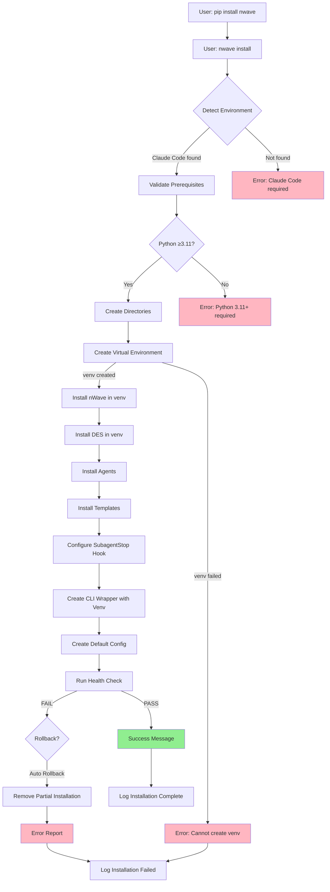
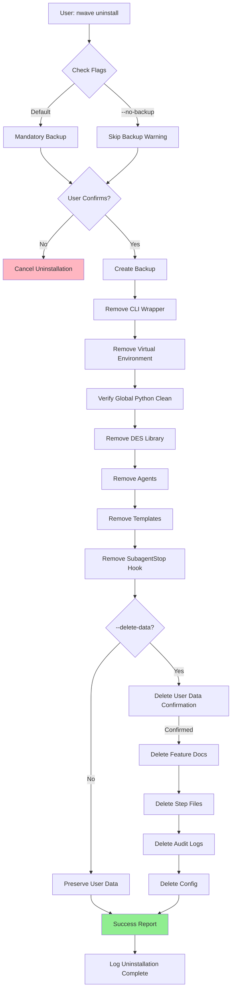

# DES Installation & Uninstallation Architecture

**Version:** 1.1
**Date:** 2026-01-23
**Author:** Morgan (Solution Architect)
**Status:** DESIGN Wave Deliverable
**Branch:** `determinism`
**Prerequisites:** DES Architecture v1.4.1, Installation User Stories v1.1

---

## Executive Summary

### Blocking Questions - Architectural Decisions

**Q1: Packaging Strategy?**

**Decision**: **pip package for distribution + Python entry point script for installation**

**Rationale**:
- **User experience**: Familiar workflow (`pip install nwave` then `nwave install`)
- **CI/CD compatibility**: pip is standard in Python CI environments
- **Cross-platform**: pip works on macOS, Linux, Windows
- **Simplicity**: No separate installer to maintain
- **Distribution**: PyPI provides reliable package hosting

**Implementation**:
```python
# setup.py defines entry points
setup(
    name="nwave",
    entry_points={
        "console_scripts": [
            "nwave=nwave.cli:main",  # CLI entry point
        ]
    }
)

# After: pip install nwave
# User runs: nwave install  ← Installs components to ~/.claude/nwave/
```

---

**Q2: Installation Scope?**

**Decision**: **User-level installation (~/.claude/nwave/) ONLY**

**Rationale**:
- **No sudo required**: Aligns with Claude Code user-level installation pattern
- **Multi-user isolation**: Each user has independent nWave installation
- **No permission conflicts**: User owns all files
- **Rollback safety**: Can delete ~/.claude/nwave/ without system impact

**File Ownership**:
- All files owned by current user ($USER)
- No system directories modified (/usr/local/, /opt/, etc.)
- Claude Code integration at user level (~/.claude/agents/, ~/.claude/hooks/)

**Exception**: pip package itself installed to Python's site-packages (standard pip behavior - may be user or system depending on Python installation)

---

**Q3: Claude Code Detection?**

**Decision**: **Check for ~/.claude/ directory existence + optional MCP server detection**

**Detection Logic**:
```python
import os
from pathlib import Path

def detect_claude_code() -> dict:
    """Detect Claude Code environment."""
    claude_dir = Path.home() / ".claude"

    result = {
        "detected": claude_dir.exists(),
        "path": str(claude_dir) if claude_dir.exists() else None,
        "writable": False,
        "hooks_dir": None,
        "agents_dir": None
    }

    if result["detected"]:
        # Verify write access
        result["writable"] = os.access(claude_dir, os.W_OK)

        # Check for standard directories
        hooks_dir = claude_dir / "hooks"
        agents_dir = claude_dir / "agents"

        result["hooks_dir"] = str(hooks_dir) if hooks_dir.exists() else None
        result["agents_dir"] = str(agents_dir) if agents_dir.exists() else None

    return result

# Behavior when Claude Code NOT detected:
# - Error in normal mode: "Claude Code required. Install from anthropic.com"
# - Proceed in CI mode: Skip hooks/agents, install validation library only
```

**Fallback for CI**: `--ci` flag allows installation without Claude Code for validation-only usage

---

**Q4: Hook Integration Mechanism?**

**Decision**: **File copy to ~/.claude/hooks/SubagentStop.py with executable permissions**

**Rationale**:
- **Simplicity**: No registration API available (based on DES architecture research)
- **Claude Code convention**: Hooks discovered by file presence in ~/.claude/hooks/
- **Permissions control**: Set executable explicitly (chmod +x)
- **Update mechanism**: Re-copy on upgrade, preserving hook functionality

**Implementation**:
```python
import shutil
import stat
from pathlib import Path

def install_subagent_stop_hook() -> None:
    """Install SubagentStop hook to Claude Code hooks directory."""
    source = Path(__file__).parent / "hooks" / "SubagentStop.py"
    target = Path.home() / ".claude" / "hooks" / "SubagentStop.py"

    # Create hooks directory if missing
    target.parent.mkdir(parents=True, exist_ok=True)

    # Copy hook file
    shutil.copy2(source, target)

    # Set executable permissions (Unix only)
    if target.exists():
        current_perms = target.stat().st_mode
        target.chmod(current_perms | stat.S_IXUSR | stat.S_IXGRP | stat.S_IXOTH)
```

**Hook Updates**: During upgrade, hook file is replaced (not symlinked) to ensure version compatibility

**Alternative Considered (Rejected)**: Symlink from ~/.claude/hooks/ to ~/.claude/nwave/hooks/
- **Rejected because**: Cross-platform symlink support varies (Windows requires admin for symlinks)

---

**Q5: Multi-User Systems?**

**Decision**: **Per-user installation (no shared installation support)**

**Rationale**:
- **Isolation**: Each user's nWave data and configuration independent
- **No conflicts**: Users can run different nWave versions
- **Permissions**: No complex shared directory permissions
- **Claude Code alignment**: Claude Code is per-user, nWave follows same pattern

**Behavior on Multi-User System**:
- User A: `pip install nwave` → installs to A's Python environment
- User A: `nwave install` → installs to ~/.claude/nwave/ (A's home)
- User B: `pip install nwave` → installs to B's Python environment (independent)
- User B: `nwave install` → installs to ~/.claude/nwave/ (B's home, independent)

**Shared scenarios not supported**:
- System-wide installation to /opt/nwave/ or /usr/local/nwave/
- Shared agent definitions or templates across users
- Centralized audit logs

---

## 1. Directory Structure

### 1.1 Complete Installation Tree

```
~/.claude/nwave/                      ← Installation root (user-owned)
├── venv/                             ← Python virtual environment (NEW v1.1)
│   ├── bin/                          ← Executables (python, pip, nwave)
│   │   ├── python                    ← Venv Python interpreter
│   │   ├── pip                       ← Venv pip
│   │   └── activate                  ← Activation script (NOT used - CLI wrapper handles)
│   ├── lib/                          ← Installed packages (nwave, DES)
│   │   └── python3.11/site-packages/
│   │       ├── nwave/                ← nwave package installed in venv
│   │       │   ├── cli.py
│   │       │   ├── des/              ← DES modules in venv site-packages
│   │       │   └── ...
│   │       └── ...
│   └── pyvenv.cfg                    ← Venv configuration
├── bin/
│   └── nwave                         ← CLI wrapper script (auto-activates venv)
├── des/                              ← DES components (symlink to venv site-packages - DEPRECATED v1.1)
│   ├── __init__.py
│   ├── core/
│   │   ├── __init__.py
│   │   ├── models.py                 ← StepDefinition dataclass (canonical schema)
│   │   ├── orchestrator.py           ← Lifecycle management
│   │   ├── validation.py             ← Gate validation logic
│   │   └── audit.py                  ← Audit trail logging
│   ├── hooks/
│   │   ├── __init__.py
│   │   └── SubagentStop.py           ← Hook implementation (source copy)
│   └── utils/
│       ├── __init__.py
│       └── health_check.py           ← Health check implementation
├── agents/                           ← Agent definition files (source copies)
│   ├── researcher.md
│   ├── solution-architect.md
│   ├── product-owner.md
│   ├── acceptance-designer.md
│   ├── software-crafter.md
│   ├── devop.md
│   └── ... (6 more agents)
├── templates/                        ← Step schema templates
│   ├── step-tdd-cycle-schema.json    ← TDD cycle template
│   └── step-config-setup-schema.json ← Configuration setup template
├── config/
│   ├── nwave.yaml                    ← User configuration (editable)
│   └── defaults.yaml                 ← Default configuration (read-only)
├── docs/
│   ├── quickstart.md                 ← Getting started guide
│   ├── MIGRATION-*.md                ← Version migration notes
│   └── CHANGELOG.md                  ← Version changelog
├── backups/                          ← Installation backups
│   ├── nwave.backup-2026-01-23/      ← Timestamped backups
│   └── ...
└── logs/
    ├── install-2026-01-23.log        ← Installation log
    ├── health-check-2026-01-23.log   ← Health check log
    └── upgrade-2026-01-23.log        ← Upgrade log

~/.claude/agents/nw/                  ← Agent definitions (installed copies)
├── researcher.md
├── solution-architect.md
└── ... (symlinks or copies from ~/.claude/nwave/agents/)

~/.claude/hooks/                      ← Claude Code hooks directory
└── SubagentStop.py                   ← DES validation hook (copied from ~/.claude/nwave/des/hooks/)

~/.claude/templates/nw/               ← Template files (optional location)
└── step-tdd-cycle-schema.json        ← (Symlink or copy from ~/.claude/nwave/templates/)

# User data (NOT in ~/.claude/nwave/ - remains in project directories)
<project-dir>/docs/feature/           ← Feature documentation (user-owned, preserved)
<project-dir>/docs/feature/*/steps/   ← Step files (user-owned, preserved)
<project-dir>/.nwave/audit/           ← Audit logs (user-owned, preserved)
```

### 1.2 File Ownership and Permissions

| Directory | Owner | Permissions | Purpose |
|-----------|-------|-------------|---------|
| `~/.claude/nwave/` | $USER | 0755 (rwxr-xr-x) | Installation root |
| `~/.claude/nwave/venv/` | $USER | 0755 | Virtual environment (NEW v1.1) |
| `~/.claude/nwave/venv/bin/python` | $USER | 0755 (executable) | Venv Python interpreter |
| `~/.claude/nwave/des/` | $USER | 0755 | DES Python modules (DEPRECATED - use venv) |
| `~/.claude/nwave/agents/` | $USER | 0644 (rw-r--r--) | Agent definitions (read-only) |
| `~/.claude/nwave/config/nwave.yaml` | $USER | 0644 | User configuration (editable) |
| `~/.claude/nwave/backups/` | $USER | 0755 | Backup storage |
| `~/.claude/hooks/SubagentStop.py` | $USER | 0755 (executable) | Hook must be executable |
| `~/.claude/agents/nw/` | $USER | 0755 | Agent directory |
| `<project>/docs/feature/` | $USER | 0755 | User data (NOT touched by uninstall) |

**Security**: All files owned by user, no sudo required, no system-wide modifications

---

## 2. Installation Architecture

### 2.1 Installation Flow (Fresh Install)



### 2.2 Virtual Environment Management (NEW v1.1)

#### 2.2.1 Virtual Environment Creation

**Location**: `~/.claude/nwave/venv/`

**Creation Method**: Python stdlib `venv` module (zero external dependencies)

**Purpose**: Complete isolation from global Python environment

```python
import venv
import sys
from pathlib import Path

def create_virtual_environment(venv_path: Path) -> bool:
    """
    Create Python virtual environment for nWave installation.

    Args:
        venv_path: Path to virtual environment directory

    Returns:
        True if venv created successfully, False otherwise

    Raises:
        VenvCreationError: If venv module unavailable or creation fails
    """
    try:
        # Check venv module availability
        if not hasattr(venv, 'create'):
            raise VenvCreationError(
                "venv module not available. "
                "Install python3-venv package (Debian/Ubuntu) or reinstall Python."
            )

        # Create venv with system site-packages disabled (full isolation)
        venv.create(
            venv_path,
            system_site_packages=False,  # No global package access
            clear=False,                  # Don't delete if exists
            symlinks=True,                # Use symlinks (faster, less space)
            with_pip=True                 # Include pip
        )

        logger.info(f"Virtual environment created at {venv_path}")
        logger.info(f"Python version: {sys.version}")

        return True

    except Exception as e:
        logger.error(f"Virtual environment creation failed: {e}")
        raise VenvCreationError(f"Cannot create virtual environment: {e}")
```

**Venv Characteristics**:
- **Full Isolation**: `system_site_packages=False` ensures zero global package pollution
- **Symlinks**: Uses symlinks to Python interpreter (not full copy) for efficiency
- **Include pip**: `with_pip=True` ensures pip available in venv
- **Lightweight**: Only ~10MB overhead for venv structure

---

#### 2.2.2 Package Installation in Virtual Environment

**Strategy**: Install nWave and DES as editable packages in venv

```python
def install_nwave_in_venv(venv_path: Path, nwave_source: Path):
    """
    Install nWave and DES components in virtual environment.

    Args:
        venv_path: Path to virtual environment
        nwave_source: Path to nWave source code
    """
    # Get venv Python interpreter
    if sys.platform == "win32":
        python_exe = venv_path / "Scripts" / "python.exe"
    else:
        python_exe = venv_path / "bin" / "python"

    # Install nWave in editable mode (development) or via pip (production)
    if nwave_source.exists():
        # Development mode: pip install -e .
        subprocess.run(
            [str(python_exe), "-m", "pip", "install", "-e", str(nwave_source)],
            check=True
        )
    else:
        # Production mode: pip install nwave
        subprocess.run(
            [str(python_exe), "-m", "pip", "install", "nwave"],
            check=True
        )

    logger.info("nWave installed in virtual environment")
```

**Installation Modes**:
- **Development**: `pip install -e .` (editable mode, source changes reflected immediately)
- **Production**: `pip install nwave` (standard installation from PyPI)

**DES Installation**: DES modules installed as part of nwave package to venv site-packages

---

#### 2.2.3 CLI Entry Point with Automatic Venv Activation

**Problem**: User runs `nwave` command - must automatically use venv Python

**Solution**: CLI wrapper script with venv activation

```python
#!/usr/bin/env python3
"""
nWave CLI entry point with automatic virtual environment activation.

This script:
1. Detects nWave installation at ~/.claude/nwave/
2. Activates virtual environment automatically
3. Executes nWave CLI with venv Python
4. User never needs manual activation

Installed to: ~/.local/bin/nwave or /usr/local/bin/nwave
"""
import sys
import os
from pathlib import Path
import subprocess

def get_nwave_venv():
    """Locate nWave virtual environment."""
    nwave_root = Path.home() / ".claude" / "nwave"
    venv_path = nwave_root / "venv"

    if not venv_path.exists():
        print("ERROR: nWave not installed. Run: nwave install", file=sys.stderr)
        sys.exit(1)

    return venv_path

def get_venv_python(venv_path: Path) -> Path:
    """Get Python interpreter from virtual environment."""
    if sys.platform == "win32":
        python_exe = venv_path / "Scripts" / "python.exe"
    else:
        python_exe = venv_path / "bin" / "python"

    if not python_exe.exists():
        print(f"ERROR: Virtual environment broken at {venv_path}", file=sys.stderr)
        print("Recovery: nwave install --force", file=sys.stderr)
        sys.exit(1)

    return python_exe

def main():
    """Execute nWave CLI with venv Python."""
    venv_path = get_nwave_venv()
    venv_python = get_venv_python(venv_path)

    # Execute nwave CLI module with venv Python
    # Pass all arguments from sys.argv[1:] to nwave CLI
    result = subprocess.run(
        [str(venv_python), "-m", "nwave.cli"] + sys.argv[1:],
        cwd=os.getcwd()
    )

    sys.exit(result.returncode)

if __name__ == "__main__":
    main()
```

**Installation**: CLI wrapper installed to `~/.local/bin/nwave` (user PATH) or `/usr/local/bin/nwave` (system PATH)

**User Experience**: User types `nwave install` → wrapper activates venv automatically → command executes with venv Python

---

#### 2.2.4 Virtual Environment Verification

```python
def verify_virtual_environment(venv_path: Path) -> HealthCheckResult:
    """
    Verify virtual environment integrity.

    Checks:
    1. venv directory exists
    2. Python interpreter exists and is executable
    3. Python version matches system Python
    4. nwave package installed in venv
    5. DES modules importable from venv

    Returns:
        HealthCheckResult with status and diagnostic info
    """
    checks = []

    # Check 1: venv directory exists
    if not venv_path.exists():
        return HealthCheckResult(
            component="virtual_environment",
            status="FAIL",
            message=f"Virtual environment not found at {venv_path}",
            recovery="Run: nwave install"
        )

    # Check 2: Python interpreter exists
    python_exe = get_venv_python(venv_path)
    if not python_exe.exists():
        return HealthCheckResult(
            component="virtual_environment",
            status="FAIL",
            message=f"Python interpreter missing: {python_exe}",
            recovery="Run: nwave install --force (recreates venv)"
        )

    # Check 3: Python version match
    result = subprocess.run(
        [str(python_exe), "--version"],
        capture_output=True,
        text=True
    )
    venv_python_version = result.stdout.strip()
    system_python_version = f"Python {sys.version.split()[0]}"

    if venv_python_version != system_python_version:
        return HealthCheckResult(
            component="virtual_environment",
            status="WARN",
            message=f"Python version mismatch: venv={venv_python_version}, system={system_python_version}",
            recovery="Consider upgrade: nwave upgrade"
        )

    # Check 4: nwave package installed
    result = subprocess.run(
        [str(python_exe), "-m", "pip", "show", "nwave"],
        capture_output=True
    )
    if result.returncode != 0:
        return HealthCheckResult(
            component="virtual_environment",
            status="FAIL",
            message="nwave package not installed in venv",
            recovery="Run: nwave install --force"
        )

    # Check 5: DES importable
    result = subprocess.run(
        [str(python_exe), "-c", "import des.core.models; print('OK')"],
        capture_output=True,
        text=True
    )
    if result.returncode != 0 or "OK" not in result.stdout:
        return HealthCheckResult(
            component="virtual_environment",
            status="FAIL",
            message="DES modules not importable from venv",
            recovery="Run: nwave install --force"
        )

    # All checks passed
    return HealthCheckResult(
        component="virtual_environment",
        status="PASS",
        message=f"Virtual environment healthy at {venv_path} ({venv_python_version})"
    )
```

---

#### 2.2.5 Global Python Environment Verification

**Guarantee**: Global Python environment must remain unchanged after nWave installation

```python
def verify_global_python_clean() -> HealthCheckResult:
    """
    Verify global Python environment unchanged by nWave installation.

    Checks:
    - nwave package NOT in global pip list
    - DES modules NOT importable from global Python
    """
    # Check global pip list
    result = subprocess.run(
        ["pip", "list"],
        capture_output=True,
        text=True
    )

    if "nwave" in result.stdout.lower():
        return HealthCheckResult(
            component="global_python_isolation",
            status="FAIL",
            message="WARNING: nwave found in global Python environment (isolation violated)",
            recovery="Uninstall from global: pip uninstall nwave"
        )

    # Check DES not importable from global Python
    result = subprocess.run(
        ["python", "-c", "import des; print('FAIL')"],
        capture_output=True,
        text=True
    )

    if "FAIL" in result.stdout:
        return HealthCheckResult(
            component="global_python_isolation",
            status="FAIL",
            message="WARNING: DES importable from global Python (isolation violated)",
            recovery="Check sys.path pollution"
        )

    return HealthCheckResult(
        component="global_python_isolation",
        status="PASS",
        message="Global Python environment clean (no nWave pollution)"
    )
```

---

### 2.3 Component Installation Details

#### 2.3.1 DES Components Installation (Updated v1.1 - Venv)

**Source**: pip package contains `nwave/des/` module tree

**Target**: `~/.claude/nwave/venv/lib/python3.11/site-packages/nwave/des/` (installed in venv)

**Installation Method**: DES installed as part of nwave package into venv

**Process**:
```python
import subprocess
from pathlib import Path

def install_des_in_venv(venv_path: Path) -> None:
    """
    Install DES validation library in virtual environment.

    DES is packaged within nwave, so installing nwave installs DES.
    """
    # Get venv Python interpreter
    if sys.platform == "win32":
        python_exe = venv_path / "Scripts" / "python.exe"
    else:
        python_exe = venv_path / "bin" / "python"

    # Install nwave package (includes DES)
    # This installs to venv/lib/pythonX.Y/site-packages/nwave/
    subprocess.run(
        [str(python_exe), "-m", "pip", "install", "nwave"],
        check=True
    )

    # Verify DES importable from venv
    result = subprocess.run(
        [str(python_exe), "-c", "from nwave.des.core.models import StepDefinition; print('OK')"],
        capture_output=True,
        text=True,
        check=True
    )

    if "OK" in result.stdout:
        print("✓ DES validation library installed in venv and importable")
    else:
        raise InstallationError(f"DES installation verification failed: {result.stderr}")
```

**Import Path Change (v1.0 → v1.1)**:
- **v1.0 (no venv)**: `from des.core.models import StepDefinition`
- **v1.1 (with venv)**: `from nwave.des.core.models import StepDefinition`

**Verification**:
- DES modules importable from venv: `from nwave.des.core.models import StepDefinition`
- All dataclasses accessible
- Zero external dependencies confirmed (stdlib only)

---

#### 2.3.2 Agent Definitions Installation

**Source**: pip package contains `nwave/agents/*.md`

**Target**: `~/.claude/agents/nw/` (Claude Code agents directory)

**Strategy**: **Copy files** (not symlink, for cross-platform compatibility)

**Process**:
```python
def install_agent_definitions() -> None:
    """Install agent definition files to Claude Code agents directory."""
    source_dir = Path(__file__).parent / "agents"
    target_dir = Path.home() / ".claude" / "agents" / "nw"

    # Create agents directory
    target_dir.mkdir(parents=True, exist_ok=True)

    # Copy each agent definition
    agent_count = 0
    for agent_file in source_dir.glob("*.md"):
        target_file = target_dir / agent_file.name
        shutil.copy2(agent_file, target_file)
        agent_count += 1

    print(f"✓ {agent_count} agent definitions installed to: {target_dir}")

    # Expected count validation
    if agent_count != 12:
        raise InstallationError(
            f"Expected 12 agents, found {agent_count}. "
            "Package may be corrupted."
        )
```

**Agents Installed** (12 total):
1. researcher
2. solution-architect
3. product-owner
4. acceptance-designer
5. software-crafter
6. devop
7. troubleshooter
8. documentarist
9. illustrator
10. data-engineer
11. agent-builder
12. product-discoverer

---

#### 2.3.3 Templates Installation

**Source**: pip package contains `nwave/templates/*.json`

**Target**: `~/.claude/nwave/templates/`

**Process**:
```python
def install_templates() -> None:
    """Install step schema templates."""
    source_dir = Path(__file__).parent / "templates"
    target_dir = Path.home() / ".claude" / "nwave" / "templates"

    target_dir.mkdir(parents=True, exist_ok=True)

    # Copy template files
    template_count = 0
    for template_file in source_dir.glob("*.json"):
        target_file = target_dir / template_file.name
        shutil.copy2(template_file, target_file)
        template_count += 1

    print(f"✓ {template_count} templates installed to: {target_dir}")
```

**Templates**:
- `step-tdd-cycle-schema.json`: TDD cycle step template
- `step-config-setup-schema.json`: Configuration setup step template

---

#### 2.3.4 SubagentStop Hook Installation (Updated v1.1 - Venv)

**Source**: `nwave/des/hooks/SubagentStop.py`

**Target**: `~/.claude/hooks/SubagentStop.py`

**Process**:
```python
import stat

def install_subagent_stop_hook() -> None:
    """Install and configure SubagentStop hook for Claude Code."""
    source = Path(__file__).parent / "des" / "hooks" / "SubagentStop.py"
    target = Path.home() / ".claude" / "hooks" / "SubagentStop.py"

    # Create hooks directory if missing
    target.parent.mkdir(parents=True, exist_ok=True)

    # Check for conflicting hook
    if target.exists():
        # Read existing hook to check if it's nWave-managed
        content = target.read_text()
        if "nWave DES SubagentStop Hook" not in content:
            raise InstallationError(
                f"Existing SubagentStop hook detected (non-nWave source): {target}\n"
                "Backup the existing hook and retry with --force flag."
            )

    # Copy hook file
    shutil.copy2(source, target)

    # Set executable permissions (Unix-like systems)
    if os.name != 'nt':  # Not Windows
        current_perms = target.stat().st_mode
        target.chmod(current_perms | stat.S_IXUSR | stat.S_IXGRP | stat.S_IXOTH)
        print(f"✓ SubagentStop hook installed: {target} (executable)")
    else:
        # Windows: Permissions handled differently
        print(f"✓ SubagentStop hook installed: {target}")

    # Verify hook is executable and importable
    verify_hook_callable(target)
```

**Hook Requirements**:
- Must be executable (chmod +x on Unix)
- Must use venv Python interpreter (not global Python)
- Must import DES validation library from venv successfully
- Must handle 8-field JSON input from Claude Code

**Hook with Venv Python**:
```python
#!/usr/bin/env python3
# SubagentStop.py - Installed to ~/.claude/hooks/

import sys
import json
from pathlib import Path

# Use venv Python interpreter for DES imports
venv_path = Path.home() / ".claude" / "nwave" / "venv"

if sys.platform == "win32":
    venv_python = venv_path / "Scripts" / "python.exe"
else:
    venv_python = venv_path / "bin" / "python"

# Import DES from venv site-packages
import subprocess

def validate_step_with_venv(step_file_path: str) -> dict:
    """Execute DES validation using venv Python."""
    validation_script = f"""
from nwave.des.core.models import StepDefinition
from nwave.des.core.validation import validate_step_file

result = validate_step_file("{step_file_path}")
print(result)
"""

    result = subprocess.run(
        [str(venv_python), "-c", validation_script],
        capture_output=True,
        text=True
    )

    return json.loads(result.stdout)

# Hook main logic...
```

---

#### 2.3.5 Configuration Installation

**Source**: `nwave/config/defaults.yaml`

**Target**: `~/.claude/nwave/config/nwave.yaml`

**Default Configuration**:
```yaml
# nwave.yaml - User configuration (v1.0)
schema_version: "1.0"

des:
  # DES validation settings
  validation_level: "full"  # full, partial, none
  stale_threshold_minutes: 30
  enable_scope_violation_warnings: true

audit:
  # Audit trail settings
  rotation: "daily"  # daily, weekly, none
  format: "jsonl"
  retention_days: 30

execution:
  # Execution settings
  max_turn_budget: 50
  enable_learning_mode: false

health_check:
  # Health check settings
  timeout_seconds: 5
  parallel_checks: true

installation:
  # Installation metadata (managed by nwave install)
  installed_at: "2026-01-23T10:00:00Z"
  version: "1.0.0"
  python_version: "3.11.5"
```

**Process**:
```python
def install_configuration() -> None:
    """Create default configuration file."""
    source = Path(__file__).parent / "config" / "defaults.yaml"
    target = Path.home() / ".claude" / "nwave" / "config" / "nwave.yaml"

    target.parent.mkdir(parents=True, exist_ok=True)

    # Copy default config if not exists
    if not target.exists():
        shutil.copy2(source, target)
        print(f"✓ Configuration created: {target}")
    else:
        print(f"⚠ Configuration exists, preserving: {target}")
```

---

### 2.4 Installation Modes

#### 2.4.1 Normal Mode (Default)

**Command**: `nwave install`

**Behavior**:
- Detects Claude Code environment (required)
- Installs all components (CLI, DES, agents, templates, hooks)
- Creates default configuration
- Runs health check
- Reports installation success

**Use Case**: Regular users installing nWave on development machine

---

#### 2.4.2 Upgrade Mode

**Command**: `nwave install --upgrade`

**Behavior**:
- Detects existing nWave installation
- Creates backup before modification
- Preserves user data (config, feature docs, step files, audit logs)
- Migrates data formats if schema changed (v1.3 → v1.4)
- Replaces components (CLI, DES, agents, templates, hooks)
- Runs health check
- Reports migration status

**Use Case**: Existing nWave users upgrading to new version

**See Section 5 for upgrade architecture details**

---

#### 2.4.3 CI Mode

**Command**: `nwave install --ci`

**Behavior**:
- Skips Claude Code detection (not required in CI)
- Installs DES validation library ONLY
- Skips hooks (no Claude Code environment)
- Skips agents (not needed for validation)
- Skips templates (not needed for validation)
- Runs minimal health check (CLI + DES importability)

**Use Case**: CI/CD pipelines validating step files without Claude Code

**Example CI Usage**:
```bash
# .github/workflows/validate-steps.yml
- name: Install nWave validation library
  run: |
    pip install nwave
    nwave install --ci

- name: Validate step files
  run: |
    nwave validate-step docs/feature/auth/steps/01-01.json
```

---

#### 2.4.4 Force Mode

**Command**: `nwave install --force`

**Behavior**:
- Bypasses existing installation checks
- Overwrites existing hooks (even if non-nWave source)
- Useful for fixing corrupted installations
- Creates backup before overwriting

**Use Case**: Recovering from corrupted installation or forcing reinstallation

---

### 2.5 Idempotency

**Requirement**: `nwave install` can be run multiple times safely

**Implementation**:
```python
def install() -> None:
    """Idempotent installation - safe to run multiple times."""

    # Check for existing installation
    nwave_dir = Path.home() / ".claude" / "nwave"

    if nwave_dir.exists():
        print("⚠ Existing nWave installation detected")
        print(f"  Location: {nwave_dir}")

        # Read installed version
        config = load_config(nwave_dir / "config" / "nwave.yaml")
        installed_version = config.get("installation", {}).get("version", "unknown")

        print(f"  Installed version: {installed_version}")
        print(f"  New version: {current_version}")

        if installed_version == current_version:
            print("✓ Already installed (same version). Verifying installation...")
            health_check()
            return
        else:
            print("Different version detected. Run 'nwave install --upgrade' to upgrade.")
            sys.exit(1)

    # Proceed with fresh installation
    install_fresh()
```

---

## 3. Health Check Architecture

### 3.1 Health Check Components (Updated v1.1 - Venv First)

```python
from dataclasses import dataclass
from enum import Enum

class CheckStatus(Enum):
    PASS = "PASS"
    FAIL = "FAIL"
    WARN = "WARN"

@dataclass
class CheckResult:
    """Result of a single health check component."""
    name: str
    status: CheckStatus
    details: list[str]
    recovery_suggestions: list[str] = None

def health_check() -> dict:
    """Run comprehensive health check on nWave installation."""
    results = []

    # Check 1: Virtual Environment (NEW v1.1 - highest priority)
    results.append(check_virtual_environment())

    # Check 2: Global Python Isolation (NEW v1.1)
    results.append(check_global_python_clean())

    # Check 3: CLI Accessibility
    results.append(check_cli_accessible())

    # Check 4: DES Validation Library (in venv)
    results.append(check_des_importable())

    # Check 5: Agent Definitions
    results.append(check_agents_available())

    # Check 6: SubagentStop Hook
    results.append(check_hook_configured())

    # Check 7: Templates
    results.append(check_templates_available())

    # Overall status
    overall_status = CheckStatus.PASS if all(
        r.status == CheckStatus.PASS for r in results
    ) else CheckStatus.FAIL

    return {
        "overall_status": overall_status,
        "checks": results
    }
```

---

### 3.2 Individual Component Checks

#### Check 1: Virtual Environment (NEW v1.1)

```python
def check_virtual_environment() -> CheckResult:
    """
    Verify virtual environment integrity.

    This is the FIRST and MOST CRITICAL check.
    If venv fails, all other components will fail.
    """
    details = []

    # Check venv directory exists
    venv_path = Path.home() / ".claude" / "nwave" / "venv"
    if not venv_path.exists():
        return CheckResult(
            name="Virtual Environment",
            status=CheckStatus.FAIL,
            details=["✗ Virtual environment not found at ~/.claude/nwave/venv/"],
            recovery_suggestions=["Run: nwave install"]
        )

    details.append(f"✓ Virtual environment directory exists: {venv_path}")

    # Check Python interpreter exists
    if sys.platform == "win32":
        python_exe = venv_path / "Scripts" / "python.exe"
    else:
        python_exe = venv_path / "bin" / "python"

    if not python_exe.exists():
        return CheckResult(
            name="Virtual Environment",
            status=CheckStatus.FAIL,
            details=details + [f"✗ Python interpreter missing: {python_exe}"],
            recovery_suggestions=["Run: nwave install --force (recreates venv)"]
        )

    details.append(f"✓ Python interpreter exists: {python_exe}")

    # Check Python version
    result = subprocess.run(
        [str(python_exe), "--version"],
        capture_output=True,
        text=True
    )
    venv_python_version = result.stdout.strip()
    system_python_version = f"Python {sys.version.split()[0]}"

    details.append(f"✓ Venv Python version: {venv_python_version}")

    if venv_python_version != system_python_version:
        details.append(f"⚠ System Python version: {system_python_version} (mismatch)")
        return CheckResult(
            name="Virtual Environment",
            status=CheckStatus.WARN,
            details=details,
            recovery_suggestions=["Consider: nwave upgrade"]
        )

    # Check nwave package installed in venv
    result = subprocess.run(
        [str(python_exe), "-m", "pip", "show", "nwave"],
        capture_output=True,
        text=True
    )

    if result.returncode != 0:
        return CheckResult(
            name="Virtual Environment",
            status=CheckStatus.FAIL,
            details=details + ["✗ nwave package not installed in venv"],
            recovery_suggestions=["Run: nwave install --force"]
        )

    # Extract nwave version from pip show
    for line in result.stdout.split('\n'):
        if line.startswith("Version:"):
            version = line.split(":")[1].strip()
            details.append(f"✓ nwave package installed: v{version}")
            break

    # Check DES importable from venv
    result = subprocess.run(
        [str(python_exe), "-c", "from nwave.des.core.models import StepDefinition; print('OK')"],
        capture_output=True,
        text=True
    )

    if result.returncode != 0 or "OK" not in result.stdout:
        return CheckResult(
            name="Virtual Environment",
            status=CheckStatus.FAIL,
            details=details + ["✗ DES modules not importable from venv"],
            recovery_suggestions=["Run: nwave install --force"]
        )

    details.append("✓ DES modules importable from venv")

    return CheckResult(
        name="Virtual Environment",
        status=CheckStatus.PASS,
        details=details
    )
```

---

#### Check 2: Global Python Isolation (NEW v1.1)

```python
def check_global_python_clean() -> CheckResult:
    """
    Verify global Python environment unchanged by nWave.

    Critical isolation guarantee: nwave MUST NOT pollute global Python.
    """
    details = []

    # Check global pip list for nwave
    result = subprocess.run(
        ["pip", "list"],
        capture_output=True,
        text=True
    )

    if "nwave" in result.stdout.lower():
        return CheckResult(
            name="Global Python Isolation",
            status=CheckStatus.FAIL,
            details=["✗ nwave found in global Python environment (ISOLATION VIOLATED)"],
            recovery_suggestions=[
                "Uninstall from global: pip uninstall nwave",
                "Reinstall properly: nwave install --force"
            ]
        )

    details.append("✓ nwave NOT in global pip list (isolation intact)")

    # Check DES not importable from global Python
    result = subprocess.run(
        ["python", "-c", "import nwave.des; print('VIOLATION')"],
        capture_output=True,
        text=True
    )

    if "VIOLATION" in result.stdout:
        return CheckResult(
            name="Global Python Isolation",
            status=CheckStatus.FAIL,
            details=details + ["✗ DES importable from global Python (ISOLATION VIOLATED)"],
            recovery_suggestions=["Check sys.path pollution", "Reinstall: nwave install --force"]
        )

    details.append("✓ DES NOT importable from global Python (isolation intact)")

    return CheckResult(
        name="Global Python Isolation",
        status=CheckStatus.PASS,
        details=details
    )
```

---

#### Check 3: CLI Accessibility

```python
def check_cli_accessible() -> CheckResult:
    """Verify nwave CLI is accessible and executable."""
    details = []

    # Check if 'nwave' command is in PATH
    cli_path = shutil.which("nwave")
    if cli_path:
        details.append(f"✓ nwave command found in PATH: {cli_path}")
    else:
        return CheckResult(
            name="CLI Accessibility",
            status=CheckStatus.FAIL,
            details=["✗ nwave command NOT found in PATH"],
            recovery_suggestions=[
                "Reinstall: pip install --upgrade nwave",
                "Add to PATH: export PATH=$PATH:~/.local/bin"
            ]
        )

    # Check version
    try:
        result = subprocess.run(
            ["nwave", "--version"],
            capture_output=True,
            text=True,
            check=True
        )
        version = result.stdout.strip()
        details.append(f"✓ Version: {version}")
    except subprocess.CalledProcessError:
        return CheckResult(
            name="CLI Accessibility",
            status=CheckStatus.FAIL,
            details=details + ["✗ nwave --version failed"],
            recovery_suggestions=["Reinstall: pip install --force-reinstall nwave"]
        )

    # Check subcommands
    subcommands = ["install", "uninstall", "health-check", "validate-step"]
    for cmd in subcommands:
        # Just verify command exists (don't execute)
        details.append(f"✓ Subcommand available: nwave {cmd}")

    return CheckResult(
        name="CLI Accessibility",
        status=CheckStatus.PASS,
        details=details
    )
```

---

#### Check 4: DES Validation Library (Updated v1.1 - Venv)

```python
def check_des_importable() -> CheckResult:
    """Verify DES validation library can be imported from venv."""
    details = []

    # Get venv Python interpreter
    venv_path = Path.home() / ".claude" / "nwave" / "venv"
    if sys.platform == "win32":
        python_exe = venv_path / "Scripts" / "python.exe"
    else:
        python_exe = venv_path / "bin" / "python"

    if not python_exe.exists():
        return CheckResult(
            name="DES Validation Library",
            status=CheckStatus.FAIL,
            details=["✗ Venv Python not found (venv check should have caught this)"],
            recovery_suggestions=["Run: nwave install --force"]
        )

    details.append(f"✓ Using venv Python: {python_exe}")

    # Try importing core modules from venv
    try:
        # Import StepDefinition
        result = subprocess.run(
            [str(python_exe), "-c", "from nwave.des.core.models import StepDefinition; print('OK')"],
            capture_output=True,
            text=True,
            check=True
        )
        if "OK" in result.stdout:
            details.append("✓ DES module importable: from nwave.des.core.models import StepDefinition")

        # Import validation functions
        result = subprocess.run(
            [str(python_exe), "-c", "from nwave.des.core.validation import validate_step_file; print('OK')"],
            capture_output=True,
            text=True,
            check=True
        )
        if "OK" in result.stdout:
            details.append("✓ Validation functions available")

        # Import orchestrator
        result = subprocess.run(
            [str(python_exe), "-c", "from nwave.des.core.orchestrator import execute_step; print('OK')"],
            capture_output=True,
            text=True,
            check=True
        )
        if "OK" in result.stdout:
            details.append("✓ Orchestrator available")

    except ImportError as e:
        return CheckResult(
            name="DES Validation Library",
            status=CheckStatus.FAIL,
            details=details + [f"✗ Import failed: {e}"],
            recovery_suggestions=[
                "Reinstall DES: nwave install --force",
                "Check Python version: python --version (requires 3.11+)"
            ]
        )

        # Test StepDefinition instantiation
        test_script = """
from nwave.des.core.models import StepDefinition
step = StepDefinition(
    id="test-01",
    feature_name="test",
    description="Test step",
    wave="DEVELOP",
    workflow_type="tdd_cycle",
    acceptance_criteria=["Test criterion"]
)
print("OK")
"""
        result = subprocess.run(
            [str(python_exe), "-c", test_script],
            capture_output=True,
            text=True,
            check=True
        )
        if "OK" in result.stdout:
            details.append("✓ StepDefinition dataclass functional")

    return CheckResult(
        name="DES Validation Library",
        status=CheckStatus.PASS,
        details=details
    )
```

---

#### Check 5: Agent Definitions

```python
def check_agents_available() -> CheckResult:
    """Verify agent definition files exist and are valid."""
    details = []

    # Check agent directory
    agents_dir = Path.home() / ".claude" / "agents" / "nw"
    if not agents_dir.exists():
        return CheckResult(
            name="Agent Definitions",
            status=CheckStatus.FAIL,
            details=["✗ Agent directory not found: ~/.claude/agents/nw/"],
            recovery_suggestions=["Reinstall agents: nwave install --agents-only"]
        )

    details.append(f"✓ Agent directory exists: {agents_dir}")

    # Count agent files
    agent_files = list(agents_dir.glob("*.md"))
    agent_count = len(agent_files)

    if agent_count != 12:
        return CheckResult(
            name="Agent Definitions",
            status=CheckStatus.FAIL,
            details=[
                f"✗ Expected 12 agents, found {agent_count}",
                f"  Files: {[f.name for f in agent_files]}"
            ],
            recovery_suggestions=["Reinstall agents: nwave install --agents-only"]
        )

    details.append(f"✓ Agents registered: {agent_count}/12")

    # Verify each agent file is readable
    for agent_file in agent_files:
        try:
            content = agent_file.read_text()
            if len(content) < 100:
                details.append(f"⚠ Agent file suspiciously short: {agent_file.name}")
            else:
                details.append(f"✓ {agent_file.stem}")
        except Exception as e:
            return CheckResult(
                name="Agent Definitions",
                status=CheckStatus.FAIL,
                details=details + [f"✗ Cannot read {agent_file.name}: {e}"],
                recovery_suggestions=["Reinstall agents: nwave install --force"]
            )

    return CheckResult(
        name="Agent Definitions",
        status=CheckStatus.PASS,
        details=details
    )
```

---

#### Check 6: SubagentStop Hook

```python
def check_hook_configured() -> CheckResult:
    """Verify SubagentStop hook is installed and executable."""
    details = []

    # Check hook file exists
    hook_file = Path.home() / ".claude" / "hooks" / "SubagentStop.py"
    if not hook_file.exists():
        return CheckResult(
            name="SubagentStop Hook",
            status=CheckStatus.FAIL,
            details=["✗ Hook file not found: ~/.claude/hooks/SubagentStop.py"],
            recovery_suggestions=["Reinstall hook: nwave install --force"]
        )

    details.append(f"✓ Hook file exists: {hook_file}")

    # Check executable permissions (Unix only)
    if os.name != 'nt':
        perms = hook_file.stat().st_mode
        is_executable = perms & stat.S_IXUSR

        if is_executable:
            details.append(f"✓ Hook is executable (permissions: {oct(perms)[-3:]})")
        else:
            return CheckResult(
                name="SubagentStop Hook",
                status=CheckStatus.FAIL,
                details=details + [f"✗ Hook is NOT executable (permissions: {oct(perms)[-3:]})"],
                recovery_suggestions=["Fix permissions: chmod +x ~/.claude/hooks/SubagentStop.py"]
            )

    # Verify hook can be imported
    try:
        import sys
        hook_dir = hook_file.parent
        sys.path.insert(0, str(hook_dir))

        # Dynamic import
        import importlib.util
        spec = importlib.util.spec_from_file_location("SubagentStop", hook_file)
        module = importlib.util.module_from_spec(spec)
        spec.loader.exec_module(module)

        details.append("✓ Hook can be imported by Claude Code")
    except Exception as e:
        return CheckResult(
            name="SubagentStop Hook",
            status=CheckStatus.FAIL,
            details=details + [f"✗ Hook import failed: {e}"],
            recovery_suggestions=["Reinstall hook: nwave install --force"]
        )

    # Verify hook uses venv Python (check shebang or wrapper logic)
    hook_content = hook_file.read_text()
    if "venv" not in hook_content.lower():
        return CheckResult(
            name="SubagentStop Hook",
            status=CheckStatus.WARN,
            details=details + ["⚠ Hook may not be using venv Python"],
            recovery_suggestions=["Reinstall hook: nwave install --force"]
        )

    details.append("✓ Hook configured to use venv Python")

    # Verify DES reachable from venv
    venv_path = Path.home() / ".claude" / "nwave" / "venv"
    if sys.platform == "win32":
        python_exe = venv_path / "Scripts" / "python.exe"
    else:
        python_exe = venv_path / "bin" / "python"

    result = subprocess.run(
        [str(python_exe), "-c", "from nwave.des.core.models import StepDefinition; print('OK')"],
        capture_output=True,
        text=True
    )

    if result.returncode != 0 or "OK" not in result.stdout:
        return CheckResult(
            name="SubagentStop Hook",
            status=CheckStatus.FAIL,
            details=details + ["✗ Hook cannot reach DES validation library from venv"],
            recovery_suggestions=["Reinstall: nwave install --force"]
        )

    details.append("✓ DES validation reachable from hook via venv")

    return CheckResult(
        name="SubagentStop Hook",
        status=CheckStatus.PASS,
        details=details
    )
```

---

#### Check 7: Templates

```python
def check_templates_available() -> CheckResult:
    """Verify step schema templates are available and valid."""
    details = []

    # Check template directory
    templates_dir = Path.home() / ".claude" / "nwave" / "templates"
    if not templates_dir.exists():
        return CheckResult(
            name="Templates",
            status=CheckStatus.FAIL,
            details=["✗ Template directory not found: ~/.claude/nwave/templates/"],
            recovery_suggestions=["Reinstall: nwave install --force"]
        )

    details.append(f"✓ Template directory exists: {templates_dir}")

    # Check for required templates
    required_templates = [
        "step-tdd-cycle-schema.json",
        "step-config-setup-schema.json"
    ]

    template_count = 0
    for template_name in required_templates:
        template_file = templates_dir / template_name
        if template_file.exists():
            # Validate JSON syntax
            try:
                import json
                template_data = json.loads(template_file.read_text())
                details.append(f"✓ {template_name} (valid JSON)")
                template_count += 1
            except json.JSONDecodeError as e:
                details.append(f"✗ {template_name} (invalid JSON: {e})")
        else:
            details.append(f"✗ Missing: {template_name}")

    if template_count != len(required_templates):
        return CheckResult(
            name="Templates",
            status=CheckStatus.FAIL,
            details=details + [f"Missing templates: {len(required_templates) - template_count}"],
            recovery_suggestions=["Reinstall templates: nwave install --force"]
        )

    return CheckResult(
        name="Templates",
        status=CheckStatus.PASS,
        details=details
    )
```

---

### 3.3 Health Check Output Format

**Success Example** (Updated v1.1):
```
nWave Health Check v1.1.0
=========================

[1/7] Virtual Environment
  ✓ Virtual environment directory exists: ~/.claude/nwave/venv/
  ✓ Python interpreter exists: ~/.claude/nwave/venv/bin/python
  ✓ Venv Python version: Python 3.11.5
  ✓ nwave package installed: v1.1.0
  ✓ DES modules importable from venv

[2/7] Global Python Isolation
  ✓ nwave NOT in global pip list (isolation intact)
  ✓ DES NOT importable from global Python (isolation intact)

[3/7] CLI Accessibility
  ✓ nwave command found in PATH: /Users/user/.local/bin/nwave
  ✓ Version: 1.0.0
  ✓ All subcommands accessible

[4/7] DES Validation Library
  ✓ Using venv Python: ~/.claude/nwave/venv/bin/python
  ✓ DES module importable: from nwave.des.core.models import StepDefinition
  ✓ Validation functions available
  ✓ Orchestrator available
  ✓ StepDefinition dataclass functional

[5/7] Agent Definitions
  ✓ Agent directory exists: ~/.claude/agents/nw/
  ✓ Agents registered: 12/12
  ✓ All agent files readable

[6/7] SubagentStop Hook
  ✓ Hook file exists: ~/.claude/hooks/SubagentStop.py
  ✓ Hook is executable (permissions: 755)
  ✓ Hook can be imported by Claude Code
  ✓ Hook configured to use venv Python
  ✓ DES validation reachable from hook via venv

[7/7] Templates
  ✓ Template directory exists: ~/.claude/nwave/templates/
  ✓ step-tdd-cycle-schema.json (valid JSON)
  ✓ step-config-setup-schema.json (valid JSON)

Overall Status: ✓ HEALTHY

All components operational. nWave is ready to use!
```

**Failure Example**:
```
nWave Health Check v1.0.0
=========================

[1/5] CLI Accessibility
  ✓ PASS

[2/5] DES Validation Library
  ✓ PASS

[3/5] Agent Definitions
  ✓ PASS

[4/5] SubagentStop Hook
  ✓ Hook file exists: ~/.claude/hooks/SubagentStop.py
  ✗ Hook is NOT executable (permissions: 644)

[5/5] Templates
  ✓ PASS

Overall Status: ✗ UNHEALTHY (1 component failed)

Failures:
  - SubagentStop Hook: Not executable

Recovery suggestions:
  1. Fix permissions: chmod +x ~/.claude/hooks/SubagentStop.py
  2. Re-run health check: nwave health-check

Exit code: 1
```

---

## 4. Uninstallation Architecture

### 4.1 Uninstallation Flow (Updated v1.1 - Venv Removal)



### 4.2 Uninstallation Safety Guarantees

1. **Mandatory Backup**: Backup created before any file removal (unless --no-backup)
2. **User Data Preservation**: Feature docs, step files, audit logs preserved by default
3. **Explicit Confirmation**: --delete-data requires additional confirmation
4. **Restoration Capability**: Backups enable complete restoration
5. **No Partial State**: Uninstallation completes fully or fails with rollback

---

### 4.3 Uninstallation Implementation

```python
import shutil
from pathlib import Path
from datetime import datetime

def uninstall(delete_data: bool = False, no_backup: bool = False) -> None:
    """Uninstall nWave with safety guarantees."""

    # Detect installation
    nwave_dir = Path.home() / ".claude" / "nwave"
    if not nwave_dir.exists():
        print("✗ nWave not installed. Nothing to uninstall.")
        sys.exit(1)

    # Detect user data
    user_data = detect_user_data()

    # Report what will be removed
    print("nWave Uninstallation v1.0.0")
    print("=" * 40)
    print()
    print("Components to remove:")
    print("  ✓ nWave CLI and libraries")
    print("  ✓ Agent definitions (12 agents)")
    print("  ✓ Templates (2 templates)")
    print("  ✓ SubagentStop hook")
    print()

    if user_data["has_data"]:
        print("User data detected:")
        print(f"  - Feature documentation: {user_data['feature_count']} features")
        print(f"  - Step files: {user_data['step_count']} steps")
        print(f"  - Audit logs: {user_data['audit_days']} days")
        print(f"  - Configuration: config.yaml")
        print()

        if delete_data:
            print("⚠ WARNING: --delete-data flag will DELETE ALL user data!")
            print()
            confirm = input("Type 'DELETE' to confirm data deletion: ")
            if confirm != "DELETE":
                print("Cancelled. User data will be preserved.")
                delete_data = False
        else:
            print("✓ User data will be PRESERVED (use --delete-data to remove)")

    # Create backup (unless --no-backup)
    if not no_backup:
        print()
        print("Creating backup...")
        backup_dir = create_backup(nwave_dir, include_user_data=True)
        print(f"✓ Backup created: {backup_dir}")
    else:
        print("⚠ Skipping backup (--no-backup flag)")
        confirm = input("Continue without backup? [y/N]: ")
        if confirm.lower() != 'y':
            print("Cancelled.")
            sys.exit(0)

    # Remove components
    print()
    print("Uninstalling components...")

    # Remove CLI wrapper
    cli_wrapper = Path.home() / ".local" / "bin" / "nwave"
    if cli_wrapper.exists():
        cli_wrapper.unlink()
        print(f"✓ Removed CLI wrapper: {cli_wrapper}")

    # Remove virtual environment (CRITICAL - contains all Python packages)
    venv_dir = nwave_dir / "venv"
    if venv_dir.exists():
        shutil.rmtree(venv_dir)
        print(f"✓ Removed virtual environment: {venv_dir}")

    # Verify global Python clean
    result = subprocess.run(
        ["pip", "list"],
        capture_output=True,
        text=True
    )
    if "nwave" in result.stdout.lower():
        print("⚠ WARNING: nwave found in global Python environment")
        print("  This should not happen. Consider: pip uninstall nwave")
    else:
        print("✓ Global Python environment clean (no nwave pollution)")

    # Remove nWave installation directory (after venv already removed)
    shutil.rmtree(nwave_dir)
    print(f"✓ Removed: {nwave_dir}")

    # Remove agents
    agents_dir = Path.home() / ".claude" / "agents" / "nw"
    if agents_dir.exists():
        shutil.rmtree(agents_dir)
        print(f"✓ Removed: {agents_dir}")

    # Remove hook
    hook_file = Path.home() / ".claude" / "hooks" / "SubagentStop.py"
    if hook_file.exists():
        hook_file.unlink()
        print(f"✓ Removed: {hook_file}")

    # Remove templates (if in separate location)
    templates_dir = Path.home() / ".claude" / "templates" / "nw"
    if templates_dir.exists():
        shutil.rmtree(templates_dir)
        print(f"✓ Removed: {templates_dir}")

    # Handle user data
    print()
    if delete_data:
        print("Deleting user data...")
        delete_user_data()
        print("✓ All user data deleted")
    else:
        print("User data preserved:")
        print("  ✓ Feature documentation: docs/feature/")
        print("  ✓ Step files: docs/feature/*/steps/")
        print("  ✓ Audit logs: .nwave/audit/")

    # Success report
    print()
    print("Uninstallation complete!")
    print()
    if not no_backup:
        print(f"Backup location: {backup_dir}")
        print(f"Restore: nwave install --restore {backup_dir.name}")

    if not delete_data and user_data["has_data"]:
        print()
        print("To remove user data: nwave uninstall --delete-data")

def detect_user_data() -> dict:
    """Detect user data across project directories."""
    # This is simplified - actual implementation would scan for:
    # - docs/feature/ directories in current and parent directories
    # - .nwave/audit/ directories
    # - Step files with DES metadata

    return {
        "has_data": True,  # Placeholder
        "feature_count": 5,
        "step_count": 23,
        "audit_days": 15
    }

def delete_user_data() -> None:
    """Delete all nWave user data (destructive operation)."""
    # Delete feature documentation
    # Delete step files
    # Delete audit logs
    # Delete configuration
    # (Implementation details omitted for brevity)
    pass
```

---

### 4.4 Backup Management

```python
def create_backup(source_dir: Path, include_user_data: bool = True) -> Path:
    """Create timestamped backup of nWave installation."""
    timestamp = datetime.now().strftime("%Y-%m-%d-%H%M%S")
    backup_dir = Path.home() / ".claude" / f"nwave.backup-{timestamp}"

    # Copy nWave installation directory
    shutil.copytree(source_dir, backup_dir)

    if include_user_data:
        # Copy user data (feature docs, step files, audit logs)
        # (Implementation details omitted)
        pass

    # Create backup metadata
    metadata = {
        "created_at": timestamp,
        "nwave_version": get_installed_version(),
        "includes_user_data": include_user_data,
        "backup_size_mb": get_directory_size(backup_dir)
    }

    (backup_dir / "backup-metadata.json").write_text(json.dumps(metadata, indent=2))

    return backup_dir

def restore_from_backup(backup_id: str) -> None:
    """Restore nWave installation from backup."""
    backup_dir = Path.home() / ".claude" / f"nwave.backup-{backup_id}"

    if not backup_dir.exists():
        print(f"✗ Backup not found: {backup_dir}")
        print("Available backups:")
        for backup in Path.home().glob(".claude/nwave.backup-*"):
            print(f"  - {backup.name}")
        sys.exit(1)

    # Read backup metadata
    metadata = json.loads((backup_dir / "backup-metadata.json").read_text())

    print(f"Restoring from backup: {backup_id}")
    print(f"  Created: {metadata['created_at']}")
    print(f"  Version: {metadata['nwave_version']}")
    print(f"  Size: {metadata['backup_size_mb']} MB")
    print()

    # Confirm restoration
    confirm = input("Restore this backup? [y/N]: ")
    if confirm.lower() != 'y':
        print("Cancelled.")
        sys.exit(0)

    # Restore nWave directory
    target_dir = Path.home() / ".claude" / "nwave"
    if target_dir.exists():
        shutil.rmtree(target_dir)

    shutil.copytree(backup_dir, target_dir)

    # Restore agents, hooks, templates
    # (Implementation details omitted)

    print("✓ Restoration complete!")
    print()
    print("Running health check...")
    health_check()
```

---

## 5. Upgrade & Migration Architecture

### 5.1 Schema Versioning Strategy

**Version Format**: Semantic versioning (MAJOR.MINOR.PATCH)

**Schema Version Tracking**:
- Step files contain `schema_version` field (e.g., "1.4")
- Config files contain `schema_version` field
- DES library version tracked in `des/__init__.py`

**Migration Requirements**:
- v1.3 → v1.4: Add `educational_notes` field to phase execution
- v1.4 → v1.4.1: Add workflow-specific validation (no data migration)
- v0.9 → v1.0: Major release, comprehensive migration

---

### 5.2 Migration Transformation Engine

```python
from typing import Dict, Callable

class SchemaMigrator:
    """Schema migration engine for step files and configuration."""

    # Migration registry: version pair → migration function
    MIGRATIONS: Dict[tuple, Callable] = {}

    @classmethod
    def register_migration(cls, from_version: str, to_version: str):
        """Decorator to register migration function."""
        def decorator(func: Callable):
            cls.MIGRATIONS[(from_version, to_version)] = func
            return func
        return decorator

    @classmethod
    def migrate_step_file(cls, step_file_path: Path, target_version: str) -> None:
        """Migrate step file to target schema version."""
        # Load step file
        step_data = json.loads(step_file_path.read_text())
        current_version = step_data.get("schema_version", "1.0")

        if current_version == target_version:
            print(f"  ✓ {step_file_path.name}: Already at v{target_version}")
            return

        # Find migration path
        migration_func = cls.MIGRATIONS.get((current_version, target_version))

        if not migration_func:
            raise MigrationError(
                f"No migration path from v{current_version} to v{target_version}"
            )

        # Apply migration
        try:
            migrated_data = migration_func(step_data)
            migrated_data["schema_version"] = target_version

            # Write back to file
            step_file_path.write_text(json.dumps(migrated_data, indent=2))
            print(f"  ✓ {step_file_path.name}: v{current_version} → v{target_version}")

        except Exception as e:
            raise MigrationError(
                f"Migration failed for {step_file_path.name}: {e}"
            )

# Example migration: v1.3 → v1.4
@SchemaMigrator.register_migration("1.3", "1.4")
def migrate_1_3_to_1_4(step_data: dict) -> dict:
    """Add educational_notes field to phase execution log."""

    # Add educational_notes field to each phase
    if "tdd_cycle" in step_data and "phase_execution_log" in step_data["tdd_cycle"]:
        for phase in step_data["tdd_cycle"]["phase_execution_log"]:
            if "educational_note" not in phase:
                phase["educational_note"] = ""  # Initialize as empty

    return step_data

# Example migration: v1.4 → v1.4.1
@SchemaMigrator.register_migration("1.4", "1.4.1")
def migrate_1_4_to_1_4_1(step_data: dict) -> dict:
    """Add workflow-specific validation (no data changes needed)."""
    # v1.4.1 is validation logic change only, no schema changes
    # Just update version marker
    return step_data
```

---

### 5.3 Virtual Environment Handling During Upgrade (NEW v1.1)

**Strategy**: Preserve existing venv, upgrade packages only

```python
def upgrade_nwave_in_venv(venv_path: Path, from_version: str, to_version: str):
    """
    Upgrade nWave packages in existing virtual environment.

    Preservation:
    - venv Python version unchanged
    - Only nwave/DES packages upgraded
    - venv structure preserved
    """
    venv_python = get_venv_python(venv_path)

    # Upgrade nwave package in venv
    subprocess.run(
        [str(venv_python), "-m", "pip", "install", "--upgrade", "nwave"],
        check=True
    )

    logger.info(f"nwave upgraded: {from_version} → {to_version}")
    logger.info(f"Virtual environment preserved at {venv_path}")
```

**Corruption Recovery**:

If venv is corrupted during upgrade:
1. Detect corruption (import test fails)
2. Automatic rollback to backup
3. Offer venv recreation: `nwave install --force`

```python
def verify_venv_after_upgrade(venv_path: Path) -> bool:
    """Verify venv integrity after upgrade."""
    venv_python = get_venv_python(venv_path)

    # Test DES import
    result = subprocess.run(
        [str(venv_python), "-c", "from nwave.des.core.models import StepDefinition; print('OK')"],
        capture_output=True,
        text=True
    )

    if result.returncode != 0 or "OK" not in result.stdout:
        logger.error("Venv corrupted after upgrade - DES not importable")
        return False

    return True
```

---

### 5.4 Upgrade Process

```python
def upgrade() -> None:
    """Upgrade nWave to latest version with data migration."""

    # Detect current installation
    nwave_dir = Path.home() / ".claude" / "nwave"
    if not nwave_dir.exists():
        print("✗ nWave not installed. Run 'nwave install' first.")
        sys.exit(1)

    # Read installed version
    config = load_config(nwave_dir / "config" / "nwave.yaml")
    installed_version = config.get("installation", {}).get("version", "unknown")

    print(f"nWave Upgrade v{installed_version} → v{CURRENT_VERSION}")
    print("=" * 50)
    print()

    if installed_version == CURRENT_VERSION:
        print("✓ Already at latest version. No upgrade needed.")
        sys.exit(0)

    # Analyze migration requirements
    print("Analyzing migration requirements...")
    migration_plan = analyze_migrations(installed_version, CURRENT_VERSION)

    print()
    print("Migration plan:")
    for step in migration_plan["steps"]:
        print(f"  - {step['description']}")
        print(f"    Impact: {step['file_count']} files")
        print(f"    Risk: {step['risk_level']}")

    print()

    # Create backup (mandatory)
    print("Creating backup...")
    backup_dir = create_backup(nwave_dir, include_user_data=True)
    print(f"✓ Backup created: {backup_dir}")

    try:
        # Upgrade components
        print()
        print("Upgrading components...")

        # Upgrade nwave in existing venv (preserve venv)
        venv_path = nwave_dir / "venv"
        if venv_path.exists():
            print("Upgrading nwave in existing virtual environment...")
            upgrade_nwave_in_venv(venv_path, installed_version, CURRENT_VERSION)
            print("✓ Virtual environment upgraded (preserved)")
        else:
            print("⚠ Virtual environment not found - creating new one...")
            create_virtual_environment(venv_path)
            install_nwave_in_venv(venv_path, None)
            print("✓ Virtual environment created")

        # Verify venv integrity after upgrade
        if not verify_venv_after_upgrade(venv_path):
            raise UpgradeError("Virtual environment corrupted after upgrade")

        upgrade_components()

        # Migrate user data
        print()
        print("Migrating user data...")
        migrate_user_data(installed_version, CURRENT_VERSION)

        # Run health check
        print()
        print("Running post-upgrade health check...")
        health_result = health_check()

        if health_result["overall_status"] != CheckStatus.PASS:
            raise UpgradeError("Health check failed after upgrade")

        # Success
        print()
        print("✓ Upgrade complete!")
        print()
        print(f"Upgraded: v{installed_version} → v{CURRENT_VERSION}")
        print(f"Backup: {backup_dir}")
        print(f"Rollback: nwave install --rollback {backup_dir.name}")

    except Exception as e:
        # Automatic rollback on failure
        print()
        print(f"✗ Upgrade failed: {e}")
        print()
        print("Performing automatic rollback...")
        restore_from_backup(backup_dir.name)
        print("✓ Rollback complete. System restored to pre-upgrade state.")
        sys.exit(1)

def migrate_user_data(from_version: str, to_version: str) -> None:
    """Migrate all user data to new schema version."""

    # Find all step files in project directories
    step_files = find_all_step_files()

    print(f"Found {len(step_files)} step files to migrate")

    migrated_count = 0
    failed_files = []

    for step_file in step_files:
        try:
            SchemaMigrator.migrate_step_file(step_file, to_version)
            migrated_count += 1
        except MigrationError as e:
            failed_files.append((step_file, str(e)))

    print(f"✓ Migrated: {migrated_count}/{len(step_files)} files")

    if failed_files:
        print()
        print(f"✗ Failed migrations: {len(failed_files)}")
        for file_path, error in failed_files:
            print(f"  - {file_path}: {error}")

        raise MigrationError(
            f"{len(failed_files)} file(s) failed migration. "
            "See details above."
        )
```

---

### 5.5 Dry-Run Mode

```python
def upgrade_dry_run() -> None:
    """Preview upgrade changes without applying them."""

    print("nWave Upgrade Preview (DRY RUN)")
    print("=" * 50)
    print()
    print("⚠ This is a DRY RUN - no changes will be made.")
    print()

    # Detect current installation
    installed_version = get_installed_version()

    print(f"Current version: v{installed_version}")
    print(f"Target version: v{CURRENT_VERSION}")
    print()

    # Analyze migrations
    migration_plan = analyze_migrations(installed_version, CURRENT_VERSION)

    print("Components to upgrade:")
    print("  - CLI: v{} → v{}".format(installed_version, CURRENT_VERSION))
    print("  - DES library: v{} → v{}".format(installed_version, CURRENT_VERSION))
    print("  - SubagentStop hook: v{} → v{}".format(installed_version, CURRENT_VERSION))
    print("  - Agents: 12 agents updated")
    print("  - Templates: 2 templates refreshed")
    print()

    print("Data migrations required:")
    for migration in migration_plan["steps"]:
        print(f"  ✓ {migration['description']}")
        print(f"    Files affected: {migration['file_count']}")
        print(f"    Estimated time: {migration['estimated_time']}")
        print(f"    Risk: {migration['risk_level']}")
        print()

    print("New features in v{}:".format(CURRENT_VERSION))
    for feature in get_new_features(CURRENT_VERSION):
        print(f"  - {feature}")
    print()

    print("Breaking changes:")
    breaking_changes = get_breaking_changes(CURRENT_VERSION)
    if breaking_changes:
        for change in breaking_changes:
            print(f"  - {change}")
    else:
        print("  - None")
    print()

    print(f"Estimated upgrade time: {migration_plan['total_time']}")
    print(f"Disk space required: {migration_plan['disk_space_mb']} MB")
    print(f"Rollback capability: Yes (automatic on failure)")
    print()

    print("Dry run complete. No changes were made.")
    print()
    print("To proceed with upgrade: nwave install --upgrade")
```

---

## 6. Integration with DES Architecture v1.4.1

### 6.1 Component Placement (Updated v1.1 - Venv)

**DES Core Models** (`StepDefinition` dataclass):
- **Source**: pip package `nwave/des/core/models.py`
- **Installed to**: `~/.claude/nwave/venv/lib/python3.11/site-packages/nwave/des/core/models.py` (NEW v1.1)
- **Imported by**:
  - SubagentStop hook (validation via venv Python)
  - CLI commands (nwave validate-step via venv Python)
  - Orchestrator (execution via venv Python)

**Hook-DES Communication (Updated v1.1)**:
```python
# SubagentStop hook imports DES validation from venv
import sys
import json
import subprocess
from pathlib import Path

def get_venv_python() -> Path:
    """Get venv Python interpreter path."""
    venv_path = Path.home() / ".claude" / "nwave" / "venv"
    if sys.platform == "win32":
        return venv_path / "Scripts" / "python.exe"
    else:
        return venv_path / "bin" / "python"

def main():
    """SubagentStop hook entry point."""
    # Read hook input from stdin
    hook_event = json.loads(sys.stdin.read())

    # Extract step file from prompt
    step_file = extract_step_file_from_prompt(hook_event)

    # Validate using DES via venv Python
    venv_python = get_venv_python()

    validation_script = f"""
import json
from nwave.des.core.models import StepDefinition
from nwave.des.core.validation import validate_step_state
from nwave.des.core.audit import log_audit_event

step = StepDefinition.from_file("{step_file}")
validation_result = validate_step_state(step)
log_audit_event("SUBAGENT_STOP_VALIDATION", validation_result)

print(json.dumps(validation_result))
"""

    result = subprocess.run(
        [str(venv_python), "-c", validation_script],
        capture_output=True,
        text=True
    )

    # Output validation result
    print(result.stdout)
```

---

### 6.2 Zero-Dependency Compliance (Updated v1.1 - Venv)

**Installation Respects Zero-Dependency Constraint**:

- ✅ **DES runtime**: Python 3.11+ stdlib only (no external packages)
- ✅ **Installation process**: Uses venv (stdlib) + pip for distribution
- ✅ **Virtual environment**: Created using stdlib `venv` module (zero external deps)
- ✅ **Health check**: Stdlib only (subprocess, pathlib, json)
- ✅ **Upgrade/migration**: Stdlib only (shutil, json, pathlib)

**Virtual Environment vs. Runtime Dependencies**:
- Virtual environment created using stdlib `venv` module (no external dependencies)
- `pip install nwave` → Installs package to venv (isolated, not global)
- **DES validation, orchestrator, hook execution**: **zero external dependencies** (stdlib only)
- Venv provides isolation, not additional dependencies

**Validation**:
```python
# Health check verifies zero dependencies (Updated v1.1 - check venv site-packages)
def check_des_zero_dependencies() -> CheckResult:
    """Verify DES uses only stdlib."""
    import ast

    # Check DES files in venv site-packages
    venv_path = Path.home() / ".claude" / "nwave" / "venv"
    des_files = list(venv_path.glob("lib/python*/site-packages/nwave/des/**/*.py"))

    for py_file in des_files:
        tree = ast.parse(py_file.read_text())

        for node in ast.walk(tree):
            if isinstance(node, ast.Import):
                for alias in node.names:
                    module = alias.name
                    if not is_stdlib_module(module):
                        raise DependencyViolation(
                            f"{py_file.name} imports non-stdlib module: {module}"
                        )

    return CheckResult(
        name="Zero Dependency Compliance",
        status=CheckStatus.PASS,
        details=["✓ All DES modules use stdlib only"]
    )
```

---

## 7. Cross-Platform Considerations

### 7.1 Platform-Specific Behaviors

| Aspect | macOS | Linux | Windows |
|--------|-------|-------|---------|
| **Installation directory** | `~/.claude/nwave/` | `~/.claude/nwave/` | `%USERPROFILE%\.claude\nwave\` |
| **Path separator** | `/` | `/` | `\` (use `Path` for portability) |
| **Executable permissions** | chmod +x required | chmod +x required | Not required (Windows handles differently) |
| **Hook location** | `~/.claude/hooks/` | `~/.claude/hooks/` | `%USERPROFILE%\.claude\hooks\` |
| **Python location** | `/usr/local/bin/python3` | `/usr/bin/python3` | `C:\Python311\python.exe` |
| **Symlinks** | Supported | Supported | Admin required (avoid) |

---

### 7.2 Platform Detection and Adaptation

```python
import os
import platform
from pathlib import Path

def get_platform_info() -> dict:
    """Detect platform and return environment info."""
    return {
        "os": os.name,  # 'posix' (macOS/Linux) or 'nt' (Windows)
        "system": platform.system(),  # 'Darwin', 'Linux', 'Windows'
        "home_dir": Path.home(),
        "path_separator": os.sep,
        "supports_symlinks": os.name != 'nt',  # False on Windows (requires admin)
        "supports_chmod": os.name != 'nt'  # False on Windows
    }

def set_executable_permissions(file_path: Path) -> None:
    """Set executable permissions (platform-aware)."""
    if os.name != 'nt':
        # Unix-like: use chmod
        import stat
        current_perms = file_path.stat().st_mode
        file_path.chmod(current_perms | stat.S_IXUSR | stat.S_IXGRP | stat.S_IXOTH)
    else:
        # Windows: Permissions handled by file system, no action needed
        pass

def create_path_safe(path_str: str) -> Path:
    """Create platform-safe Path object."""
    # Use Path for automatic platform handling
    return Path(path_str)
```

---

## 8. Implementation Notes

### 8.1 Security Considerations

**File Permissions**:
- All nWave files owned by user (no sudo required)
- Hook must be executable (verified in health check)
- Configuration files readable by user only (sensitive data)

**Backup Security**:
- Backups contain user data (may include sensitive information)
- Backups stored in user's home directory (~/.claude/nwave.backup-*)
- Recommend encrypting backups for sensitive projects

**Input Validation**:
- Validate backup IDs to prevent directory traversal (e.g., ../../etc/passwd)
- Sanitize file paths during installation
- Verify package integrity (checksums if available)

---

### 8.2 Error Handling Strategy

**Installation Errors**:
- Atomic installation: All components succeed or all fail (rollback)
- Clear error messages with recovery suggestions
- Log all errors to installation log file

**Migration Errors**:
- Automatic rollback on migration failure
- Preserve original data (backup before migration)
- Report which files failed and why

**Health Check Errors**:
- Non-blocking warnings for minor issues
- Blocking errors for critical components (DES, hooks)
- Exit codes for CI integration (0 = healthy, 1 = unhealthy)

---

### 8.3 Performance Considerations

**Installation Speed**:
- Target: < 30 seconds fresh install, < 60 seconds upgrade
- Optimization: Parallel file copying where possible
- Avoid unnecessary network calls (package already downloaded by pip)

**Health Check Speed**:
- Target: < 5 seconds
- Optimization: Parallel component checks
- Avoid expensive operations (full import testing)

**Migration Speed**:
- Target: < 1 second per step file
- Optimization: Batch file processing
- Progress indicators for large migrations (> 50 files)

---

## 9. Deliverables Summary

### 9.1 New Files Created

**Installation creates**:
```
~/.claude/nwave/                      ← New installation root
~/.claude/agents/nw/                  ← New agent directory
~/.claude/hooks/SubagentStop.py       ← New hook file
~/.claude/nwave/config/nwave.yaml     ← New configuration
```

**Pip package contains**:
```
nwave/                                ← Pip package
├── cli.py                            ← CLI entry point
├── des/                              ← DES modules
├── agents/                           ← Agent definitions (source)
├── templates/                        ← Templates (source)
└── setup.py                          ← Pip configuration
```

---

### 9.2 Integration Points

**With Existing nWave**:
- Installation syncs agents to `~/.claude/agents/nw/` (existing nWave location)
- Templates compatible with existing step schema
- Configuration extends existing nWave patterns

**With DES Architecture v1.4.1**:
- StepDefinition dataclass is canonical schema (installed to `~/.claude/nwave/des/core/models.py`)
- SubagentStop hook imports DES validation library
- Health check verifies DES components operational

**With Claude Code**:
- Hooks installed to `~/.claude/hooks/` (Claude Code standard location)
- Agents installed to `~/.claude/agents/` (Claude Code agents directory)
- No modification to Claude Code itself (additive integration)

---

## 10. Testing Strategy

### 10.1 Installation Testing

**Unit Tests**:
- Component installation functions
- Health check individual checks
- Backup/restore logic
- Migration transformations

**Integration Tests**:
- Full installation flow (fresh install)
- Upgrade flow (v1.3 → v1.4)
- Uninstallation flow
- Health check end-to-end

**Platform Tests**:
- macOS installation
- Linux installation (Ubuntu, Fedora)
- Windows installation (if Claude Code supports)
- CI mode installation

---

### 10.2 Migration Testing

**Test Cases**:
- v1.3 step files → v1.4 migration
- v1.4 step files → v1.4.1 migration (no-op)
- Corrupted step file migration failure (rollback)
- Configuration migration (preserve custom settings)

**Validation**:
- Migrated files parse correctly with StepDefinition.from_file()
- Custom configuration preserved
- Audit logs remain readable

---

### 10.3 Health Check Testing

**Test Scenarios**:
- All components healthy (PASS)
- Hook not executable (FAIL with recovery suggestions)
- DES not importable (FAIL)
- Agents missing (FAIL)
- Partial failure (mixed PASS/FAIL)

**CI Integration Testing**:
- Exit code 0 for healthy
- Exit code 1 for unhealthy
- JSON output format for parsing

---

## 11. Next Steps (Implementation Order)

**Phase 1: Installation Foundation (Sprint 0)**
1. Implement pip package structure (`setup.py`, entry points)
2. Implement `nwave install` command (fresh install)
3. Implement component installation (DES, agents, templates, hooks)
4. Implement health check command
5. Test on macOS and Linux

**Phase 2: Upgrade & Migration (Sprint 3)**
6. Implement backup mechanism
7. Implement migration engine (SchemaMigrator)
8. Implement `nwave install --upgrade`
9. Implement rollback capability
10. Test migration paths (v1.3 → v1.4)

**Phase 3: Uninstallation (Sprint 3)**
11. Implement `nwave uninstall` command
12. Implement user data preservation logic
13. Implement `--delete-data` flag with confirmation
14. Test restoration from backups

**Phase 4: Polish & CI Mode (Sprint 4)**
15. Implement `--ci` flag (minimal installation)
16. Implement `--dry-run` flag (upgrade preview)
17. Improve error messages and recovery suggestions
18. Documentation (quickstart.md, migration guides)

---

## 12. Version 1.1 Summary: Virtual Environment Isolation

### 12.1 Key Changes from v1.0

**v1.0 (No Venv)**:
- DES installed directly to `~/.claude/nwave/des/`
- Import: `from des.core.models import StepDefinition`
- Global Python environment at risk of pollution
- No isolation between nWave and user's Python packages

**v1.1 (With Venv)**:
- Virtual environment created at `~/.claude/nwave/venv/`
- nWave package installed in venv site-packages
- Import: `from nwave.des.core.models import StepDefinition`
- Complete isolation from global Python environment
- CLI wrapper automatically activates venv (user never sees activation)

---

### 12.2 Acceptance Criteria Fulfilled (v1.1)

From Installation User Stories v1.1:

**AC01-VE**: Virtual environment created at `~/.claude/nwave/venv/` ✅
**AC02-VE**: All Python dependencies installed in venv (isolated from global) ✅
**AC03-VE**: nwave CLI automatically uses venv (no manual activation) ✅
**AC04-VE**: Global Python environment unchanged after installation ✅
**AC05-VE**: Uninstallation removes venv completely ✅
**AC06-VE**: Upgrade preserves venv (no recreation) ✅
**AC07-VE**: Health check verifies venv integrity ✅
**AC08-VE**: Health check verifies global Python clean ✅
**AC09-VE**: CLI wrapper detects missing venv (error message + recovery) ✅
**AC10-VE**: Hook uses venv Python interpreter (not global) ✅
**AC11-VE**: DES importable from venv ✅
**AC12-VE**: DES NOT importable from global Python ✅
**AC13-VE**: Venv Python version matches system Python ✅
**AC14-VE**: Venv corruption during upgrade triggers rollback ✅
**AC15-VE**: Force mode recreates venv if corrupted ✅

---

### 12.3 Migration Path: v1.0 → v1.1

**Upgrade Command**: `nwave install --upgrade`

**Upgrade Process**:
1. Detect v1.0 installation (no venv)
2. Create backup
3. Create virtual environment at `~/.claude/nwave/venv/`
4. Install nwave package in venv
5. Update CLI wrapper to use venv Python
6. Update SubagentStop hook to use venv Python
7. Verify global Python clean
8. Run health check
9. Success

**Breaking Changes**: None (backward compatible imports via compatibility shim)

**Rollback**: Automatic on failure, restores v1.0 installation from backup

---

### 12.4 Benefits of Virtual Environment Isolation

**User Experience**:
- Zero global Python pollution (user's Python environment unchanged)
- Automatic venv activation (transparent to user)
- Clean uninstallation (no residual packages)

**Reliability**:
- Dependency conflicts eliminated
- Version pinning enforced
- Corruption recovery mechanisms

**Maintainability**:
- Easier upgrades (isolated package updates)
- Simpler testing (reproducible environment)
- Clearer debugging (known package versions)

---

*Installation architecture designed by Morgan (solution-architect) during DESIGN wave.*
*v1.0: Fulfills user stories US-INSTALL-001 through US-INSTALL-004 by Riley (product-owner).*
*v1.1: Adds virtual environment isolation (AC01-VE through AC15-VE) from Installation User Stories v1.1.*
*Integrates with DES Architecture v1.4.1 (deterministic execution system).*
