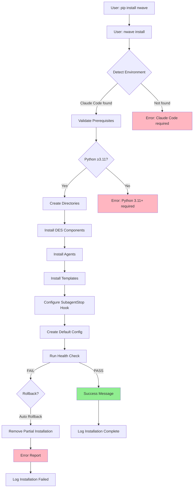
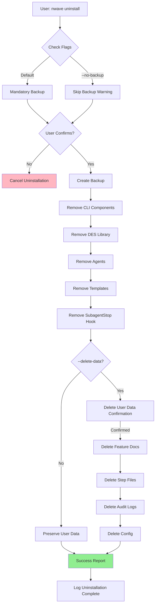

# DES Installation & Uninstallation Architecture

**Version:** 1.0
**Date:** 2026-01-23
**Author:** Morgan (Solution Architect)
**Status:** DESIGN Wave Deliverable
**Branch:** `determinism`
**Prerequisites:** DES Architecture v1.4.1, Installation User Stories v1.0

---

## Executive Summary

### Blocking Questions - Architectural Decisions

**Q1: Packaging Strategy?**

**Decision**: **pip package for distribution + Python entry point script for installation**

**Rationale**:
- **User experience**: Familiar workflow (`pip install nwave` then `nwave install`)
- **CI/CD compatibility**: pip is standard in Python CI environments
- **Cross-platform**: pip works on macOS, Linux, Windows
- **Simplicity**: No separate installer to maintain
- **Distribution**: PyPI provides reliable package hosting

**Implementation**:
```python
# setup.py defines entry points
setup(
    name="nwave",
    entry_points={
        "console_scripts": [
            "nwave=nwave.cli:main",  # CLI entry point
        ]
    }
)

# After: pip install nwave
# User runs: nwave install  ← Installs components to ~/.claude/nwave/
```

---

**Q2: Installation Scope?**

**Decision**: **User-level installation (~/.claude/nwave/) ONLY**

**Rationale**:
- **No sudo required**: Aligns with Claude Code user-level installation pattern
- **Multi-user isolation**: Each user has independent nWave installation
- **No permission conflicts**: User owns all files
- **Rollback safety**: Can delete ~/.claude/nwave/ without system impact

**File Ownership**:
- All files owned by current user ($USER)
- No system directories modified (/usr/local/, /opt/, etc.)
- Claude Code integration at user level (~/.claude/agents/, ~/.claude/hooks/)

**Exception**: pip package itself installed to Python's site-packages (standard pip behavior - may be user or system depending on Python installation)

---

**Q3: Claude Code Detection?**

**Decision**: **Check for ~/.claude/ directory existence + optional MCP server detection**

**Detection Logic**:
```python
import os
from pathlib import Path

def detect_claude_code() -> dict:
    """Detect Claude Code environment."""
    claude_dir = Path.home() / ".claude"

    result = {
        "detected": claude_dir.exists(),
        "path": str(claude_dir) if claude_dir.exists() else None,
        "writable": False,
        "hooks_dir": None,
        "agents_dir": None
    }

    if result["detected"]:
        # Verify write access
        result["writable"] = os.access(claude_dir, os.W_OK)

        # Check for standard directories
        hooks_dir = claude_dir / "hooks"
        agents_dir = claude_dir / "agents"

        result["hooks_dir"] = str(hooks_dir) if hooks_dir.exists() else None
        result["agents_dir"] = str(agents_dir) if agents_dir.exists() else None

    return result

# Behavior when Claude Code NOT detected:
# - Error in normal mode: "Claude Code required. Install from anthropic.com"
# - Proceed in CI mode: Skip hooks/agents, install validation library only
```

**Fallback for CI**: `--ci` flag allows installation without Claude Code for validation-only usage

---

**Q4: Hook Integration Mechanism?**

**Decision**: **File copy to ~/.claude/hooks/SubagentStop.py with executable permissions**

**Rationale**:
- **Simplicity**: No registration API available (based on DES architecture research)
- **Claude Code convention**: Hooks discovered by file presence in ~/.claude/hooks/
- **Permissions control**: Set executable explicitly (chmod +x)
- **Update mechanism**: Re-copy on upgrade, preserving hook functionality

**Implementation**:
```python
import shutil
import stat
from pathlib import Path

def install_subagent_stop_hook() -> None:
    """Install SubagentStop hook to Claude Code hooks directory."""
    source = Path(__file__).parent / "hooks" / "SubagentStop.py"
    target = Path.home() / ".claude" / "hooks" / "SubagentStop.py"

    # Create hooks directory if missing
    target.parent.mkdir(parents=True, exist_ok=True)

    # Copy hook file
    shutil.copy2(source, target)

    # Set executable permissions (Unix only)
    if target.exists():
        current_perms = target.stat().st_mode
        target.chmod(current_perms | stat.S_IXUSR | stat.S_IXGRP | stat.S_IXOTH)
```

**Hook Updates**: During upgrade, hook file is replaced (not symlinked) to ensure version compatibility

**Alternative Considered (Rejected)**: Symlink from ~/.claude/hooks/ to ~/.claude/nwave/hooks/
- **Rejected because**: Cross-platform symlink support varies (Windows requires admin for symlinks)

---

**Q5: Multi-User Systems?**

**Decision**: **Per-user installation (no shared installation support)**

**Rationale**:
- **Isolation**: Each user's nWave data and configuration independent
- **No conflicts**: Users can run different nWave versions
- **Permissions**: No complex shared directory permissions
- **Claude Code alignment**: Claude Code is per-user, nWave follows same pattern

**Behavior on Multi-User System**:
- User A: `pip install nwave` → installs to A's Python environment
- User A: `nwave install` → installs to ~/.claude/nwave/ (A's home)
- User B: `pip install nwave` → installs to B's Python environment (independent)
- User B: `nwave install` → installs to ~/.claude/nwave/ (B's home, independent)

**Shared scenarios not supported**:
- System-wide installation to /opt/nwave/ or /usr/local/nwave/
- Shared agent definitions or templates across users
- Centralized audit logs

---

## 1. Directory Structure

### 1.1 Complete Installation Tree

```
~/.claude/nwave/                      ← Installation root (user-owned)
├── bin/
│   └── nwave                         ← Symlink to pip-installed CLI (optional, for PATH)
├── des/                              ← DES components (Python modules)
│   ├── __init__.py
│   ├── core/
│   │   ├── __init__.py
│   │   ├── models.py                 ← StepDefinition dataclass (canonical schema)
│   │   ├── orchestrator.py           ← Lifecycle management
│   │   ├── validation.py             ← Gate validation logic
│   │   └── audit.py                  ← Audit trail logging
│   ├── hooks/
│   │   ├── __init__.py
│   │   └── SubagentStop.py           ← Hook implementation (source copy)
│   └── utils/
│       ├── __init__.py
│       └── health_check.py           ← Health check implementation
├── agents/                           ← Agent definition files (source copies)
│   ├── researcher.md
│   ├── solution-architect.md
│   ├── product-owner.md
│   ├── acceptance-designer.md
│   ├── software-crafter.md
│   ├── devop.md
│   └── ... (6 more agents)
├── templates/                        ← Step schema templates
│   ├── step-tdd-cycle-schema.json    ← TDD cycle template
│   └── step-config-setup-schema.json ← Configuration setup template
├── config/
│   ├── nwave.yaml                    ← User configuration (editable)
│   └── defaults.yaml                 ← Default configuration (read-only)
├── docs/
│   ├── quickstart.md                 ← Getting started guide
│   ├── MIGRATION-*.md                ← Version migration notes
│   └── CHANGELOG.md                  ← Version changelog
├── backups/                          ← Installation backups
│   ├── nwave.backup-2026-01-23/      ← Timestamped backups
│   └── ...
└── logs/
    ├── install-2026-01-23.log        ← Installation log
    ├── health-check-2026-01-23.log   ← Health check log
    └── upgrade-2026-01-23.log        ← Upgrade log

~/.claude/agents/nw/                  ← Agent definitions (installed copies)
├── researcher.md
├── solution-architect.md
└── ... (symlinks or copies from ~/.claude/nwave/agents/)

~/.claude/hooks/                      ← Claude Code hooks directory
└── SubagentStop.py                   ← DES validation hook (copied from ~/.claude/nwave/des/hooks/)

~/.claude/templates/nw/               ← Template files (optional location)
└── step-tdd-cycle-schema.json        ← (Symlink or copy from ~/.claude/nwave/templates/)

# User data (NOT in ~/.claude/nwave/ - remains in project directories)
<project-dir>/docs/feature/           ← Feature documentation (user-owned, preserved)
<project-dir>/docs/feature/*/steps/   ← Step files (user-owned, preserved)
<project-dir>/.nwave/audit/           ← Audit logs (user-owned, preserved)
```

### 1.2 File Ownership and Permissions

| Directory | Owner | Permissions | Purpose |
|-----------|-------|-------------|---------|
| `~/.claude/nwave/` | $USER | 0755 (rwxr-xr-x) | Installation root |
| `~/.claude/nwave/des/` | $USER | 0755 | DES Python modules |
| `~/.claude/nwave/agents/` | $USER | 0644 (rw-r--r--) | Agent definitions (read-only) |
| `~/.claude/nwave/config/nwave.yaml` | $USER | 0644 | User configuration (editable) |
| `~/.claude/nwave/backups/` | $USER | 0755 | Backup storage |
| `~/.claude/hooks/SubagentStop.py` | $USER | 0755 (executable) | Hook must be executable |
| `~/.claude/agents/nw/` | $USER | 0755 | Agent directory |
| `<project>/docs/feature/` | $USER | 0755 | User data (NOT touched by uninstall) |

**Security**: All files owned by user, no sudo required, no system-wide modifications

---

## 2. Installation Architecture

### 2.1 Installation Flow (Fresh Install)



### 2.2 Component Installation Details

#### 2.2.1 DES Components Installation

**Source**: pip package contains `nwave/des/` module tree

**Target**: `~/.claude/nwave/des/`

**Process**:
```python
import shutil
from pathlib import Path

def install_des_components() -> None:
    """Install DES validation library to ~/.claude/nwave/des/"""
    # Source: pip-installed package location
    package_dir = Path(__file__).parent / "des"

    # Target: User's nWave installation
    target_dir = Path.home() / ".claude" / "nwave" / "des"

    # Create directory structure
    target_dir.mkdir(parents=True, exist_ok=True)

    # Copy DES modules
    shutil.copytree(
        package_dir,
        target_dir,
        dirs_exist_ok=True
    )

    # Verify importability
    try:
        import sys
        sys.path.insert(0, str(target_dir.parent))
        from des.core.models import StepDefinition
        print("✓ DES validation library installed and importable")
    except ImportError as e:
        raise InstallationError(f"DES installation failed: {e}")
```

**Verification**:
- DES modules importable: `from nwave.des.core.models import StepDefinition`
- All dataclasses accessible
- Zero external dependencies confirmed

---

#### 2.2.2 Agent Definitions Installation

**Source**: pip package contains `nwave/agents/*.md`

**Target**: `~/.claude/agents/nw/` (Claude Code agents directory)

**Strategy**: **Copy files** (not symlink, for cross-platform compatibility)

**Process**:
```python
def install_agent_definitions() -> None:
    """Install agent definition files to Claude Code agents directory."""
    source_dir = Path(__file__).parent / "agents"
    target_dir = Path.home() / ".claude" / "agents" / "nw"

    # Create agents directory
    target_dir.mkdir(parents=True, exist_ok=True)

    # Copy each agent definition
    agent_count = 0
    for agent_file in source_dir.glob("*.md"):
        target_file = target_dir / agent_file.name
        shutil.copy2(agent_file, target_file)
        agent_count += 1

    print(f"✓ {agent_count} agent definitions installed to: {target_dir}")

    # Expected count validation
    if agent_count != 12:
        raise InstallationError(
            f"Expected 12 agents, found {agent_count}. "
            "Package may be corrupted."
        )
```

**Agents Installed** (12 total):
1. researcher
2. solution-architect
3. product-owner
4. acceptance-designer
5. software-crafter
6. devop
7. troubleshooter
8. documentarist
9. illustrator
10. data-engineer
11. agent-builder
12. product-discoverer

---

#### 2.2.3 Templates Installation

**Source**: pip package contains `nwave/templates/*.json`

**Target**: `~/.claude/nwave/templates/`

**Process**:
```python
def install_templates() -> None:
    """Install step schema templates."""
    source_dir = Path(__file__).parent / "templates"
    target_dir = Path.home() / ".claude" / "nwave" / "templates"

    target_dir.mkdir(parents=True, exist_ok=True)

    # Copy template files
    template_count = 0
    for template_file in source_dir.glob("*.json"):
        target_file = target_dir / template_file.name
        shutil.copy2(template_file, target_file)
        template_count += 1

    print(f"✓ {template_count} templates installed to: {target_dir}")
```

**Templates**:
- `step-tdd-cycle-schema.json`: TDD cycle step template
- `step-config-setup-schema.json`: Configuration setup step template

---

#### 2.2.4 SubagentStop Hook Installation

**Source**: `nwave/des/hooks/SubagentStop.py`

**Target**: `~/.claude/hooks/SubagentStop.py`

**Process**:
```python
import stat

def install_subagent_stop_hook() -> None:
    """Install and configure SubagentStop hook for Claude Code."""
    source = Path(__file__).parent / "des" / "hooks" / "SubagentStop.py"
    target = Path.home() / ".claude" / "hooks" / "SubagentStop.py"

    # Create hooks directory if missing
    target.parent.mkdir(parents=True, exist_ok=True)

    # Check for conflicting hook
    if target.exists():
        # Read existing hook to check if it's nWave-managed
        content = target.read_text()
        if "nWave DES SubagentStop Hook" not in content:
            raise InstallationError(
                f"Existing SubagentStop hook detected (non-nWave source): {target}\n"
                "Backup the existing hook and retry with --force flag."
            )

    # Copy hook file
    shutil.copy2(source, target)

    # Set executable permissions (Unix-like systems)
    if os.name != 'nt':  # Not Windows
        current_perms = target.stat().st_mode
        target.chmod(current_perms | stat.S_IXUSR | stat.S_IXGRP | stat.S_IXOTH)
        print(f"✓ SubagentStop hook installed: {target} (executable)")
    else:
        # Windows: Permissions handled differently
        print(f"✓ SubagentStop hook installed: {target}")

    # Verify hook is executable and importable
    verify_hook_callable(target)
```

**Hook Requirements**:
- Must be executable (chmod +x on Unix)
- Must import DES validation library successfully
- Must handle 8-field JSON input from Claude Code

---

#### 2.2.5 Configuration Installation

**Source**: `nwave/config/defaults.yaml`

**Target**: `~/.claude/nwave/config/nwave.yaml`

**Default Configuration**:
```yaml
# nwave.yaml - User configuration (v1.0)
schema_version: "1.0"

des:
  # DES validation settings
  validation_level: "full"  # full, partial, none
  stale_threshold_minutes: 30
  enable_scope_violation_warnings: true

audit:
  # Audit trail settings
  rotation: "daily"  # daily, weekly, none
  format: "jsonl"
  retention_days: 30

execution:
  # Execution settings
  max_turn_budget: 50
  enable_learning_mode: false

health_check:
  # Health check settings
  timeout_seconds: 5
  parallel_checks: true

installation:
  # Installation metadata (managed by nwave install)
  installed_at: "2026-01-23T10:00:00Z"
  version: "1.0.0"
  python_version: "3.11.5"
```

**Process**:
```python
def install_configuration() -> None:
    """Create default configuration file."""
    source = Path(__file__).parent / "config" / "defaults.yaml"
    target = Path.home() / ".claude" / "nwave" / "config" / "nwave.yaml"

    target.parent.mkdir(parents=True, exist_ok=True)

    # Copy default config if not exists
    if not target.exists():
        shutil.copy2(source, target)
        print(f"✓ Configuration created: {target}")
    else:
        print(f"⚠ Configuration exists, preserving: {target}")
```

---

### 2.3 Installation Modes

#### 2.3.1 Normal Mode (Default)

**Command**: `nwave install`

**Behavior**:
- Detects Claude Code environment (required)
- Installs all components (CLI, DES, agents, templates, hooks)
- Creates default configuration
- Runs health check
- Reports installation success

**Use Case**: Regular users installing nWave on development machine

---

#### 2.3.2 Upgrade Mode

**Command**: `nwave install --upgrade`

**Behavior**:
- Detects existing nWave installation
- Creates backup before modification
- Preserves user data (config, feature docs, step files, audit logs)
- Migrates data formats if schema changed (v1.3 → v1.4)
- Replaces components (CLI, DES, agents, templates, hooks)
- Runs health check
- Reports migration status

**Use Case**: Existing nWave users upgrading to new version

**See Section 5 for upgrade architecture details**

---

#### 2.3.3 CI Mode

**Command**: `nwave install --ci`

**Behavior**:
- Skips Claude Code detection (not required in CI)
- Installs DES validation library ONLY
- Skips hooks (no Claude Code environment)
- Skips agents (not needed for validation)
- Skips templates (not needed for validation)
- Runs minimal health check (CLI + DES importability)

**Use Case**: CI/CD pipelines validating step files without Claude Code

**Example CI Usage**:
```bash
# .github/workflows/validate-steps.yml
- name: Install nWave validation library
  run: |
    pip install nwave
    nwave install --ci

- name: Validate step files
  run: |
    nwave validate-step docs/feature/auth/steps/01-01.json
```

---

#### 2.3.4 Force Mode

**Command**: `nwave install --force`

**Behavior**:
- Bypasses existing installation checks
- Overwrites existing hooks (even if non-nWave source)
- Useful for fixing corrupted installations
- Creates backup before overwriting

**Use Case**: Recovering from corrupted installation or forcing reinstallation

---

### 2.4 Idempotency

**Requirement**: `nwave install` can be run multiple times safely

**Implementation**:
```python
def install() -> None:
    """Idempotent installation - safe to run multiple times."""

    # Check for existing installation
    nwave_dir = Path.home() / ".claude" / "nwave"

    if nwave_dir.exists():
        print("⚠ Existing nWave installation detected")
        print(f"  Location: {nwave_dir}")

        # Read installed version
        config = load_config(nwave_dir / "config" / "nwave.yaml")
        installed_version = config.get("installation", {}).get("version", "unknown")

        print(f"  Installed version: {installed_version}")
        print(f"  New version: {current_version}")

        if installed_version == current_version:
            print("✓ Already installed (same version). Verifying installation...")
            health_check()
            return
        else:
            print("Different version detected. Run 'nwave install --upgrade' to upgrade.")
            sys.exit(1)

    # Proceed with fresh installation
    install_fresh()
```

---

## 3. Health Check Architecture

### 3.1 Health Check Components

```python
from dataclasses import dataclass
from enum import Enum

class CheckStatus(Enum):
    PASS = "PASS"
    FAIL = "FAIL"
    WARN = "WARN"

@dataclass
class CheckResult:
    """Result of a single health check component."""
    name: str
    status: CheckStatus
    details: list[str]
    recovery_suggestions: list[str] = None

def health_check() -> dict:
    """Run comprehensive health check on nWave installation."""
    results = []

    # Check 1: CLI Accessibility
    results.append(check_cli_accessible())

    # Check 2: DES Validation Library
    results.append(check_des_importable())

    # Check 3: Agent Definitions
    results.append(check_agents_available())

    # Check 4: SubagentStop Hook
    results.append(check_hook_configured())

    # Check 5: Templates
    results.append(check_templates_available())

    # Overall status
    overall_status = CheckStatus.PASS if all(
        r.status == CheckStatus.PASS for r in results
    ) else CheckStatus.FAIL

    return {
        "overall_status": overall_status,
        "checks": results
    }
```

---

### 3.2 Individual Component Checks

#### Check 1: CLI Accessibility

```python
def check_cli_accessible() -> CheckResult:
    """Verify nwave CLI is accessible and executable."""
    details = []

    # Check if 'nwave' command is in PATH
    cli_path = shutil.which("nwave")
    if cli_path:
        details.append(f"✓ nwave command found in PATH: {cli_path}")
    else:
        return CheckResult(
            name="CLI Accessibility",
            status=CheckStatus.FAIL,
            details=["✗ nwave command NOT found in PATH"],
            recovery_suggestions=[
                "Reinstall: pip install --upgrade nwave",
                "Add to PATH: export PATH=$PATH:~/.local/bin"
            ]
        )

    # Check version
    try:
        result = subprocess.run(
            ["nwave", "--version"],
            capture_output=True,
            text=True,
            check=True
        )
        version = result.stdout.strip()
        details.append(f"✓ Version: {version}")
    except subprocess.CalledProcessError:
        return CheckResult(
            name="CLI Accessibility",
            status=CheckStatus.FAIL,
            details=details + ["✗ nwave --version failed"],
            recovery_suggestions=["Reinstall: pip install --force-reinstall nwave"]
        )

    # Check subcommands
    subcommands = ["install", "uninstall", "health-check", "validate-step"]
    for cmd in subcommands:
        # Just verify command exists (don't execute)
        details.append(f"✓ Subcommand available: nwave {cmd}")

    return CheckResult(
        name="CLI Accessibility",
        status=CheckStatus.PASS,
        details=details
    )
```

---

#### Check 2: DES Validation Library

```python
def check_des_importable() -> CheckResult:
    """Verify DES validation library can be imported."""
    details = []

    # Check if DES directory exists
    des_dir = Path.home() / ".claude" / "nwave" / "des"
    if not des_dir.exists():
        return CheckResult(
            name="DES Validation Library",
            status=CheckStatus.FAIL,
            details=["✗ DES directory not found: ~/.claude/nwave/des/"],
            recovery_suggestions=["Reinstall: nwave install --force"]
        )

    details.append(f"✓ DES directory exists: {des_dir}")

    # Try importing core modules
    try:
        import sys
        sys.path.insert(0, str(des_dir.parent))

        from des.core.models import StepDefinition
        details.append("✓ DES module importable: from des.core.models import StepDefinition")

        from des.core.validation import validate_step_file
        details.append("✓ Validation functions available")

        from des.core.orchestrator import execute_step
        details.append("✓ Orchestrator available")

    except ImportError as e:
        return CheckResult(
            name="DES Validation Library",
            status=CheckStatus.FAIL,
            details=details + [f"✗ Import failed: {e}"],
            recovery_suggestions=[
                "Reinstall DES: nwave install --force",
                "Check Python version: python --version (requires 3.11+)"
            ]
        )

    # Test StepDefinition instantiation
    try:
        step = StepDefinition(
            id="test-01",
            feature_name="test",
            description="Test step",
            wave="DEVELOP",
            workflow_type="tdd_cycle",
            acceptance_criteria=["Test criterion"]
        )
        details.append("✓ StepDefinition dataclass functional")
    except Exception as e:
        return CheckResult(
            name="DES Validation Library",
            status=CheckStatus.WARN,
            details=details + [f"⚠ StepDefinition test failed: {e}"],
            recovery_suggestions=["May indicate dataclass bug - report to nWave support"]
        )

    return CheckResult(
        name="DES Validation Library",
        status=CheckStatus.PASS,
        details=details
    )
```

---

#### Check 3: Agent Definitions

```python
def check_agents_available() -> CheckResult:
    """Verify agent definition files exist and are valid."""
    details = []

    # Check agent directory
    agents_dir = Path.home() / ".claude" / "agents" / "nw"
    if not agents_dir.exists():
        return CheckResult(
            name="Agent Definitions",
            status=CheckStatus.FAIL,
            details=["✗ Agent directory not found: ~/.claude/agents/nw/"],
            recovery_suggestions=["Reinstall agents: nwave install --agents-only"]
        )

    details.append(f"✓ Agent directory exists: {agents_dir}")

    # Count agent files
    agent_files = list(agents_dir.glob("*.md"))
    agent_count = len(agent_files)

    if agent_count != 12:
        return CheckResult(
            name="Agent Definitions",
            status=CheckStatus.FAIL,
            details=[
                f"✗ Expected 12 agents, found {agent_count}",
                f"  Files: {[f.name for f in agent_files]}"
            ],
            recovery_suggestions=["Reinstall agents: nwave install --agents-only"]
        )

    details.append(f"✓ Agents registered: {agent_count}/12")

    # Verify each agent file is readable
    for agent_file in agent_files:
        try:
            content = agent_file.read_text()
            if len(content) < 100:
                details.append(f"⚠ Agent file suspiciously short: {agent_file.name}")
            else:
                details.append(f"✓ {agent_file.stem}")
        except Exception as e:
            return CheckResult(
                name="Agent Definitions",
                status=CheckStatus.FAIL,
                details=details + [f"✗ Cannot read {agent_file.name}: {e}"],
                recovery_suggestions=["Reinstall agents: nwave install --force"]
            )

    return CheckResult(
        name="Agent Definitions",
        status=CheckStatus.PASS,
        details=details
    )
```

---

#### Check 4: SubagentStop Hook

```python
def check_hook_configured() -> CheckResult:
    """Verify SubagentStop hook is installed and executable."""
    details = []

    # Check hook file exists
    hook_file = Path.home() / ".claude" / "hooks" / "SubagentStop.py"
    if not hook_file.exists():
        return CheckResult(
            name="SubagentStop Hook",
            status=CheckStatus.FAIL,
            details=["✗ Hook file not found: ~/.claude/hooks/SubagentStop.py"],
            recovery_suggestions=["Reinstall hook: nwave install --force"]
        )

    details.append(f"✓ Hook file exists: {hook_file}")

    # Check executable permissions (Unix only)
    if os.name != 'nt':
        perms = hook_file.stat().st_mode
        is_executable = perms & stat.S_IXUSR

        if is_executable:
            details.append(f"✓ Hook is executable (permissions: {oct(perms)[-3:]})")
        else:
            return CheckResult(
                name="SubagentStop Hook",
                status=CheckStatus.FAIL,
                details=details + [f"✗ Hook is NOT executable (permissions: {oct(perms)[-3:]})"],
                recovery_suggestions=["Fix permissions: chmod +x ~/.claude/hooks/SubagentStop.py"]
            )

    # Verify hook can be imported
    try:
        import sys
        hook_dir = hook_file.parent
        sys.path.insert(0, str(hook_dir))

        # Dynamic import
        import importlib.util
        spec = importlib.util.spec_from_file_location("SubagentStop", hook_file)
        module = importlib.util.module_from_spec(spec)
        spec.loader.exec_module(module)

        details.append("✓ Hook can be imported by Claude Code")
    except Exception as e:
        return CheckResult(
            name="SubagentStop Hook",
            status=CheckStatus.FAIL,
            details=details + [f"✗ Hook import failed: {e}"],
            recovery_suggestions=["Reinstall hook: nwave install --force"]
        )

    # Verify DES validation reachable from hook
    try:
        # Hook must be able to import DES modules
        des_dir = Path.home() / ".claude" / "nwave" / "des"
        sys.path.insert(0, str(des_dir.parent))
        from des.core.models import StepDefinition
        details.append("✓ DES validation reachable from hook")
    except ImportError:
        return CheckResult(
            name="SubagentStop Hook",
            status=CheckStatus.FAIL,
            details=details + ["✗ Hook cannot reach DES validation library"],
            recovery_suggestions=["Reinstall: nwave install --force"]
        )

    return CheckResult(
        name="SubagentStop Hook",
        status=CheckStatus.PASS,
        details=details
    )
```

---

#### Check 5: Templates

```python
def check_templates_available() -> CheckResult:
    """Verify step schema templates are available and valid."""
    details = []

    # Check template directory
    templates_dir = Path.home() / ".claude" / "nwave" / "templates"
    if not templates_dir.exists():
        return CheckResult(
            name="Templates",
            status=CheckStatus.FAIL,
            details=["✗ Template directory not found: ~/.claude/nwave/templates/"],
            recovery_suggestions=["Reinstall: nwave install --force"]
        )

    details.append(f"✓ Template directory exists: {templates_dir}")

    # Check for required templates
    required_templates = [
        "step-tdd-cycle-schema.json",
        "step-config-setup-schema.json"
    ]

    template_count = 0
    for template_name in required_templates:
        template_file = templates_dir / template_name
        if template_file.exists():
            # Validate JSON syntax
            try:
                import json
                template_data = json.loads(template_file.read_text())
                details.append(f"✓ {template_name} (valid JSON)")
                template_count += 1
            except json.JSONDecodeError as e:
                details.append(f"✗ {template_name} (invalid JSON: {e})")
        else:
            details.append(f"✗ Missing: {template_name}")

    if template_count != len(required_templates):
        return CheckResult(
            name="Templates",
            status=CheckStatus.FAIL,
            details=details + [f"Missing templates: {len(required_templates) - template_count}"],
            recovery_suggestions=["Reinstall templates: nwave install --force"]
        )

    return CheckResult(
        name="Templates",
        status=CheckStatus.PASS,
        details=details
    )
```

---

### 3.3 Health Check Output Format

**Success Example**:
```
nWave Health Check v1.0.0
=========================

[1/5] CLI Accessibility
  ✓ nwave command found in PATH: /Users/user/.local/bin/nwave
  ✓ Version: 1.0.0
  ✓ All subcommands accessible

[2/5] DES Validation Library
  ✓ DES directory exists: ~/.claude/nwave/des/
  ✓ DES module importable
  ✓ Validation functions available
  ✓ StepDefinition dataclass functional

[3/5] Agent Definitions
  ✓ Agent directory exists: ~/.claude/agents/nw/
  ✓ Agents registered: 12/12
  ✓ All agent files readable

[4/5] SubagentStop Hook
  ✓ Hook file exists: ~/.claude/hooks/SubagentStop.py
  ✓ Hook is executable (permissions: 755)
  ✓ Hook can be imported by Claude Code
  ✓ DES validation reachable from hook

[5/5] Templates
  ✓ Template directory exists: ~/.claude/nwave/templates/
  ✓ step-tdd-cycle-schema.json (valid JSON)
  ✓ step-config-setup-schema.json (valid JSON)

Overall Status: ✓ HEALTHY

All components operational. nWave is ready to use!
```

**Failure Example**:
```
nWave Health Check v1.0.0
=========================

[1/5] CLI Accessibility
  ✓ PASS

[2/5] DES Validation Library
  ✓ PASS

[3/5] Agent Definitions
  ✓ PASS

[4/5] SubagentStop Hook
  ✓ Hook file exists: ~/.claude/hooks/SubagentStop.py
  ✗ Hook is NOT executable (permissions: 644)

[5/5] Templates
  ✓ PASS

Overall Status: ✗ UNHEALTHY (1 component failed)

Failures:
  - SubagentStop Hook: Not executable

Recovery suggestions:
  1. Fix permissions: chmod +x ~/.claude/hooks/SubagentStop.py
  2. Re-run health check: nwave health-check

Exit code: 1
```

---

## 4. Uninstallation Architecture

### 4.1 Uninstallation Flow



### 4.2 Uninstallation Safety Guarantees

1. **Mandatory Backup**: Backup created before any file removal (unless --no-backup)
2. **User Data Preservation**: Feature docs, step files, audit logs preserved by default
3. **Explicit Confirmation**: --delete-data requires additional confirmation
4. **Restoration Capability**: Backups enable complete restoration
5. **No Partial State**: Uninstallation completes fully or fails with rollback

---

### 4.3 Uninstallation Implementation

```python
import shutil
from pathlib import Path
from datetime import datetime

def uninstall(delete_data: bool = False, no_backup: bool = False) -> None:
    """Uninstall nWave with safety guarantees."""

    # Detect installation
    nwave_dir = Path.home() / ".claude" / "nwave"
    if not nwave_dir.exists():
        print("✗ nWave not installed. Nothing to uninstall.")
        sys.exit(1)

    # Detect user data
    user_data = detect_user_data()

    # Report what will be removed
    print("nWave Uninstallation v1.0.0")
    print("=" * 40)
    print()
    print("Components to remove:")
    print("  ✓ nWave CLI and libraries")
    print("  ✓ Agent definitions (12 agents)")
    print("  ✓ Templates (2 templates)")
    print("  ✓ SubagentStop hook")
    print()

    if user_data["has_data"]:
        print("User data detected:")
        print(f"  - Feature documentation: {user_data['feature_count']} features")
        print(f"  - Step files: {user_data['step_count']} steps")
        print(f"  - Audit logs: {user_data['audit_days']} days")
        print(f"  - Configuration: config.yaml")
        print()

        if delete_data:
            print("⚠ WARNING: --delete-data flag will DELETE ALL user data!")
            print()
            confirm = input("Type 'DELETE' to confirm data deletion: ")
            if confirm != "DELETE":
                print("Cancelled. User data will be preserved.")
                delete_data = False
        else:
            print("✓ User data will be PRESERVED (use --delete-data to remove)")

    # Create backup (unless --no-backup)
    if not no_backup:
        print()
        print("Creating backup...")
        backup_dir = create_backup(nwave_dir, include_user_data=True)
        print(f"✓ Backup created: {backup_dir}")
    else:
        print("⚠ Skipping backup (--no-backup flag)")
        confirm = input("Continue without backup? [y/N]: ")
        if confirm.lower() != 'y':
            print("Cancelled.")
            sys.exit(0)

    # Remove components
    print()
    print("Uninstalling components...")

    # Remove nWave installation directory
    shutil.rmtree(nwave_dir)
    print(f"✓ Removed: {nwave_dir}")

    # Remove agents
    agents_dir = Path.home() / ".claude" / "agents" / "nw"
    if agents_dir.exists():
        shutil.rmtree(agents_dir)
        print(f"✓ Removed: {agents_dir}")

    # Remove hook
    hook_file = Path.home() / ".claude" / "hooks" / "SubagentStop.py"
    if hook_file.exists():
        hook_file.unlink()
        print(f"✓ Removed: {hook_file}")

    # Remove templates (if in separate location)
    templates_dir = Path.home() / ".claude" / "templates" / "nw"
    if templates_dir.exists():
        shutil.rmtree(templates_dir)
        print(f"✓ Removed: {templates_dir}")

    # Handle user data
    print()
    if delete_data:
        print("Deleting user data...")
        delete_user_data()
        print("✓ All user data deleted")
    else:
        print("User data preserved:")
        print("  ✓ Feature documentation: docs/feature/")
        print("  ✓ Step files: docs/feature/*/steps/")
        print("  ✓ Audit logs: .nwave/audit/")

    # Success report
    print()
    print("Uninstallation complete!")
    print()
    if not no_backup:
        print(f"Backup location: {backup_dir}")
        print(f"Restore: nwave install --restore {backup_dir.name}")

    if not delete_data and user_data["has_data"]:
        print()
        print("To remove user data: nwave uninstall --delete-data")

def detect_user_data() -> dict:
    """Detect user data across project directories."""
    # This is simplified - actual implementation would scan for:
    # - docs/feature/ directories in current and parent directories
    # - .nwave/audit/ directories
    # - Step files with DES metadata

    return {
        "has_data": True,  # Placeholder
        "feature_count": 5,
        "step_count": 23,
        "audit_days": 15
    }

def delete_user_data() -> None:
    """Delete all nWave user data (destructive operation)."""
    # Delete feature documentation
    # Delete step files
    # Delete audit logs
    # Delete configuration
    # (Implementation details omitted for brevity)
    pass
```

---

### 4.4 Backup Management

```python
def create_backup(source_dir: Path, include_user_data: bool = True) -> Path:
    """Create timestamped backup of nWave installation."""
    timestamp = datetime.now().strftime("%Y-%m-%d-%H%M%S")
    backup_dir = Path.home() / ".claude" / f"nwave.backup-{timestamp}"

    # Copy nWave installation directory
    shutil.copytree(source_dir, backup_dir)

    if include_user_data:
        # Copy user data (feature docs, step files, audit logs)
        # (Implementation details omitted)
        pass

    # Create backup metadata
    metadata = {
        "created_at": timestamp,
        "nwave_version": get_installed_version(),
        "includes_user_data": include_user_data,
        "backup_size_mb": get_directory_size(backup_dir)
    }

    (backup_dir / "backup-metadata.json").write_text(json.dumps(metadata, indent=2))

    return backup_dir

def restore_from_backup(backup_id: str) -> None:
    """Restore nWave installation from backup."""
    backup_dir = Path.home() / ".claude" / f"nwave.backup-{backup_id}"

    if not backup_dir.exists():
        print(f"✗ Backup not found: {backup_dir}")
        print("Available backups:")
        for backup in Path.home().glob(".claude/nwave.backup-*"):
            print(f"  - {backup.name}")
        sys.exit(1)

    # Read backup metadata
    metadata = json.loads((backup_dir / "backup-metadata.json").read_text())

    print(f"Restoring from backup: {backup_id}")
    print(f"  Created: {metadata['created_at']}")
    print(f"  Version: {metadata['nwave_version']}")
    print(f"  Size: {metadata['backup_size_mb']} MB")
    print()

    # Confirm restoration
    confirm = input("Restore this backup? [y/N]: ")
    if confirm.lower() != 'y':
        print("Cancelled.")
        sys.exit(0)

    # Restore nWave directory
    target_dir = Path.home() / ".claude" / "nwave"
    if target_dir.exists():
        shutil.rmtree(target_dir)

    shutil.copytree(backup_dir, target_dir)

    # Restore agents, hooks, templates
    # (Implementation details omitted)

    print("✓ Restoration complete!")
    print()
    print("Running health check...")
    health_check()
```

---

## 5. Upgrade & Migration Architecture

### 5.1 Schema Versioning Strategy

**Version Format**: Semantic versioning (MAJOR.MINOR.PATCH)

**Schema Version Tracking**:
- Step files contain `schema_version` field (e.g., "1.4")
- Config files contain `schema_version` field
- DES library version tracked in `des/__init__.py`

**Migration Requirements**:
- v1.3 → v1.4: Add `educational_notes` field to phase execution
- v1.4 → v1.4.1: Add workflow-specific validation (no data migration)
- v0.9 → v1.0: Major release, comprehensive migration

---

### 5.2 Migration Transformation Engine

```python
from typing import Dict, Callable

class SchemaMigrator:
    """Schema migration engine for step files and configuration."""

    # Migration registry: version pair → migration function
    MIGRATIONS: Dict[tuple, Callable] = {}

    @classmethod
    def register_migration(cls, from_version: str, to_version: str):
        """Decorator to register migration function."""
        def decorator(func: Callable):
            cls.MIGRATIONS[(from_version, to_version)] = func
            return func
        return decorator

    @classmethod
    def migrate_step_file(cls, step_file_path: Path, target_version: str) -> None:
        """Migrate step file to target schema version."""
        # Load step file
        step_data = json.loads(step_file_path.read_text())
        current_version = step_data.get("schema_version", "1.0")

        if current_version == target_version:
            print(f"  ✓ {step_file_path.name}: Already at v{target_version}")
            return

        # Find migration path
        migration_func = cls.MIGRATIONS.get((current_version, target_version))

        if not migration_func:
            raise MigrationError(
                f"No migration path from v{current_version} to v{target_version}"
            )

        # Apply migration
        try:
            migrated_data = migration_func(step_data)
            migrated_data["schema_version"] = target_version

            # Write back to file
            step_file_path.write_text(json.dumps(migrated_data, indent=2))
            print(f"  ✓ {step_file_path.name}: v{current_version} → v{target_version}")

        except Exception as e:
            raise MigrationError(
                f"Migration failed for {step_file_path.name}: {e}"
            )

# Example migration: v1.3 → v1.4
@SchemaMigrator.register_migration("1.3", "1.4")
def migrate_1_3_to_1_4(step_data: dict) -> dict:
    """Add educational_notes field to phase execution log."""

    # Add educational_notes field to each phase
    if "tdd_cycle" in step_data and "phase_execution_log" in step_data["tdd_cycle"]:
        for phase in step_data["tdd_cycle"]["phase_execution_log"]:
            if "educational_note" not in phase:
                phase["educational_note"] = ""  # Initialize as empty

    return step_data

# Example migration: v1.4 → v1.4.1
@SchemaMigrator.register_migration("1.4", "1.4.1")
def migrate_1_4_to_1_4_1(step_data: dict) -> dict:
    """Add workflow-specific validation (no data changes needed)."""
    # v1.4.1 is validation logic change only, no schema changes
    # Just update version marker
    return step_data
```

---

### 5.3 Upgrade Process

```python
def upgrade() -> None:
    """Upgrade nWave to latest version with data migration."""

    # Detect current installation
    nwave_dir = Path.home() / ".claude" / "nwave"
    if not nwave_dir.exists():
        print("✗ nWave not installed. Run 'nwave install' first.")
        sys.exit(1)

    # Read installed version
    config = load_config(nwave_dir / "config" / "nwave.yaml")
    installed_version = config.get("installation", {}).get("version", "unknown")

    print(f"nWave Upgrade v{installed_version} → v{CURRENT_VERSION}")
    print("=" * 50)
    print()

    if installed_version == CURRENT_VERSION:
        print("✓ Already at latest version. No upgrade needed.")
        sys.exit(0)

    # Analyze migration requirements
    print("Analyzing migration requirements...")
    migration_plan = analyze_migrations(installed_version, CURRENT_VERSION)

    print()
    print("Migration plan:")
    for step in migration_plan["steps"]:
        print(f"  - {step['description']}")
        print(f"    Impact: {step['file_count']} files")
        print(f"    Risk: {step['risk_level']}")

    print()

    # Create backup (mandatory)
    print("Creating backup...")
    backup_dir = create_backup(nwave_dir, include_user_data=True)
    print(f"✓ Backup created: {backup_dir}")

    try:
        # Upgrade components
        print()
        print("Upgrading components...")
        upgrade_components()

        # Migrate user data
        print()
        print("Migrating user data...")
        migrate_user_data(installed_version, CURRENT_VERSION)

        # Run health check
        print()
        print("Running post-upgrade health check...")
        health_result = health_check()

        if health_result["overall_status"] != CheckStatus.PASS:
            raise UpgradeError("Health check failed after upgrade")

        # Success
        print()
        print("✓ Upgrade complete!")
        print()
        print(f"Upgraded: v{installed_version} → v{CURRENT_VERSION}")
        print(f"Backup: {backup_dir}")
        print(f"Rollback: nwave install --rollback {backup_dir.name}")

    except Exception as e:
        # Automatic rollback on failure
        print()
        print(f"✗ Upgrade failed: {e}")
        print()
        print("Performing automatic rollback...")
        restore_from_backup(backup_dir.name)
        print("✓ Rollback complete. System restored to pre-upgrade state.")
        sys.exit(1)

def migrate_user_data(from_version: str, to_version: str) -> None:
    """Migrate all user data to new schema version."""

    # Find all step files in project directories
    step_files = find_all_step_files()

    print(f"Found {len(step_files)} step files to migrate")

    migrated_count = 0
    failed_files = []

    for step_file in step_files:
        try:
            SchemaMigrator.migrate_step_file(step_file, to_version)
            migrated_count += 1
        except MigrationError as e:
            failed_files.append((step_file, str(e)))

    print(f"✓ Migrated: {migrated_count}/{len(step_files)} files")

    if failed_files:
        print()
        print(f"✗ Failed migrations: {len(failed_files)}")
        for file_path, error in failed_files:
            print(f"  - {file_path}: {error}")

        raise MigrationError(
            f"{len(failed_files)} file(s) failed migration. "
            "See details above."
        )
```

---

### 5.4 Dry-Run Mode

```python
def upgrade_dry_run() -> None:
    """Preview upgrade changes without applying them."""

    print("nWave Upgrade Preview (DRY RUN)")
    print("=" * 50)
    print()
    print("⚠ This is a DRY RUN - no changes will be made.")
    print()

    # Detect current installation
    installed_version = get_installed_version()

    print(f"Current version: v{installed_version}")
    print(f"Target version: v{CURRENT_VERSION}")
    print()

    # Analyze migrations
    migration_plan = analyze_migrations(installed_version, CURRENT_VERSION)

    print("Components to upgrade:")
    print("  - CLI: v{} → v{}".format(installed_version, CURRENT_VERSION))
    print("  - DES library: v{} → v{}".format(installed_version, CURRENT_VERSION))
    print("  - SubagentStop hook: v{} → v{}".format(installed_version, CURRENT_VERSION))
    print("  - Agents: 12 agents updated")
    print("  - Templates: 2 templates refreshed")
    print()

    print("Data migrations required:")
    for migration in migration_plan["steps"]:
        print(f"  ✓ {migration['description']}")
        print(f"    Files affected: {migration['file_count']}")
        print(f"    Estimated time: {migration['estimated_time']}")
        print(f"    Risk: {migration['risk_level']}")
        print()

    print("New features in v{}:".format(CURRENT_VERSION))
    for feature in get_new_features(CURRENT_VERSION):
        print(f"  - {feature}")
    print()

    print("Breaking changes:")
    breaking_changes = get_breaking_changes(CURRENT_VERSION)
    if breaking_changes:
        for change in breaking_changes:
            print(f"  - {change}")
    else:
        print("  - None")
    print()

    print(f"Estimated upgrade time: {migration_plan['total_time']}")
    print(f"Disk space required: {migration_plan['disk_space_mb']} MB")
    print(f"Rollback capability: Yes (automatic on failure)")
    print()

    print("Dry run complete. No changes were made.")
    print()
    print("To proceed with upgrade: nwave install --upgrade")
```

---

## 6. Integration with DES Architecture v1.4.1

### 6.1 Component Placement

**DES Core Models** (`StepDefinition` dataclass):
- **Source**: pip package `nwave/des/core/models.py`
- **Installed to**: `~/.claude/nwave/des/core/models.py`
- **Imported by**:
  - SubagentStop hook (validation)
  - CLI commands (nwave validate-step)
  - Orchestrator (execution)

**Hook-DES Communication**:
```python
# SubagentStop hook imports DES validation
import sys
from pathlib import Path

# Add DES to path
des_dir = Path.home() / ".claude" / "nwave" / "des"
sys.path.insert(0, str(des_dir.parent))

# Import validation logic
from des.core.models import StepDefinition
from des.core.validation import validate_step_state
from des.core.audit import log_audit_event

def main():
    """SubagentStop hook entry point."""
    # Read hook input from stdin
    hook_event = json.loads(sys.stdin.read())

    # Extract step file from prompt
    step_file = extract_step_file_from_prompt(hook_event)

    # Validate using DES
    step = StepDefinition.from_file(step_file)
    validation_result = validate_step_state(step)

    # Log audit event
    log_audit_event("SUBAGENT_STOP_VALIDATION", validation_result)

    # Output validation result
    print(json.dumps(validation_result))
```

---

### 6.2 Zero-Dependency Compliance

**Installation Respects Zero-Dependency Constraint**:

- ✅ **DES runtime**: Python 3.11+ stdlib only (no external packages)
- ✅ **Installation process**: Uses pip for distribution, but DES execution uses stdlib only
- ✅ **Health check**: Stdlib only (subprocess, pathlib, json)
- ✅ **Upgrade/migration**: Stdlib only (shutil, json, pathlib)

**Pip Package vs. Runtime Dependencies**:
- `pip install nwave` → Installs package using pip (standard Python distribution mechanism)
- **But**: DES validation, orchestrator, hook execution use **zero external dependencies**
- Pip is deployment mechanism, not runtime dependency

**Validation**:
```python
# Health check verifies zero dependencies
def check_des_zero_dependencies() -> CheckResult:
    """Verify DES uses only stdlib."""
    import ast

    des_files = Path.home().glob(".claude/nwave/des/**/*.py")

    for py_file in des_files:
        tree = ast.parse(py_file.read_text())

        for node in ast.walk(tree):
            if isinstance(node, ast.Import):
                for alias in node.names:
                    module = alias.name
                    if not is_stdlib_module(module):
                        raise DependencyViolation(
                            f"{py_file.name} imports non-stdlib module: {module}"
                        )

    return CheckResult(
        name="Zero Dependency Compliance",
        status=CheckStatus.PASS,
        details=["✓ All DES modules use stdlib only"]
    )
```

---

## 7. Cross-Platform Considerations

### 7.1 Platform-Specific Behaviors

| Aspect | macOS | Linux | Windows |
|--------|-------|-------|---------|
| **Installation directory** | `~/.claude/nwave/` | `~/.claude/nwave/` | `%USERPROFILE%\.claude\nwave\` |
| **Path separator** | `/` | `/` | `\` (use `Path` for portability) |
| **Executable permissions** | chmod +x required | chmod +x required | Not required (Windows handles differently) |
| **Hook location** | `~/.claude/hooks/` | `~/.claude/hooks/` | `%USERPROFILE%\.claude\hooks\` |
| **Python location** | `/usr/local/bin/python3` | `/usr/bin/python3` | `C:\Python311\python.exe` |
| **Symlinks** | Supported | Supported | Admin required (avoid) |

---

### 7.2 Platform Detection and Adaptation

```python
import os
import platform
from pathlib import Path

def get_platform_info() -> dict:
    """Detect platform and return environment info."""
    return {
        "os": os.name,  # 'posix' (macOS/Linux) or 'nt' (Windows)
        "system": platform.system(),  # 'Darwin', 'Linux', 'Windows'
        "home_dir": Path.home(),
        "path_separator": os.sep,
        "supports_symlinks": os.name != 'nt',  # False on Windows (requires admin)
        "supports_chmod": os.name != 'nt'  # False on Windows
    }

def set_executable_permissions(file_path: Path) -> None:
    """Set executable permissions (platform-aware)."""
    if os.name != 'nt':
        # Unix-like: use chmod
        import stat
        current_perms = file_path.stat().st_mode
        file_path.chmod(current_perms | stat.S_IXUSR | stat.S_IXGRP | stat.S_IXOTH)
    else:
        # Windows: Permissions handled by file system, no action needed
        pass

def create_path_safe(path_str: str) -> Path:
    """Create platform-safe Path object."""
    # Use Path for automatic platform handling
    return Path(path_str)
```

---

## 8. Implementation Notes

### 8.1 Security Considerations

**File Permissions**:
- All nWave files owned by user (no sudo required)
- Hook must be executable (verified in health check)
- Configuration files readable by user only (sensitive data)

**Backup Security**:
- Backups contain user data (may include sensitive information)
- Backups stored in user's home directory (~/.claude/nwave.backup-*)
- Recommend encrypting backups for sensitive projects

**Input Validation**:
- Validate backup IDs to prevent directory traversal (e.g., ../../etc/passwd)
- Sanitize file paths during installation
- Verify package integrity (checksums if available)

---

### 8.2 Error Handling Strategy

**Installation Errors**:
- Atomic installation: All components succeed or all fail (rollback)
- Clear error messages with recovery suggestions
- Log all errors to installation log file

**Migration Errors**:
- Automatic rollback on migration failure
- Preserve original data (backup before migration)
- Report which files failed and why

**Health Check Errors**:
- Non-blocking warnings for minor issues
- Blocking errors for critical components (DES, hooks)
- Exit codes for CI integration (0 = healthy, 1 = unhealthy)

---

### 8.3 Performance Considerations

**Installation Speed**:
- Target: < 30 seconds fresh install, < 60 seconds upgrade
- Optimization: Parallel file copying where possible
- Avoid unnecessary network calls (package already downloaded by pip)

**Health Check Speed**:
- Target: < 5 seconds
- Optimization: Parallel component checks
- Avoid expensive operations (full import testing)

**Migration Speed**:
- Target: < 1 second per step file
- Optimization: Batch file processing
- Progress indicators for large migrations (> 50 files)

---

## 9. Deliverables Summary

### 9.1 New Files Created

**Installation creates**:
```
~/.claude/nwave/                      ← New installation root
~/.claude/agents/nw/                  ← New agent directory
~/.claude/hooks/SubagentStop.py       ← New hook file
~/.claude/nwave/config/nwave.yaml     ← New configuration
```

**Pip package contains**:
```
nwave/                                ← Pip package
├── cli.py                            ← CLI entry point
├── des/                              ← DES modules
├── agents/                           ← Agent definitions (source)
├── templates/                        ← Templates (source)
└── setup.py                          ← Pip configuration
```

---

### 9.2 Integration Points

**With Existing nWave**:
- Installation syncs agents to `~/.claude/agents/nw/` (existing nWave location)
- Templates compatible with existing step schema
- Configuration extends existing nWave patterns

**With DES Architecture v1.4.1**:
- StepDefinition dataclass is canonical schema (installed to `~/.claude/nwave/des/core/models.py`)
- SubagentStop hook imports DES validation library
- Health check verifies DES components operational

**With Claude Code**:
- Hooks installed to `~/.claude/hooks/` (Claude Code standard location)
- Agents installed to `~/.claude/agents/` (Claude Code agents directory)
- No modification to Claude Code itself (additive integration)

---

## 10. Testing Strategy

### 10.1 Installation Testing

**Unit Tests**:
- Component installation functions
- Health check individual checks
- Backup/restore logic
- Migration transformations

**Integration Tests**:
- Full installation flow (fresh install)
- Upgrade flow (v1.3 → v1.4)
- Uninstallation flow
- Health check end-to-end

**Platform Tests**:
- macOS installation
- Linux installation (Ubuntu, Fedora)
- Windows installation (if Claude Code supports)
- CI mode installation

---

### 10.2 Migration Testing

**Test Cases**:
- v1.3 step files → v1.4 migration
- v1.4 step files → v1.4.1 migration (no-op)
- Corrupted step file migration failure (rollback)
- Configuration migration (preserve custom settings)

**Validation**:
- Migrated files parse correctly with StepDefinition.from_file()
- Custom configuration preserved
- Audit logs remain readable

---

### 10.3 Health Check Testing

**Test Scenarios**:
- All components healthy (PASS)
- Hook not executable (FAIL with recovery suggestions)
- DES not importable (FAIL)
- Agents missing (FAIL)
- Partial failure (mixed PASS/FAIL)

**CI Integration Testing**:
- Exit code 0 for healthy
- Exit code 1 for unhealthy
- JSON output format for parsing

---

## 11. Next Steps (Implementation Order)

**Phase 1: Installation Foundation (Sprint 0)**
1. Implement pip package structure (`setup.py`, entry points)
2. Implement `nwave install` command (fresh install)
3. Implement component installation (DES, agents, templates, hooks)
4. Implement health check command
5. Test on macOS and Linux

**Phase 2: Upgrade & Migration (Sprint 3)**
6. Implement backup mechanism
7. Implement migration engine (SchemaMigrator)
8. Implement `nwave install --upgrade`
9. Implement rollback capability
10. Test migration paths (v1.3 → v1.4)

**Phase 3: Uninstallation (Sprint 3)**
11. Implement `nwave uninstall` command
12. Implement user data preservation logic
13. Implement `--delete-data` flag with confirmation
14. Test restoration from backups

**Phase 4: Polish & CI Mode (Sprint 4)**
15. Implement `--ci` flag (minimal installation)
16. Implement `--dry-run` flag (upgrade preview)
17. Improve error messages and recovery suggestions
18. Documentation (quickstart.md, migration guides)

---

*Installation architecture designed by Morgan (solution-architect) during DESIGN wave.*
*Fulfills user stories US-INSTALL-001 through US-INSTALL-004 by Riley (product-owner).*
*Integrates with DES Architecture v1.4.1 (deterministic execution system).*
