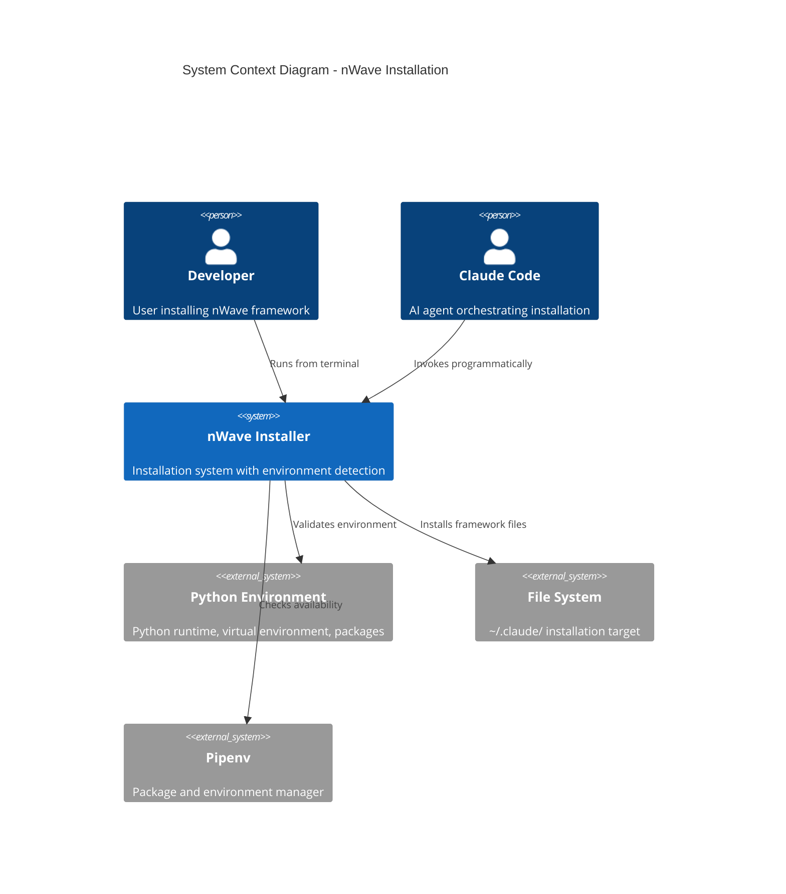
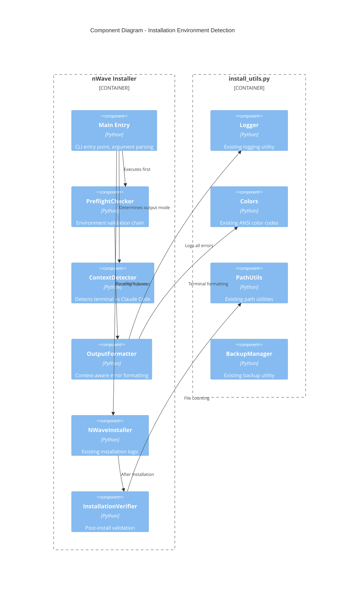
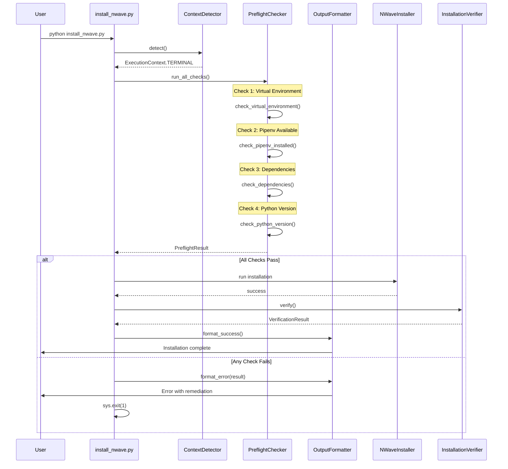
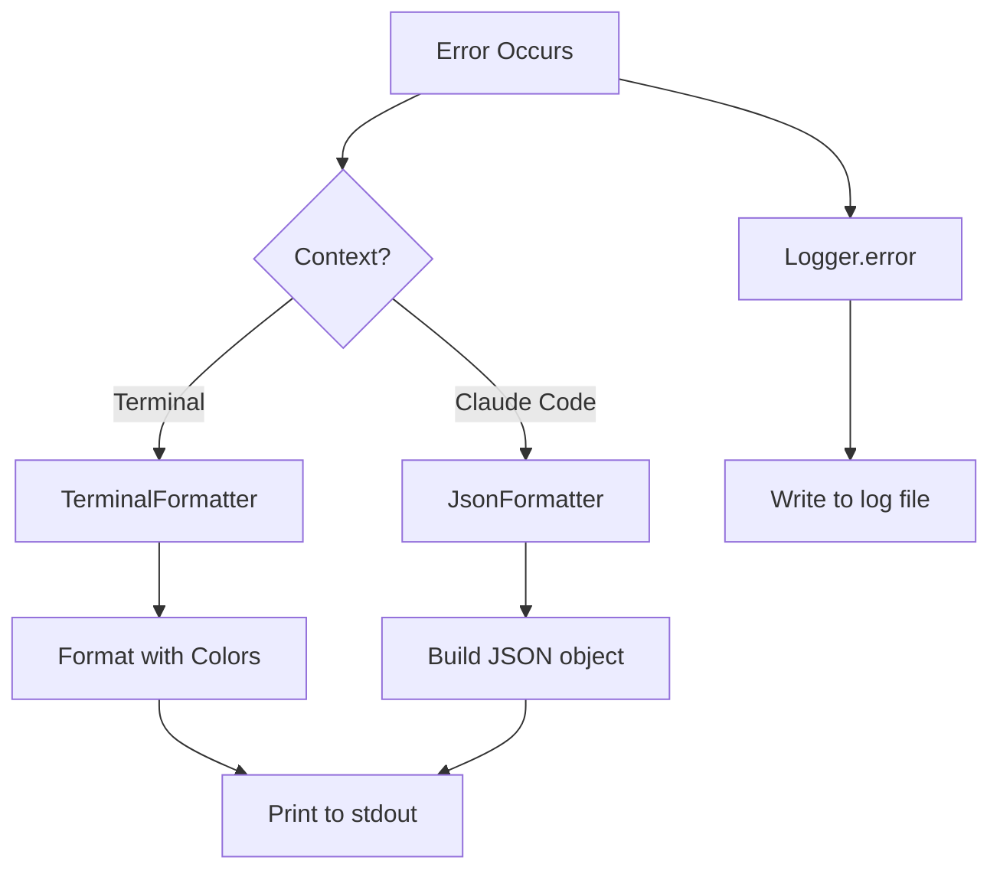
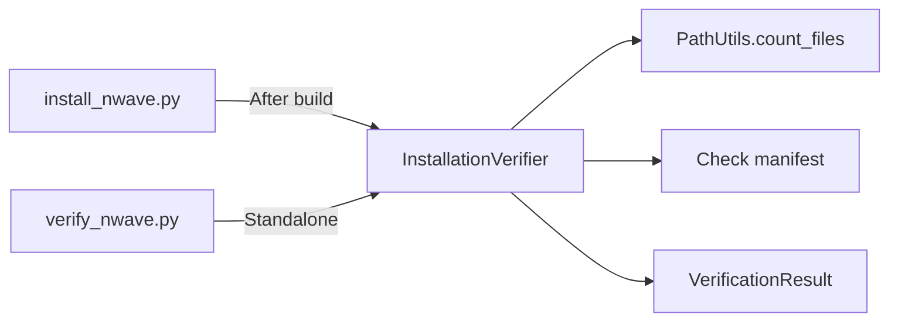

# Architecture Design: Installation Environment Detection

**Feature ID:** APEX-002
**Wave:** DESIGN
**Status:** Draft
**Created:** 2026-01-29
**Architect:** Morgan (Solution Architect)

---

## 1. Executive Summary

This document defines the technical architecture for the Installation Environment Detection feature. The design follows hexagonal architecture principles, maximizing reuse of existing `install_utils.py` components while adding a pre-flight validation layer that operates using only Python standard library modules.

### Key Architectural Decisions

| Decision | Choice | Rationale |
|----------|--------|-----------|
| Pre-flight checker architecture | Chain of Responsibility pattern | Extensible, ordered checks, fail-fast |
| Claude Code context detection | Non-TTY stdout detection | Standard library only, no env dependencies |
| Output strategy | Dual-mode OutputFormatter | Single responsibility, context-aware |
| Verification | Shared module, dual invocation | Code reuse between automatic and standalone |

---

## 2. System Overview

### 2.1 System Context



### 2.2 High-Level Architecture

The installation system adds a **Pre-flight Validation Layer** that executes BEFORE any existing installation logic. This layer:

1. Uses ONLY Python standard library (sys, os, subprocess, pathlib)
2. Detects execution context (terminal vs Claude Code)
3. Validates environment prerequisites
4. Provides context-appropriate error output
5. Blocks installation if validation fails

```
                    +------------------+
                    |   Entry Point    |
                    | install_nwave.py |
                    +--------+---------+
                             |
                             v
                    +------------------+
                    |  Pre-flight      |
                    |  Validation      |  <-- NEW LAYER
                    |  (stdlib only)   |
                    +--------+---------+
                             |
              Pass?  +-------+-------+  Fail?
                     |               |
                     v               v
            +----------------+  +------------------+
            | Existing       |  | Context-Aware    |
            | Installation   |  | Error Output     |
            | Logic          |  | (JSON or Human)  |
            +----------------+  +------------------+
                     |
                     v
            +----------------+
            | Post-Install   |
            | Verification   |
            +----------------+
```

---

## 3. Component Architecture

### 3.1 Component Diagram



### 3.2 Component Responsibilities

#### 3.2.1 PreflightChecker (NEW)

**Purpose:** Validates environment before installation proceeds.

**Location:** `scripts/install/preflight_checker.py`

**Responsibilities:**
- Execute ordered chain of environment checks
- Collect all failures (not just first)
- Return structured result for output formatting
- Use ONLY Python standard library

**Interface:**
```python
class PreflightResult:
    passed: bool
    checks: List[CheckResult]  # All check outcomes
    blocking_errors: List[CheckResult]  # Failures that block installation

class PreflightChecker:
    def run_all_checks(self) -> PreflightResult
    def add_check(self, check: EnvironmentCheck) -> None
```

#### 3.2.2 ContextDetector (NEW)

**Purpose:** Determines execution context for output formatting.

**Location:** `scripts/install/context_detector.py`

**Responsibilities:**
- Detect if running in terminal (TTY) vs non-interactive (Claude Code)
- Provide consistent context throughout execution
- Single point of truth for output mode

**Interface:**
```python
class ExecutionContext(Enum):
    TERMINAL = "terminal"
    CLAUDE_CODE = "claude_code"

class ContextDetector:
    @staticmethod
    def detect() -> ExecutionContext
```

#### 3.2.3 OutputFormatter (NEW)

**Purpose:** Formats errors based on execution context.

**Location:** `scripts/install/output_formatter.py`

**Responsibilities:**
- Format errors for terminal (human-readable)
- Format errors for Claude Code (JSON)
- Log all errors regardless of output mode
- Provide consistent error code mapping

**Interface:**
```python
class OutputFormatter:
    def __init__(self, context: ExecutionContext, logger: Logger)
    def format_error(self, error: CheckResult) -> str
    def format_success(self, message: str) -> str
    def output(self, content: str) -> None  # Writes to stdout
```

#### 3.2.4 InstallationVerifier (NEW)

**Purpose:** Validates installation completeness.

**Location:** `scripts/install/installation_verifier.py`

**Responsibilities:**
- Count installed agent files
- Count installed command files
- Verify manifest exists
- Compare against expected counts
- Provide verification result with details

**Interface:**
```python
class VerificationResult:
    passed: bool
    agent_count: int
    agent_expected: int
    command_count: int
    command_expected: int
    manifest_exists: bool
    issues: List[str]

class InstallationVerifier:
    def verify(self) -> VerificationResult
```

---

## 4. Pre-flight Check Flow

### 4.1 Sequence Diagram



### 4.2 Check Execution Order

The checks execute in this specific order to fail fast on most common issues:

| Order | Check | Rationale |
|-------|-------|-----------|
| 1 | Virtual Environment | Most common error, quickest to check |
| 2 | Pipenv Installed | Required tool, fails before deps check |
| 3 | Dependencies | Only matters if venv active |
| 4 | Python Version | Least likely to fail, informational |

### 4.3 Check Details

#### Check 1: Virtual Environment Detection

```python
# Detection method - standard library only
def is_in_virtual_environment() -> bool:
    return sys.prefix != sys.base_prefix
```

**Error Code:** `ENV_NO_VENV`
**Recoverable:** Yes
**Remediation:** `pipenv install --dev && pipenv shell`

#### Check 2: Pipenv Installation

```python
# Detection method - subprocess only
def is_pipenv_installed() -> bool:
    try:
        result = subprocess.run(
            ['pipenv', '--version'],
            capture_output=True,
            timeout=5
        )
        return result.returncode == 0
    except (FileNotFoundError, subprocess.TimeoutExpired):
        return False
```

**Error Code:** `ENV_NO_PIPENV`
**Recoverable:** Yes
**Remediation:** `pip3 install pipenv`

#### Check 3: Dependency Verification

```python
# Check required modules without importing them into main process
REQUIRED_MODULES = ['yaml', 'pathlib']

def check_module_available(module_name: str) -> bool:
    try:
        __import__(module_name)
        return True
    except ImportError:
        return False
```

**Error Code:** `DEP_MISSING`
**Recoverable:** Yes
**Remediation:** `pipenv install --dev`

#### Check 4: Python Version

```python
# Version check
MIN_PYTHON = (3, 8)

def check_python_version() -> bool:
    return sys.version_info >= MIN_PYTHON
```

**Error Code:** `ENV_PYTHON_VERSION`
**Recoverable:** No (requires system change)
**Remediation:** "Install Python 3.8 or higher"

---

## 5. Context Detection Strategy

### 5.1 Decision Analysis

Three options were evaluated for detecting Claude Code execution context:

| Option | Method | Pros | Cons |
|--------|--------|------|------|
| A | CLAUDE_* env vars | Explicit, intentional | Requires Claude Code changes |
| B | Non-TTY stdout | Standard library, works now | May false-positive in pipes |
| C | --json flag | Explicit user control | Requires user action |

### 5.2 Recommended Approach: Option B with Fallback

**Primary:** Check if stdout is a TTY
**Fallback:** Check for CLAUDE_CODE environment variable (future-proof)

```python
class ContextDetector:
    @staticmethod
    def detect() -> ExecutionContext:
        # Future-proof: Check explicit env var first
        if os.environ.get('CLAUDE_CODE'):
            return ExecutionContext.CLAUDE_CODE

        # Primary: TTY detection
        if sys.stdout.isatty():
            return ExecutionContext.TERMINAL
        else:
            return ExecutionContext.CLAUDE_CODE
```

**Rationale:**
- Works today without any Claude Code changes
- Standard library only (sys, os)
- Consistent with Unix convention (scripts detect pipes)
- Future-proof with env var check

### 5.3 Output Behavior by Context

| Context | stdout | Log File | Exit Code |
|---------|--------|----------|-----------|
| Terminal | Human-readable with colors | Yes, plain text | 0/1 |
| Claude Code | JSON structured | Yes, plain text | 0/1 |

---

## 6. Error Output Strategy

### 6.1 Terminal Output Format

```
[ERROR] Virtual environment required. You are running in global Python.
[FIX] Run: pipenv install --dev && pipenv shell
[THEN] Run: python scripts/install/install_nwave.py
```

Uses existing `Colors` class from `install_utils.py`:
- `[ERROR]` in RED
- `[FIX]` in YELLOW
- `[THEN]` in BLUE

### 6.2 Claude Code Output Format (JSON)

```json
{
  "status": "error",
  "error_code": "ENV_NO_VENV",
  "message": "Virtual environment required. You are running in global Python.",
  "remediation": "pipenv install --dev && pipenv shell",
  "recoverable": true,
  "details": {
    "python_version": "3.10.11",
    "sys_prefix": "/usr/local",
    "sys_base_prefix": "/usr/local"
  }
}
```

### 6.3 Error Code Registry

| Error Code | HTTP-like | Description | Recoverable |
|------------|-----------|-------------|-------------|
| ENV_NO_VENV | 412 | Not in virtual environment | true |
| ENV_NO_PIPENV | 412 | Pipenv not installed | true |
| ENV_PYTHON_VERSION | 412 | Python version too old | false |
| DEP_MISSING | 412 | Required module not found | true |
| BUILD_FAILED | 500 | Build phase error | false |
| VERIFY_FAILED | 500 | Post-install verification failed | true |

### 6.4 Dual Output Architecture



Both paths always log to the installation log file for debugging.

---

## 7. Integration with Existing Code

### 7.1 Changes to install_nwave.py

**Minimal modification approach:** Add pre-flight check call at start of `main()`.

```python
# At top of main(), BEFORE creating NWaveInstaller
def main():
    # NEW: Pre-flight validation (uses only stdlib)
    from preflight_checker import PreflightChecker
    from context_detector import ContextDetector
    from output_formatter import OutputFormatter

    context = ContextDetector.detect()
    preflight = PreflightChecker()
    result = preflight.run_all_checks()

    if not result.passed:
        # Create minimal logger for preflight errors
        formatter = OutputFormatter(context)
        formatter.output_errors(result.blocking_errors)
        return 1

    # EXISTING: Continue with normal installation
    installer = NWaveInstaller(dry_run=args.dry_run, ...)
    # ... rest of existing code
```

### 7.2 Reuse of install_utils.py

| Component | Reuse Strategy |
|-----------|----------------|
| Colors | Use directly in TerminalFormatter |
| Logger | Use for all logging (preflight and installation) |
| PathUtils | Use in InstallationVerifier |
| BackupManager | No change needed |
| ManifestWriter | No change needed |

### 7.3 New Files Created

| File | Purpose | Dependencies |
|------|---------|--------------|
| `preflight_checker.py` | Environment validation | stdlib only |
| `context_detector.py` | Detect execution context | sys, os |
| `output_formatter.py` | Format errors by context | Colors, Logger |
| `installation_verifier.py` | Post-install validation | PathUtils |
| `verify_nwave.py` | Standalone verification script | installation_verifier |

---

## 8. Verification Architecture

### 8.1 Shared Verification Module

Both automatic (post-install) and standalone verification use the same `InstallationVerifier` class.



### 8.2 Expected Counts

Expected file counts should be configurable, not hardcoded:

```python
# In installation_verifier.py
DEFAULT_EXPECTED = {
    'agents': 28,      # Expected agent files
    'commands': 23,    # Expected command files
}

# Can be overridden by manifest or config
```

### 8.3 verify_nwave.py Script

Thin wrapper around InstallationVerifier:

```python
#!/usr/bin/env python3
"""Standalone nWave installation verification."""

from installation_verifier import InstallationVerifier
from context_detector import ContextDetector
from output_formatter import OutputFormatter

def main():
    context = ContextDetector.detect()
    verifier = InstallationVerifier()
    result = verifier.verify()

    formatter = OutputFormatter(context)
    if result.passed:
        formatter.output_success(result)
        return 0
    else:
        formatter.output_verification_failure(result)
        return 1

if __name__ == '__main__':
    sys.exit(main())
```

---

## 9. Logging Architecture

### 9.1 Log File Location

**Location:** `~/.nwave/install.log`

**Rationale:**
- Separate from Claude config (`~/.claude/`)
- Survives uninstall (useful for debugging reinstalls)
- User-accessible for troubleshooting

### 9.2 Log Format

```
================================================================================
nWave Installation Session: 2026-01-29 14:23:45
Python: 3.10.11 | Platform: darwin | User: marco
================================================================================
[2026-01-29 14:23:45] INFO: Starting pre-flight environment checks
[2026-01-29 14:23:45] INFO: Check 1/4: Virtual environment... PASSED
[2026-01-29 14:23:45] INFO: Check 2/4: Pipenv installed... PASSED
[2026-01-29 14:23:45] INFO: Check 3/4: Dependencies... PASSED
[2026-01-29 14:23:45] INFO: Check 4/4: Python version... PASSED
[2026-01-29 14:23:45] INFO: Pre-flight checks: ALL PASSED
[2026-01-29 14:23:45] INFO: Proceeding with installation...
```

### 9.3 Error Logging

Errors include additional context for debugging:

```
[2026-01-29 14:23:45] ERROR: Pre-flight check failed: Virtual environment required
    Error Code: ENV_NO_VENV
    sys.prefix: /usr/local
    sys.base_prefix: /usr/local
    Remediation: pipenv install --dev && pipenv shell
```

---

## 10. Cross-Platform Considerations

### 10.1 Path Handling

All paths use `pathlib.Path` (already standard in existing code):

```python
log_dir = Path.home() / '.nwave'
log_file = log_dir / 'install.log'
```

### 10.2 Virtual Environment Detection

Works identically on all platforms:
- macOS: `sys.prefix` vs `sys.base_prefix`
- Linux: Same mechanism
- Windows: Same mechanism (pipenv creates proper venv)

### 10.3 Pipenv Command

```python
# Cross-platform pipenv detection
subprocess.run(['pipenv', '--version'], ...)  # Works on all platforms
```

On Windows, ensure `pipenv` is in PATH after `pip install pipenv`.

---

## 11. Quality Attributes

### 11.1 Performance

- Pre-flight checks complete < 2 seconds
- No network calls during pre-flight
- Lazy imports (only load what's needed)

### 11.2 Reliability

- Fail-fast on first blocking error
- Comprehensive logging for debugging
- Graceful degradation (log file errors don't block installation)

### 11.3 Maintainability

- Single responsibility per module
- Extensible check chain (add checks without modifying existing)
- Clear error code registry

### 11.4 Testability

- Each checker is independently testable
- Context detection can be mocked
- Output formatting can be unit tested

---

## 12. Risk Assessment

| Risk | Likelihood | Impact | Mitigation |
|------|------------|--------|------------|
| TTY detection false positive | Low | Medium | Add CLAUDE_CODE env var fallback |
| Pipenv command not in PATH | Medium | High | Clear error message with PATH guidance |
| Log directory creation fails | Low | Low | Graceful fallback, don't block install |
| Module import side effects | Low | Medium | Use `__import__()` not `import` |

---

## 13. Traceability

| Requirement | Component | Acceptance Criteria |
|-------------|-----------|---------------------|
| FR-01 | PreflightChecker | AC-01 |
| FR-02 | VirtualEnvCheck | AC-02 |
| FR-03 | PreflightChecker (pipenv only) | AC-03 |
| FR-04 | OutputFormatter | AC-04, AC-05 |
| FR-05 | DependencyCheck | AC-06 |
| FR-06 | InstallationVerifier (auto) | AC-07 |
| FR-07 | verify_nwave.py | AC-08 |
| FR-08 | Logger extension | AC-09 |
| NFR-01 | OutputFormatter (JSON) | AC-05 |
| NFR-02 | PreflightChecker (stdlib) | AC-01 |

---

## 14. Next Steps

1. **DISTILL Wave:** Create acceptance tests based on AC-01 through AC-10
2. **DEVELOP Wave:** Implement components in TDD style
3. **Documentation Update:** Update installation guide per DR-01, DR-02
