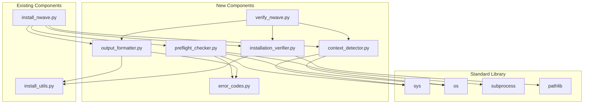

# Component Boundaries: Installation Environment Detection

**Feature ID:** APEX-002
**Wave:** DESIGN
**Created:** 2026-01-29

---

## 1. Existing System Analysis

### 1.1 Reuse Checklist

| Functionality | Exists? | Location | Reuse Strategy |
|---------------|---------|----------|----------------|
| ANSI Colors | Yes | `install_utils.py:Colors` | Direct import |
| File Logging | Yes | `install_utils.py:Logger` | Extend for preflight |
| Path Utilities | Yes | `install_utils.py:PathUtils` | Direct import |
| File Counting | Yes | `install_utils.py:PathUtils.count_files()` | Direct use |
| Backup Management | Yes | `install_utils.py:BackupManager` | No changes needed |
| Version Comparison | Yes | `install_utils.py:VersionUtils` | No changes needed |
| Manifest Writing | Yes | `install_utils.py:ManifestWriter` | No changes needed |
| Virtual Env Detection | No | - | NEW: Simple function |
| Pipenv Detection | No | - | NEW: Simple function |
| Dependency Check | No | - | NEW: Simple function |
| Context Detection | No | - | NEW: ContextDetector |
| JSON Error Output | No | - | NEW: OutputFormatter |
| Installation Verification | Partial | `install_nwave.py:validate_installation()` | EXTEND |

### 1.2 Existing Components to Extend

#### Logger Class Extension

**Current:** Logs to file with timestamp, writes to both console and file.

**Extension Needed:** None for core functionality. The existing Logger already supports:
- Timestamped entries
- INFO/WARN/ERROR levels
- Optional file logging
- Console output with colors

**Usage for Preflight:** Create Logger instance early with `~/.nwave/install.log` path.

#### PathUtils Extension

**Current:** Provides `count_files()`, `get_claude_config_dir()`, `find_newest_file()`.

**Extension Needed:** None. Existing methods sufficient for verification.

#### validate_installation() Refactor

**Current Location:** `install_nwave.py` lines 462-521

**Current Behavior:**
- Checks agents/commands directories exist
- Validates essential commands
- Validates schema template
- Counts installed files

**Proposed Refactor:** Extract to `InstallationVerifier` class for reuse by standalone script.

---

## 2. New Components

### 2.1 Component Overview

```
scripts/install/
├── install_nwave.py          # MODIFIED: Add preflight call at start
├── install_utils.py          # UNCHANGED
├── uninstall_nwave.py        # UNCHANGED
├── update_nwave.py           # UNCHANGED
├── preflight_checker.py      # NEW: Environment validation
├── context_detector.py       # NEW: Terminal vs Claude Code detection
├── output_formatter.py       # NEW: Context-aware error formatting
├── installation_verifier.py  # NEW: Extracted from validate_installation()
├── verify_nwave.py           # NEW: Standalone verification script
└── error_codes.py            # NEW: Error code constants
```

### 2.2 Dependency Graph



---

## 3. Component Specifications

### 3.1 preflight_checker.py

**Purpose:** Validate Python environment before installation.

**Constraints:**
- MUST use ONLY Python standard library
- CANNOT import yaml, toml, or any non-stdlib module
- MUST complete all checks within 2 seconds

**Dependencies:**
- `sys` - Version info, prefix detection
- `os` - Environment variables
- `subprocess` - Pipenv detection
- `error_codes` - Error code constants

**Interface:**

```python
from dataclasses import dataclass
from typing import List, Optional
from enum import Enum

class CheckStatus(Enum):
    PASSED = "passed"
    FAILED = "failed"
    SKIPPED = "skipped"

@dataclass
class CheckResult:
    name: str
    status: CheckStatus
    error_code: Optional[str]
    message: str
    remediation: Optional[str]
    recoverable: bool
    details: dict

@dataclass
class PreflightResult:
    passed: bool
    checks: List[CheckResult]
    blocking_errors: List[CheckResult]

class PreflightChecker:
    """Validates environment before installation."""

    def __init__(self):
        self._checks: List[callable] = []
        self._register_default_checks()

    def add_check(self, check_func: callable) -> None:
        """Add a check function to the chain."""

    def run_all_checks(self) -> PreflightResult:
        """Execute all registered checks in order."""

    # Built-in checks
    def _check_virtual_environment(self) -> CheckResult:
        """Check if running inside virtual environment."""

    def _check_pipenv_installed(self) -> CheckResult:
        """Check if pipenv command is available."""

    def _check_dependencies(self) -> CheckResult:
        """Check if required modules are importable."""

    def _check_python_version(self) -> CheckResult:
        """Check Python version meets minimum requirement."""
```

**Behavior:**
- Executes checks in registered order
- Collects all results (does not stop at first failure)
- Returns structured result with pass/fail and details

### 3.2 context_detector.py

**Purpose:** Determine execution context for output formatting.

**Constraints:**
- Standard library only
- Single static method, no state

**Dependencies:**
- `sys` - TTY detection
- `os` - Environment variable check

**Interface:**

```python
from enum import Enum

class ExecutionContext(Enum):
    TERMINAL = "terminal"
    CLAUDE_CODE = "claude_code"

class ContextDetector:
    """Detects execution context for output formatting."""

    @staticmethod
    def detect() -> ExecutionContext:
        """
        Determine execution context.

        Returns CLAUDE_CODE if:
        - CLAUDE_CODE environment variable is set, OR
        - stdout is not a TTY (piped/redirected)

        Returns TERMINAL otherwise.
        """

    @staticmethod
    def is_interactive() -> bool:
        """Check if running interactively (can prompt user)."""
```

### 3.3 output_formatter.py

**Purpose:** Format output based on execution context.

**Constraints:**
- Uses Colors from install_utils for terminal output
- Produces valid JSON for Claude Code context
- Always logs to file regardless of context

**Dependencies:**
- `install_utils.Colors` - Terminal colors
- `install_utils.Logger` - File logging
- `error_codes` - Error code constants
- `json` - JSON output formatting

**Interface:**

```python
from install_utils import Colors, Logger
from context_detector import ExecutionContext
from preflight_checker import CheckResult, PreflightResult

class OutputFormatter:
    """Context-aware output formatting."""

    def __init__(self, context: ExecutionContext, logger: Logger = None):
        self.context = context
        self.logger = logger

    def format_preflight_error(self, result: PreflightResult) -> str:
        """Format pre-flight check errors for output."""

    def format_check_error(self, check: CheckResult) -> str:
        """Format single check error."""

    def format_success(self, message: str) -> str:
        """Format success message."""

    def format_verification_result(self, result: 'VerificationResult') -> str:
        """Format verification result."""

    def output(self, content: str) -> None:
        """Write formatted content to stdout."""

    def output_and_log(self, content: str, log_level: str = "INFO") -> None:
        """Write to stdout and log file."""


class TerminalFormatter:
    """Human-readable terminal formatting."""

    @staticmethod
    def format_error(check: CheckResult) -> str:
        """
        Format:
        [ERROR] {message}
        [FIX] Run: {remediation}
        [THEN] Re-run the installer
        """

    @staticmethod
    def format_success(message: str) -> str:
        """Format success with green checkmark."""


class JsonFormatter:
    """JSON formatting for Claude Code."""

    @staticmethod
    def format_error(check: CheckResult) -> str:
        """
        Format:
        {
          "status": "error",
          "error_code": "...",
          "message": "...",
          "remediation": "...",
          "recoverable": true/false,
          "details": {...}
        }
        """

    @staticmethod
    def format_success(message: str, details: dict = None) -> str:
        """
        Format:
        {
          "status": "success",
          "message": "...",
          "details": {...}
        }
        """
```

### 3.4 installation_verifier.py

**Purpose:** Verify installation completeness.

**Constraints:**
- Reuses PathUtils for file operations
- Configurable expected counts
- Returns structured result

**Dependencies:**
- `install_utils.PathUtils` - File counting, path utilities
- `pathlib` - Path operations

**Interface:**

```python
from dataclasses import dataclass
from typing import List
from pathlib import Path

@dataclass
class VerificationResult:
    passed: bool
    agent_count: int
    agent_expected: int
    command_count: int
    command_expected: int
    manifest_exists: bool
    schema_valid: bool
    issues: List[str]

class InstallationVerifier:
    """Verifies nWave installation completeness."""

    DEFAULT_EXPECTED_AGENTS = 28
    DEFAULT_EXPECTED_COMMANDS = 23

    def __init__(
        self,
        claude_config_dir: Path = None,
        expected_agents: int = None,
        expected_commands: int = None
    ):
        """Initialize with optional custom paths and expectations."""

    def verify(self) -> VerificationResult:
        """Run all verification checks."""

    def verify_agents(self) -> tuple[int, List[str]]:
        """Count agents and return issues."""

    def verify_commands(self) -> tuple[int, List[str]]:
        """Count commands and return issues."""

    def verify_manifest(self) -> bool:
        """Check manifest file exists and is readable."""

    def verify_schema(self) -> bool:
        """Validate TDD cycle schema if present."""
```

### 3.5 error_codes.py

**Purpose:** Central registry of error codes.

**Constraints:**
- No dependencies
- Constants only

**Interface:**

```python
"""Error code constants for installation environment detection."""

# Environment errors (recoverable)
ENV_NO_VENV = "ENV_NO_VENV"
ENV_NO_PIPENV = "ENV_NO_PIPENV"
ENV_PYTHON_VERSION = "ENV_PYTHON_VERSION"

# Dependency errors (recoverable)
DEP_MISSING = "DEP_MISSING"

# Build errors (may not be recoverable)
BUILD_FAILED = "BUILD_FAILED"

# Verification errors (recoverable via reinstall)
VERIFY_FAILED = "VERIFY_FAILED"
VERIFY_MISSING_AGENTS = "VERIFY_MISSING_AGENTS"
VERIFY_MISSING_COMMANDS = "VERIFY_MISSING_COMMANDS"
VERIFY_NO_MANIFEST = "VERIFY_NO_MANIFEST"

# Error metadata
ERROR_METADATA = {
    ENV_NO_VENV: {
        "recoverable": True,
        "remediation": "pipenv install --dev && pipenv shell",
        "description": "Virtual environment required"
    },
    ENV_NO_PIPENV: {
        "recoverable": True,
        "remediation": "pip3 install pipenv",
        "description": "Pipenv is required but not installed"
    },
    # ... etc
}
```

### 3.6 verify_nwave.py

**Purpose:** Standalone verification script.

**Constraints:**
- Executable script with main()
- Shares code with automatic verification
- Supports both terminal and Claude Code output

**Dependencies:**
- `installation_verifier` - Verification logic
- `context_detector` - Output mode detection
- `output_formatter` - Result formatting
- `install_utils.Logger` - Logging

**Interface:**

```python
#!/usr/bin/env python3
"""
Standalone nWave Installation Verification Script

Verifies that nWave framework is properly installed.
Can be run independently at any time to check installation health.

Usage: pipenv run python scripts/install/verify_nwave.py
"""

def main() -> int:
    """
    Main entry point.

    Returns:
        0 if verification passes
        1 if verification fails
    """

def show_help() -> None:
    """Display help message."""

if __name__ == '__main__':
    sys.exit(main())
```

---

## 4. Integration Points

### 4.1 Modification to install_nwave.py

**Location:** `main()` function, lines 585-691

**Change Type:** Add preflight check before creating NWaveInstaller

**Before:**
```python
def main():
    parser = argparse.ArgumentParser(...)
    args = parser.parse_args()

    if args.help:
        show_help()
        return 0

    installer = NWaveInstaller(dry_run=args.dry_run, force_rebuild=args.force_rebuild)
    # ... rest of installation
```

**After:**
```python
def main():
    parser = argparse.ArgumentParser(...)
    args = parser.parse_args()

    if args.help:
        show_help()
        return 0

    # NEW: Pre-flight environment validation
    from preflight_checker import PreflightChecker
    from context_detector import ContextDetector
    from output_formatter import OutputFormatter
    from install_utils import Logger
    from pathlib import Path

    context = ContextDetector.detect()
    log_dir = Path.home() / '.nwave'
    log_dir.mkdir(parents=True, exist_ok=True)
    preflight_logger = Logger(log_dir / 'install.log')

    preflight_logger.info("Starting pre-flight environment checks...")
    preflight = PreflightChecker()
    result = preflight.run_all_checks()

    formatter = OutputFormatter(context, preflight_logger)

    if not result.passed:
        formatter.output(formatter.format_preflight_error(result))
        return 1

    preflight_logger.info("Pre-flight checks: ALL PASSED")

    # EXISTING: Continue with normal installation
    installer = NWaveInstaller(dry_run=args.dry_run, force_rebuild=args.force_rebuild)
    # ... rest of existing code unchanged
```

### 4.2 Modification to NWaveInstaller.validate_installation()

**Change Type:** Delegate to InstallationVerifier

**Current:** Lines 462-521, inline validation logic

**Proposed:** Extract to InstallationVerifier, keep method as thin wrapper

```python
def validate_installation(self) -> bool:
    """Validate installation using shared verifier."""
    from installation_verifier import InstallationVerifier

    self.logger.info("Validating installation...")
    verifier = InstallationVerifier(self.claude_config_dir)
    result = verifier.verify()

    # Log results using existing logger
    self.logger.info("Installation summary:")
    self.logger.info(f"  - Agents installed: {result.agent_count}")
    self.logger.info(f"  - Commands installed: {result.command_count}")
    self.logger.info(f"  - Installation directory: {self.claude_config_dir}")

    if result.passed:
        self.logger.info(f"Installation validation: {Colors.GREEN}PASSED{Colors.NC}")
        return True
    else:
        for issue in result.issues:
            self.logger.error(issue)
        self.logger.error(f"Installation validation: {Colors.RED}FAILED{Colors.NC}")
        return False
```

---

## 5. File Dependency Matrix

| Component | sys | os | subprocess | pathlib | json | install_utils | error_codes |
|-----------|-----|-----|------------|---------|------|---------------|-------------|
| preflight_checker | Y | Y | Y | - | - | - | Y |
| context_detector | Y | Y | - | - | - | - | - |
| output_formatter | - | - | - | - | Y | Y | Y |
| installation_verifier | - | - | - | Y | - | Y | - |
| error_codes | - | - | - | - | - | - | - |
| verify_nwave | Y | - | - | - | - | Y | - |

---

## 6. Testing Boundaries

Each component has clear boundaries for unit testing:

| Component | Test Strategy | Mocks Needed |
|-----------|---------------|--------------|
| PreflightChecker | Unit test each check method | sys.prefix, subprocess.run |
| ContextDetector | Unit test detect() | sys.stdout.isatty, os.environ |
| OutputFormatter | Unit test format methods | None (pure transformation) |
| InstallationVerifier | Unit test verify methods | File system (use tmp_path) |
| Integration | End-to-end with fixture env | Subprocess for full run |

---

## 7. Boundary Validation Checklist

- [x] No circular dependencies between new components
- [x] PreflightChecker uses ONLY stdlib (no install_utils)
- [x] OutputFormatter correctly imports from install_utils
- [x] InstallationVerifier reuses PathUtils
- [x] verify_nwave.py is thin wrapper, no duplicate logic
- [x] Error codes centralized in single module
- [x] Existing install_utils.py unchanged
- [x] Minimal modifications to install_nwave.py
