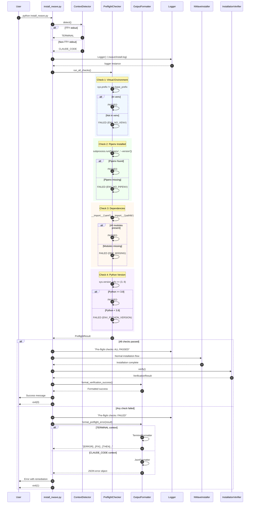
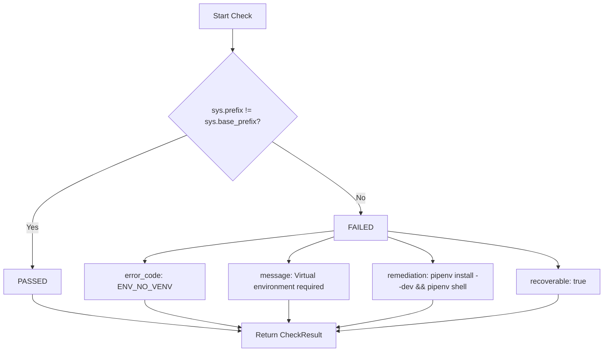
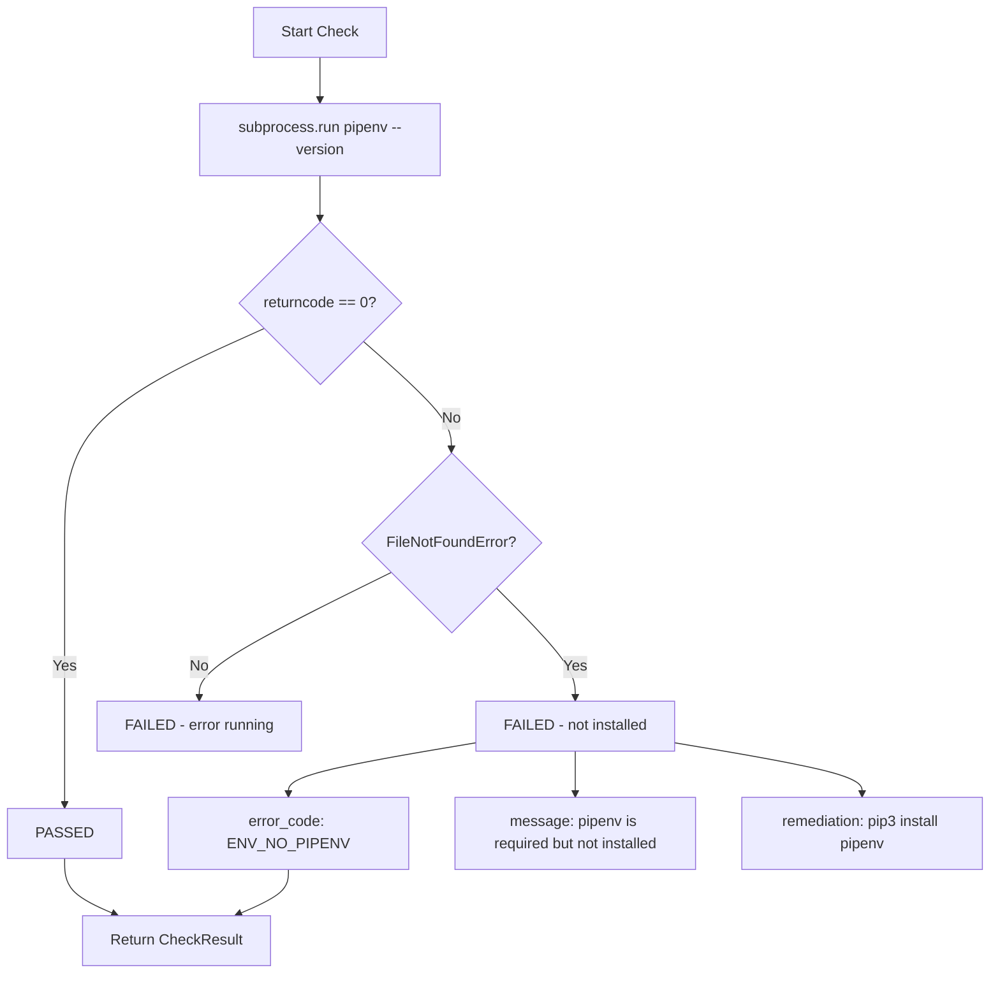
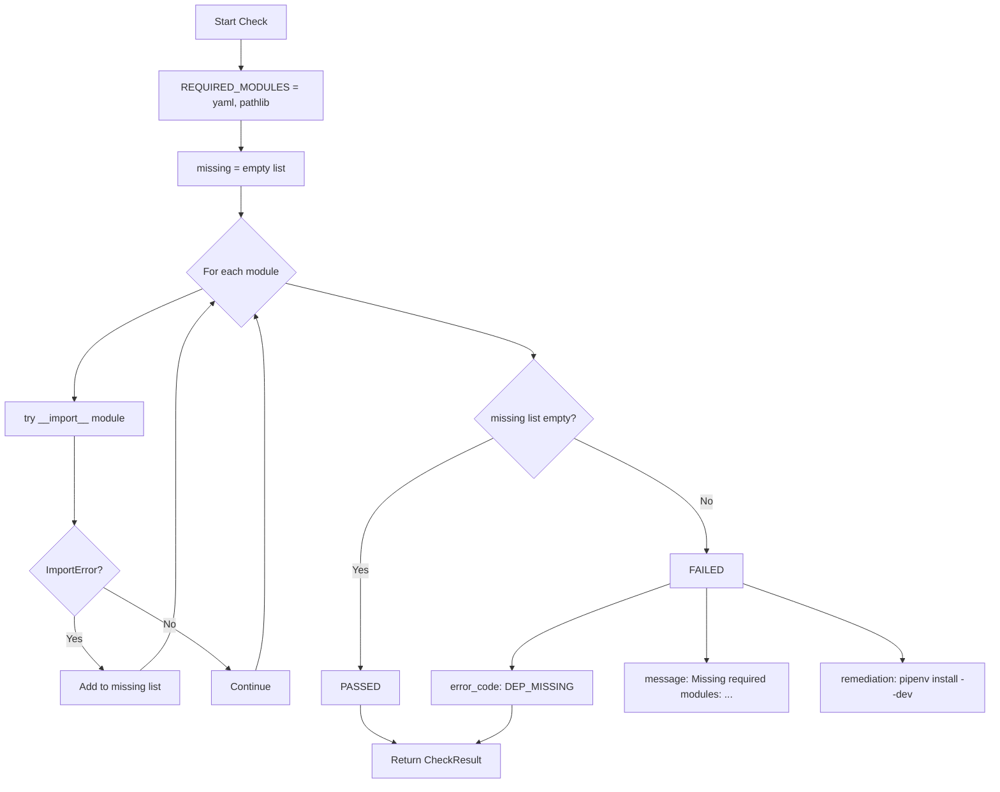
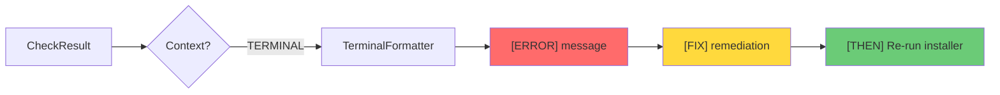
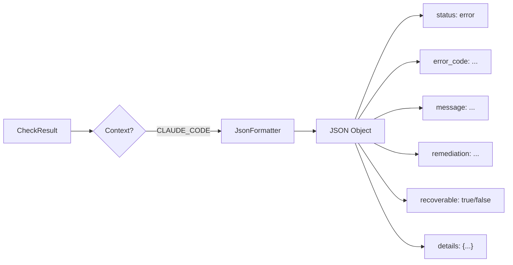

# Pre-flight Check Sequence Diagram

## Main Installation Flow with Pre-flight

## Pre-flight Check Details

### Virtual Environment Check Flow

### Pipenv Check Flow

### Dependency Check Flow

## Error Output Formatting

### Terminal Format Flow

### Claude Code Format Flow

