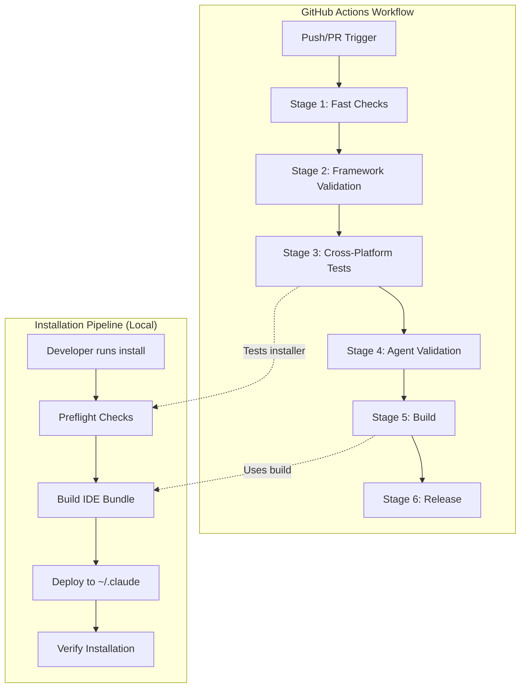

# Platform Design: Installation Environment Detection

**Feature ID:** APEX-002
**Wave:** DESIGN (Platform Perspective)
**Status:** Draft
**Created:** 2026-01-29
**Architect:** Apex (Platform Architect)

---

## 1. Executive Summary

This document provides the platform and infrastructure perspective for the Installation Environment Detection feature. It complements Morgan's solution architecture by addressing:

- Pipenv as infrastructure component in the developer workflow
- Installation as a deployment pipeline with quality gates
- CI/CD environment detection and integration
- Cross-platform compatibility matrix
- Observability and diagnostics strategy

### Relationship to Solution Architecture

| Aspect | Solution Architecture (Morgan) | Platform Design (Apex) |
|--------|-------------------------------|------------------------|
| Focus | Code structure, patterns | Infrastructure integration |
| Components | PreflightChecker, OutputFormatter | Pipeline gates, CI detection |
| Scope | Application logic | Deployment and operations |
| Output | New Python modules | CI workflows, environment matrix |

---

## 2. Infrastructure Context

### 2.1 Context Diagram

```
+------------------------------------------------------------------+
|                    DEVELOPER WORKSTATION                          |
|                                                                   |
|  +------------------+     +------------------+                    |
|  |  Python Runtime  |     |  Package Manager |                    |
|  |  (pyenv/system)  |     |     (pipenv)     |                    |
|  +--------+---------+     +--------+---------+                    |
|           |                        |                              |
|           v                        v                              |
|  +------------------------------------------------+              |
|  |              VIRTUAL ENVIRONMENT               |              |
|  |  (pipenv shell / pipenv run)                   |              |
|  |                                                 |              |
|  |  +------------------+  +------------------+    |              |
|  |  |  Dependencies    |  |  nWave Installer |    |              |
|  |  |  (pyyaml, etc)   |  |  (preflight)     |    |              |
|  |  +------------------+  +------------------+    |              |
|  +------------------------------------------------+              |
|                            |                                      |
|                            v                                      |
|  +------------------------------------------------+              |
|  |              INSTALLATION TARGET               |              |
|  |  ~/.claude/agents/nw/                          |              |
|  |  ~/.claude/commands/nw/                        |              |
|  |  ~/.nwave/install.log                          |              |
|  +------------------------------------------------+              |
+------------------------------------------------------------------+

+------------------------------------------------------------------+
|                       CI/CD ENVIRONMENT                           |
|                                                                   |
|  +------------------+     +------------------+                    |
|  |  GitHub Actions  |     |  Runner (VM)     |                    |
|  |  (workflow)      |     |  ubuntu/windows/ |                    |
|  |                  |     |  macos           |                    |
|  +------------------+     +------------------+                    |
|           |                        |                              |
|           v                        v                              |
|  +------------------------------------------------+              |
|  |              EPHEMERAL ENVIRONMENT             |              |
|  |  pipenv install --dev --deploy                 |              |
|  |  pipenv run pytest tests/                      |              |
|  +------------------------------------------------+              |
+------------------------------------------------------------------+
```

### 2.2 Pipenv as Infrastructure

Pipenv serves three infrastructure roles in the nWave ecosystem:

| Role | Function | Why It Matters |
|------|----------|----------------|
| Environment Isolation | Creates virtual environment | Prevents global Python pollution |
| Dependency Lock | Pipfile.lock ensures reproducibility | Same deps on all machines |
| Script Runner | `pipenv run` executes in context | No manual activation needed |

**Infrastructure Implications:**

1. **Pre-installation Gate:** Pipenv must be installed before any nWave installation
2. **Environment Bootstrap:** Virtual environment must exist before installer runs
3. **Dependency Resolution:** Pipfile.lock must be synced before installer runs
4. **CI Integration:** All CI workflows use `pipenv install --dev` pattern

---

## 3. Installation as Pipeline

### 3.1 Pipeline Metaphor

The nWave installation process maps to a CI/CD pipeline:

```
INSTALLATION PIPELINE
=====================

Stage 1: PREFLIGHT (Quality Gates)
    +-- Check: Virtual Environment Active
    +-- Check: Pipenv Installed
    +-- Check: Dependencies Resolved
    +-- Check: Python Version Compatible
    |
    v  [All Pass?]

Stage 2: BUILD (Artifact Creation)
    +-- Run embed_sources.py (update embedded content)
    +-- Run build_ide_bundle.py (create dist/ide/)
    +-- Validate dist/ structure
    |
    v  [Build Success?]

Stage 3: DEPLOY (Installation)
    +-- Backup existing installation
    +-- Copy agents to ~/.claude/agents/nw/
    +-- Copy commands to ~/.claude/commands/nw/
    +-- Install templates
    |
    v  [Deploy Success?]

Stage 4: VERIFY (Smoke Tests)
    +-- Count installed agents (expect 28+)
    +-- Count installed commands (expect 23)
    +-- Validate manifest exists
    +-- Schema template validation
    |
    v  [Verify Pass?]

Stage 5: REPORT (Observability)
    +-- Write installation manifest
    +-- Log to ~/.nwave/install.log
    +-- Output success/failure message
```

### 3.2 Pipeline Quality Gates

| Gate | Stage | Blocking | Timeout |
|------|-------|----------|---------|
| Virtual Environment | Preflight | Yes | N/A |
| Pipenv Available | Preflight | Yes | 5s |
| Dependencies Resolved | Preflight | Yes | N/A |
| Python Version | Preflight | No (warn) | N/A |
| Build Success | Build | Yes | 60s |
| Agent Count | Verify | No (warn) | N/A |
| Command Count | Verify | No (warn) | N/A |

### 3.3 Failure Recovery

| Failure Point | Recovery Strategy | User Action |
|---------------|-------------------|-------------|
| No Virtual Env | Exit with remediation command | `pipenv install --dev && pipenv shell` |
| No Pipenv | Exit with install command | `pip3 install pipenv` |
| Missing Deps | Exit with sync command | `pipenv install --dev` |
| Build Failed | Exit, preserve logs | Check ~/.nwave/install.log |
| Deploy Failed | Restore from backup | Automatic rollback |
| Verify Warnings | Continue with warnings | Review installed files |

---

## 4. CI/CD Environment Detection

### 4.1 CI Environment Variables

When running in CI/CD environments, specific environment variables are set:

| CI Platform | Detection Variable | Example Value |
|-------------|-------------------|---------------|
| GitHub Actions | `GITHUB_ACTIONS` | `true` |
| GitHub Actions | `CI` | `true` |
| GitLab CI | `GITLAB_CI` | `true` |
| GitLab CI | `CI` | `true` |
| Jenkins | `JENKINS_URL` | `http://jenkins...` |
| CircleCI | `CIRCLECI` | `true` |
| Travis CI | `TRAVIS` | `true` |
| Azure DevOps | `TF_BUILD` | `True` |
| Generic CI | `CI` | `true` |

### 4.2 CI Detection Strategy

```python
class CIEnvironmentDetector:
    """Detects CI/CD environment for specialized behavior."""

    CI_INDICATORS = {
        'GITHUB_ACTIONS': 'GitHub Actions',
        'GITLAB_CI': 'GitLab CI',
        'JENKINS_URL': 'Jenkins',
        'CIRCLECI': 'CircleCI',
        'TRAVIS': 'Travis CI',
        'TF_BUILD': 'Azure DevOps',
        'CI': 'Generic CI',
    }

    @classmethod
    def detect(cls) -> Optional[str]:
        """Detect if running in CI environment."""
        for var, name in cls.CI_INDICATORS.items():
            if os.environ.get(var):
                return name
        return None

    @classmethod
    def is_ci(cls) -> bool:
        """Return True if running in any CI environment."""
        return cls.detect() is not None
```

### 4.3 CI-Specific Behavior

| Behavior | Terminal | Claude Code | CI Environment |
|----------|----------|-------------|----------------|
| Output Format | Human (colors) | JSON | Human (no colors) |
| Color Codes | Yes | No | No (CI logs) |
| Interactive Prompts | Allowed | Not used | Forbidden |
| Log Verbosity | Normal | Normal | Verbose |
| Exit Codes | Standard | Standard | Strict (fail-fast) |

### 4.4 Extended Context Detection

Update to Morgan's ContextDetector to include CI awareness:

```python
class ExecutionContext(Enum):
    TERMINAL = "terminal"
    CLAUDE_CODE = "claude_code"
    CI_ENVIRONMENT = "ci_environment"

class ContextDetector:
    @staticmethod
    def detect() -> ExecutionContext:
        # Check explicit env var first (future-proof)
        if os.environ.get('CLAUDE_CODE'):
            return ExecutionContext.CLAUDE_CODE

        # Check for CI environment
        if CIEnvironmentDetector.is_ci():
            return ExecutionContext.CI_ENVIRONMENT

        # TTY detection for terminal vs non-interactive
        if sys.stdout.isatty():
            return ExecutionContext.TERMINAL
        else:
            return ExecutionContext.CLAUDE_CODE
```

---

## 5. Cross-Platform Considerations

### 5.1 Python Installation Methods

| Platform | Installation Method | Python Location | Notes |
|----------|-------------------|-----------------|-------|
| macOS | Homebrew | /opt/homebrew/bin/python3 | ARM Macs |
| macOS | python.org | /Library/Frameworks/Python.framework | Intel/ARM |
| macOS | pyenv | ~/.pyenv/shims/python | Version management |
| macOS | System (deprecated) | /usr/bin/python3 | Not recommended |
| Linux | apt/dnf/yum | /usr/bin/python3 | System package |
| Linux | pyenv | ~/.pyenv/shims/python | Version management |
| Linux | deadsnakes PPA | /usr/bin/python3.x | Multiple versions |
| Windows | python.org | C:\PythonXX | Standard |
| Windows | Windows Store | WindowsApps path | Microsoft Store |
| Windows | pyenv-win | %USERPROFILE%\.pyenv | Version management |
| Windows | WSL | /usr/bin/python3 | Linux subsystem |

### 5.2 Pipenv Behavior Differences

| Aspect | macOS/Linux | Windows | WSL |
|--------|-------------|---------|-----|
| Pipenv install | `pip3 install pipenv` | `pip install pipenv` | `pip3 install pipenv` |
| Pipenv location | ~/.local/bin/pipenv | Scripts\pipenv.exe | ~/.local/bin/pipenv |
| PATH requirement | Often automatic | Manual PATH update needed | Often automatic |
| Virtual env location | ~/.local/share/virtualenvs/ | %USERPROFILE%\.virtualenvs\ | ~/.local/share/virtualenvs/ |
| Shell activation | `pipenv shell` | `pipenv shell` (cmd/PS) | `pipenv shell` |

### 5.3 Path Handling

All path operations use `pathlib.Path` for cross-platform compatibility:

```python
# Correct: Cross-platform
log_dir = Path.home() / '.nwave'
claude_dir = Path.home() / '.claude'

# Incorrect: Platform-specific
log_dir = os.path.expanduser('~/.nwave')  # Works but less clean
```

### 5.4 Known Platform Issues

| Platform | Issue | Workaround |
|----------|-------|------------|
| Windows | pipenv not in PATH after install | Add Scripts to PATH or use full path |
| Windows | ANSI colors not supported in CMD | Detect and strip colors |
| macOS Ventura+ | Python 2 removed | Use python3 explicitly |
| Linux (minimal) | pip not installed | Install python3-pip first |
| WSL | Windows/Linux path confusion | Use native Linux paths |

---

## 6. GitHub Actions Integration

### 6.1 Current Workflow Analysis

The existing `.github/workflows/ci-cd.yml` already handles:
- Cross-platform matrix (ubuntu, windows, macos)
- Python version matrix (3.11, 3.12)
- Pipenv installation and caching
- Test execution via `pipenv run pytest`

### 6.2 Installation Test Recommendations

Add installation verification to CI workflow:

```yaml
# Recommended addition to test job
- name: Test installation script
  run: |
    pipenv run python scripts/install/install_nwave.py --dry-run
  shell: bash

- name: Verify installation preflight
  run: |
    pipenv run python -c "
    from scripts.install.preflight_checker import PreflightChecker
    result = PreflightChecker().run_all_checks()
    assert result.passed, f'Preflight failed: {result.blocking_errors}'
    "
  shell: bash
```

### 6.3 CI Environment Detection in Workflow

The installer should behave appropriately in CI:

| CI Context | Expected Behavior |
|------------|-------------------|
| GitHub Actions | No color output, verbose logging |
| PR checks | Dry-run mode recommended |
| Release tags | Full installation for artifact building |

---

## 7. Observability Design

### 7.1 Structured Logging Strategy

All installation events use structured log format:

```
[TIMESTAMP] [LEVEL] [COMPONENT] MESSAGE | key=value key=value
```

**Example log entries:**

```
[2026-01-29 14:23:45] INFO  [PREFLIGHT] Starting environment validation | checks=4
[2026-01-29 14:23:45] INFO  [PREFLIGHT] Check passed | check=virtual_env duration_ms=2
[2026-01-29 14:23:45] INFO  [PREFLIGHT] Check passed | check=pipenv_installed duration_ms=150
[2026-01-29 14:23:45] ERROR [PREFLIGHT] Check failed | check=dependencies error_code=DEP_MISSING missing=yaml
[2026-01-29 14:23:45] INFO  [PREFLIGHT] Validation complete | passed=false failed=1 duration_ms=160
```

### 7.2 Log Levels

| Level | Usage | Examples |
|-------|-------|----------|
| DEBUG | Detailed execution flow | Function entry/exit, variable values |
| INFO | Normal operational events | Check started, check passed, installation step |
| WARN | Recoverable issues | Low agent count, missing optional file |
| ERROR | Failures blocking progress | Check failed, build error |
| CRITICAL | System-level failures | Cannot write log, permission denied |

### 7.3 Diagnostic Collection

For support troubleshooting, collect diagnostic info on error:

```python
def collect_diagnostics() -> dict:
    """Collect system diagnostics for error reporting."""
    return {
        'platform': {
            'system': platform.system(),
            'release': platform.release(),
            'machine': platform.machine(),
        },
        'python': {
            'version': sys.version,
            'executable': sys.executable,
            'prefix': sys.prefix,
            'base_prefix': sys.base_prefix,
        },
        'environment': {
            'in_venv': sys.prefix != sys.base_prefix,
            'ci_detected': CIEnvironmentDetector.detect(),
            'claude_code': os.environ.get('CLAUDE_CODE'),
        },
        'paths': {
            'home': str(Path.home()),
            'cwd': str(Path.cwd()),
            'claude_dir': str(Path.home() / '.claude'),
            'nwave_log': str(Path.home() / '.nwave' / 'install.log'),
        },
    }
```

### 7.4 Log Rotation

For long-term installations, implement log rotation:

```python
MAX_LOG_SIZE = 1024 * 1024  # 1 MB
MAX_LOG_FILES = 5  # Keep 5 rotated logs

def rotate_log_if_needed(log_path: Path):
    """Rotate log file if it exceeds size limit."""
    if not log_path.exists():
        return

    if log_path.stat().st_size > MAX_LOG_SIZE:
        # Rotate: install.log -> install.log.1 -> install.log.2 ...
        for i in range(MAX_LOG_FILES - 1, 0, -1):
            old = log_path.with_suffix(f'.log.{i}')
            new = log_path.with_suffix(f'.log.{i+1}')
            if old.exists():
                old.rename(new)

        log_path.rename(log_path.with_suffix('.log.1'))
```

---

## 8. Integration with Existing CI/CD

### 8.1 Workflow Integration Points



### 8.2 Pre-commit Hook Integration

The installer should work seamlessly with existing pre-commit hooks:

| Hook | Impact on Installer |
|------|---------------------|
| prevent-shell-scripts | Installer is Python, not affected |
| yaml-validation | Installer YAML configs validated |
| pytest-validation | Installer tests run on commit |
| ruff | Installer code linted |

---

## 9. Security Considerations

### 9.1 No Credentials in Installation

The installation process should NEVER:
- Access environment credentials
- Store secrets in logs
- Transmit data externally

### 9.2 File Permission Handling

```python
# Installation creates user-readable files only
def set_secure_permissions(path: Path):
    """Set secure permissions on installed files."""
    if platform.system() != 'Windows':
        os.chmod(path, 0o644)  # rw-r--r-- for files
        if path.is_dir():
            os.chmod(path, 0o755)  # rwxr-xr-x for dirs
```

### 9.3 Path Traversal Prevention

All user-provided paths should be validated:

```python
def validate_path(path: Path, expected_parent: Path) -> bool:
    """Prevent path traversal attacks."""
    try:
        resolved = path.resolve()
        return resolved.is_relative_to(expected_parent.resolve())
    except (ValueError, RuntimeError):
        return False
```

---

## 10. Traceability to Requirements

| Requirement | Platform Design Element | Section |
|-------------|------------------------|---------|
| C-01: Python 3 only | Cross-platform Python detection | 5.1 |
| C-02: Local pipenv | Pipenv as infrastructure | 2.2 |
| C-03: Deps first | Preflight pipeline gate | 3.2 |
| NFR-03: Performance | Pipeline timeouts | 3.2 |
| NFR-04: Cross-platform | Platform matrix | 5.1-5.4 |
| FR-08: Logging | Observability strategy | 7 |

---

## 11. Next Steps

1. Create environment-matrix.md with detailed compatibility data
2. Create ci-cd-integration.md with workflow recommendations
3. Create observability-design.md with detailed logging specification
4. Create infrastructure-decisions.md with platform ADRs (PADR-001 through PADR-004)
