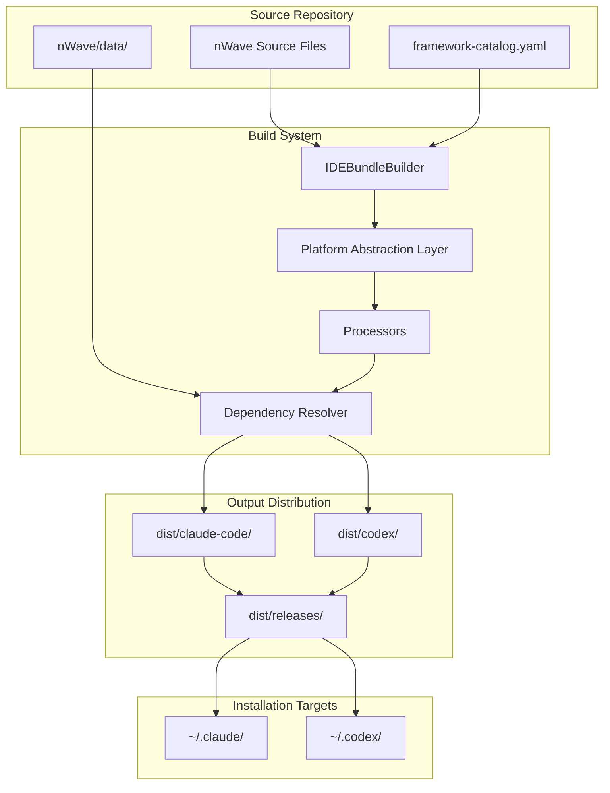
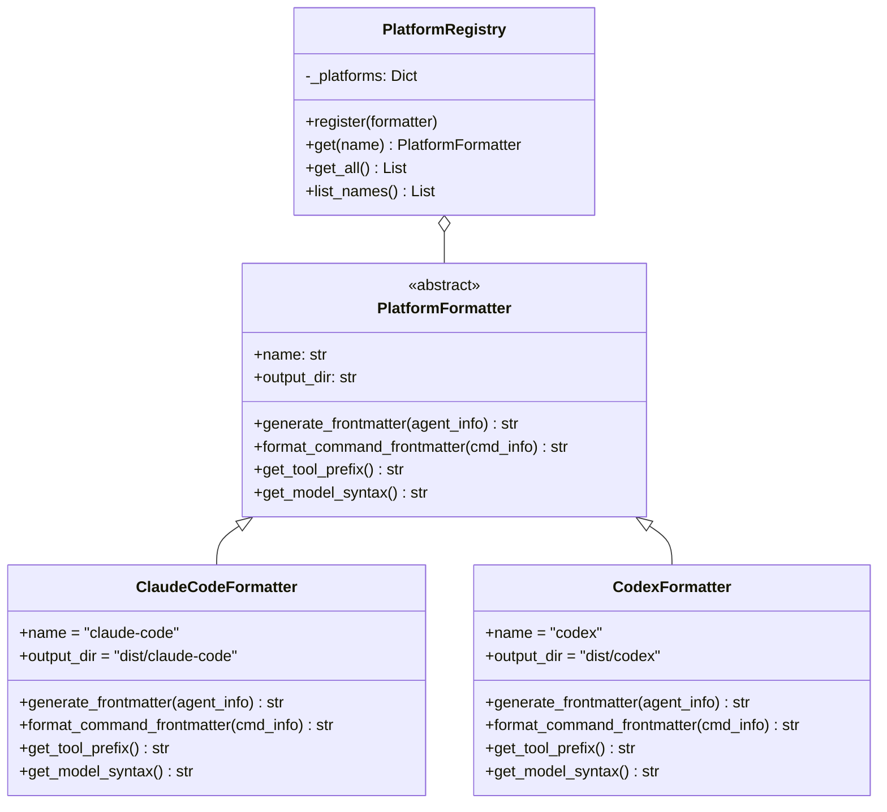
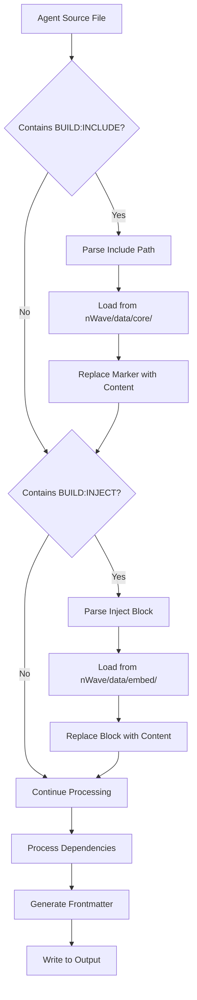
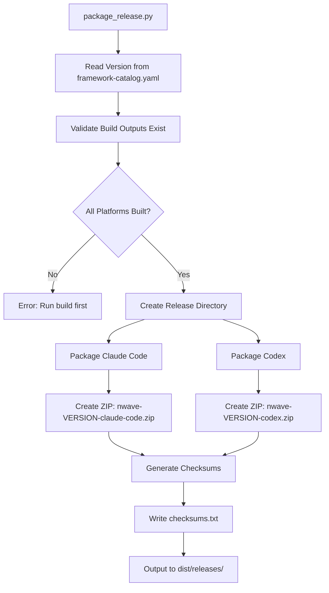
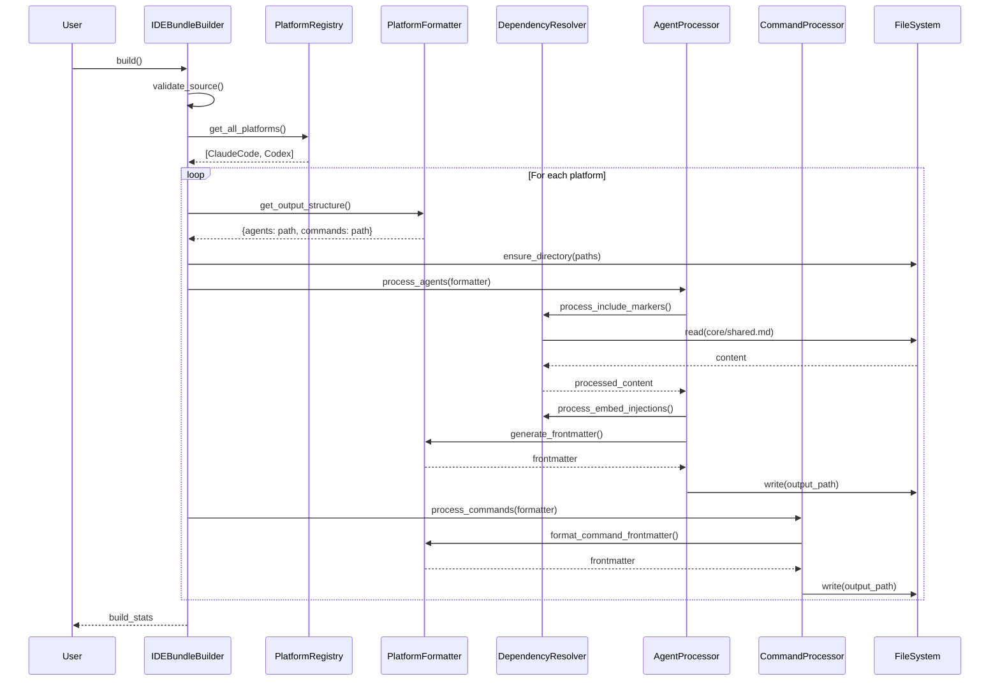
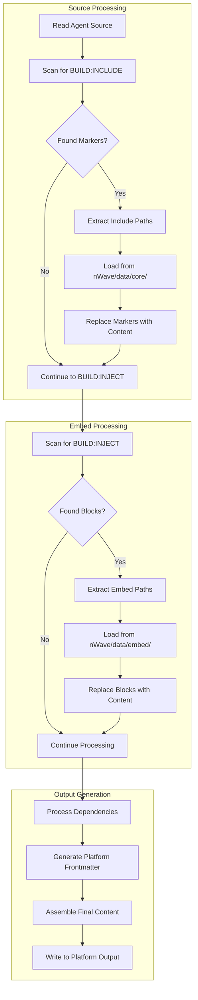
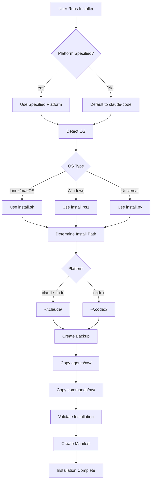
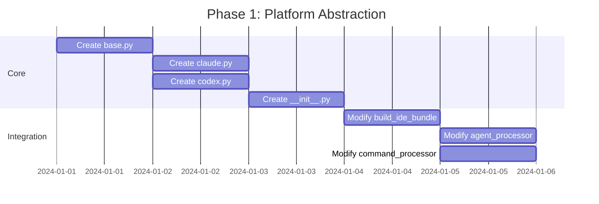

# nWave Framework Rationalization - Architecture Design

**Wave:** DESIGN
**Status:** Architecture specification complete
**Previous Wave:** DISCUSS (requirements.md)
**Next Wave:** DISTILL
**Feature:** Framework rationalization for open source publication

---

## 1. Architecture Overview

This architecture transforms the nWave framework from a single-platform build system into a multi-platform, release-ready open source project with standardized wave handoffs and feature-centric output organization.

### 1.1 High-Level System Context



### 1.2 Design Principles

| Principle | Implementation |
|-----------|----------------|
| **Strategy Pattern** | Platform formatters implement common interface |
| **Single Source of Truth** | BUILD:INCLUDE for shared content injection |
| **Backward Compatibility** | Default to claude-code platform |
| **Cross-Platform** | Python-based build, platform-specific installers |
| **Minimal Coupling** | Platform adapters independent of core processors |
| **Open Source First** | All dependencies open source (MIT/Apache 2.0 preferred) |

---

## 2. Component Design

### 2.1 Platform Abstraction Layer

The platform abstraction layer uses the Strategy Pattern to support multiple AI IDE platforms without modifying core build logic.

#### 2.1.1 Component Architecture



#### 2.1.2 Directory Structure

```
tools/platforms/
├── __init__.py          # Platform registry, factory, and exports
├── base.py              # Abstract PlatformFormatter base class
├── claude.py            # Claude Code formatter implementation
└── codex.py             # OpenAI Codex formatter implementation
```

#### 2.1.3 Platform Formatter Interface

```python
# tools/platforms/base.py
from abc import ABC, abstractmethod
from typing import Dict, Any, Optional
from pathlib import Path


class PlatformFormatter(ABC):
    """Abstract base class for platform-specific formatters."""

    @property
    @abstractmethod
    def name(self) -> str:
        """Platform identifier (e.g., 'claude-code', 'codex')."""
        pass

    @property
    @abstractmethod
    def output_dir(self) -> str:
        """Output directory name for this platform."""
        pass

    @abstractmethod
    def generate_frontmatter(self, agent_info: Dict[str, Any]) -> str:
        """Generate platform-specific YAML frontmatter for agents."""
        pass

    @abstractmethod
    def format_command_frontmatter(self, cmd_info: Dict[str, Any]) -> str:
        """Generate platform-specific frontmatter for commands."""
        pass

    @abstractmethod
    def get_tool_prefix(self) -> str:
        """Get platform-specific tool naming prefix."""
        pass

    @abstractmethod
    def get_model_syntax(self) -> str:
        """Get model selection syntax for this platform."""
        pass

    def get_output_structure(self) -> Dict[str, str]:
        """Return output directory structure for this platform."""
        return {
            "agents": f"{self.output_dir}/agents/nw",
            "commands": f"{self.output_dir}/commands/nw",
        }
```

#### 2.1.4 Platform Registry

```python
# tools/platforms/__init__.py
from typing import Dict, List, Optional
from .base import PlatformFormatter
from .claude import ClaudeCodeFormatter
from .codex import CodexFormatter


class PlatformRegistry:
    """Registry for platform formatters with factory methods."""

    _instance: Optional['PlatformRegistry'] = None
    _platforms: Dict[str, PlatformFormatter] = {}

    def __new__(cls):
        if cls._instance is None:
            cls._instance = super().__new__(cls)
            cls._instance._platforms = {}
            cls._instance._register_defaults()
        return cls._instance

    def _register_defaults(self):
        """Register built-in platform formatters."""
        self.register(ClaudeCodeFormatter())
        self.register(CodexFormatter())

    def register(self, formatter: PlatformFormatter) -> None:
        """Register a platform formatter."""
        self._platforms[formatter.name] = formatter

    def get(self, name: str) -> Optional[PlatformFormatter]:
        """Get a platform formatter by name."""
        return self._platforms.get(name)

    def get_all(self) -> List[PlatformFormatter]:
        """Get all registered platform formatters."""
        return list(self._platforms.values())

    def list_names(self) -> List[str]:
        """List all registered platform names."""
        return list(self._platforms.keys())


# Convenience functions
def get_platform(name: str) -> Optional[PlatformFormatter]:
    """Get a platform formatter by name."""
    return PlatformRegistry().get(name)


def get_all_platforms() -> List[PlatformFormatter]:
    """Get all registered platform formatters."""
    return PlatformRegistry().get_all()
```

### 2.2 BUILD:INCLUDE Mechanism

The BUILD:INCLUDE mechanism enables shared content injection while maintaining BUILD:INJECT for agent-specific embeds.

#### 2.2.1 Marker Syntax

```markdown
<!-- BUILD:INCLUDE nWave/data/core/critique/priority-validation.md -->
```

vs existing BUILD:INJECT (unchanged):

```markdown
<!-- BUILD:INJECT:START:nWave/data/embed/agent-name/file.md -->
<!-- Content will be injected here at build time -->
<!-- BUILD:INJECT:END -->
```

#### 2.2.2 Key Differences

| Aspect | BUILD:INJECT | BUILD:INCLUDE |
|--------|--------------|---------------|
| **Purpose** | Agent-specific embeds | Shared content across agents |
| **Source Location** | `nWave/data/embed/{agent}/` | `nWave/data/core/` |
| **Marker Style** | START/END block | Single-line marker |
| **Content Visibility** | Markers preserved in output | Markers replaced entirely |
| **Use Case** | Critique dimensions, research | Radical Candor, shared frameworks |

#### 2.2.3 Parser Implementation

```python
# Addition to tools/utils/dependency_resolver.py

def process_include_markers(self, content: str) -> str:
    """
    Process BUILD:INCLUDE markers and replace with file content.

    Finds markers in format:
    <!-- BUILD:INCLUDE path/to/shared/file.md -->

    And replaces the entire marker with the actual file content.
    """
    include_pattern = re.compile(
        r"<!-- BUILD:INCLUDE\s+(.+?)\s*-->",
        re.MULTILINE,
    )

    def replace_include(match):
        include_path = match.group(1).strip()

        # Resolve path relative to project root
        project_root = self.source_dir.parent
        full_path = project_root / include_path

        try:
            content = self.file_manager.read_file(full_path)
            if not content:
                raise FileNotFoundError(f"Could not read: {include_path}")

            logging.info(f"Including shared content from: {include_path}")
            return content.strip()

        except Exception as e:
            logging.error(f"Error processing BUILD:INCLUDE for {include_path}: {e}")
            raise

    return include_pattern.sub(replace_include, content)
```

#### 2.2.4 Data Flow for Content Injection



### 2.3 Wave Handoff System

#### 2.3.1 Feature-Centric Output Structure

```
docs/features/{feature-name}/
├── 01-discuss/
│   ├── requirements.md          # Primary handoff document
│   └── user-stories.md          # Optional detailed stories
├── 02-design/
│   ├── architecture.md          # Primary handoff document
│   └── diagrams/                # Optional architecture diagrams
│       └── *.mermaid
├── 03-distill/
│   ├── acceptance-tests.md      # Primary handoff document
│   └── test-scenarios.md        # Optional detailed scenarios
├── 04-develop/
│   ├── baseline.yaml            # Measurement baseline
│   ├── roadmap.yaml             # Implementation roadmap
│   └── steps/                   # Atomic task files
│       └── *.json
├── 05-deliver/
│   └── release-notes.md         # Production release documentation
└── .nwave/
    └── metadata.yaml            # Feature tracking metadata
```

#### 2.3.2 Wave Command Output Parameter

All wave commands support the `--output` parameter to override default paths:

```yaml
# framework-catalog.yaml additions
commands:
  discuss:
    description: "Requirements gathering and business analysis"
    argument_hint: "[feature-name] --output=[path] --interactive=[high|moderate]"

  design:
    description: "Architecture design with visual representation"
    argument_hint: "[component-name] --output=[path] --architecture=[hexagonal|layered]"

  distill:
    description: "Acceptance test creation and business validation"
    argument_hint: "[story-id] --output=[path] --test-framework=[cucumber|specflow]"

  develop:
    description: "Execute complete DEVELOP wave"
    argument_hint: "[feature-description] --output=[path]"

  deliver:
    description: "Production readiness validation"
    argument_hint: "[deployment-target] --output=[path] --environment=[staging|production]"

  research:
    description: "Execute research task"
    argument_hint: "[topic] --output=[path]"
```

#### 2.3.3 DEVELOP Wave Inner Loop

The DEVELOP wave executes a complete implementation cycle with the following inner command sequence:

```mermaid
flowchart TD
    A[/nw:baseline] --> B[/nw:roadmap]
    B --> C[/nw:split]
    C --> D[/nw:execute step-01-01.json]
    D --> E[/nw:review]
    E --> F{Review Pass?}
    F -->|No| G[/nw:refactor]
    G --> D
    F -->|Yes| H{More Steps?}
    H -->|Yes| I[/nw:execute step-XX-YY.json]
    I --> E
    H -->|No| J[/nw:finalize]
    J --> K[Archive to docs/evolution/]
```

**DEVELOP Inner Commands:**

| Command | Purpose | Output |
|---------|---------|--------|
| `/nw:baseline` | Establish measurement baseline | `04-develop/baseline.yaml` |
| `/nw:roadmap` | Create implementation roadmap | `04-develop/roadmap.yaml` |
| `/nw:split` | Generate atomic task files from roadmap | `04-develop/steps/*.json` |
| `/nw:execute` | Execute single step file | Implementation + tests |
| `/nw:review` | Review implementation quality | Pass/fail + feedback |
| `/nw:refactor` | Refactor based on review feedback | Improved implementation |
| `/nw:finalize` | Summarize & archive after last step | `docs/evolution/{timestamp}-{feature}.md` |

**Finalization Process:**

When `/nw:finalize` is invoked after the last JSON step has been implemented:
1. Consolidates all wave outputs into summary
2. Captures baseline vs final metrics
3. Documents lessons learned
4. Creates evolution archive: `docs/evolution/{YYYYMMDD_HHmmss}-{feature-name}.md`
5. Marks feature complete in `.nwave/metadata.yaml`
6. Optionally cleans up feature directory based on retention policy

**Evolution Archive Structure:**
```
docs/evolution/{YYYYMMDD_HHmmss}-{feature-name}.md
```

**Archive Contents:**
- Summary of all wave outputs (DISCUSS → DELIVER)
- Baseline vs final measurements
- Key architectural decisions
- Implementation lessons learned
- Retrospective notes
- Reference links to original feature directory

#### 2.3.4 Handoff Document Standards

Each wave produces a standardized handoff document:

| Wave | Primary Document | Required Sections |
|------|------------------|-------------------|
| DISCUSS | `requirements.md` | Business Objectives, User Stories, Acceptance Criteria, Open Questions |
| DESIGN | `architecture.md` | Overview, Components, Interfaces, Technology Decisions, Risks |
| DISTILL | `acceptance-tests.md` | Test Scenarios, Given-When-Then, Data Requirements |
| DEVELOP | `roadmap.yaml` + `docs/evolution/{timestamp}-{feature}.md` | Roadmap: Phases, Steps, Dependencies; Evolution: Summary, Metrics, Lessons |
| DELIVER | `release-notes.md` | Features, Breaking Changes, Migration Notes |

### 2.4 Release Packaging System

#### 2.4.1 Package Release Script Architecture



#### 2.4.2 ZIP Archive Structure

```
nwave-{version}-{platform}.zip
├── agents/nw/
│   └── *.md                     # All agent files
├── commands/nw/
│   └── *.md                     # All command files
├── install.sh                   # Linux/macOS installer (Bash)
├── install.ps1                  # Windows installer (PowerShell)
├── install.py                   # Universal installer (Python)
├── README.md                    # Quick start guide
└── VERSION                      # Version file for verification
```

#### 2.4.3 Package Release Implementation

```python
# tools/package_release.py
"""
Release Packaging Script

Creates distributable ZIP archives for each platform.
"""

import hashlib
import shutil
import zipfile
from pathlib import Path
from typing import List, Tuple

import yaml


class ReleasePackager:
    """Packages built distributions into release archives."""

    def __init__(self, project_root: Path):
        self.project_root = project_root
        self.dist_dir = project_root / "dist"
        self.releases_dir = self.dist_dir / "releases"
        self.version = self._read_version()

    def _read_version(self) -> str:
        """Read version from framework-catalog.yaml."""
        catalog_path = self.project_root / "nWave" / "framework-catalog.yaml"
        with open(catalog_path) as f:
            catalog = yaml.safe_load(f)
        return catalog.get("version", "0.0.0")

    def _get_platforms(self) -> List[str]:
        """Get list of built platforms."""
        platforms = []
        for subdir in self.dist_dir.iterdir():
            if subdir.is_dir() and subdir.name not in ("releases", "ide"):
                if (subdir / "agents" / "nw").exists():
                    platforms.append(subdir.name)
        return platforms

    def _create_archive(self, platform: str) -> Tuple[Path, str]:
        """Create ZIP archive for a platform, return (path, checksum)."""
        platform_dir = self.dist_dir / platform
        archive_name = f"nwave-{self.version}-{platform}.zip"
        archive_path = self.releases_dir / archive_name

        with zipfile.ZipFile(archive_path, 'w', zipfile.ZIP_DEFLATED) as zf:
            # Add agents
            agents_dir = platform_dir / "agents" / "nw"
            for agent_file in agents_dir.glob("*.md"):
                zf.write(agent_file, f"agents/nw/{agent_file.name}")

            # Add commands
            commands_dir = platform_dir / "commands" / "nw"
            for cmd_file in commands_dir.glob("*.md"):
                zf.write(cmd_file, f"commands/nw/{cmd_file.name}")

            # Add installers
            zf.write(self.project_root / "install.sh", "install.sh")
            zf.write(self.project_root / "install.ps1", "install.ps1")
            zf.write(self.project_root / "install.py", "install.py")

            # Add README and VERSION
            zf.writestr("README.md", self._generate_readme())
            zf.writestr("VERSION", self.version)

        # Calculate checksum
        sha256 = hashlib.sha256()
        with open(archive_path, 'rb') as f:
            for chunk in iter(lambda: f.read(8192), b''):
                sha256.update(chunk)

        return archive_path, sha256.hexdigest()

    def _generate_readme(self) -> str:
        """Generate quick start README."""
        return f"""# nWave Framework v{self.version}

## Quick Start

### Linux/macOS
```bash
./install.sh
```

### Windows (PowerShell)
```powershell
.\\install.ps1
```

### Universal (Python)
```bash
python install.py
```

## Platform Selection

Add `--platform` parameter to install for a specific AI IDE:

```bash
./install.sh --platform claude-code  # Default
./install.sh --platform codex
```

## Documentation

Full documentation: https://github.com/your-org/nwave
"""

    def package_all(self) -> None:
        """Package all built platforms."""
        self.releases_dir.mkdir(parents=True, exist_ok=True)

        platforms = self._get_platforms()
        if not platforms:
            raise RuntimeError("No built platforms found. Run build first.")

        checksums = []
        for platform in platforms:
            archive_path, checksum = self._create_archive(platform)
            checksums.append((archive_path.name, checksum))
            print(f"Created: {archive_path}")

        # Write checksums file
        checksums_path = self.releases_dir / "checksums.txt"
        with open(checksums_path, 'w') as f:
            for name, checksum in checksums:
                f.write(f"{checksum}  {name}\n")
        print(f"Created: {checksums_path}")
```

### 2.5 Pre-commit Hook System

#### 2.5.1 Documentation Sync Validation

```yaml
# .pre-commit-config.yaml
repos:
  # Standard formatting and linting
  - repo: https://github.com/astral-sh/ruff-pre-commit
    rev: v0.1.9
    hooks:
      - id: ruff
        args: [--fix]
      - id: ruff-format

  # Type checking
  - repo: https://github.com/pre-commit/mirrors-mypy
    rev: v1.8.0
    hooks:
      - id: mypy
        additional_dependencies: [types-PyYAML]

  # YAML validation
  - repo: https://github.com/adrienverge/yamllint
    rev: v1.33.0
    hooks:
      - id: yamllint
        args: [-c, .yamllint.yaml]

  # Markdown linting
  - repo: https://github.com/igorshubovych/markdownlint-cli
    rev: v0.38.0
    hooks:
      - id: markdownlint
        args: [--fix]

  # Standard file cleanup
  - repo: https://github.com/pre-commit/pre-commit-hooks
    rev: v4.5.0
    hooks:
      - id: trailing-whitespace
      - id: end-of-file-fixer
      - id: check-yaml
      - id: check-json
      - id: check-merge-conflict

  # Custom documentation sync check
  - repo: local
    hooks:
      - id: check-docs-sync
        name: Check Documentation Sync
        entry: bash tools/check-docs-sync.sh
        language: system
        pass_filenames: false
        always_run: true
```

#### 2.5.2 Documentation Sync Checker

```bash
#!/bin/bash
# tools/check-docs-sync.sh
# Validates that documentation may need updating based on changed files

set -e

# Get list of staged files
STAGED_FILES=$(git diff --cached --name-only)

WARNINGS=0

check_file_pattern() {
    local pattern="$1"
    local doc_to_update="$2"
    local message="$3"

    if echo "$STAGED_FILES" | grep -qE "$pattern"; then
        echo "WARNING: $message"
        echo "  -> Consider updating: $doc_to_update"
        ((WARNINGS++)) || true
    fi
}

# Check agent changes
check_file_pattern \
    "nWave/agents/.*\.md$" \
    "AGENTS.md" \
    "Agent files modified"

# Check task/command changes
check_file_pattern \
    "nWave/tasks/nw/.*\.md$" \
    "docs/reference/commands.md" \
    "Command files modified"

# Check build system changes
check_file_pattern \
    "tools/.*\.py$" \
    "docs/architecture/build-system.md" \
    "Build system files modified"

# Check platform changes
check_file_pattern \
    "tools/platforms/.*\.py$" \
    "docs/platforms/*.md" \
    "Platform formatter files modified"

# Check framework catalog changes
check_file_pattern \
    "nWave/framework-catalog\.yaml$" \
    "CHANGELOG.md" \
    "Framework catalog modified"

if [ $WARNINGS -gt 0 ]; then
    echo ""
    echo "============================================"
    echo "  $WARNINGS documentation sync warning(s)"
    echo "  Commit will proceed, but please review."
    echo "============================================"
fi

# Always exit 0 - warnings only, not blocking
exit 0
```

---

## 3. Interface Specifications

### 3.1 Platform Formatter Contract

```python
class PlatformFormatter(ABC):
    """
    Contract for platform-specific formatters.

    Implementations must provide:
    - Unique platform name
    - Output directory specification
    - Frontmatter generation for agents and commands
    - Tool naming conventions
    - Model selection syntax
    """

    @property
    @abstractmethod
    def name(self) -> str:
        """
        Returns: Unique platform identifier.
        Example: 'claude-code', 'codex'
        """

    @property
    @abstractmethod
    def output_dir(self) -> str:
        """
        Returns: Base output directory for this platform.
        Example: 'dist/claude-code'
        """

    @abstractmethod
    def generate_frontmatter(self, agent_info: Dict[str, Any]) -> str:
        """
        Generate YAML frontmatter for an agent file.

        Args:
            agent_info: Dictionary containing:
                - name: Agent identifier
                - description: Agent description (from whenToUse)
                - model: Model specification (default: 'inherit')

        Returns:
            Formatted frontmatter string with --- delimiters.
        """

    @abstractmethod
    def format_command_frontmatter(self, cmd_info: Dict[str, Any]) -> str:
        """
        Generate frontmatter for a command file.

        Args:
            cmd_info: Dictionary containing:
                - description: Command description
                - argument_hint: Argument usage hint

        Returns:
            Formatted frontmatter string with --- delimiters.
        """
```

### 3.2 Build System API

```python
class IDEBundleBuilder:
    """
    Main builder orchestrating multi-platform builds.

    Public API:
    - build() -> bool: Execute complete build for all platforms
    - build_platform(name: str) -> bool: Build single platform
    - validate_source() -> bool: Validate source structure
    """

    def __init__(
        self,
        source_dir: Path,
        output_base_dir: Path,
        platforms: Optional[List[str]] = None,
        dry_run: bool = False
    ):
        """
        Initialize builder.

        Args:
            source_dir: Path to nWave source directory
            output_base_dir: Base path for output (dist/)
            platforms: List of platforms to build (default: all)
            dry_run: If True, simulate without writing files
        """
```

### 3.3 Release Packaging API

```python
class ReleasePackager:
    """
    Creates distributable release archives.

    Public API:
    - package_all() -> None: Package all built platforms
    - package_platform(name: str) -> Tuple[Path, str]: Package single platform
    - get_version() -> str: Get current version
    """
```

---

## 4. Data Flow Diagrams

### 4.1 Complete Build Pipeline



### 4.2 BUILD:INCLUDE Processing Flow



### 4.3 Installation Flow



---

## 5. Technology Decisions

### 5.1 Build System

| Component | Technology | Rationale |
|-----------|------------|-----------|
| **Build Orchestration** | Python 3.11+ | Cross-platform, existing codebase, rich ecosystem |
| **YAML Processing** | PyYAML | MIT license, mature, well-maintained |
| **Template Processing** | Native Python | Avoid additional dependencies |
| **Archive Creation** | zipfile (stdlib) | No external dependencies |
| **Checksums** | hashlib (stdlib) | SHA-256, no external dependencies |

### 5.2 Installation Scripts

| Platform | Technology | Rationale |
|----------|------------|-----------|
| **Linux/macOS** | Bash | Native, no dependencies required |
| **Windows** | PowerShell | Native, no dependencies required |
| **Universal** | Python 3 | Fallback for all platforms |

### 5.3 Pre-commit Hooks

| Hook | Tool | License |
|------|------|---------|
| **Python Formatting/Linting** | Ruff | MIT |
| **Type Checking** | mypy | MIT |
| **YAML Validation** | yamllint | GPL-3.0 |
| **Markdown Linting** | markdownlint-cli | MIT |
| **Custom Checks** | Bash scripts | N/A |

### 5.4 CI/CD

| Component | Technology | Rationale |
|-----------|------------|-----------|
| **CI Platform** | GitHub Actions | Native integration, free for open source |
| **Matrix Testing** | ubuntu/macos/windows-latest | Cross-platform validation |
| **Release Automation** | softprops/action-gh-release | Popular, well-maintained |

---

## 6. Implementation Sequence

### Phase 0: Agent and Template Rationalization (Preparation)

**Purpose:** Improve COMMAND_TEMPLATE.yaml and update agent-builder/reviewer before enforcing template usage

**Dependencies:** None (research and analysis phase)

**Sub-phases:**

#### Phase 0.1: Command Template Research and Improvement

**Approach:** Use researcher agent to analyze existing patterns and best practices

**Research Tasks:**
1. Analyze all existing command files in `nWave/tasks/nw/*.md`
2. Extract common patterns, structures, and best practices
3. Research online resources for task delegation patterns
4. Identify gaps in current COMMAND_TEMPLATE.yaml
5. Document findings and improvement recommendations

**Analysis Scope:**
```bash
# Commands to analyze
find nWave/tasks/nw/ -name "*.md" -type f
# Expected: 10-15 command files to extract patterns from
```

**Deliverables:**
- Research report: `docs/features/framework-rationalization/research/command-template-analysis.md`
- Improvement recommendations with evidence
- Updated COMMAND_TEMPLATE.yaml incorporating findings

#### Phase 0.2: Agent-Builder Enhancement

**Purpose:** Update agent-builder to reference and enforce command template usage

**Files to Modify:**
- `nWave/agents/agent-builder.md`
  - Add `COMMAND_TEMPLATE.yaml` to dependencies.templates (line 94-99)
  - Add command creation guidance to pipeline section
  - Add `*forge-command` to commands list for creating new commands
  - Update documentation to include command template usage

**Changes Required:**
```yaml
dependencies:
  templates:
    - AGENT_TEMPLATE.yaml
    - COMMAND_TEMPLATE.yaml  # ADD THIS
  tasks:
  data:
    - agents_reference/AGENT_QUICK_REFERENCE.md
    - agents_reference/P1_IMPROVEMENTS_DESIGN.md
```

**New Command:**
```yaml
commands:
  - forge-command: Create minimal delegation command/task using COMMAND_TEMPLATE.yaml (50-60 lines, zero workflow duplication)
```

#### Phase 0.3: Agent-Builder-Reviewer Enhancement

**Purpose:** Update reviewer to validate command template compliance

**Files to Modify:**
- `nWave/agents/agent-builder-reviewer.md`
  - Add `COMMAND_TEMPLATE.yaml` to dependencies.templates
  - Add command template validation to critique dimensions
  - Add quality gates for command structure validation

**New Critique Dimensions:**
```yaml
critique_dimensions:
  command_template_compliance:
    description: "Validate commands follow COMMAND_TEMPLATE.yaml structure"
    checks:
      - "Command size: 50-60 lines (excluding comments)"
      - "Zero workflow duplication (workflows in agent files only)"
      - "Explicit context bundling (pre-discovered file paths)"
      - "Agent-as-Function invocation pattern used"
      - "Minimal delegation structure enforced"
    severity: "critical"
    blocking: true
```

**Validation Checklist:**
- [ ] COMMAND_TEMPLATE.yaml referenced in dependencies
- [ ] Command template compliance critique dimension added
- [ ] Size validation enforced (50-60 lines target)
- [ ] Workflow duplication detection implemented
- [ ] Context bundling verification added

**Deliverables:**
- Updated agent-builder.md with command creation capabilities
- Updated agent-builder-reviewer.md with command template validation
- Test suite validating template compliance enforcement

### Phase 1: Platform Abstraction (Foundation)

**Duration Estimate:** 2-3 days



**Dependencies:** None (foundation work)

**Files to Create:**
- `tools/platforms/__init__.py`
- `tools/platforms/base.py`
- `tools/platforms/claude.py`
- `tools/platforms/codex.py`

**Files to Modify:**
- `tools/build_ide_bundle.py`
- `tools/processors/agent_processor.py`
- `tools/processors/command_processor.py`

### Phase 2: BUILD:INCLUDE Mechanism

**Duration Estimate:** 1-2 days

**Dependencies:** Phase 1 (platform abstraction working)

**Files to Modify:**
- `tools/utils/dependency_resolver.py`
- `tools/processors/agent_processor.py`

**Files to Create:**
- `nWave/data/core/critique/priority-validation.md`
- `nWave/data/core/radical-candor.md`

### Phase 3: Wave Handoff System

**Duration Estimate:** 2-3 days

**Dependencies:** Phase 1 (output parameter requires multi-platform awareness)

**Files to Modify:**
- `nWave/framework-catalog.yaml` (add --output argument hints)
- Wave task files in `nWave/tasks/nw/`

**Documentation to Create:**
- Handoff document templates

### Phase 4: Pre-commit Hooks

**Duration Estimate:** 1 day

**Dependencies:** None (can run in parallel)

**Files to Create:**
- `.pre-commit-config.yaml`
- `tools/check-docs-sync.sh`
- `.yamllint.yaml`

### Phase 5: Release Packaging

**Duration Estimate:** 2-3 days

**Dependencies:** Phase 1 (requires multi-platform outputs)

**Files to Create:**
- `tools/package_release.py`
- `install.sh` (root level, for releases)
- `install.ps1` (root level, for releases)
- `install.py` (root level, for releases)

**Files to Modify:**
- `scripts/install-nwave.sh` (add --platform parameter)

### Phase 6: CI/CD Integration

**Duration Estimate:** 1-2 days

**Dependencies:** Phase 5 (release packaging must work)

**Files to Create:**
- `.github/workflows/ci.yml`
- `.github/workflows/release.yml`

### Implementation Order Summary

```
0. Agent & Template Rationalization (Phase 0) [PREPARATION - No Dependencies]
   ├── 0.1: Command Template Research
   ├── 0.2: Agent-Builder Enhancement
   └── 0.3: Agent-Builder-Reviewer Enhancement

1. Platform Abstraction (Phase 1)     [FOUNDATION - Depends on Phase 0]
   └── BUILD:INCLUDE (Phase 2)        [Depends on Phase 1]
       └── Wave Handoffs (Phase 3)    [Depends on Phase 1]
           └── Release Packaging (Phase 5) [Depends on Phase 1]
               └── CI/CD (Phase 6)    [Depends on Phase 5]

4. Pre-commit Hooks (Phase 4)         [PARALLEL - No Dependencies]
```

**Rationale for Phase 0:**
- Must improve COMMAND_TEMPLATE.yaml before enforcing it
- Agent-builder needs command creation capabilities before other agents can use it
- Evidence-based template improvement (analyze existing commands + research)
- Foundation for consistent command/task creation across all phases

---

## 7. Risk Assessment

### 7.1 Technical Risks

| Risk | Probability | Impact | Mitigation |
|------|-------------|--------|------------|
| **Command template improvement insufficient** | Medium | Medium | Phase 0.1: Analyze all existing commands; research best practices; reviewer validates |
| **Agent-builder changes break existing workflows** | Low | High | Maintain backward compatibility; comprehensive testing; gradual rollout |
| **Codex format unknown** | Medium | High | Research Codex CLI docs before implementing; create stub formatter |
| **BUILD:INCLUDE conflicts with INJECT** | Low | Medium | Clear syntax differentiation; comprehensive tests |
| **Cross-platform installer failures** | Medium | Medium | Matrix testing in CI; user feedback channels |
| **Pre-commit hook performance** | Low | Low | Limit to staged files; optional slow checks |
| **Backward compatibility breaks** | Medium | High | Default to claude-code; extensive regression tests |

### 7.2 Mitigation Strategies

#### Command Template Improvement (Phase 0.1)

**Research Approach:**
1. Extract patterns from all existing commands in `nWave/tasks/nw/`
2. Identify common structures, anti-patterns, and best practices
3. Research online resources for task delegation patterns
4. Use researcher agent for evidence-based analysis
5. Validate improvements with agent-builder-reviewer

**Success Criteria:**
- All existing commands analyzed (10-15 files)
- Pattern extraction complete with evidence
- COMMAND_TEMPLATE.yaml updated with validated improvements
- Reviewer approval obtained before agent-builder changes

#### Codex Format Research

**Before Implementation:**
1. Review OpenAI Codex CLI documentation
2. Test with sample agent files
3. Document format differences in `docs/platforms/codex.md`
4. Create CodexFormatter with placeholder implementation if needed

#### Backward Compatibility

**Safeguards:**
1. Existing `dist/ide/` path preserved during transition
2. `--platform` parameter defaults to `claude-code`
3. Existing install scripts continue working
4. Version bump to minor (not major) version

#### Cross-Platform Testing

**CI Matrix:**
```yaml
strategy:
  matrix:
    os: [ubuntu-latest, macos-latest, windows-latest]
    python-version: ['3.11', '3.12']
```

### 7.3 Rollback Plan

If issues arise post-deployment:

1. **Build System Rollback:**
   - Revert to single-platform build
   - Restore `dist/ide/` output path
   - Remove platform abstraction

2. **Installation Rollback:**
   - Users can restore from backup: `install.sh --restore`
   - Previous version available from GitHub releases

3. **Documentation:**
   - Keep deprecated paths documented for 2 minor versions
   - Provide migration guide

---

## 8. Open Design Decisions

### 8.1 Command Template Improvement Scope

**Status:** Requires research in Phase 0.1 before implementation

**Questions:**
1. What patterns exist in current commands that should be preserved?
2. What anti-patterns need to be eliminated?
3. What's the optimal structure for minimal delegation (50-60 lines)?
4. How to enforce context bundling without being overly prescriptive?
5. Should template include examples or remain abstract?

**Research Plan:**
1. Analyze all existing commands in `nWave/tasks/nw/` (10-15 files expected)
2. Extract common patterns: agent activation, context bundling, handoff coordination
3. Identify anti-patterns: workflow duplication, missing context, unclear delegation
4. Research best practices from online resources
5. Validate findings with agent-builder-reviewer

**Deliverable:** Updated COMMAND_TEMPLATE.yaml with evidence-based improvements

### 8.2 Codex Format Specifics

**Status:** Requires research before implementation

**Questions:**
1. What frontmatter format does Codex CLI expect?
2. Are there tool naming conventions?
3. What model syntax is used?

**Action:** Create research task for DEVELOP wave

### 8.2 Version Source Location

**Current:** `nWave/framework-catalog.yaml` line 21

**Options:**
| Option | Pros | Cons |
|--------|------|------|
| Keep in catalog | Single source of truth | Requires YAML parsing |
| Dedicated VERSION file | Simple, standard | Two sources to maintain |
| Both (catalog primary) | Compatibility | Sync complexity |

**Recommendation:** Keep in `framework-catalog.yaml` as primary, generate `VERSION` file during release packaging only.

### 8.3 Radical Candor Integration Depth

**Options:**
1. **Minimal:** Single shared BUILD:INCLUDE in preamble
2. **Moderate:** Shared preamble + reviewer-specific enhancements
3. **Deep:** Full integration into agent persona definitions

**Recommendation:** Option 2 (Moderate) - Balances consistency with specialization.

---

## DESIGN Wave Handoff

### Deliverables Complete

| Deliverable | Status |
|-------------|--------|
| Architecture Overview | Complete |
| Component Design | Complete |
| Interface Specifications | Complete |
| Data Flow Diagrams | Complete |
| Technology Decisions | Complete |
| Implementation Sequence | Complete |
| Risk Assessment | Complete |

### Ready for DISTILL Wave

The following acceptance criteria should be validated:

0. **Agent & Template Rationalization (Phase 0):**
   - All existing commands analyzed (10-15 files)
   - Common patterns and anti-patterns documented
   - COMMAND_TEMPLATE.yaml improved with evidence-based changes
   - Agent-builder.md updated with COMMAND_TEMPLATE.yaml reference
   - Agent-builder-reviewer.md updated with command template validation
   - `*forge-command` command added to agent-builder
   - Command template compliance critique dimension added to reviewer

1. **Platform Abstraction:**
   - Build produces both `dist/claude-code/` and `dist/codex/`
   - Platform formatters generate correct frontmatter
   - Registry returns all registered platforms

2. **BUILD:INCLUDE Mechanism:**
   - Markers replaced with file content
   - No conflicts with existing BUILD:INJECT
   - Error handling for missing files

3. **Wave Handoffs:**
   - `--output` parameter works for all wave commands
   - Feature-centric directory structure created
   - Handoff documents contain required sections

4. **Release Packaging:**
   - ZIP archives created for each platform
   - Checksums generated correctly
   - Installers included in archives

5. **Pre-commit Hooks:**
   - Documentation sync warnings displayed
   - Standard hooks pass on clean code
   - Custom check script executable

### Open Questions for DISTILL

0. **Phase 0 - Command Template Research:**
   - What specific patterns should be preserved from existing commands?
   - What anti-patterns need explicit prohibition in template?
   - How to validate 50-60 line constraint in acceptance tests?
   - Should examples be embedded in template or separate file?

1. What specific test scenarios for Codex formatter?
2. Edge cases for BUILD:INCLUDE path resolution?
3. Acceptance criteria for cross-platform installer testing?
4. Validation approach for agent-builder changes (backward compatibility)?
