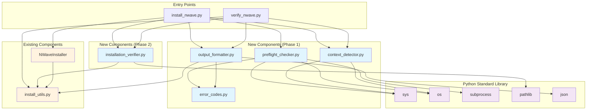
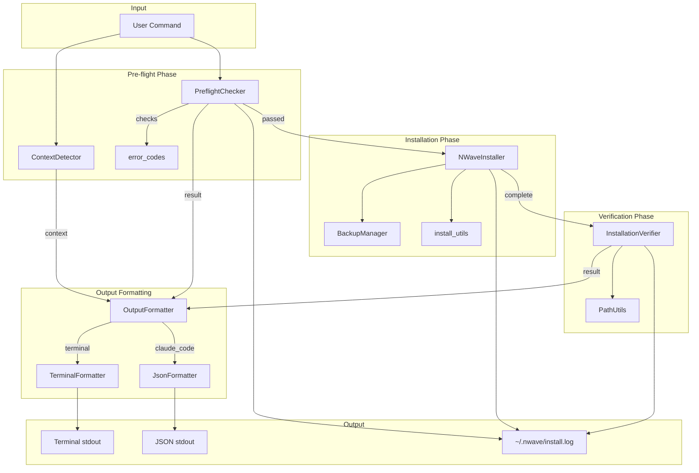
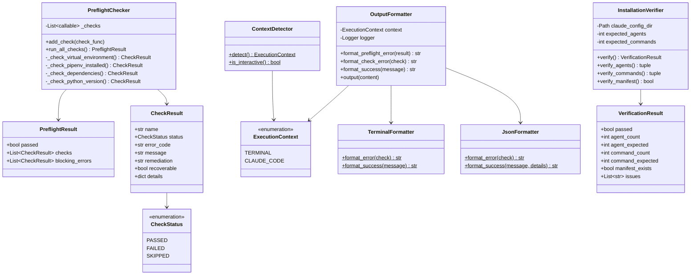
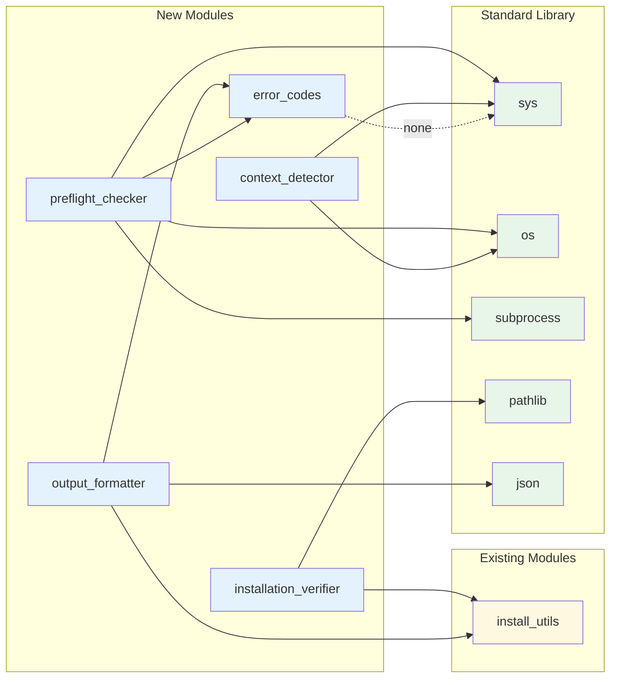
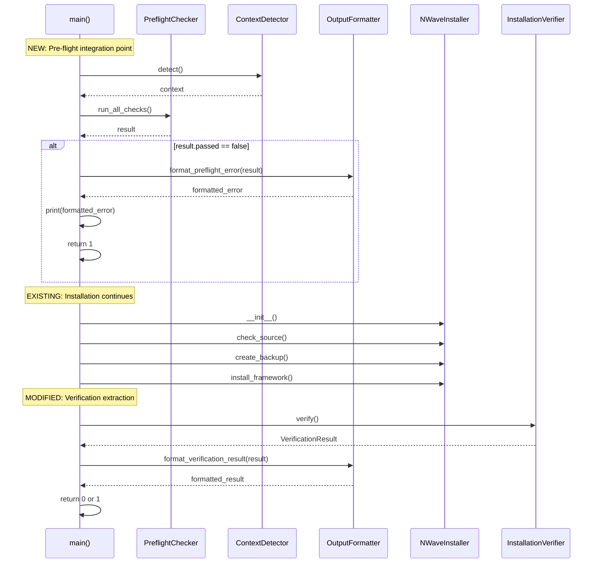

# Component Interaction Diagrams

## System Component Overview

```mermaid
graph TB
    subgraph "Entry Points"
        A[install_nwave.py]
        B[verify_nwave.py]
    end

    subgraph "New Components (Phase 1)"
        C[error_codes.py]
        D[context_detector.py]
        E[preflight_checker.py]
        F[output_formatter.py]
    end

    subgraph "New Components (Phase 2)"
        G[installation_verifier.py]
    end

    subgraph "Existing Components"
        H[install_utils.py]
        I[NWaveInstaller]
    end

    subgraph "Python Standard Library"
        J[sys]
        K[os]
        L[subprocess]
        M[pathlib]
        N[json]
    end

    %% Entry point dependencies
    A --> D
    A --> E
    A --> F
    A --> I
    A --> G

    B --> D
    B --> F
    B --> G
    B --> H

    %% New component dependencies
    E --> C
    E --> J
    E --> K
    E --> L

    D --> J
    D --> K

    F --> C
    F --> H
    F --> N

    G --> H
    G --> M

    %% Existing component usage
    I --> H

    classDef new fill:#e1f5fe
    classDef existing fill:#fff3e0
    classDef stdlib fill:#f3e5f5

    class C,D,E,F,G new
    class H,I existing
    class J,K,L,M,N stdlib
```

## Data Flow Diagram

```mermaid
flowchart TB
    subgraph "Input"
        U[User Command]
    end

    subgraph "Pre-flight Phase"
        CD[ContextDetector]
        PF[PreflightChecker]
        EC[error_codes]
    end

    subgraph "Output Formatting"
        OF[OutputFormatter]
        TF[TerminalFormatter]
        JF[JsonFormatter]
    end

    subgraph "Installation Phase"
        NWI[NWaveInstaller]
        BM[BackupManager]
        IU[install_utils]
    end

    subgraph "Verification Phase"
        IV[InstallationVerifier]
        PU[PathUtils]
    end

    subgraph "Output"
        TERM[Terminal stdout]
        JSON[JSON stdout]
        LOG[~/.nwave/install.log]
    end

    U --> CD
    CD --> |context| OF

    U --> PF
    PF --> |checks| EC
    PF --> |result| OF

    OF --> |terminal| TF
    OF --> |claude_code| JF
    TF --> TERM
    JF --> JSON

    PF --> |passed| NWI
    NWI --> BM
    NWI --> IU
    NWI --> |complete| IV

    IV --> PU
    IV --> |result| OF

    PF --> LOG
    NWI --> LOG
    IV --> LOG
```

## Class Relationships

```mermaid
classDiagram
    class PreflightChecker {
        -List~callable~ _checks
        +add_check(check_func)
        +run_all_checks() PreflightResult
        -_check_virtual_environment() CheckResult
        -_check_pipenv_installed() CheckResult
        -_check_dependencies() CheckResult
        -_check_python_version() CheckResult
    }

    class PreflightResult {
        +bool passed
        +List~CheckResult~ checks
        +List~CheckResult~ blocking_errors
    }

    class CheckResult {
        +str name
        +CheckStatus status
        +str error_code
        +str message
        +str remediation
        +bool recoverable
        +dict details
    }

    class CheckStatus {
        <<enumeration>>
        PASSED
        FAILED
        SKIPPED
    }

    class ContextDetector {
        +detect()$ ExecutionContext
        +is_interactive()$ bool
    }

    class ExecutionContext {
        <<enumeration>>
        TERMINAL
        CLAUDE_CODE
    }

    class OutputFormatter {
        -ExecutionContext context
        -Logger logger
        +format_preflight_error(result) str
        +format_check_error(check) str
        +format_success(message) str
        +output(content)
    }

    class TerminalFormatter {
        +format_error(check)$ str
        +format_success(message)$ str
    }

    class JsonFormatter {
        +format_error(check)$ str
        +format_success(message, details)$ str
    }

    class InstallationVerifier {
        -Path claude_config_dir
        -int expected_agents
        -int expected_commands
        +verify() VerificationResult
        +verify_agents() tuple
        +verify_commands() tuple
        +verify_manifest() bool
    }

    class VerificationResult {
        +bool passed
        +int agent_count
        +int agent_expected
        +int command_count
        +int command_expected
        +bool manifest_exists
        +List~str~ issues
    }

    PreflightChecker --> PreflightResult
    PreflightChecker --> CheckResult
    CheckResult --> CheckStatus
    ContextDetector --> ExecutionContext
    OutputFormatter --> TerminalFormatter
    OutputFormatter --> JsonFormatter
    OutputFormatter --> ExecutionContext
    InstallationVerifier --> VerificationResult
```

## Module Import Dependencies

```mermaid
graph LR
    subgraph "Standard Library"
        sys
        os
        subprocess
        pathlib
        json
    end

    subgraph "New Modules"
        EC[error_codes]
        CD[context_detector]
        PF[preflight_checker]
        OF[output_formatter]
        IV[installation_verifier]
    end

    subgraph "Existing Modules"
        IU[install_utils]
    end

    %% error_codes: no imports
    EC -.-> |none| sys

    %% context_detector
    CD --> sys
    CD --> os

    %% preflight_checker
    PF --> sys
    PF --> os
    PF --> subprocess
    PF --> EC

    %% output_formatter
    OF --> json
    OF --> IU
    OF --> EC

    %% installation_verifier
    IV --> pathlib
    IV --> IU

    classDef stdlib fill:#e8f5e9
    classDef new fill:#e3f2fd
    classDef existing fill:#fff8e1

    class sys,os,subprocess,pathlib,json stdlib
    class EC,CD,PF,OF,IV new
    class IU existing
```

## Integration Point Detail

```mermaid
sequenceDiagram
    participant M as main()
    participant PF as PreflightChecker
    participant CD as ContextDetector
    participant OF as OutputFormatter
    participant NWI as NWaveInstaller
    participant IV as InstallationVerifier

    Note over M: NEW: Pre-flight integration point

    M->>CD: detect()
    CD-->>M: context

    M->>PF: run_all_checks()
    PF-->>M: result

    alt result.passed == false
        M->>OF: format_preflight_error(result)
        OF-->>M: formatted_error
        M->>M: print(formatted_error)
        M->>M: return 1
    end

    Note over M: EXISTING: Installation continues

    M->>NWI: __init__()
    M->>NWI: check_source()
    M->>NWI: create_backup()
    M->>NWI: install_framework()

    Note over M: MODIFIED: Verification extraction

    M->>IV: verify()
    IV-->>M: VerificationResult
    M->>OF: format_verification_result(result)
    OF-->>M: formatted_result
    M->>M: return 0 or 1
```
