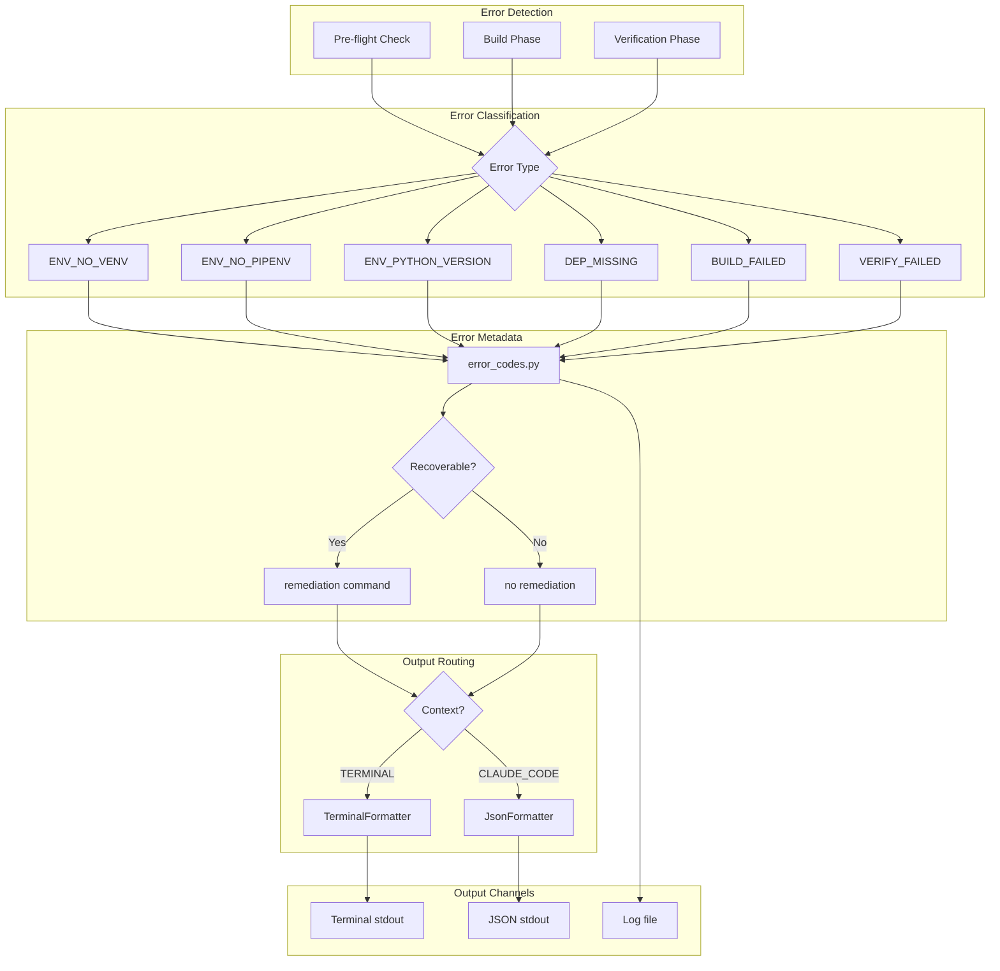
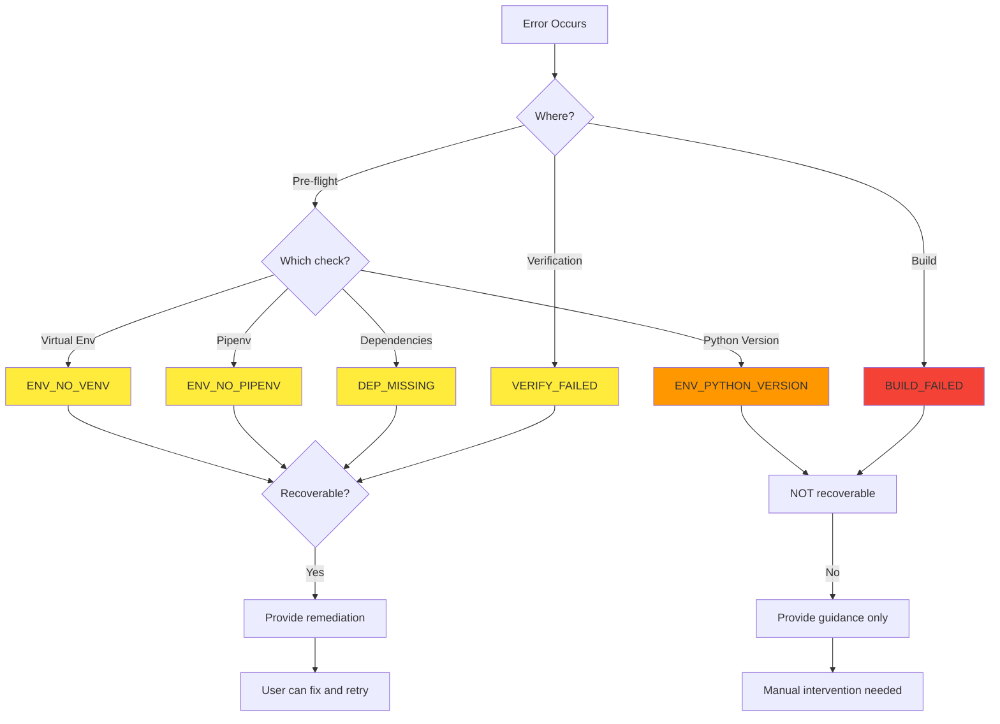
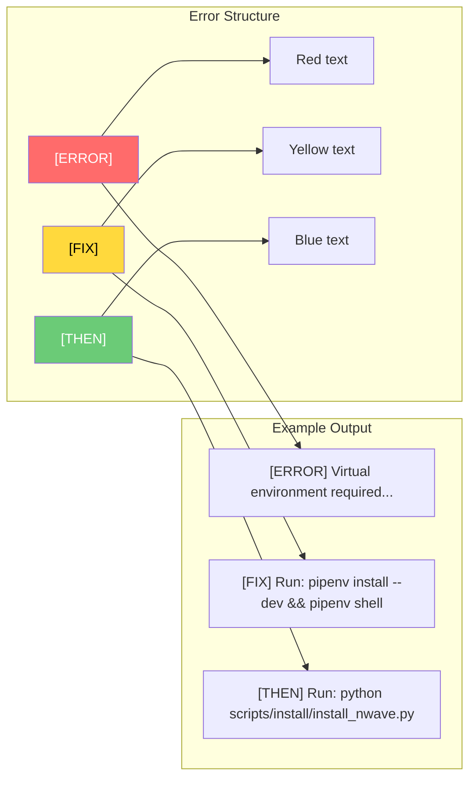
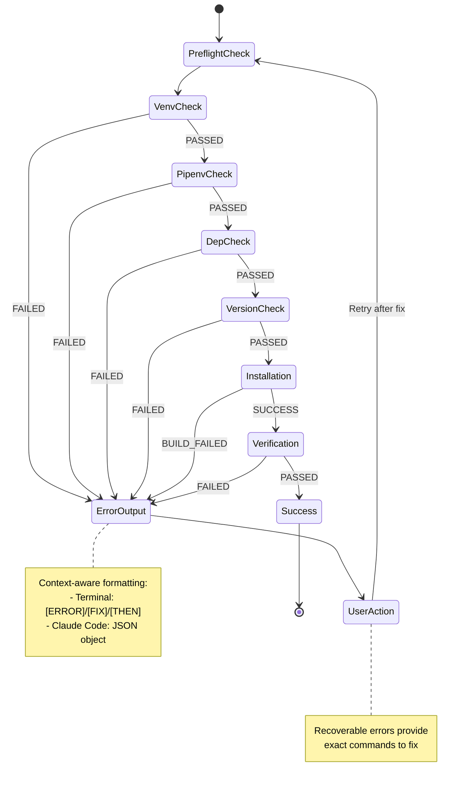
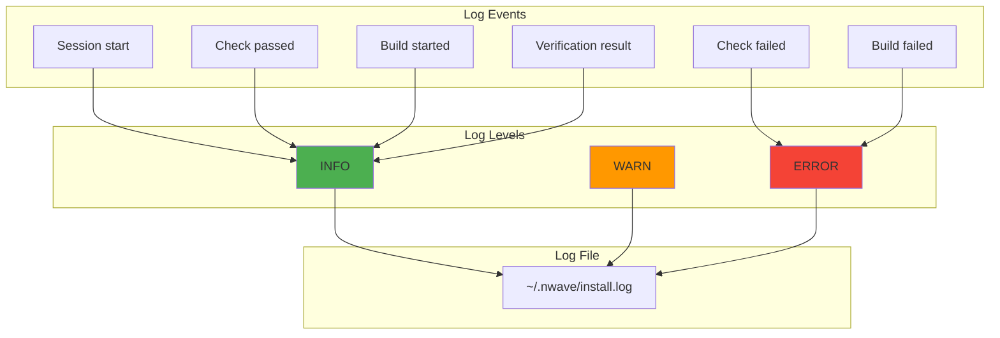
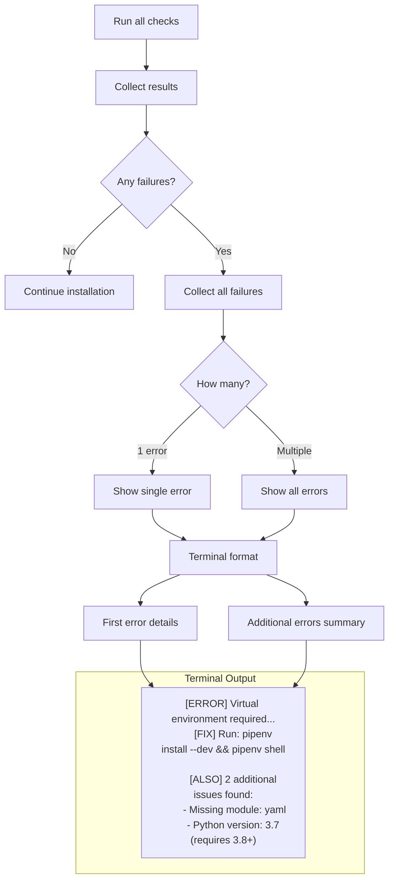
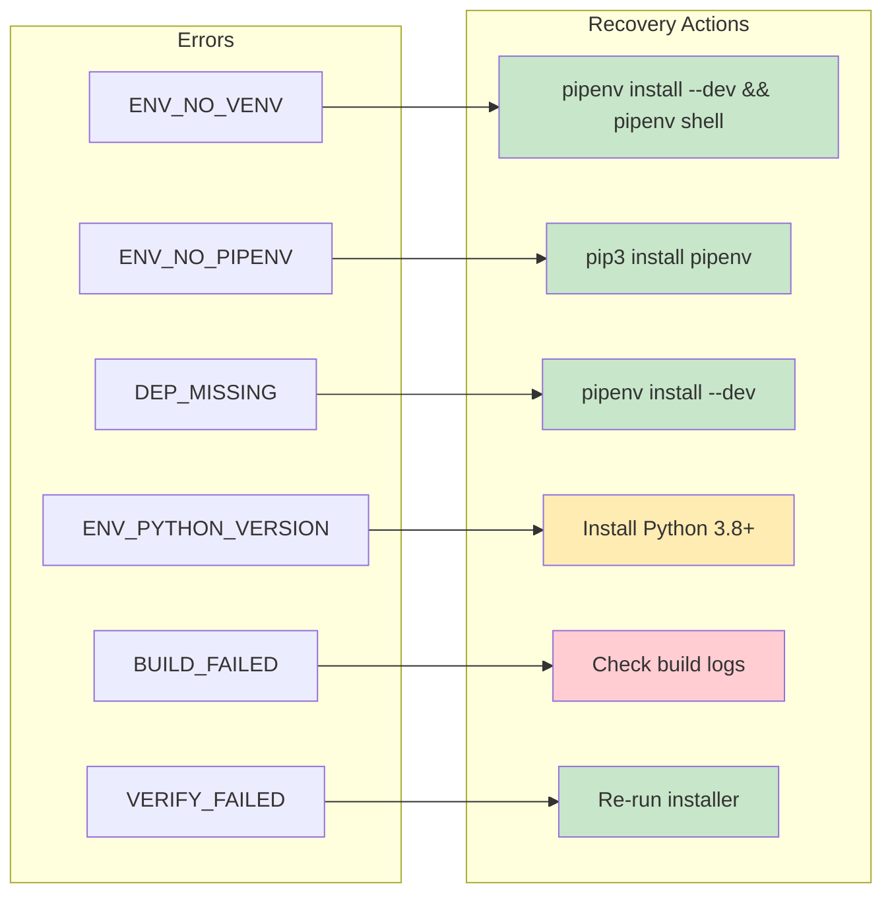

# Error Handling Flow Diagrams

## Complete Error Handling Architecture



## Error Code Decision Tree



## Terminal Error Format Structure



## JSON Error Format Structure

```mermaid
flowchart TB
    subgraph "JSON Schema"
        A[status: error]
        B[error_code: string]
        C[message: string]
        D[remediation: string|null]
        E[recoverable: boolean]
        F[details: object]
    end

    subgraph "Details Object"
        G[python_version]
        H[sys_prefix]
        I[missing_modules]
        J[exit_code]
        K[stderr]
    end

    F --> G
    F --> H
    F --> I
    F --> J
    F --> K
```

## Error Recovery Flow



## Logging Strategy



## Multi-Error Handling



## Recovery Actions by Error Type


