# Integration Plan: Installation Environment Detection

**Feature ID:** APEX-002
**Wave:** DESIGN
**Created:** 2026-01-29

---

## 1. Implementation Phases

### Phase 1: Foundation (New Modules)

Create new modules with no dependencies on existing code modifications.

| Module | Priority | Dependencies | Estimated Size |
|--------|----------|--------------|----------------|
| `error_codes.py` | 1 | None | ~50 lines |
| `context_detector.py` | 2 | sys, os | ~30 lines |
| `preflight_checker.py` | 3 | error_codes | ~150 lines |
| `output_formatter.py` | 4 | error_codes, install_utils | ~200 lines |

### Phase 2: Verification Extraction

Extract verification logic for reuse.

| Module | Priority | Dependencies | Estimated Size |
|--------|----------|--------------|----------------|
| `installation_verifier.py` | 5 | install_utils | ~100 lines |
| `verify_nwave.py` | 6 | installation_verifier, context_detector, output_formatter | ~50 lines |

### Phase 3: Integration

Integrate new modules into existing installer.

| Change | Priority | Risk Level |
|--------|----------|------------|
| Modify `install_nwave.py` main() | 7 | Medium |
| Modify `validate_installation()` | 8 | Low |

### Phase 4: Documentation

Update user-facing documentation.

| Document | Priority | Scope |
|----------|----------|-------|
| `installation-guide.md` | 9 | Prerequisites, quick start |
| README quickstart section | 10 | Brief update |

---

## 2. File Creation Plan

### 2.1 New Files

```
scripts/install/
├── error_codes.py              # Phase 1: Error code constants
├── context_detector.py         # Phase 1: Execution context detection
├── preflight_checker.py        # Phase 1: Environment validation
├── output_formatter.py         # Phase 1: Context-aware formatting
├── installation_verifier.py    # Phase 2: Verification logic
└── verify_nwave.py             # Phase 2: Standalone verification
```

### 2.2 File Creation Order

```mermaid
gantt
    title Implementation Order
    dateFormat  X
    axisFormat %s

    section Phase 1
    error_codes.py           :a1, 0, 1
    context_detector.py      :a2, after a1, 1
    preflight_checker.py     :a3, after a2, 2
    output_formatter.py      :a4, after a3, 2

    section Phase 2
    installation_verifier.py :b1, after a4, 2
    verify_nwave.py          :b2, after b1, 1

    section Phase 3
    install_nwave.py mod     :c1, after b2, 2

    section Phase 4
    installation-guide.md    :d1, after c1, 1
```



---

## 3. Modifications to install_nwave.py

### 3.1 Changes Overview

| Line Range | Current | Change Type | New Behavior |
|------------|---------|-------------|--------------|
| 11-23 | Imports | Add imports | Import new modules |
| 585-610 | main() start | Insert | Add preflight check |
| 462-521 | validate_installation() | Refactor | Delegate to InstallationVerifier |

### 3.2 Detailed Changes

#### 3.2.1 New Imports (after line 23)

```python
# Add after existing imports
from preflight_checker import PreflightChecker, PreflightResult
from context_detector import ContextDetector, ExecutionContext
from output_formatter import OutputFormatter
from installation_verifier import InstallationVerifier
```

Note: These imports occur INSIDE main() to avoid import errors when modules don't exist yet during development.

#### 3.2.2 Main Function Modification (insert after line 604)

**Current code (lines 600-610):**
```python
def main():
    """Main entry point."""
    parser = argparse.ArgumentParser(...)
    # ... argument parsing ...
    args = parser.parse_args()

    if args.help:
        show_help()
        return 0

    installer = NWaveInstaller(dry_run=args.dry_run, force_rebuild=args.force_rebuild)
```

**Modified code:**
```python
def main():
    """Main entry point."""
    parser = argparse.ArgumentParser(...)
    # ... argument parsing unchanged ...
    args = parser.parse_args()

    if args.help:
        show_help()
        return 0

    # === NEW: Pre-flight environment validation ===
    from preflight_checker import PreflightChecker
    from context_detector import ContextDetector
    from output_formatter import OutputFormatter
    from install_utils import Logger
    from pathlib import Path

    # Detect execution context
    context = ContextDetector.detect()

    # Setup logging early
    log_dir = Path.home() / '.nwave'
    log_dir.mkdir(parents=True, exist_ok=True)
    preflight_logger = Logger(log_dir / 'install.log')

    # Log session start
    preflight_logger.info("=" * 70)
    preflight_logger.info("nWave Installation Session Started")
    preflight_logger.info(f"Python: {sys.version_info.major}.{sys.version_info.minor}.{sys.version_info.micro}")
    preflight_logger.info(f"Context: {context.value}")
    preflight_logger.info("=" * 70)

    # Run pre-flight checks
    preflight_logger.info("Starting pre-flight environment checks...")
    preflight = PreflightChecker()
    result = preflight.run_all_checks()

    # Log check results
    for check in result.checks:
        status = "PASSED" if check.status.value == "passed" else "FAILED"
        preflight_logger.info(f"  Check: {check.name}... {status}")

    # Handle failures
    if not result.passed:
        preflight_logger.error("Pre-flight checks: FAILED")
        formatter = OutputFormatter(context, preflight_logger)
        formatter.output(formatter.format_preflight_error(result))
        return 1

    preflight_logger.info("Pre-flight checks: ALL PASSED")
    preflight_logger.info("Proceeding with installation...")
    # === END NEW CODE ===

    # EXISTING: Continue with normal installation (unchanged)
    installer = NWaveInstaller(dry_run=args.dry_run, force_rebuild=args.force_rebuild)
    # ... rest of existing code unchanged ...
```

#### 3.2.3 validate_installation() Refactor

**Current code (lines 462-521):** Inline validation logic

**Refactored code:**
```python
def validate_installation(self) -> bool:
    """Validate installation using shared verifier."""
    from installation_verifier import InstallationVerifier

    self.logger.info("Validating installation...")

    verifier = InstallationVerifier(self.claude_config_dir)
    result = verifier.verify()

    # Log summary
    self.logger.info("Installation summary:")
    self.logger.info(f"  - Agents installed: {result.agent_count}")
    self.logger.info(f"  - Commands installed: {result.command_count}")
    self.logger.info(f"  - Installation directory: {self.claude_config_dir}")

    if self.claude_config_dir.exists():
        agents_dir = self.claude_config_dir / "agents" / "nw"
        commands_dir = self.claude_config_dir / "commands" / "nw"
        if agents_dir.exists():
            self.logger.info("  - nWave agents: Available")
        if commands_dir.exists():
            self.logger.info("  - nWave commands: Available")

    # Validation outcome
    if result.passed:
        self.logger.info(f"Installation validation: {Colors.GREEN}PASSED{Colors.NC}")
        return True
    else:
        for issue in result.issues:
            self.logger.error(f"  {issue}")
        self.logger.error(f"Installation validation: {Colors.RED}FAILED{Colors.NC}")
        return False
```

---

## 4. Changes to install_utils.py

### 4.1 Changes Required

**None.** The existing `install_utils.py` requires no modifications.

All existing classes will be used as-is:
- `Colors` - Used by OutputFormatter for terminal output
- `Logger` - Used for all logging
- `PathUtils` - Used by InstallationVerifier

---

## 5. New Script: verify_nwave.py

### 5.1 Full Implementation

```python
#!/usr/bin/env python3
"""
nWave Installation Verification Script

Standalone script to verify nWave framework installation.
Can be run independently at any time to check installation health.

Usage:
    pipenv run python scripts/install/verify_nwave.py
    pipenv run python scripts/install/verify_nwave.py --help

Exit Codes:
    0 - Verification passed, all components present
    1 - Verification failed, issues detected
"""

import argparse
import sys
from pathlib import Path

# Add parent directory for imports
sys.path.insert(0, str(Path(__file__).parent))

from installation_verifier import InstallationVerifier
from context_detector import ContextDetector
from output_formatter import OutputFormatter
from install_utils import Logger, Colors

__version__ = "1.0.0"


def show_help():
    """Display help message."""
    help_text = f"""{Colors.BLUE}nWave Installation Verification Script{Colors.NC}

{Colors.BLUE}DESCRIPTION:{Colors.NC}
    Verifies that nWave framework is properly installed by checking:
    - Agent files in ~/.claude/agents/nw/
    - Command files in ~/.claude/commands/nw/
    - Installation manifest
    - TDD cycle schema

{Colors.BLUE}USAGE:{Colors.NC}
    pipenv run python scripts/install/verify_nwave.py [OPTIONS]

{Colors.BLUE}OPTIONS:{Colors.NC}
    --help, -h     Show this help message

{Colors.BLUE}EXIT CODES:{Colors.NC}
    0   All verification checks passed
    1   One or more checks failed

{Colors.BLUE}EXAMPLES:{Colors.NC}
    pipenv run python scripts/install/verify_nwave.py
"""
    print(help_text)


def main() -> int:
    """Main entry point."""
    parser = argparse.ArgumentParser(
        description="Verify nWave installation",
        add_help=False
    )
    parser.add_argument("--help", "-h", action="store_true", help="Show help")

    args = parser.parse_args()

    if args.help:
        show_help()
        return 0

    # Detect context for output formatting
    context = ContextDetector.detect()

    # Setup logger
    log_dir = Path.home() / '.nwave'
    log_dir.mkdir(parents=True, exist_ok=True)
    logger = Logger(log_dir / 'verify.log')

    logger.info("nWave Installation Verification")
    logger.info("=" * 35)

    # Run verification
    verifier = InstallationVerifier()
    result = verifier.verify()

    # Format and output results
    formatter = OutputFormatter(context, logger)

    if result.passed:
        formatter.output(formatter.format_verification_success(result))
        return 0
    else:
        formatter.output(formatter.format_verification_failure(result))
        return 1


if __name__ == "__main__":
    sys.exit(main())
```

---

## 6. Documentation Updates

### 6.1 installation-guide.md Changes

**File:** `docs/installation/installation-guide.md`

#### Prerequisites Section (Replace)

**Current (approximately lines 15-20):**
```markdown
**Prerequisites**: Python 3.11 or higher
```

**New:**
```markdown
## Prerequisites

Before installing nWave, ensure you have:

- **Python 3.8 or higher** - Check with `python3 --version`
- **pipenv** - Install with `pip3 install pipenv`

### Installing Prerequisites

```bash
# Check Python version (must be 3.8+)
python3 --version

# Install pipenv if not present
pip3 install pipenv
```
```

#### Quick Start Section (Replace)

**Current (approximately lines 9-16):**
```markdown
```bash
# From repository root
python3 scripts/install/install_nwave.py
```
```

**New:**
```markdown
## Quick Start

```bash
# 1. Clone the repository
git clone https://github.com/11PJ11/crafter-ai.git
cd crafter-ai

# 2. Install pipenv (if not already installed)
pip3 install pipenv

# 3. Create virtual environment and install dependencies
pipenv install --dev

# 4. Run the installer
pipenv run python scripts/install/install_nwave.py

# 5. Verify installation (optional)
pipenv run python scripts/install/verify_nwave.py
```

### What Gets Installed

- **Agent files**: `~/.claude/agents/nw/` (28 specialized agents)
- **Command files**: `~/.claude/commands/nw/` (23 workflow commands)
- **Templates**: `~/.claude/templates/` (TDD cycle schema)
- **Manifest**: `~/.claude/nwave-manifest.txt`
```

#### Troubleshooting Section (Add)

```markdown
## Troubleshooting

### Common Issues

#### "ModuleNotFoundError: No module named 'yaml'"
You're running outside the virtual environment.

**Fix:**
```bash
pipenv install --dev
pipenv run python scripts/install/install_nwave.py
```

#### "Virtual environment required"
The installer detected you're using global Python.

**Fix:**
```bash
pipenv install --dev && pipenv shell
python scripts/install/install_nwave.py
```

#### "pipenv is required but not installed"
Install pipenv first.

**Fix:**
```bash
pip3 install pipenv
```

### Verification

After installation, verify everything is working:

```bash
pipenv run python scripts/install/verify_nwave.py
```

### Installation Logs

If issues persist, check the installation log:

```bash
cat ~/.nwave/install.log
```
```

---

## 7. Risk Mitigation

### 7.1 Rollback Plan

If integration causes issues:

1. **Revert install_nwave.py** to previous version
2. New modules (`preflight_checker.py`, etc.) can remain (unused)
3. No other files modified

### 7.2 Feature Flag (Optional)

For phased rollout, add environment variable bypass:

```python
# In main()
if os.environ.get('NWAVE_SKIP_PREFLIGHT'):
    # Skip preflight, use existing behavior
    pass
else:
    # New preflight behavior
    ...
```

Remove after validation period.

### 7.3 Testing Strategy

| Test Type | Coverage | When |
|-----------|----------|------|
| Unit tests | Each new module | Before integration |
| Integration test | Full install flow | After integration |
| Regression test | Existing install behavior | After integration |
| E2E test | Virgin machine install | Before release |

---

## 8. Implementation Checklist

### Phase 1: Foundation
- [ ] Create `error_codes.py`
- [ ] Unit test error_codes
- [ ] Create `context_detector.py`
- [ ] Unit test context_detector
- [ ] Create `preflight_checker.py`
- [ ] Unit test preflight_checker
- [ ] Create `output_formatter.py`
- [ ] Unit test output_formatter

### Phase 2: Verification
- [ ] Create `installation_verifier.py`
- [ ] Unit test installation_verifier
- [ ] Create `verify_nwave.py`
- [ ] Integration test verify_nwave.py

### Phase 3: Integration
- [ ] Modify `install_nwave.py` main()
- [ ] Refactor `validate_installation()`
- [ ] Integration test full installation
- [ ] Regression test existing flags (--dry-run, --backup-only, etc.)

### Phase 4: Documentation
- [ ] Update `installation-guide.md` prerequisites
- [ ] Update `installation-guide.md` quick start
- [ ] Add troubleshooting section
- [ ] Update README if needed

### Final Validation
- [ ] Test on macOS (primary)
- [ ] Test on Linux
- [ ] Test on Windows
- [ ] Test Claude Code context (non-TTY)
- [ ] Test virgin machine scenario

---

## 9. Dependency Summary

### New Files Created

| File | Depends On |
|------|------------|
| `error_codes.py` | (none) |
| `context_detector.py` | sys, os |
| `preflight_checker.py` | sys, os, subprocess, error_codes |
| `output_formatter.py` | json, install_utils, error_codes |
| `installation_verifier.py` | pathlib, install_utils |
| `verify_nwave.py` | installation_verifier, context_detector, output_formatter, install_utils |

### Existing Files Modified

| File | Change Type | Risk |
|------|-------------|------|
| `install_nwave.py` | Add preflight call, refactor validate | Medium |
| `install_utils.py` | None | None |
| `uninstall_nwave.py` | None | None |
| `update_nwave.py` | None | None |

### Documentation Modified

| File | Change Type |
|------|-------------|
| `docs/installation/installation-guide.md` | Prerequisites, Quick Start, Troubleshooting |
