# Component Interaction Diagrams: modern_CLI_installer

**Epic**: modern_CLI_installer
**Wave**: DESIGN
**Architect**: Morgan (Solution Architect)
**Date**: 2026-02-01

---

## 1. System Context Diagram

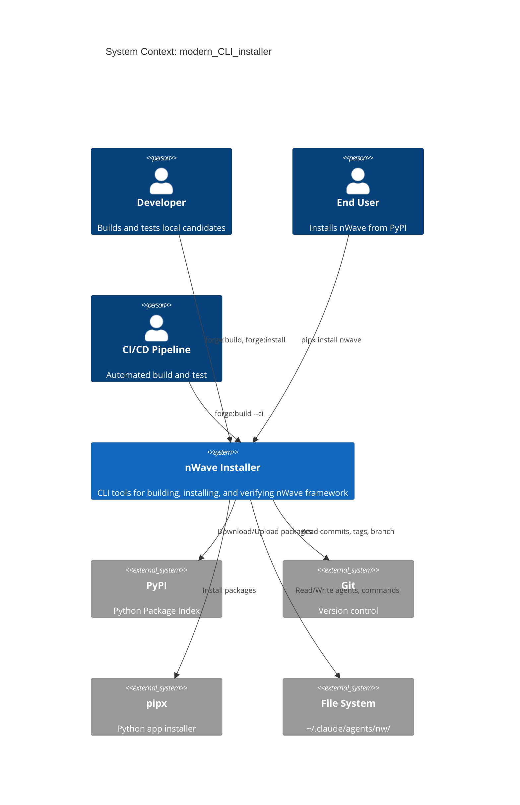

---

## 2. Container Diagram

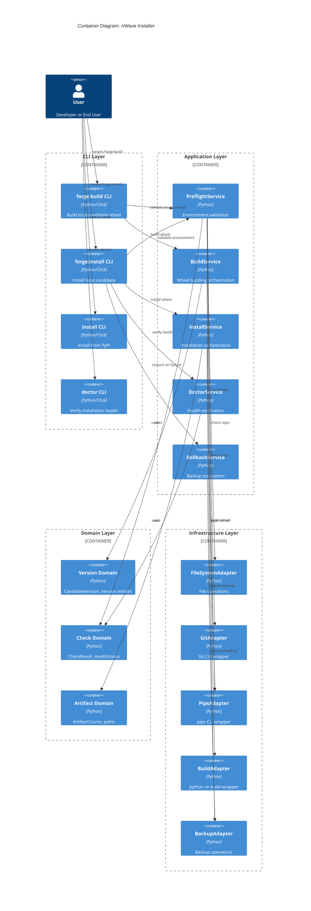

---

## 3. Component Diagram: Application Services

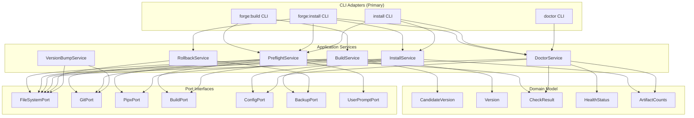

---

## 4. Component Diagram: Pre-flight Check Framework

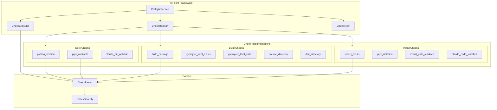

---

## 5. Component Diagram: Doctor Health Framework

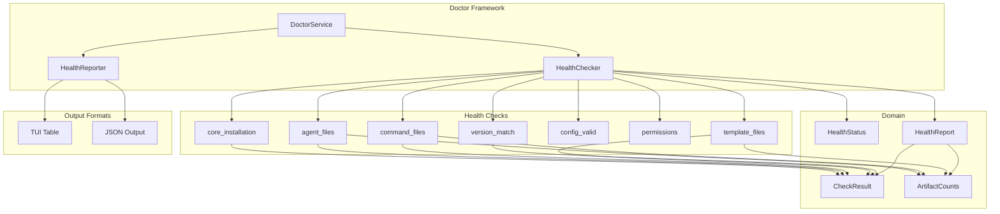

---

## 6. Data Flow Diagram: Build Journey

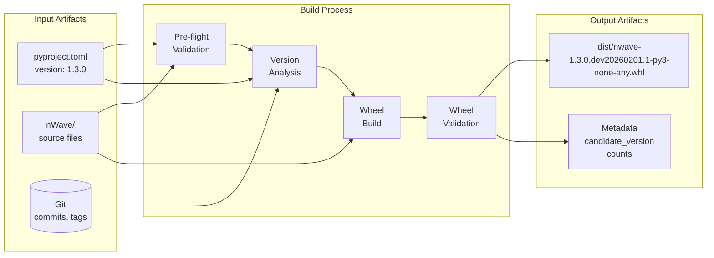

---

## 7. Data Flow Diagram: Install Journey

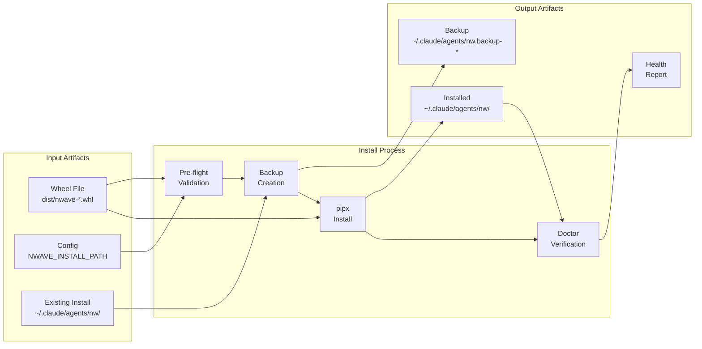

---

## 8. Hexagonal Architecture Visualization

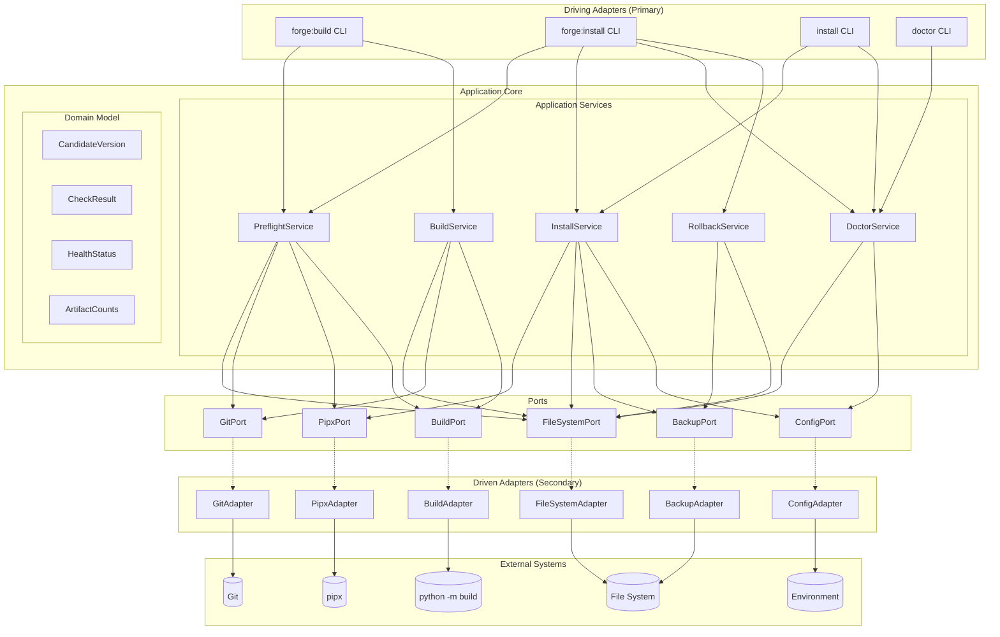

---

## 9. Dependency Injection Container

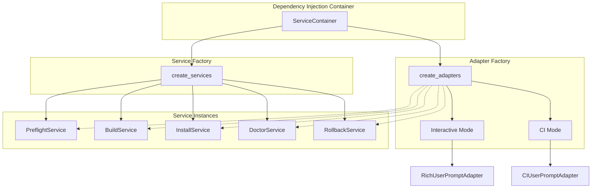

---

## 10. Journey Flow Overview

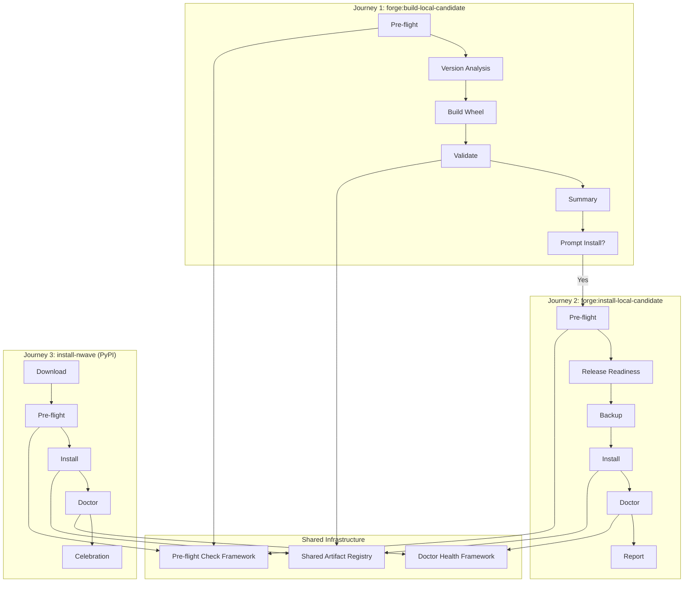

---

## 11. Error Recovery Flow

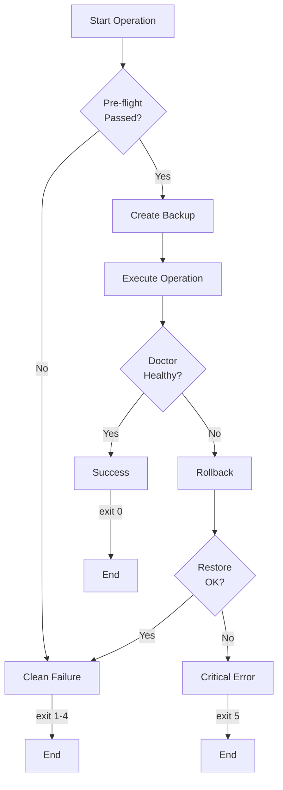

---

## References

- [Architecture Design](../architecture-design.md)
- [Component Boundaries](../component-boundaries.md)
- [Sequence Diagrams](./sequence-diagrams.md)
