# Sequence Diagrams: modern_CLI_installer

**Epic**: modern_CLI_installer
**Wave**: DESIGN
**Architect**: Morgan (Solution Architect)
**Date**: 2026-02-01

---

## 1. Journey 1: forge:build-local-candidate

### 1.1 Happy Path Sequence

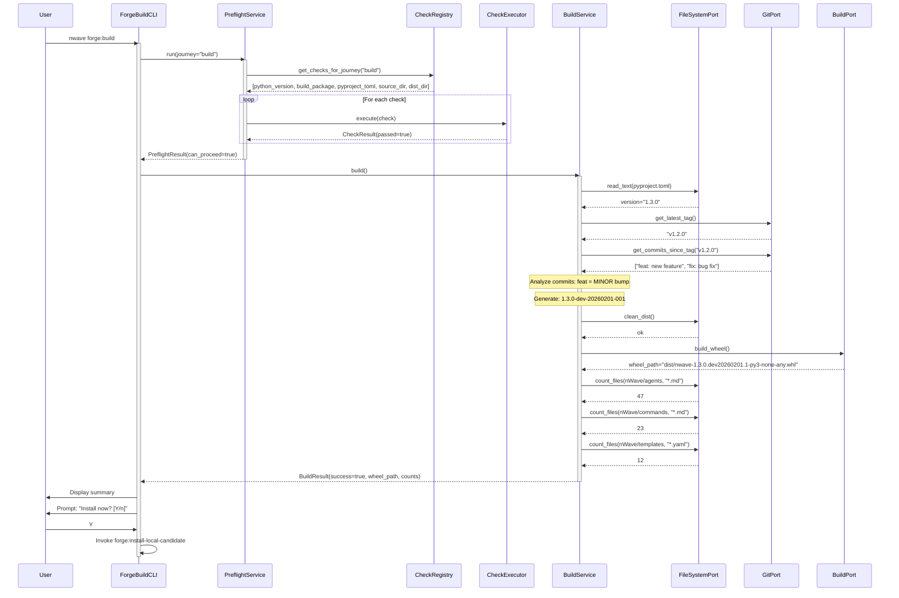

### 1.2 Pre-flight Failure with Fix

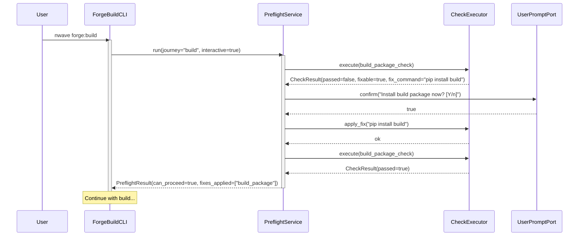

---

## 2. Journey 2: forge:install-local-candidate

### 2.1 Happy Path Sequence

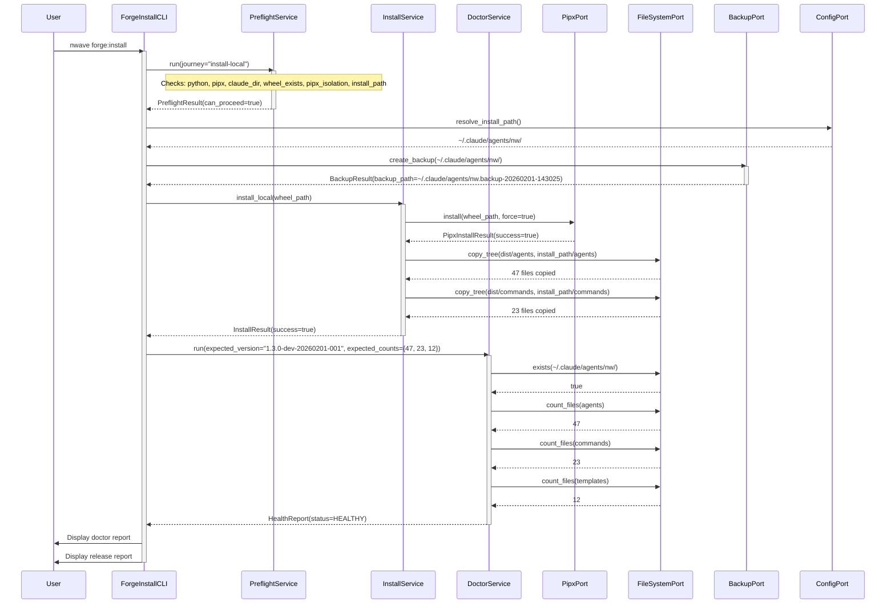

### 2.2 Install Failure with Rollback

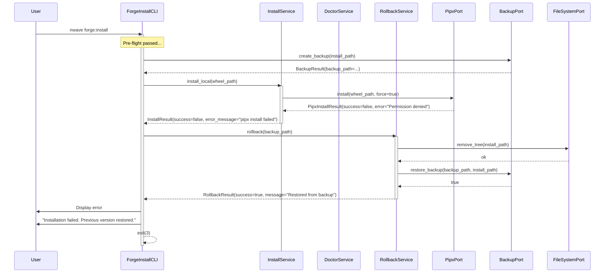

### 2.3 Doctor Failure with Rollback

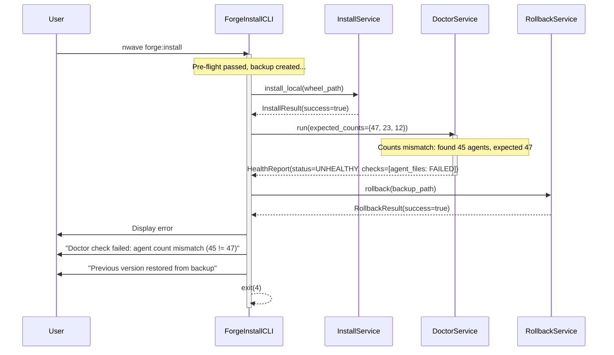

---

## 3. Journey 3: install-nwave (PyPI)

### 3.1 Fresh Install Sequence

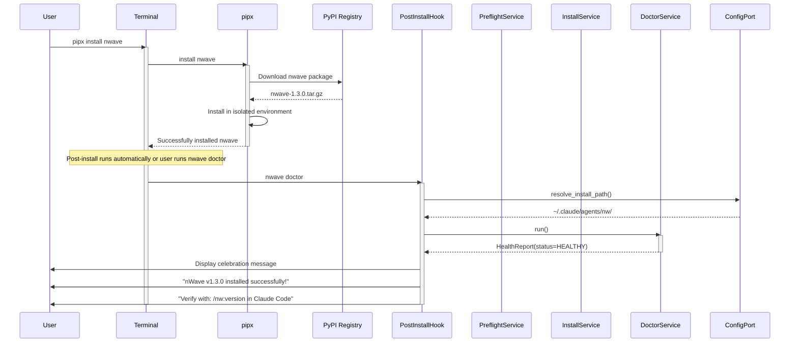

### 3.2 Upgrade Detection Sequence

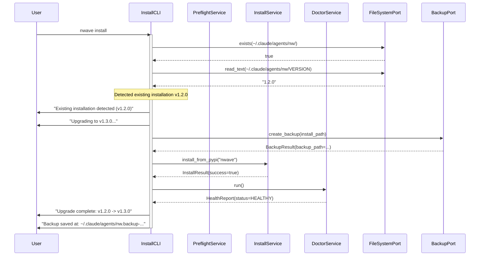

---

## 4. Shared Infrastructure Sequences

### 4.1 Pre-flight Check Execution

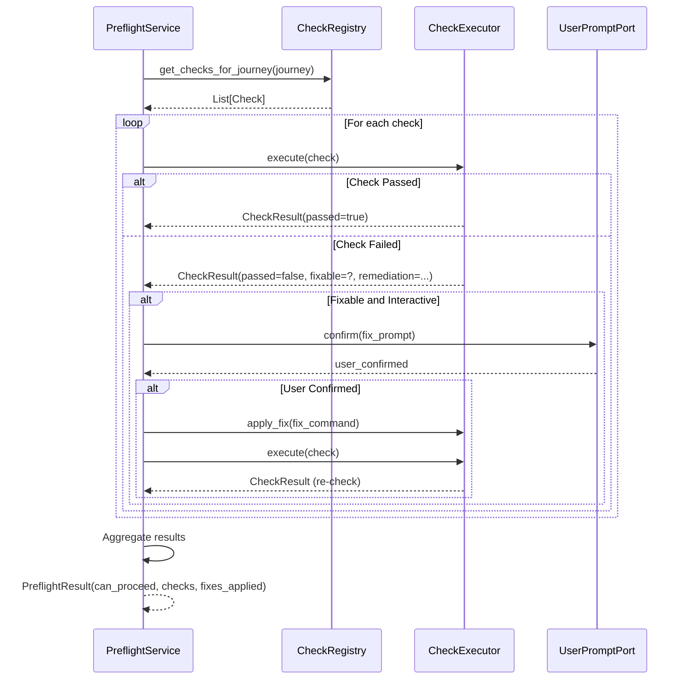

### 4.2 Doctor Health Check

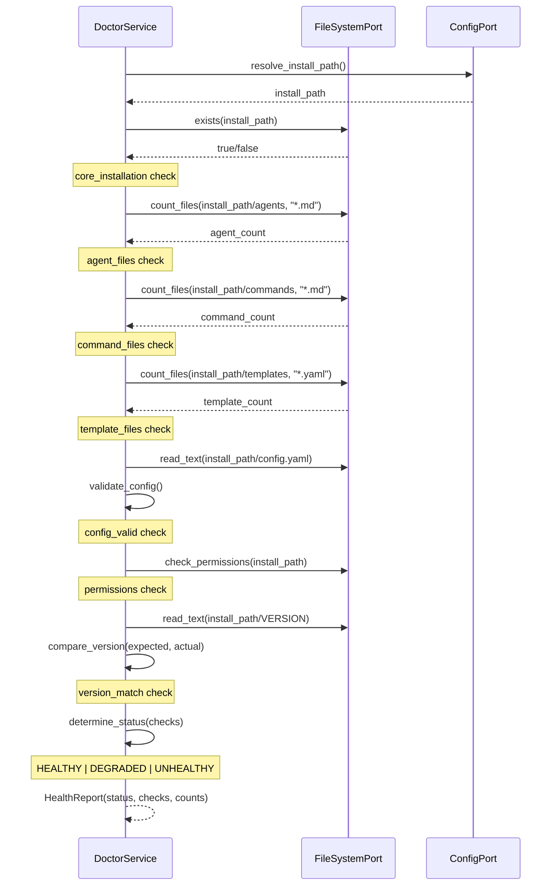

### 4.3 Backup and Rollback

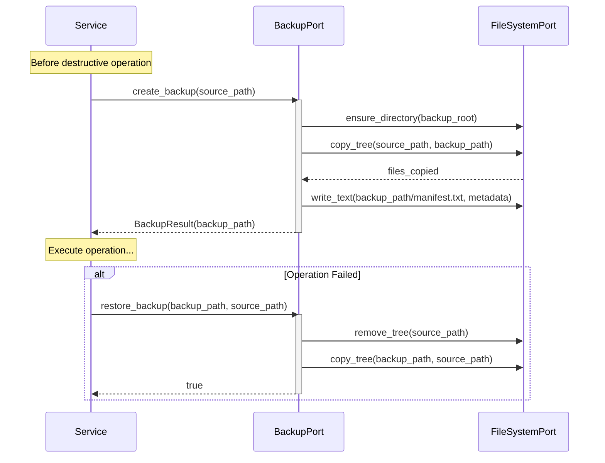

---

## 5. CI/CD Mode Sequences

### 5.1 CI Mode Build

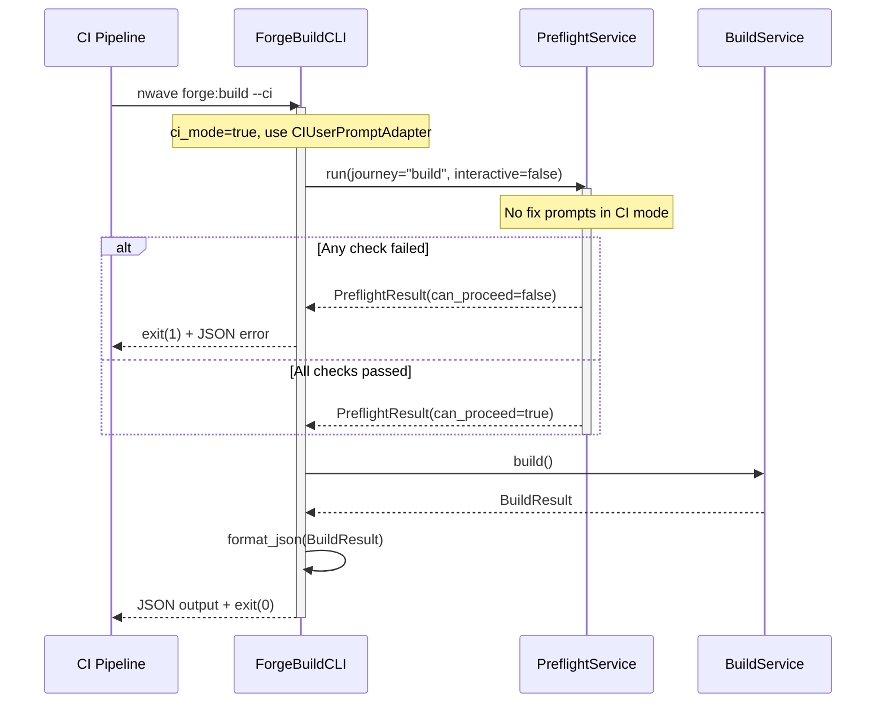

### 5.2 CI JSON Output

```json
{
  "success": true,
  "journey": "forge:build-local-candidate",
  "version": "1.3.0-dev-20260201-001",
  "wheel_path": "dist/nwave-1.3.0.dev20260201.1-py3-none-any.whl",
  "artifacts": {
    "agent_count": 47,
    "command_count": 23,
    "template_count": 12
  },
  "preflight": {
    "passed": true,
    "checks": [
      {"id": "python_version", "passed": true, "message": "Python 3.12.0"},
      {"id": "build_package", "passed": true, "message": "build 1.0.3"}
    ]
  },
  "duration_ms": 4523
}
```

---

## 6. Error Handling Sequences

### 6.1 Blocking Pre-flight Failure

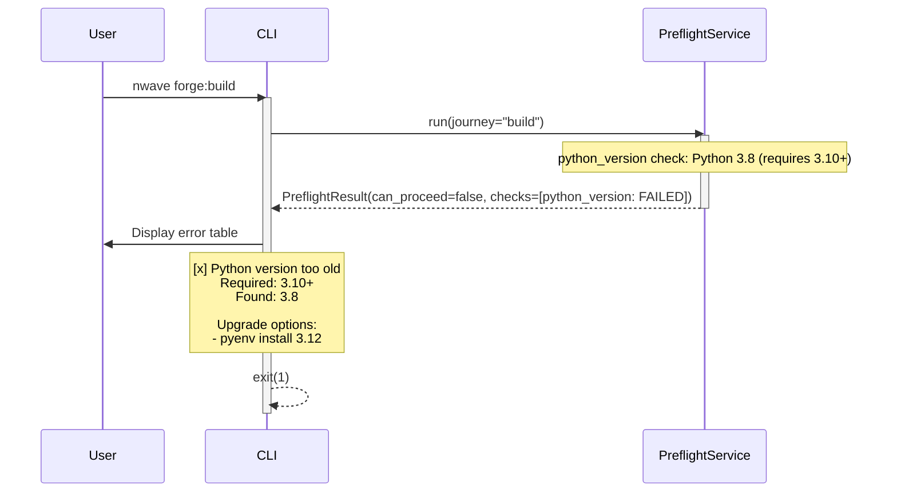

### 6.2 Build Failure

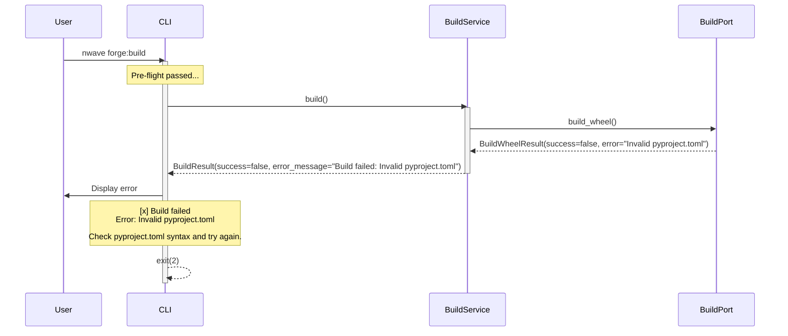

---

## 7. References

- [Architecture Design](../architecture-design.md)
- [Component Boundaries](../component-boundaries.md)
- [UX Journeys](/docs/ux/modern-cli-installer/)
