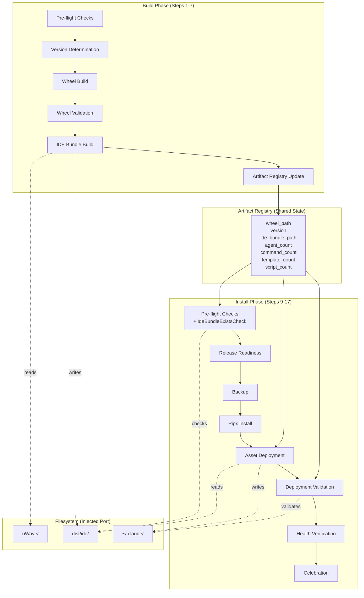

# Unified Install Integration Architecture

## Executive Summary

This document defines how four new services integrate into the existing BuildService and InstallService to create a unified 17-step forge TUI pipeline. The architecture follows hexagonal principles with ports and adapters, ensuring testability via filesystem dependency injection. The design prioritizes **integration over reimplementation**, extending existing services rather than replacing them.

**Key Integration Approach**: Constructor injection of optional services, preserving backward compatibility while enabling the new IDE bundle workflow.

---

## Existing System Analysis

### What Exists

| Component | Location | Purpose | Reusable? |
|-----------|----------|---------|-----------|
| **BuildService** | `src/crafter_ai/installer/services/build_service.py` | Orchestrates wheel build (preflight, version, build, validate) | YES - Extend |
| **InstallService** | `src/crafter_ai/installer/services/install_service.py` | Orchestrates install (preflight, readiness, backup, pipx, verify) | YES - Extend |
| **CheckExecutor** | `src/crafter_ai/installer/domain/check_executor.py` | Runs checks from CheckRegistry | YES - Reuse |
| **CheckRegistry** | `src/crafter_ai/installer/domain/check_registry.py` | Registers check functions | YES - Extend |
| **ArtifactRegistry** | `src/crafter_ai/installer/domain/artifact_registry.py` | Shares artifacts between stages | YES - Extend |
| **InMemoryFileSystemAdapter** | `tests/installer/conftest.py` | In-memory filesystem for testing | YES - Reuse |
| **IDEBundleBuilder** | `tools/core/build_ide_bundle.py` | CLI script for IDE bundle build | PARTIAL - Extract logic |
| **install_utils.py** | `scripts/install/install_utils.py` | PathUtils, BackupManager, Logger | YES - Reuse patterns |

### What Can Be Reused

1. **BuildService.execute()** - Extend with optional IDE bundle build step
2. **InstallService.install()** - Extend with asset deployment and validation steps
3. **CheckRegistry pattern** - Add `ide-bundle-exists` check to install checks
4. **ArtifactRegistry** - Add new keys for IDE bundle counts
5. **InMemoryFileSystemAdapter** - All new services use this for testability
6. **PathUtils.get_claude_config_dir()** - Reuse for deploy target path

### Integration Points Identified

| Integration Point | Existing Service | New Service | Position |
|-------------------|------------------|-------------|----------|
| **Build Step 6** | BuildService.execute() | IdeBundleBuildService | AFTER wheel validation |
| **Install Step 10** | InstallService.install() | IdeBundleExistsCheck | IN preflight CheckExecutor |
| **Install Step 13** | InstallService.install() | AssetDeploymentService | AFTER pipx install |
| **Install Step 14** | InstallService.install() | DeploymentValidationService | AFTER asset deployment |

### Reuse Checklist (Completed)

- [x] Does installation functionality already exist? **YES** - InstallService handles pipx install
- [x] Are there existing services that handle asset deployment? **NO** - New service needed
- [x] Can BuildService be extended instead of creating new service? **YES** - Add optional IdeBundleBuildService
- [x] Can InstallService be extended instead of creating new service? **YES** - Add optional deployment services
- [x] What's the cost of integration vs reimplementation? **Integration is lower cost** - 4 new focused services vs rewriting orchestrators

---

## Integration Architecture

### BuildService Integration

**Goal**: Add IDE bundle build AFTER wheel validation (Step 6 in journey)

**Integration Pattern**: Optional constructor injection with backward compatibility

```python
# Extended BuildService constructor (proposed)
class BuildService:
    def __init__(
        self,
        check_executor: CheckExecutor,
        build_port: BuildPort,
        version_bump_service: VersionBumpService,
        wheel_validation_service: WheelValidationService,
        artifact_registry: ArtifactRegistry,
        # NEW: Optional IDE bundle service
        ide_bundle_build_service: IdeBundleBuildService | None = None,
    ) -> None:
        self._ide_bundle_build_service = ide_bundle_build_service
        # ... existing init
```

**Modified execute() flow**:

```
BuildService.execute()
├── Step 1: Run pre-flight checks
├── Step 2: Determine version
├── Step 3: Build wheel
├── Step 4: Validate wheel
├── Step 5: [NEW] Build IDE bundle (if service provided)
│   ├── Call ide_bundle_build_service.build()
│   ├── Store counts in artifact_registry
│   └── Return failure if bundle build fails
└── Step 6: Store artifacts in registry
```

**Artifact Registry Extensions**:

```python
# New keys for ArtifactRegistry
class ArtifactRegistry:
    # Existing keys...
    IDE_BUNDLE_PATH: str = "ide_bundle_path"
    AGENT_COUNT: str = "agent_count"
    COMMAND_COUNT: str = "command_count"
    TEMPLATE_COUNT: str = "template_count"
    SCRIPT_COUNT: str = "script_count"
    TEAM_COUNT: str = "team_count"
```

**BuildResult Extension**:

```python
@dataclass(frozen=True)
class BuildResult:
    # Existing fields...
    ide_bundle_result: IdeBundleBuildResult | None = None
```

### InstallService Integration

**Goal**: Add IDE bundle check (Step 10), asset deployment (Step 13), and validation (Step 14)

**Integration Pattern**: Optional constructor injection + new InstallPhases

```python
# Extended InstallService constructor (proposed)
class InstallService:
    def __init__(
        self,
        pipx_port: PipxPort,
        backup_port: BackupPort,
        check_executor: CheckExecutor,
        release_readiness_service: ReleaseReadinessService,
        nwave_config_path: Path | None = None,
        health_checker: HealthChecker | None = None,
        # NEW: Optional deployment services
        asset_deployment_service: AssetDeploymentService | None = None,
        deployment_validation_service: DeploymentValidationService | None = None,
    ) -> None:
        self._asset_deployment_service = asset_deployment_service
        self._deployment_validation_service = deployment_validation_service
        # ... existing init
```

**New InstallPhases**:

```python
class InstallPhase(Enum):
    PREFLIGHT = "preflight"
    READINESS = "readiness"
    BACKUP = "backup"
    INSTALL = "install"
    # NEW phases
    ASSET_DEPLOYMENT = "asset_deployment"
    DEPLOYMENT_VALIDATION = "deployment_validation"
    VERIFICATION = "verification"
```

**Modified install() flow**:

```
InstallService.install()
├── Phase 1: Preflight checks (includes ide-bundle-exists)
├── Phase 2: Release readiness
├── Phase 3: Backup (if upgrade path)
├── Phase 4: Install via pipx
├── Phase 5: [NEW] Asset deployment (if service provided)
│   ├── Call asset_deployment_service.deploy()
│   ├── Report progress via callback
│   └── Return failure if deployment fails
├── Phase 6: [NEW] Deployment validation (if service provided)
│   ├── Call deployment_validation_service.validate()
│   ├── Compare counts against expected
│   └── Return failure if validation fails
└── Phase 7: Verification (health checks)
```

**IdeBundleExistsCheck Integration**:

```python
# In install_checks.py
def create_install_check_registry(
    ide_bundle_dir: Path | None = None,
    filesystem: FileSystemPort | None = None,
) -> CheckRegistry:
    registry = CheckRegistry()
    registry.register("wheel-exists", check_wheel_exists)
    registry.register("wheel-format", check_wheel_format)
    registry.register("pipx-isolation", check_pipx_isolation)
    registry.register("install-path-resolved", check_install_path_resolved)

    # NEW: IDE bundle check (only if path provided)
    if ide_bundle_dir is not None:
        check = IdeBundleExistsCheck(filesystem or RealFileSystemAdapter(), ide_bundle_dir)
        registry.register("ide-bundle-exists", check.execute)

    return registry
```

---

## Component Boundaries (Hexagonal)

> **Port vs Adapter Type Hints**: All service constructors below use `FileSystemPort`
> (the protocol) as the type hint, not `InMemoryFileSystemAdapter` (the test adapter).
> Quinn's test stubs currently use `InMemoryFileSystemAdapter` directly as the type hint;
> when the developer moves stubs to production code, constructors must use `FileSystemPort`
> instead. Tests continue to work because `InMemoryFileSystemAdapter` satisfies the
> `FileSystemPort` protocol via structural subtyping (`@runtime_checkable`).
> See ADR-004 for the rationale.

### IdeBundleBuildService

**Domain**: Build orchestration for IDE assets

**Port Interface** (what business logic expects):

```python
class FileSystemPort(Protocol):
    """Port for filesystem operations."""
    def exists(self, path: Path) -> bool: ...
    def read_text(self, path: Path) -> str: ...
    def write_text(self, path: Path, content: str) -> None: ...
    def mkdir(self, path: Path, parents: bool = False) -> None: ...
    def list_dir(self, path: Path) -> list[Path]: ...
    def copy_file(self, src: Path, dst: Path) -> None: ...
```

> **Note**: Tree copying is a service responsibility, not a port operation. Services that
> need to copy directory trees (e.g., AssetDeploymentService) implement traversal using
> existing port primitives: `list_dir()` to enumerate, `read_text()`/`write_text()` to
> copy content, and `mkdir()` to create structure. This keeps the port interface minimal
> and avoids requiring every adapter to implement recursive copy logic.

**Service Implementation**:

```python
class IdeBundleBuildService:
    """Builds IDE bundle from nWave/ source directory.

    Responsibilities:
    - Scan nWave/ for agents, commands, templates, scripts
    - Copy files to dist/ide/ with correct structure
    - Count components and track YAML warnings
    - Return immutable result with counts and status
    """

    def __init__(self, filesystem: FileSystemPort) -> None:
        self._filesystem = filesystem

    def build(self, source_dir: Path, output_dir: Path) -> IdeBundleBuildResult:
        """Build IDE bundle from source directory."""
        # Implementation scans source, copies to output, counts files
```

**Adapter**: `RealFileSystemAdapter` (production) / `InMemoryFileSystemAdapter` (test)

### AssetDeploymentService

**Domain**: Deploy IDE bundle assets to user's system

**Port Interface**: Same `FileSystemPort` as above

**Service Implementation**:

```python
class AssetDeploymentService:
    """Deploys IDE bundle assets to ~/.claude/.

    Responsibilities:
    - Copy agents to ~/.claude/agents/nw/
    - Copy commands to ~/.claude/commands/nw/
    - Copy templates to ~/.claude/templates/
    - Copy scripts to ~/.claude/scripts/
    - Return immutable result with deployment counts
    """

    def __init__(self, filesystem: FileSystemPort) -> None:
        self._filesystem = filesystem

    def deploy(self, source_dir: Path, target_dir: Path) -> AssetDeploymentResult:
        """Deploy IDE bundle assets to target directory."""
```

### DeploymentValidationService

**Domain**: Validate deployed assets match expectations

**Port Interface**: Same `FileSystemPort`

**Service Implementation**:

```python
class DeploymentValidationService:
    """Validates deployed assets match bundle expectations.

    Responsibilities:
    - Count deployed files in each category
    - Compare against expected counts
    - Write manifest file
    - Validate schema version
    - Return immutable result with match status
    """

    def __init__(self, filesystem: FileSystemPort) -> None:
        self._filesystem = filesystem

    def validate(
        self,
        target_dir: Path,
        expected_agents: int,
        expected_commands: int,
        expected_templates: int,
        expected_scripts: int,
    ) -> DeploymentValidationResult:
        """Validate deployed assets match expected counts."""
```

### IdeBundleExistsCheck

**Domain**: Pre-flight check for IDE bundle existence

**Port Interface**: Same `FileSystemPort`

**Implementation**:

```python
class IdeBundleExistsCheck:
    """Pre-flight check for IDE bundle existence.

    Returns BLOCKING if dist/ide/ missing or empty.
    Returns passed with counts if bundle exists.
    """

    def __init__(self, filesystem: FileSystemPort, bundle_dir: Path) -> None:
        self._filesystem = filesystem
        self._bundle_dir = bundle_dir

    def execute(self) -> CheckResult:
        """Check if IDE bundle exists and is not empty."""
```

---

## Data Flow Diagram



---

## Walking Skeleton

**Definition**: The minimal integration path that proves end-to-end flow works.

### Walking Skeleton Scope

1. **IdeBundleBuildService** with single method that:
   - Checks source_dir exists
   - Creates output_dir structure
   - Counts files in each category (no actual copying yet)
   - Returns result with counts

2. **IdeBundleExistsCheck** with execute() that:
   - Checks if bundle_dir exists
   - Counts agents (minimum validation)
   - Returns BLOCKING if empty, PASSED if has content

3. **AssetDeploymentService** with deploy() that:
   - Creates target directory structure
   - Copies files from source to target
   - Returns counts of deployed files

4. **DeploymentValidationService** with validate() that:
   - Counts files in target directories
   - Compares against expected counts
   - Returns validation result

### Walking Skeleton Test

```python
def test_walking_skeleton_full_pipeline(mock_filesystem):
    """Prove the full integration path works end-to-end."""
    # Setup: Create mock nWave source
    source_dir = Path("nWave")
    setup_mock_nwave_source(mock_filesystem, source_dir)

    # Step 1: Build IDE bundle
    build_service = IdeBundleBuildService(filesystem=mock_filesystem)
    build_result = build_service.build(source_dir, Path("dist/ide"))
    assert build_result.success
    assert build_result.agent_count == EXPECTED_AGENT_COUNT

    # Step 2: Check bundle exists (install pre-flight)
    check = IdeBundleExistsCheck(mock_filesystem, Path("dist/ide"))
    check_result = check.execute()
    assert check_result.passed

    # Step 3: Deploy assets
    deploy_service = AssetDeploymentService(filesystem=mock_filesystem)
    deploy_result = deploy_service.deploy(Path("dist/ide"), Path.home() / ".claude")
    assert deploy_result.success
    assert deploy_result.agents_deployed == EXPECTED_AGENT_COUNT

    # Step 4: Validate deployment
    validation_service = DeploymentValidationService(filesystem=mock_filesystem)
    validation_result = validation_service.validate(
        target_dir=Path.home() / ".claude",
        expected_agents=EXPECTED_AGENT_COUNT,
        expected_commands=EXPECTED_COMMAND_COUNT,
        expected_templates=EXPECTED_TEMPLATE_COUNT,
        expected_scripts=EXPECTED_SCRIPT_COUNT,
    )
    assert validation_result.valid
```

---

## Implementation Sequence (Outside-In TDD)

### Phase 1: Acceptance Tests First

The acceptance tests already exist as stubs in:
- `tests/installer/services/test_ide_bundle_build_service.py`
- `tests/installer/services/test_asset_deployment_service.py`
- `tests/installer/services/test_deployment_validation_service.py`

### Phase 2: Walking Skeleton Implementation

1. **IdeBundleExistsCheck** (simplest, pure check)
   - Implement execute() method
   - Integrate into install_checks.py
   - Test: Check returns BLOCKING for missing dir, PASSED for existing

2. **IdeBundleBuildService** (reads source, creates output)
   - Implement build() with file counting
   - Test: Build returns correct counts from mock filesystem

3. **AssetDeploymentService** (copies files)
   - Implement deploy() with directory copying
   - Test: Deployment creates correct structure

4. **DeploymentValidationService** (validates result)
   - Implement validate() with file counting
   - Test: Validation matches expected counts

### Phase 3: Service Integration

5. **BuildService Integration**
   - Add IdeBundleBuildService as optional constructor parameter
   - Modify execute() to call build service after wheel validation
   - Test: BuildResult includes IDE bundle result

6. **InstallService Integration**
   - Add deployment services as optional constructor parameters
   - Add new InstallPhases
   - Modify install() to call deployment services after pipx install
   - Test: InstallResult includes deployment phases

### Phase 4: Artifact Registry Integration

7. **Extend ArtifactRegistry**
   - Add new key constants for IDE bundle counts
   - Store counts in BuildService.execute()
   - Retrieve counts in InstallService for validation

---

## Shared Constants Module

Create a shared constants module to ensure consistency:

```python
# src/crafter_ai/installer/domain/ide_bundle_constants.py
"""Shared constants for IDE bundle operations.

Source of truth: journey-forge-tui.yaml
"""
from pathlib import Path

EXPECTED_AGENT_COUNT = 30
EXPECTED_COMMAND_COUNT = 23
EXPECTED_TEMPLATE_COUNT = 17
EXPECTED_SCRIPT_COUNT = 4
EXPECTED_TEAM_COUNT = 0  # Teams directory optional
EXPECTED_SCHEMA_VERSION = "v3.0"
EXPECTED_SCHEMA_PHASES = 7

# Paths
DEFAULT_SOURCE_DIR = Path("nWave")
DEFAULT_OUTPUT_DIR = Path("dist/ide")
DEFAULT_DEPLOY_TARGET = Path.home() / ".claude"

# Subdirectories
AGENTS_SUBDIR = "agents/nw"
COMMANDS_SUBDIR = "commands/nw"
TEMPLATES_SUBDIR = "templates"
SCRIPTS_SUBDIR = "scripts"
```

---

## Integration with Existing Scripts

### Relationship to tools/core/build_ide_bundle.py

The existing `IDEBundleBuilder` class in `tools/core/build_ide_bundle.py` is a CLI tool with:
- Direct filesystem access (no dependency injection)
- Logging to stdout/file
- Command-line argument parsing

**Integration Strategy**:
1. **Extract core logic** from IDEBundleBuilder into IdeBundleBuildService
2. **Keep CLI wrapper** as thin layer over service
3. **Service uses filesystem port** for testability
4. **CLI provides RealFileSystemAdapter** in production

### Relationship to scripts/install/install_utils.py

The existing utilities provide:
- `PathUtils.get_claude_config_dir()` - Reuse for deploy target
- `BackupManager` - Already integrated via BackupPort
- `ManifestWriter` - Extract patterns for DeploymentValidationService

**Integration Strategy**:
1. **Reuse PathUtils** for consistent path resolution
2. **ManifestWriter patterns** inform manifest creation in validation service
3. **Logger patterns** inform progress callback implementation

---

## Dependency Injection Pattern

### Production Wiring (Composition Root)

```python
# src/crafter_ai/installer/cli/forge_build.py (composition root)
def create_build_service() -> BuildService:
    """Factory function for BuildService with all dependencies."""
    filesystem = RealFileSystemAdapter()

    return BuildService(
        check_executor=CheckExecutor(create_build_check_registry()),
        build_port=RealBuildAdapter(),
        version_bump_service=VersionBumpService(...),
        wheel_validation_service=WheelValidationService(...),
        artifact_registry=ArtifactRegistry(),
        # NEW: IDE bundle service
        ide_bundle_build_service=IdeBundleBuildService(filesystem=filesystem),
    )
```

```python
# src/crafter_ai/installer/cli/forge_install.py (composition root)
def create_install_service(ide_bundle_dir: Path | None = None) -> InstallService:
    """Factory function for InstallService with all dependencies."""
    filesystem = RealFileSystemAdapter()

    # Create check registry with optional IDE bundle check
    check_registry = create_install_check_registry(
        ide_bundle_dir=ide_bundle_dir,
        filesystem=filesystem,
    )

    return InstallService(
        pipx_port=RealPipxAdapter(),
        backup_port=FileSystemBackupAdapter(),
        check_executor=CheckExecutor(check_registry),
        release_readiness_service=ReleaseReadinessService(...),
        health_checker=DefaultHealthChecker(),
        # NEW: Deployment services
        asset_deployment_service=AssetDeploymentService(filesystem=filesystem),
        deployment_validation_service=DeploymentValidationService(filesystem=filesystem),
    )
```

### Test Wiring

```python
# tests/installer/services/test_build_service_integration.py
def test_build_with_ide_bundle(mock_filesystem):
    """Test BuildService with IdeBundleBuildService."""
    service = BuildService(
        check_executor=CheckExecutor(create_passing_registry()),
        build_port=MockBuildAdapter(),
        version_bump_service=MockVersionBumpService(),
        wheel_validation_service=MockWheelValidationService(),
        artifact_registry=ArtifactRegistry(),
        # Test with mock filesystem
        ide_bundle_build_service=IdeBundleBuildService(filesystem=mock_filesystem),
    )
    # ... test assertions
```

---

## FileSystemPort Extension

The existing `InMemoryFileSystemAdapter` needs a single extension: `copy_file()`.
The production `FileSystemPort` already defines `copy_file()` but `InMemoryFileSystemAdapter`
in `tests/installer/conftest.py` does not yet implement it.

```python
class InMemoryFileSystemAdapter:
    """In-memory file system for isolated testing."""

    # ... existing methods ...

    def copy_file(self, src: Path, dst: Path) -> None:
        """Copy file in memory."""
        content = self.read_text(src)
        self.write_text(dst, content)
```

> **Tree copying is a service responsibility, not a port operation.** Services that need
> to copy directory trees (IdeBundleBuildService, AssetDeploymentService) implement the
> traversal internally using existing port primitives:
>
> ```python
> # Example: service-level tree copy using port primitives
> def _copy_tree(self, src: Path, dst: Path) -> int:
>     """Copy directory tree using filesystem port primitives."""
>     copied = 0
>     self._filesystem.mkdir(dst, parents=True)
>     for entry in self._filesystem.list_dir(src):
>         if self._filesystem.exists(entry):  # file
>             content = self._filesystem.read_text(entry)
>             target = dst / entry.name
>             self._filesystem.write_text(target, content)
>             copied += 1
>     return copied
> ```
>
> This avoids inflating the port interface and keeps each adapter implementation simple.
> The traversal logic is owned by the service, which knows the specific directory structure
> it needs to copy (agents/nw/, commands/nw/, templates/, scripts/).

---

## Risk Assessment

| Risk | Probability | Impact | Mitigation |
|------|-------------|--------|------------|
| Breaking existing BuildService consumers | Low | High | Optional injection preserves backward compatibility |
| Breaking existing InstallService consumers | Low | High | Optional injection preserves backward compatibility |
| Inconsistent counts between build and validation | Medium | Medium | Shared constants module, artifact registry |
| Test isolation issues | Low | Medium | InMemoryFileSystemAdapter ensures isolation |
| Progress callback complexity | Medium | Low | Follow existing on_progress pattern |

---

## Acceptance Criteria

1. **IdeBundleBuildService** builds dist/ide/ with correct structure and counts
2. **IdeBundleExistsCheck** blocks install if bundle missing
3. **AssetDeploymentService** deploys to ~/.claude/ with correct structure
4. **DeploymentValidationService** validates deployed counts match expected
5. **BuildService** can optionally include IDE bundle build step
6. **InstallService** can optionally include deployment and validation steps
7. **All services** use filesystem port for testability
8. **All results** are immutable frozen dataclasses
9. **Artifact registry** shares counts between build and install phases
10. **Existing tests** continue to pass (backward compatibility)

---

## Next Steps

1. **Quinn (Acceptance Designer)** verifies test contracts align with this architecture
2. **Crafter** implements services following Outside-In TDD sequence
3. **Morgan** reviews implementation against architecture decisions

---

## Architecture Decision Records

### ADR-001: Optional Constructor Injection for New Services

**Context**: Need to add IDE bundle capabilities without breaking existing consumers.

**Decision**: Use optional constructor parameters with None defaults.

**Consequences**:
- Existing code continues to work unchanged
- New features opt-in via dependency injection
- Slightly more complex constructors

### ADR-002: Filesystem Port for All New Services

**Context**: Services need filesystem access but must be testable.

**Decision**: All new services accept FileSystemPort in constructor.

**Consequences**:
- Perfect test isolation via InMemoryFileSystemAdapter
- Production uses RealFileSystemAdapter
- Consistent pattern across all services

### ADR-003: Shared Constants Module for Component Counts

**Context**: Expected counts used in multiple places (tests, validation, checks).

**Decision**: Create ide_bundle_constants.py as single source of truth.

**Consequences**:
- No magic numbers scattered in code
- Easy to update when counts change
- Tests and production use same values

### ADR-004: FileSystemPort Protocol as Constructor Type Hint

**Status**: Accepted

**Context**: Quinn's Outside-In TDD test stubs define service constructors with
`InMemoryFileSystemAdapter` as the type hint (e.g., `def __init__(self, filesystem: InMemoryFileSystemAdapter)`).
This creates a direct dependency from the service interface to a concrete test adapter,
violating the Dependency Inversion Principle. If a second adapter is introduced (e.g.,
`RealFileSystemAdapter`), the service signature would need to change.

**Decision**: Production service constructors must use `FileSystemPort` (the Protocol)
as the type hint, not `InMemoryFileSystemAdapter`. Test stubs in Quinn's files are
intentional placeholders; when the developer moves the stub to `src/`, the type hint
must change to `FileSystemPort`.

**Alternatives Considered**:
- **Keep InMemoryFileSystemAdapter as type**: Simpler in tests but couples services
  to a test-only class, preventing injection of RealFileSystemAdapter without type errors.
  Rejected because it breaks hexagonal architecture boundaries.
- **Use ABC instead of Protocol**: Would require explicit inheritance.
  Rejected because Python's structural typing via `Protocol` + `@runtime_checkable`
  is the established pattern in this codebase (see `conftest.py` lines 24-45).

**Consequences**:
- Services depend on the protocol, not any adapter
- InMemoryFileSystemAdapter satisfies FileSystemPort via structural subtyping
- RealFileSystemAdapter satisfies FileSystemPort via structural subtyping
- No adapter class needs to explicitly inherit from FileSystemPort
- Test code passes InMemoryFileSystemAdapter; it works because it matches the protocol shape

---

## Architecture Review (solution-architect-reviewer)

**Reviewer**: Eclipse
**Date**: 2026-02-04
**Verdict**: APPROVED

### Summary

Morgan has produced a well-structured integration architecture that correctly analyzes existing code, extends services through optional constructor injection for backward compatibility, and maintains hexagonal architecture principles throughout. The design properly aligns with Quinn's test contracts, using identical constants (30/23/17/4, v3.0, 7 phases) from the journey YAML source of truth. The walking skeleton definition follows Outside-In TDD principles and provides sufficient guidance for Crafter implementation.

### Findings

#### Critical Issues (must fix)
- None

#### High Issues (RESOLVED)

1. **FileSystemPort Extension Gap** -- FIXED: Removed `copy_tree()` from port interface.
   Tree copying is now documented as a service responsibility using existing primitives
   (`list_dir()`, `read_text()`, `write_text()`, `mkdir()`). See updated "FileSystemPort
   Extension" section and the note in "Component Boundaries".

2. **Test Contract Port Type Mismatch** -- FIXED: All service constructor type hints
   in the architecture document now use `FileSystemPort` protocol. Added note in
   "Component Boundaries" explaining that tests pass `InMemoryFileSystemAdapter` which
   satisfies the protocol via structural subtyping. Added ADR-004 documenting this decision.

#### Medium Issues (nice to have)

1. **InstallPhase Enum Extension**: The document shows adding `ASSET_DEPLOYMENT` and `DEPLOYMENT_VALIDATION` phases to InstallPhase enum (lines 146-155), but current enum has 5 phases. Adding 2 makes 7 phases matching journey YAML's "7 phases" expectation. This is correct but should be explicitly called out in ADRs.
   - **Recommendation**: Add ADR-004 documenting InstallPhase extension rationale.

2. **IdeBundleExistsCheck Check ID**: The document shows registering as `"ide-bundle-exists"` (line 192), which matches journey YAML step 10 check id. This is correct but the passing message format differs slightly.
   - **Document shows**: No explicit pass_message
   - **Journey YAML shows**: `"IDE bundle found ({agent_count} agents, {command_count} commands)"`
   - **Recommendation**: Ensure check result includes agent/command counts in message for TUI display.

3. **BuildResult vs IdeBundleBuildResult Nesting**: Document shows `ide_bundle_result: IdeBundleBuildResult | None` as a field on BuildResult (line 114). This creates a nested result. Consider whether artifact registry should carry counts directly for simpler access downstream.
   - **Recommendation**: Current design is acceptable; artifact registry extension (lines 97-106) provides flat access to counts.

### Strengths

1. **Excellent existing code analysis**: Morgan thoroughly analyzed BuildService, InstallService, ArtifactRegistry, and InMemoryFileSystemAdapter before designing integration.

2. **Backward compatibility preserved**: Optional constructor injection pattern (ADR-001) ensures existing consumers of BuildService and InstallService continue working unchanged.

3. **Hexagonal architecture compliance**: All new services use FileSystemPort for filesystem operations, enabling test isolation.

4. **Test contract alignment**: Constants (30/23/17/4, v3.0, 7 phases) match exactly between architecture document and Quinn's test files.

5. **Clear data flow**: Mermaid diagram accurately shows artifact flow from nWave/ through dist/ide/ to ~/.claude/.

6. **Walking skeleton is implementable**: The four-service walking skeleton with test is minimal and sufficient for proving end-to-end flow.

7. **ADRs document key decisions**: Three ADRs capture the critical architectural decisions with rationale.

### Recommendation

**Proceed to DISTILL wave** with the following minor adjustments during implementation:

1. Crafter should use `FileSystemPort` protocol type in service constructors, not `InMemoryFileSystemAdapter` directly.
2. Implement `copy_tree()` functionality using existing primitives rather than extending the port interface.
3. Ensure IdeBundleExistsCheck returns counts in its message for TUI display alignment.

The architecture is sound, well-integrated with existing code, and ready for Outside-In TDD implementation.
