# System Context Diagram (C4 Level 1)

**Feature:** Version Update Experience
**Diagram Type:** C4 Model - System Context
**Purpose:** Show the system in its environment with external actors and systems

---

## Diagram

```mermaid
graph TB
    subgraph "External Actors"
        User["👤 User<br/>(Framework Consumer)"]
        Creator["👨‍💻 Creator<br/>(Framework Builder)"]
    end

    subgraph "nWave Framework"
        NWave["🔷 nWave Version Update System<br/><br/>Provides:<br/>• Version checking (/nw:version)<br/>• Safe updates (/nw:update)<br/>• Backup management<br/>• Changelog visibility"]
    end

    subgraph "External Systems"
        GitHub["🌐 GitHub API<br/><br/>Releases endpoint:<br/>GET /repos/{owner}/{repo}/releases/latest"]
        GitConfig["⚙️ Git Configuration<br/><br/>Local .git/config:<br/>remote.origin.url"]
        FileSystem["💾 Local File System<br/><br/>~/.claude/<br/>~/.claude_bck_YYYYMMDD/"]
    end

    %% User interactions
    User -->|"runs /nw:version<br/>/nw:update"| NWave
    NWave -->|"displays version info<br/>update prompts<br/>error messages"| User

    %% Creator interactions
    Creator -->|"git commit<br/>git push"| GitConfig
    GitConfig -->|"triggers<br/>release"| GitHub

    %% System interactions
    NWave -->|"GET /releases/latest<br/>(fetch version & changelog)"| GitHub
    GitHub -->|"release metadata<br/>(JSON response)"| NWave

    NWave -->|"git config --get<br/>remote.origin.url"| GitConfig
    GitConfig -->|"repository URL"| NWave

    NWave -->|"backup/restore<br/>read/write VERSION file"| FileSystem
    FileSystem -->|"file operations<br/>results"| NWave

    style NWave fill:#4A90E2,stroke:#2E5C8A,stroke-width:3px,color:#fff
    style User fill:#7ED321,stroke:#5FA319,stroke-width:2px
    style Creator fill:#7ED321,stroke:#5FA319,stroke-width:2px
    style GitHub fill:#F5A623,stroke:#C48318,stroke-width:2px
    style GitConfig fill:#F5A623,stroke:#C48318,stroke-width:2px
    style FileSystem fill:#F5A623,stroke:#C48318,stroke-width:2px
```

---

## Components Description

### nWave Version Update System

**Purpose:** Manage version checking and safe updates for nWave framework

**Key Responsibilities:**
- Check installed version vs. available version
- Fetch and display changelog highlights
- Create backups before updates
- Install new versions safely
- Automatic rollback on failure
- Cleanup old backups (30-day retention)

**Commands:**
- `/nw:version` - Display version status and update availability
- `/nw:update` - Execute safe update with backup and confirmation

### User (Framework Consumer)

**Role:** End user who uses nWave for projects

**Interactions:**
- Runs version check command to see current status
- Runs update command to upgrade to latest version
- Confirms update after seeing changelog
- Receives feedback on update success/failure

**Pain Points Solved:**
- No longer needs git knowledge to update
- Clear visibility of what changed between versions
- Safe updates with automatic backup
- Breaking change warnings prevent surprises

### Creator (Framework Builder)

**Role:** Developers who build and maintain nWave

**Interactions:**
- Commits code with conventional commit messages
- Pushes to main/master branch
- Automatic release creation via semantic-release
- Changelog generated from commit history

**Pain Points Solved:**
- Automated version bumping (no manual VERSION file edits)
- Changelog automatically generated
- Conventional commits enforced via hooks
- Release process fully automated

### GitHub API

**Purpose:** Source of truth for available releases

**Endpoints Used:**
- `GET /repos/{owner}/{repo}/releases/latest` - Fetch latest release metadata

**Response Data:**
- `tag_name` - Version tag (e.g., "v1.6.0")
- `body` - Release notes (Markdown)
- `published_at` - Release timestamp
- `html_url` - Release page URL

**Error Scenarios:**
- Network timeout (10 seconds)
- Rate limit exceeded (60 requests/hour unauthenticated)
- No releases found (HTTP 404)

### Git Configuration

**Purpose:** Resolve repository URL dynamically

**Access Method:**
- Execute `git config --get remote.origin.url`
- Parse owner/repo from URL (HTTPS or SSH format)

**Why Dynamic:**
- Works across open source, enterprise forks, development environments
- No hardcoded repository URLs
- Automatic fork support

**Fallback:**
- If git config unavailable, show local version only
- Clear error message with remediation steps

### Local File System

**Purpose:** Persistent storage for nWave installation and backups

**Directories:**
- `~/.claude/` - nWave installation directory
- `~/.claude/nwave-version.txt` - Installed version file
- `~/.claude_bck_YYYYMMDD/` - Backup directories

**Operations:**
- **Backup:** Copy entire `~/.claude/` directory before update
- **Restore:** Copy backup back on update failure
- **Cleanup:** Delete backups older than 30 days
- **Version Read/Write:** Track installed version

**Safety:**
- Permissions preserved during backup/restore
- Atomic operations (all-or-nothing)
- Disk space check before backup

---

## Data Flows

### Version Check Flow (User → GitHub)

1. User runs `/nw:version` command
2. System reads local version from `~/.claude/nwave-version.txt`
3. System resolves repository URL from git config
4. System fetches latest release from GitHub API
5. System compares versions and detects breaking changes
6. System displays update banner if newer version available

### Update Flow (User → FileSystem → GitHub)

1. User runs `/nw:update` command
2. System checks for updates (reuses version check flow)
3. System creates backup at `~/.claude_bck_YYYYMMDD/`
4. System displays changelog and prompts for confirmation
5. User confirms update
6. System downloads and installs new version
7. System displays update summary with changelog link

**Rollback on Failure:**
- Any error during download/install triggers automatic restore from backup
- User sees clear error message and confirmation of rollback

### Release Flow (Creator → GitHub → User)

1. Creator commits code with conventional commit message
2. Creator pushes to main/master branch
3. GitHub Actions runs semantic-release
4. semantic-release analyzes commits and determines version bump
5. semantic-release generates CHANGELOG.md and updates VERSION file
6. semantic-release creates Git tag and GitHub Release
7. Users see new version available via `/nw:version`

---

## Integration Points

### 1. GitHub API Integration

**Protocol:** HTTPS (TLS 1.2+)
**Authentication:** None (public repository access)
**Rate Limiting:** 60 requests/hour (unauthenticated)
**Timeout:** 10 seconds
**Error Handling:** Graceful degradation on failure

### 2. Git Config Integration

**Access Method:** Subprocess execution of `git` command
**Requirements:** Git installed, repository with remote origin
**Error Handling:** Show local version if git config unavailable

### 3. File System Integration

**Operations:** Directory copy (backup/restore), file read/write
**Permissions:** Preserve original permissions
**Error Handling:** Check disk space, handle permission errors

---

## Security Boundaries

### 1. Network Security

- **HTTPS Only:** No HTTP fallback for GitHub API
- **SSL Verification:** Certificate validation enabled
- **No Credentials:** Public repository access, no API tokens

### 2. File System Security

- **User Permissions:** Run as current user, no privilege escalation
- **Path Validation:** Prevent directory traversal
- **Permission Preservation:** Maintain original file permissions

### 3. Input Validation

- **Version Strings:** Validate semantic version format
- **Git URLs:** Parse and validate GitHub URL format
- **File Paths:** Sanitize and validate paths

---

## Failure Scenarios

### Network Failure

**Scenario:** GitHub API unreachable
**Behavior:** Display local version with helpful error message
**Recovery:** Suggest manual check at releases URL, retry hint

### Disk Space Failure

**Scenario:** Insufficient disk space for backup
**Behavior:** Abort update before any changes, clear error message
**Recovery:** Display required space, suggest freeing disk space

### Update Failure

**Scenario:** Download or install fails mid-process
**Behavior:** Automatic rollback from backup, error message with details
**Recovery:** System restored to pre-update state, user can retry later

### Concurrent Update

**Scenario:** Another update already in progress
**Behavior:** Reject second update attempt with lock file check
**Recovery:** Wait for first update to complete, then retry

---

## Non-Functional Requirements

### Performance

- Version check: < 3 seconds (including network latency)
- Backup creation: < 30 seconds for typical installation
- Update installation: < 60 seconds total

### Reliability

- Automatic rollback on any failure (zero data loss)
- Graceful degradation on network failure
- Non-blocking backup cleanup (warnings only)

### Security

- HTTPS only for GitHub API
- No credential storage
- Permission preservation

### Usability

- Attention-grabbing update notifications
- Clear error messages with suggested actions
- Breaking change warnings

---

## Business Value

### For Users

- ✅ Always know current version and available updates
- ✅ Safe updates with automatic backup and rollback
- ✅ Clear changelog showing what changed
- ✅ Breaking change warnings prevent surprises
- ✅ Self-service updates (no developer intervention)

### For Creators

- ✅ Automated version management (no manual VERSION edits)
- ✅ Automated changelog generation from commits
- ✅ Consistent release process (no manual steps)
- ✅ Conventional commits enforced via hooks
- ✅ Full audit trail of all releases

---

**Diagram Version:** 1.0
**Last Updated:** 2026-01-25
**Architect:** Morgan (Solution Architect)
