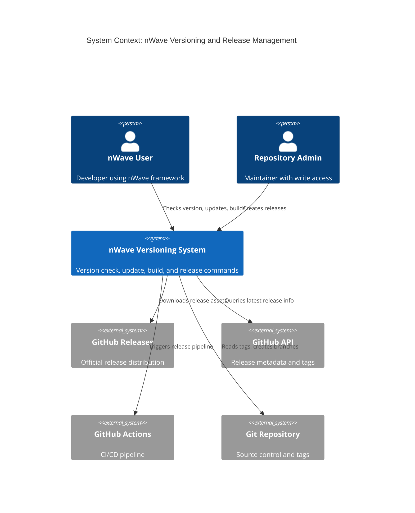
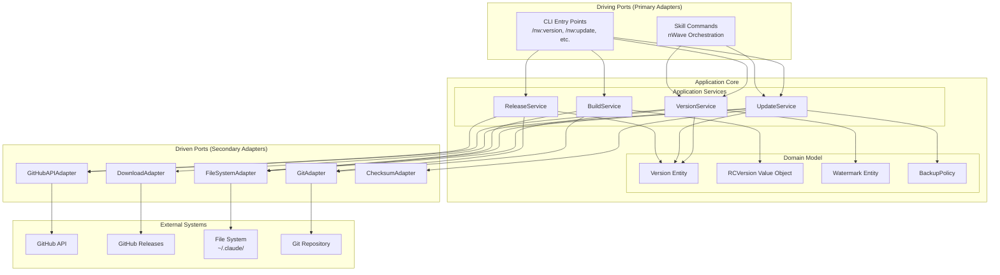
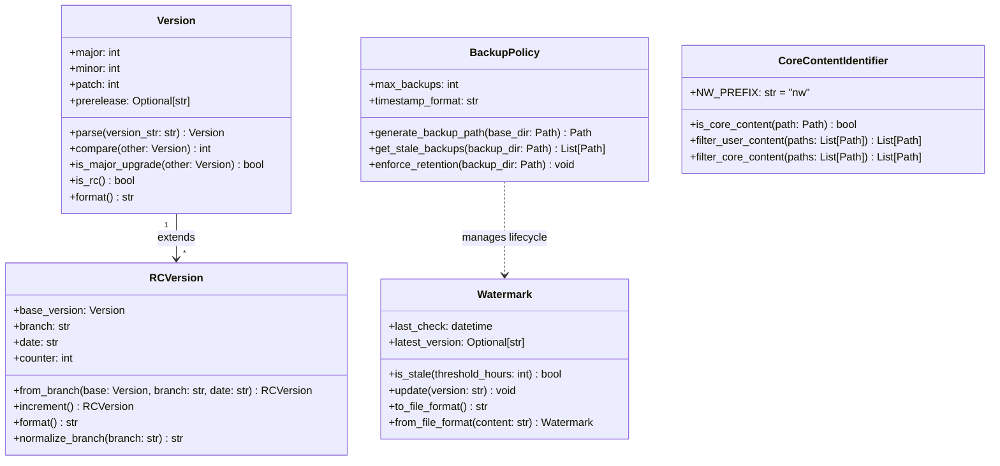
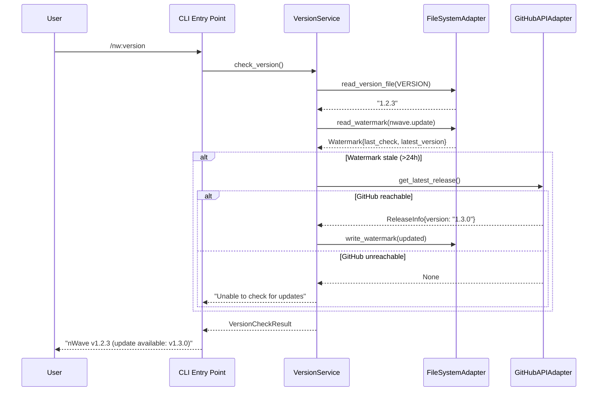
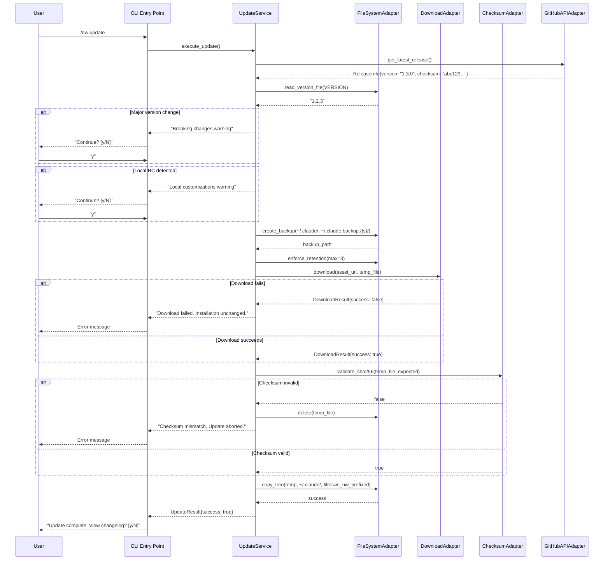
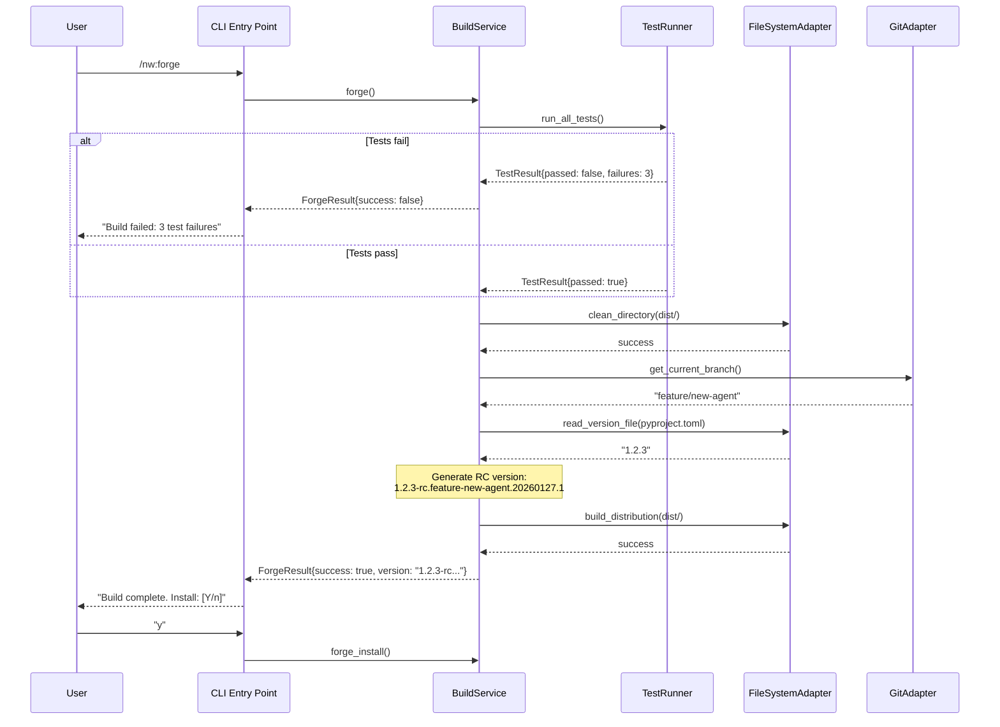
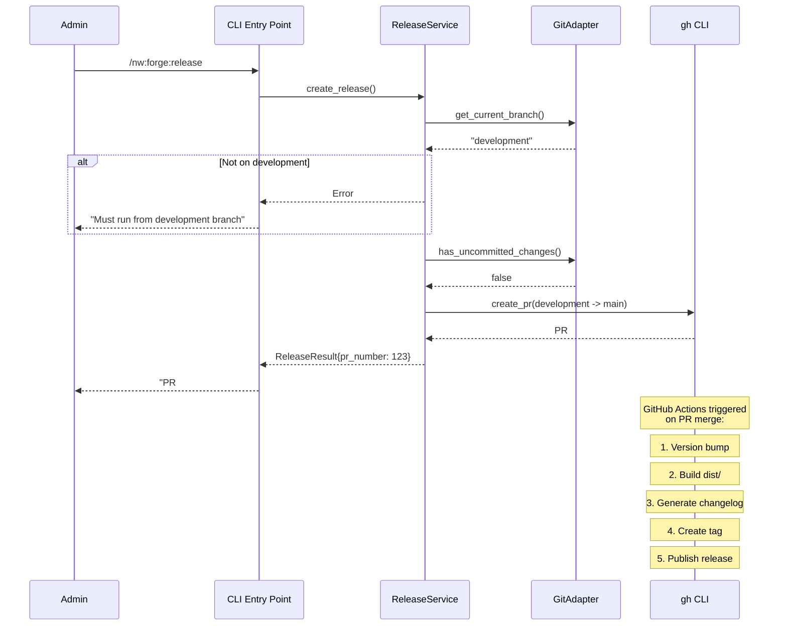

# nWave Versioning and Release Management - Architecture Design

## Document Metadata

| Field | Value |
|-------|-------|
| Feature | nWave Versioning and Release Management |
| Wave | DESIGN |
| Status | Architecture Complete |
| Author | Morgan (solution-architect) |
| Created | 2026-01-27 |
| Version | 1.0.0 |

---

## 1. Executive Summary

This architecture defines a comprehensive versioning, update, and release management system for nWave following hexagonal architecture principles. The system enables users to check installed versions, safely update to latest releases, build custom local distributions, and (for repository admins) publish official releases through a controlled CI/CD pipeline.

### Key Architectural Decisions

1. **Hexagonal Architecture**: Clear separation between domain logic, application services, and infrastructure adapters
2. **Atomic Operations**: Download-then-install approach prevents partial state corruption
3. **Safe by Default**: Mandatory backup before any destructive operation, rolling retention of 3 backups
4. **User Content Preservation**: Non-nWave content (without `nw` prefix) is never touched
5. **Open Source Stack**: Python 3 mandatory; curl/wget, tar, shasum optional but enhance experience

---

## 2. System Context Diagram



---

## 3. Component Architecture

### 3.1 Hexagonal Architecture Overview



### 3.2 Component Responsibilities

| Component | Layer | Responsibility |
|-----------|-------|----------------|
| `VersionService` | Application | Orchestrates version check, watermark management, daily auto-check |
| `UpdateService` | Application | Orchestrates download, validation, backup, installation |
| `BuildService` | Application | Orchestrates test execution, RC version generation, dist creation |
| `ReleaseService` | Application | Orchestrates PR creation, pipeline triggering, changelog generation |
| `Version` | Domain | Semantic version comparison, format validation |
| `RCVersion` | Domain | RC version format: `{base}-rc.{branch}.{YYYYMMDD}.{N}` |
| `Watermark` | Domain | Update check state: `last_check`, `latest_version` |
| `BackupPolicy` | Domain | Rolling retention rules (max 3 backups) |
| `GitHubAPIAdapter` | Infrastructure | HTTP calls to GitHub API for release metadata |
| `FileSystemAdapter` | Infrastructure | Read/write `~/.claude/`, backup creation |
| `GitAdapter` | Infrastructure | Branch operations, tag creation, commit info |
| `DownloadAdapter` | Infrastructure | Fetch release assets via curl/wget |
| `ChecksumAdapter` | Infrastructure | SHA256 validation via shasum |

---

## 4. Detailed Component Design

### 4.1 Domain Model



### 4.2 Application Services

#### VersionService

```python
class VersionService:
    """
    Application service for version checking.

    Ports:
    - Driven: GitHubAPIPort, FileSystemPort
    """

    def __init__(
        self,
        github_api: GitHubAPIPort,
        file_system: FileSystemPort
    ):
        self._github_api = github_api
        self._file_system = file_system

    def check_version(self) -> VersionCheckResult:
        """
        Check installed version against GitHub latest release.

        Returns: VersionCheckResult with status and message
        """
        pass

    def get_installed_version(self) -> Version:
        """Read VERSION file from installed nWave."""
        pass

    def should_auto_check(self) -> bool:
        """Determine if daily auto-check should run."""
        pass

    def update_watermark(self, latest_version: str) -> None:
        """Update watermark file with check timestamp."""
        pass
```

#### UpdateService

```python
class UpdateService:
    """
    Application service for safe updates.

    Ports:
    - Driven: DownloadPort, ChecksumPort, FileSystemPort, GitHubAPIPort
    """

    def __init__(
        self,
        downloader: DownloadPort,
        checksum: ChecksumPort,
        file_system: FileSystemPort,
        github_api: GitHubAPIPort,
        backup_policy: BackupPolicy
    ):
        # ... inject dependencies

    def execute_update(self, force: bool = False) -> UpdateResult:
        """
        Orchestrate complete update workflow:
        1. Check for available update
        2. Warn on major version / local RC
        3. Create backup (enforce retention)
        4. Download release asset
        5. Validate checksum
        6. Install (replace nw-prefixed content only)
        7. Prompt for changelog
        """
        pass

    def rollback(self, backup_path: Path) -> None:
        """Manual rollback from backup directory."""
        pass
```

#### BuildService

```python
class BuildService:
    """
    Application service for local distribution builds.

    Ports:
    - Driven: FileSystemPort, GitPort, TestRunnerPort
    """

    def __init__(
        self,
        file_system: FileSystemPort,
        git: GitPort,
        test_runner: TestRunnerPort
    ):
        # ... inject dependencies

    def forge(self) -> ForgeResult:
        """
        Build custom distribution:
        1. Run all tests and hooks
        2. Abort if tests fail
        3. Clean dist/
        4. Generate RC version
        5. Build distribution
        6. Prompt for install
        """
        pass

    def forge_install(self) -> InstallResult:
        """
        Install from dist/:
        1. Validate dist/ structure
        2. Copy to ~/.claude/ (nw-prefixed only)
        3. Run smoke test
        """
        pass
```

#### ReleaseService

```python
class ReleaseService:
    """
    Application service for official releases.

    Ports:
    - Driven: GitPort, GitHubCLIPort
    """

    def __init__(
        self,
        git: GitPort,
        github_cli: GitHubCLIPort
    ):
        # ... inject dependencies

    def create_release(self) -> ReleaseResult:
        """
        Orchestrate release workflow:
        1. Validate on development branch
        2. Create PR to main
        3. Trigger CI pipeline
        (Post-merge handled by GitHub Actions)
        """
        pass
```

---

## 5. Port Interfaces (Driven Ports)

### 5.1 GitHubAPIPort

```python
from abc import ABC, abstractmethod
from typing import Optional
from dataclasses import dataclass

@dataclass
class ReleaseInfo:
    tag_name: str
    version: str
    changelog: str
    asset_url: str
    checksum: str
    published_at: datetime

class GitHubAPIPort(ABC):
    """Port for GitHub API interactions."""

    @abstractmethod
    def get_latest_release(self) -> Optional[ReleaseInfo]:
        """Fetch latest release metadata from GitHub."""
        pass

    @abstractmethod
    def is_reachable(self) -> bool:
        """Check if GitHub API is accessible."""
        pass
```

### 5.2 FileSystemPort

```python
class FileSystemPort(ABC):
    """Port for file system operations on ~/.claude/."""

    @abstractmethod
    def read_version_file(self, path: Path) -> str:
        """Read VERSION file content."""
        pass

    @abstractmethod
    def read_watermark(self, path: Path) -> Optional[Watermark]:
        """Read watermark file."""
        pass

    @abstractmethod
    def write_watermark(self, path: Path, watermark: Watermark) -> None:
        """Write watermark file."""
        pass

    @abstractmethod
    def create_backup(self, source: Path, target: Path) -> None:
        """Create full backup of directory."""
        pass

    @abstractmethod
    def delete_directory(self, path: Path) -> None:
        """Delete directory recursively."""
        pass

    @abstractmethod
    def copy_tree(
        self,
        source: Path,
        target: Path,
        filter_fn: Callable[[Path], bool]
    ) -> None:
        """Copy directory tree with filter function."""
        pass

    @abstractmethod
    def list_backups(self, pattern: str) -> List[Path]:
        """List backup directories matching pattern."""
        pass
```

### 5.3 DownloadPort

```python
class DownloadPort(ABC):
    """Port for downloading release assets."""

    @abstractmethod
    def download(self, url: str, target: Path) -> DownloadResult:
        """
        Download file from URL to target path.
        Returns result with success/failure and error message.
        """
        pass

    @abstractmethod
    def is_available(self) -> bool:
        """Check if download tool (curl/wget) is available."""
        pass
```

### 5.4 ChecksumPort

```python
class ChecksumPort(ABC):
    """Port for checksum validation."""

    @abstractmethod
    def validate_sha256(self, file_path: Path, expected: str) -> bool:
        """Validate file SHA256 checksum."""
        pass

    @abstractmethod
    def is_available(self) -> bool:
        """Check if shasum tool is available."""
        pass
```

### 5.5 GitPort

```python
class GitPort(ABC):
    """Port for Git operations."""

    @abstractmethod
    def get_current_branch(self) -> str:
        """Get current branch name."""
        pass

    @abstractmethod
    def create_tag(self, tag_name: str, message: str) -> None:
        """Create annotated Git tag."""
        pass

    @abstractmethod
    def push_tag(self, tag_name: str) -> None:
        """Push tag to remote."""
        pass

    @abstractmethod
    def has_uncommitted_changes(self) -> bool:
        """Check for uncommitted changes."""
        pass
```

---

## 6. Sequence Diagrams

### 6.1 Version Check Flow (`/nw:version`)



### 6.2 Update Flow (`/nw:update`)



### 6.3 Forge Build Flow (`/nw:forge`)



### 6.4 Release Flow (`/nw:forge:release`)



---

## 7. Data Model

### 7.1 Watermark File Format

**Location**: `~/.claude/nwave.update`

```yaml
# Simple key-value format for minimal parsing
last_check: 2026-01-27T14:30:22Z
latest_version: 1.3.0
```

**Parsing Rules**:
- ISO 8601 timestamp for `last_check`
- SemVer string for `latest_version`
- Missing file = never checked (trigger immediate check)
- Stale threshold: 24 hours

### 7.2 Version Format Specification

**Official Release**:
```
MAJOR.MINOR.PATCH
Example: 1.2.3
```

**Pre-release (RC)**:
```
MAJOR.MINOR.PATCH-rc.{branch}.{YYYYMMDD}.{N}
Example: 1.2.3-rc.feature-new-agent.20260127.1

Where:
- branch: normalized (slashes to hyphens)
- YYYYMMDD: build date
- N: daily counter (resets each day)
```

### 7.3 Directory Structure

```
~/.claude/                          # Installation root
  agents/
    nw/                            # nWave agents (CORE - replaced on update)
    {user-custom}/                 # User agents (PRESERVED)
  commands/
    nw/                            # nWave commands (CORE - replaced on update)
    {user-custom}/                 # User commands (PRESERVED)
  nwave.update                     # Watermark file
  VERSION                          # Installed version

~/.claude.backup.{YYYYMMDDHHMMSS}/ # Backup directories (max 3 retained)
  agents/
  commands/
  nwave.update
  VERSION

{repo}/
  dist/                            # Build output (cleaned on each build)
    ide/
      agents/nw/
      commands/nw/
  pyproject.toml                   # Version source of truth
```

### 7.4 Core Content Identification

Content is **core** (nWave-owned, replaced on update) if:
1. Located under `agents/nw/` or `commands/nw/`
2. Produced by the build process and included in `dist/`

**User content** (without `nw` prefix) is **never** modified by update/install operations.

```python
def is_core_content(path: Path) -> bool:
    """Determine if path represents nWave core content."""
    parts = path.parts
    # Check for nw/ directory in agents or commands
    if "agents" in parts or "commands" in parts:
        try:
            idx = parts.index("agents") if "agents" in parts else parts.index("commands")
            return len(parts) > idx + 1 and parts[idx + 1] == "nw"
        except ValueError:
            return False
    return False
```

---

## 8. Error Handling Matrix

### 8.1 Network Errors

| Scenario | Detection | User Message | System State |
|----------|-----------|--------------|--------------|
| GitHub API unreachable during version check | HTTP timeout/error | "nWave v{ver} (Unable to check for updates)" | Unchanged, show local version |
| Download fails during update | HTTP error, incomplete file | "Download failed: {reason}. Your nWave installation is unchanged." | Unchanged, temp file deleted |
| GitHub rate limited | HTTP 403 with rate limit headers | "GitHub rate limit exceeded. Try again in {minutes} minutes." | Unchanged |

### 8.2 Validation Errors

| Scenario | Detection | User Message | System State |
|----------|-----------|--------------|--------------|
| SHA256 checksum mismatch | Computed != expected | "Download corrupted (checksum mismatch). Update aborted." | Unchanged, corrupted file deleted |
| Invalid dist/ structure | Missing required files | "Invalid distribution: missing {files}. Rebuild with /nw:forge." | Unchanged |
| Tests fail during forge | Non-zero test exit code | "Build failed: {N} test failures. Fix tests before building." | dist/ not modified |
| VERSION file missing | FileNotFoundError | "VERSION file not found. nWave may be corrupted." | Return error, suggest reinstall |

### 8.3 Permission Errors

| Scenario | Detection | User Message | System State |
|----------|-----------|--------------|--------------|
| No write access to ~/.claude/ | PermissionError | "Permission denied writing to {path}. Check file permissions." | Unchanged |
| Cannot create backup directory | PermissionError | "Cannot create backup: permission denied. Update aborted." | Unchanged (backup first) |
| No repository access for release | Git push rejected | "Permission denied. You don't have access to create releases." | No PR created |

### 8.4 State Conflicts

| Scenario | Detection | User Message | System State |
|----------|-----------|--------------|--------------|
| Local RC version when updating | Version contains "-rc." | "Local customizations detected. Update will overwrite. Continue? [y/N]" | Wait for confirmation |
| Major version bump | Parsed major version increased | "Major version change detected ({old}.x to {new}.x). This may break existing workflows. Continue? [y/N]" | Wait for confirmation |
| Wrong branch for release | Branch != "development" | "Release must be initiated from the development branch." | No action |

---

## 9. Security Considerations

### 9.1 Download Validation

- **SHA256 Checksum**: All downloaded assets validated before installation
- **HTTPS Only**: GitHub Releases use HTTPS for all downloads
- **No Code Execution Before Validation**: Downloaded archive is validated before extraction

### 9.2 File System Safety

- **Atomic Operations**: Download completes fully before any installation begins
- **Backup Before Modify**: Full backup created before any destructive operation
- **User Content Protection**: Non-nWave content never touched (explicit filter)
- **Rolling Retention**: Old backups automatically cleaned (max 3)

### 9.3 Release Pipeline Security

- **Branch Protection**: `main` branch protected, requires PR
- **CI Gate**: All tests must pass before merge
- **Admin Only**: Release command requires repository write access
- **Signed Tags**: Git tags created with commit verification

### 9.4 Input Validation

- **Version Format Validation**: SemVer parsing with strict validation
- **Path Traversal Prevention**: All paths resolved to absolute, validated within allowed directories
- **Branch Name Sanitization**: Special characters normalized before use in RC version

---

## 10. Technical Decisions

### ADR-001: Version Source of Truth

**Context**: Need single source for version information across build, install, and release.

**Decision**: Use `pyproject.toml` as version source of truth, synchronized with Git tags.

**Rationale**:
- Standard Python packaging location
- Single source eliminates drift between files
- Git tags provide release history and rollback capability
- `pyproject.toml` already exists and contains project metadata

**Consequences**:
- Version bump requires `pyproject.toml` update
- Release pipeline must update `pyproject.toml` before tagging
- Local VERSION file derived from `pyproject.toml` during build

---

### ADR-002: Backup Naming and Retention

**Context**: Users need rollback capability without managing backups manually.

**Decision**: Use timestamped backup directories with rolling retention of 3.

**Format**: `~/.claude.backup.{YYYYMMDDHHMMSS}/`

**Rationale**:
- Timestamp in name provides clear chronological ordering
- Fixed retention (3) prevents disk space exhaustion
- Location adjacent to installation makes restoration obvious
- No sequence numbers needed (timestamp is unique)

**Consequences**:
- Automatic cleanup on each update (oldest deleted when >3)
- User can manually restore by copying backup to `~/.claude/`
- Future `/nw:rollback` command can leverage backup directories

---

### ADR-003: RC Version Format

**Context**: Local builds need distinguishing version that doesn't conflict with official releases.

**Decision**: RC format `{base}-rc.{branch}.{YYYYMMDD}.{N}`

**Example**: `1.2.3-rc.feature-new-agent.20260127.2`

**Rationale**:
- `-rc.` suffix clearly marks pre-release
- Branch name provides build context
- Date enables temporal ordering
- Counter handles multiple builds per day
- SemVer compliant (pre-release identifier)

**Consequences**:
- Branch names with special characters normalized (slashes to hyphens)
- Counter must be tracked (derived from existing dist/ or file)
- RC versions compare as less than release versions

---

### ADR-004: User Content Identification by Prefix

**Context**: Updates must not destroy user's custom agents/commands.

**Decision**: Core content identified by `nw` prefix in directory structure.

**Core**: `agents/nw/*`, `commands/nw/*`
**User**: Everything else in `agents/` and `commands/`

**Rationale**:
- Simple, filesystem-based identification
- No manifest or tracking file needed
- Users naturally create custom content outside `nw/`
- Clear ownership boundary

**Consequences**:
- Users must not place custom content in `nw/` directories
- Documentation must clearly communicate this convention
- Update only replaces content in `nw/` directories

---

### ADR-005: Atomic Download-Then-Install

**Context**: Network failures mid-update could leave system in broken state.

**Decision**: Complete download and validation before any modification to installation.

**Workflow**:
1. Download to temp location
2. Validate checksum
3. Create backup
4. Install from validated temp file

**Rationale**:
- No partial state possible from network failure
- Checksum validates integrity before any change
- Backup provides rollback even if installation fails
- Temp file cleaned up on any failure

**Consequences**:
- Requires temp disk space for full download
- Slightly slower (no streaming install)
- Extremely safe (no partial updates possible)

---

### ADR-006: Existing Infrastructure Reuse

**Context**: Codebase already has backup, version, and installation utilities.

**Decision**: Extend existing components rather than reimplementing.

**Existing Components to Reuse/Extend**:
- `nWave/core/version_management/version_comparator.py` - Version comparison
- `nWave/core/version_management/changelog_parser.py` - Changelog extraction
- `scripts/update/backup_manager.py` - Backup creation
- `scripts/install/install_utils.py` - PathUtils, Logger, Colors
- `tools/core/build_ide_bundle.py` - Build orchestration

**Rationale**:
- DRY principle - don't duplicate working code
- Existing utilities are tested and cross-platform
- Consistent UX across install/update/build
- Faster implementation with less risk

**Consequences**:
- Must ensure backward compatibility with existing interfaces
- May need to extract common interfaces (ports)
- Some refactoring to align with hexagonal architecture

---

## 11. Integration with Existing Codebase

### 11.1 Components to Reuse

| Existing Component | New Usage |
|-------------------|-----------|
| `VersionComparator.is_major_update()` | Major version warning in UpdateService |
| `ChangelogParser.extract_breaking_changes()` | Breaking changes display in version check |
| `BackupManager.create_backup()` | Backup creation in UpdateService |
| `PathUtils.get_claude_config_dir()` | Installation directory resolution |
| `Logger`, `Colors` | Consistent CLI output formatting |
| `IDEBundleBuilder` | Build orchestration for forge command |

### 11.2 New Components Required

| New Component | Purpose |
|--------------|---------|
| `WatermarkManager` | Read/write watermark file, staleness check |
| `RCVersionGenerator` | Generate and parse RC version strings |
| `DownloadManager` | Download with progress, retry, checksum |
| `ContentFilter` | Identify nw-prefixed vs user content |
| `BackupRetentionPolicy` | Enforce rolling 3-backup retention |
| `GitHubReleaseClient` | GitHub API for release metadata |

---

## 12. DISTILL Wave Handoff

This architecture document provides the foundation for acceptance test creation in the DISTILL wave.

### 12.1 Key Acceptance Test Scenarios

**US-001: Check Installed Version**
- Version display with update available
- Version display when up-to-date
- Version display when offline
- Daily auto-check watermark update

**US-002: Update to Latest Release**
- Successful update with changelog prompt
- Major version confirmation warning
- Local RC customization warning
- Network failure leaves installation unchanged
- Checksum validation failure
- Backup rotation maintains 3 copies
- User content preservation

**US-003: Build Custom Distribution**
- Successful build with install prompt
- Build fails when tests fail
- RC counter increments within same day
- RC counter resets on new day
- Branch name included in RC version

**US-004: Install Built Distribution**
- Successful installation with smoke test
- Installation fails without dist/
- Installation fails with invalid dist/

**US-005: Create Official Release**
- Successful release workflow
- Pipeline failure blocks merge
- Permission denied for non-admin
- Wrong branch error

### 12.2 Hexagonal Boundary Testing

Tests should invoke through **driving ports only** (CLI entry points):

```python
# CORRECT: Invoke CLI entry point
result = subprocess.run([sys.executable, "version_cli.py"], ...)

# FORBIDDEN: Direct domain import
from nWave.core.version_management.version_comparator import VersionComparator
```

### 12.3 Infrastructure Adapter Mocking

For acceptance tests, mock adapters for external systems:
- `MockGitHubAPIAdapter` - Return configured release metadata
- `MockDownloadAdapter` - Simulate download success/failure
- `MockFileSystemAdapter` - Isolated temp directory operations

---

## 13. Appendix: Mermaid Diagram Sources

All diagrams in this document use Mermaid syntax and can be rendered with:
- GitHub Markdown preview
- Mermaid Live Editor (https://mermaid.live)
- VS Code Mermaid extension

---

## Document History

| Version | Date | Author | Changes |
|---------|------|--------|---------|
| 1.0.0 | 2026-01-27 | Morgan (solution-architect) | Initial architecture design |
