# The Ultimate Platform Engineering Curriculum

**For Apex: Elite Platform-Architect AI Agent**

**Research Date:** 2026-01-27
**Researcher:** Nova (Evidence-Driven Knowledge Researcher)
**Overall Confidence:** High
**Sources Consulted:** 75+
**Target Bar:** Staff+ Platform Engineer at Google, AWS, or Meta

---

## Executive Summary

Platform engineering has evolved from ad-hoc automation scripts to a sophisticated discipline that combines software engineering, operations, and product thinking. This curriculum traces that evolution across five distinct eras, from the pre-DevOps foundations (2004-2010) through the modern platform engineering renaissance (2020-present).

### The Evolution Timeline

```
2004-2010: FOUNDATIONS
    Continuous Integration, early automation, Release It!
         |
         v
2010-2016: DEVOPS REVOLUTION
    Continuous Delivery, Phoenix Project, Infrastructure as Code
         |
         v
2016-2020: SITE RELIABILITY ENGINEERING
    Google SRE books, error budgets, SLOs, observability
         |
         v
2017-Present: CLOUD NATIVE & KUBERNETES
    Container orchestration, GitOps, service mesh
         |
         v
2020-Present: MODERN PLATFORM ENGINEERING
    Team Topologies, platform-as-product, IDPs, eBPF, AI/ML
```

### The 12 Absolutely Essential Books (Non-Negotiables)

These books form the core canon. A Staff+ Platform Engineer must have internalized these:

| # | Book | Author(s) | Year | Why Essential |
|---|------|-----------|------|---------------|
| 1 | **Continuous Delivery** | Jez Humble, David Farley | 2010 | THE bible. Defined deployment pipelines. |
| 2 | **The Phoenix Project** | Gene Kim et al. | 2013 | Made DevOps accessible. The Three Ways. |
| 3 | **Site Reliability Engineering** | Google (Betsy Beyer et al.) | 2016 | The SRE bible. Error budgets, SLOs. |
| 4 | **Accelerate** | Forsgren, Humble, Kim | 2018 | The science. DORA metrics. Data-driven. |
| 5 | **Team Topologies** | Skelton, Pais | 2019 | Platform teams defined. Cognitive load. |
| 6 | **Kubernetes: Up and Running** | Hightower, Burns, Beda | 2022 (3e) | K8s fundamentals from the creators. |
| 7 | **Designing Data-Intensive Applications** | Martin Kleppmann | 2017 | Distributed systems masterpiece. |
| 8 | **Infrastructure as Code** | Kief Morris | 2020 (2e) | Modern IaC patterns and practices. |
| 9 | **The DevOps Handbook** | Kim, Humble, Debois, Willis | 2021 (2e) | Practical implementation guide. |
| 10 | **Release It!** | Michael Nygard | 2018 (2e) | Stability patterns. Production readiness. |
| 11 | **Observability Engineering** | Majors, Fong-Jones, Miranda | 2022 | Modern observability practices. |
| 12 | **Platform Engineering on Kubernetes** | Mauricio Salatino | 2024 | The synthesis. IDP on K8s. |

---

## The Complete Curriculum

### Era 1: The Foundations (Pre-DevOps, 2004-2010)

The roots of modern delivery practices. These books established patterns we still use today.

#### Essential Tier

##### Continuous Integration: Improving Software Quality and Reducing Risk
**Authors:** Paul Duvall, Steve Matyas, Andrew Glover
**Year:** 2007
**Publisher:** Addison-Wesley (Jolt Award Winner 2008)

**Why It Matters:** The first comprehensive book on CI. Transformed integration from "hell" to routine. Martin Fowler noted this book "gathered information together into a cohesive handbook."

**Key Concepts Introduced:**
- Continuous integration as practice, not tool
- Automated build verification
- Fast feedback loops
- Integration frequency reduces risk

**Still Relevant?** *Partial* - Core principles timeless; tool examples dated. Concepts evolved into Continuous Delivery.

**Difficulty:** Foundational

---

##### Release It! Design and Deploy Production-Ready Software (1st Edition)
**Author:** Michael Nygard
**Year:** 2007
**Publisher:** Pragmatic Bookshelf

**Why It Matters:** First book to focus on production operations as a design concern. Introduced stability patterns that became industry standard.

**Key Concepts Introduced:**
- Stability antipatterns (cascading failures, resource leaks)
- Circuit Breaker pattern (borrowed from electrical engineering)
- Timeouts, bulkheads, handshaking
- Cynical software philosophy: "expect bad things to happen"

**Still Relevant?** *Partial* - Read the 2nd edition (2018) instead. Original predates cloud-native but philosophy is timeless.

**Difficulty:** Intermediate

---

##### Ship It! A Practical Guide to Successful Software Projects
**Authors:** Jared Richardson, William Gwaltney Jr.
**Year:** 2005
**Publisher:** Pragmatic Bookshelf

**Why It Matters:** Practical, no-nonsense guide to shipping software. Introduced "tracer bullet development" concept.

**Key Concepts Introduced:**
- Tools and infrastructure for delivery
- Pragmatic project techniques
- Tracer bullet development
- Common problems and fixes

**Still Relevant?** *Historical context* - Concepts absorbed into later works. Good for understanding evolution.

**Difficulty:** Foundational

---

#### Also Consider

| Book | Author(s) | Year | Notes |
|------|-----------|------|-------|
| Pragmatic Project Automation | Mike Clark | 2004 | Early automation patterns |
| Agile Software Development | Robert Martin | 2002 | Principles underlying CI/CD |

---

### Era 2: The DevOps Revolution (2010-2016)

The movement that changed everything. DevOps went from fringe idea to industry standard.

#### Essential Tier

##### Continuous Delivery: Reliable Software Releases through Build, Test, and Deployment Automation
**Authors:** Jez Humble, David Farley
**Year:** 2010
**Publisher:** Addison-Wesley (Jolt Award Winner 2011)

**Why It Matters:** THE DevOps bible. Extended CI to full delivery pipeline. Every modern CI/CD system traces lineage here.

**Key Concepts Introduced:**
- Deployment pipeline as first-class concept
- Configuration management
- Automated acceptance testing
- Database migrations as code
- Release strategies (blue-green, canary)
- "If it hurts, do it more frequently"

**Still Relevant?** *Yes - Timeless.* Core principles unchanged despite tool evolution.

**Difficulty:** Intermediate

**Note:** Jez Humble later co-founded DORA, acquired by Google. The research continues in Accelerate.

---

##### The Phoenix Project: A Novel About IT, DevOps, and Helping Your Business Win
**Authors:** Gene Kim, Kevin Behr, George Spafford
**Year:** 2013
**Publisher:** IT Revolution Press

**Why It Matters:** Made DevOps accessible through narrative. Reached audiences technical books couldn't. Tim O'Reilly: "Every person involved in a failed IT project should be forced to read this book."

**Key Concepts Introduced:**
- The Three Ways of DevOps:
  1. Flow (left-to-right, dev to ops to customer)
  2. Feedback (right-to-left feedback loops)
  3. Continuous Learning
- Work in Progress (WIP) limits
- Theory of Constraints applied to IT
- Types of work: business projects, internal projects, changes, unplanned work

**Still Relevant?** *Yes.* Cultural and organizational insights transcend technology.

**Difficulty:** Foundational (narrative format)

---

##### The DevOps Handbook: How to Create World-Class Agility, Reliability, & Security
**Authors:** Gene Kim, Jez Humble, Patrick Debois, John Willis
**Year:** 2016 (2nd Edition 2021)
**Publisher:** IT Revolution Press

**Why It Matters:** Practical implementation companion to The Phoenix Project. Case studies from Google, Netflix, Target, Capital One.

**Key Concepts Introduced:**
- Technical practices enabling DevOps
- Value stream mapping
- Deployment lead time optimization
- Security integration (DevSecOps foundations)
- 15+ new case studies in 2nd edition

**Still Relevant?** *Yes.* Read the 2nd edition (2021) with Nicole Forsgren's additions.

**Difficulty:** Intermediate

---

##### Infrastructure as Code: Managing Servers in the Cloud (1st Edition)
**Author:** Kief Morris
**Year:** 2016
**Publisher:** O'Reilly

**Why It Matters:** Codified IaC practices. ThoughtWorks consultant experience distilled.

**Key Concepts Introduced:**
- Infrastructure definition files
- Server configuration tools (Puppet, Chef, Ansible)
- Immutable infrastructure concepts
- Pattern catalog for IaC

**Still Relevant?** *Partial* - Read 2nd edition (2020) instead. 1st edition focused on server config; 2nd shifted to cloud stacks.

**Difficulty:** Intermediate

---

##### Web Operations: Keeping the Data On Time
**Editors:** John Allspaw, Jesse Robbins
**Year:** 2010
**Publisher:** O'Reilly

**Why It Matters:** Pre-DevOps operations wisdom from Flickr, Amazon. Jesse Robbins was Amazon's "Master of Disaster." John Allspaw later became CTO at Etsy.

**Key Concepts Introduced:**
- Continuous deployment at scale
- Dev/Ops collaboration patterns
- Agile infrastructure
- Post-mortem culture
- War stories and case studies

**Still Relevant?** *Partial* - Tools changed but behaviors during outages haven't. Historical context valuable.

**Difficulty:** Intermediate

---

##### Effective DevOps: Building a Culture of Collaboration, Affinity, and Tooling at Scale
**Authors:** Jennifer Davis, Ryn Daniels
**Year:** 2016
**Publisher:** O'Reilly

**Why It Matters:** Focuses on cultural and organizational aspects often neglected. Strong coverage of diversity in tech.

**Key Concepts Introduced:**
- Four pillars: Collaboration, Affinity, Tools, Scaling
- Cultural transformation patterns
- Team building and affinity
- Diversity and inclusion in tech orgs

**Still Relevant?** *Yes* - Cultural aspects timeless even as tools evolve.

**Difficulty:** Intermediate

---

#### Also Consider

| Book | Author(s) | Year | Notes |
|------|-----------|------|-------|
| The Visible Ops Handbook | Kim, Behr, Spafford | 2004-2006 | Pre-DevOps process improvement |
| Lean Enterprise | Humble, Molesky, O'Reilly | 2015 | Scaling lean/DevOps |
| The Art of Monitoring | James Turnbull | 2016 | Modern monitoring practices |

---

### Era 3: Site Reliability Engineering (2016-2020)

Google's gift to operations. Formalized reliability as engineering discipline.

#### Essential Tier

##### Site Reliability Engineering: How Google Runs Production Systems
**Editors:** Betsy Beyer, Chris Jones, Jennifer Petoff, Niall Richard Murphy
**Year:** 2016
**Publisher:** O'Reilly (Free online at sre.google)

**Why It Matters:** THE SRE bible. Google opened the kimono on how they run planetary-scale systems. Changed how industry thinks about operations.

**Key Concepts Introduced:**
- SRE as discipline (software engineering applied to operations)
- Error budgets
- Service Level Objectives (SLOs), SLIs, SLAs
- Toil elimination
- Blameless postmortems
- On-call practices
- Capacity planning

**Still Relevant?** *Yes - Canonical.* Some Google-specific scale concerns but principles universal.

**Difficulty:** Intermediate to Advanced

**Note:** Free to read online. Some chapters stand alone; doesn't require cover-to-cover reading.

---

##### The Site Reliability Workbook: Practical Ways to Implement SRE
**Editors:** Betsy Beyer, Niall Murphy, Dave Rensin, Kent Kawahara, Stephen Thorne
**Year:** 2018
**Publisher:** O'Reilly (Free online at sre.google)

**Why It Matters:** Hands-on companion to SRE book. Case studies from Evernote, Home Depot, New York Times.

**Key Concepts Introduced:**
- Practical SLO implementation
- Error budget policies
- On-call engineering
- Incident response (Chapters 13-14 particularly valuable)
- Non-Google case studies

**Still Relevant?** *Yes.* More practical than first book.

**Difficulty:** Intermediate

---

##### Accelerate: The Science of Lean Software and DevOps
**Authors:** Nicole Forsgren PhD, Jez Humble, Gene Kim
**Year:** 2018
**Publisher:** IT Revolution Press (Shingo Publication Award Winner)

**Why It Matters:** The SCIENCE behind DevOps. Four years of research. Introduced DORA metrics now industry standard.

**Key Concepts Introduced:**
- Four Key Metrics (DORA metrics):
  1. Deployment Frequency
  2. Lead Time for Changes
  3. Change Failure Rate
  4. Mean Time to Recovery (MTTR)
- Elite/High/Medium/Low performer categories
- Capabilities that drive performance
- Westrum organizational culture model
- Transformational leadership

**Still Relevant?** *Yes - Essential.* Google acquired DORA; research continues in State of DevOps reports.

**Difficulty:** Intermediate

**Note:** DORA was acquired by Google in 2018. Research continues at dora.dev.

---

##### Seeking SRE: Conversations About Running Production Systems at Scale
**Editor:** David N. Blank-Edelman
**Year:** 2018
**Publisher:** O'Reilly

**Why It Matters:** Shows SRE beyond Google. Amazon, Facebook, Netflix, Dropbox perspectives.

**Key Concepts Introduced:**
- SRE implementation variations
- Human side of SRE (burnout, work-life balance)
- SRE vs DevOps relationship
- Cultural aspects

**Still Relevant?** *Yes.* Valuable for seeing how SRE adapts to different organizations.

**Difficulty:** Intermediate

---

##### Building Secure and Reliable Systems
**Authors:** Heather Adkins, Betsy Beyer, Paul Blankinship, Piotr Lewandowski, Ana Oprea, Adam Stubblefield
**Year:** 2020
**Publisher:** O'Reilly (Free online at sre.google)

**Why It Matters:** Completes Google's SRE trilogy. Argues security and reliability are inseparable.

**Key Concepts Introduced:**
- Security as reliability concern
- "Defense in depth" for systems
- Design for recovery
- Secure development lifecycle
- Incident response integration

**Still Relevant?** *Yes.* Security integration increasingly critical.

**Difficulty:** Advanced

---

##### Database Reliability Engineering
**Authors:** Laine Campbell, Charity Majors
**Year:** 2017
**Publisher:** O'Reilly

**Why It Matters:** SRE principles applied to databases. Charity Majors (Honeycomb founder) perspective.

**Key Concepts Introduced:**
- DBRE (Database Reliability Engineer) role
- SLOs for databases
- Operational database management
- Modern persistence options
- Infrastructure as code for data

**Still Relevant?** *Yes.* Database operations often neglected. This fills gap.

**Difficulty:** Intermediate to Advanced

---

#### Also Consider

| Book | Author(s) | Year | Notes |
|------|-----------|------|-------|
| Systems Performance (2nd Ed) | Brendan Gregg | 2020 | Deep Linux/systems performance |
| Practical Monitoring | Mike Julian | 2017 | Monitoring principles (vendor-neutral) |
| Distributed Systems Observability | Cindy Sridharan | 2018 | Free ebook, excellent overview |

---

### Era 4: Cloud Native & Kubernetes (2017-Present)

The container revolution. Kubernetes became the operating system of the cloud.

#### Essential Tier

##### Kubernetes: Up and Running (3rd Edition)
**Authors:** Brendan Burns, Joe Beda, Kelsey Hightower, Lachlan Evenson
**Year:** 2022
**Publisher:** O'Reilly

**Why It Matters:** Written by Kubernetes creators. THE starting point for K8s learning.

**Key Concepts Introduced:**
- Kubernetes architecture and components
- Deployments, Services, Pods
- ConfigMaps and Secrets
- RBAC and security
- 3rd edition adds: security, multi-cluster deployments

**Still Relevant?** *Yes.* Updated regularly. Start here for K8s.

**Difficulty:** Foundational to Intermediate

---

##### Production Kubernetes: Building Successful Application Platforms
**Authors:** Josh Rosso, Rich Lander, Alex Brand, John Harris
**Year:** 2021
**Publisher:** O'Reilly (Free PDF from VMware Tanzu)

**Why It Matters:** Fills gap between "running K8s" and "running K8s in production." Real-world tradeoffs.

**Key Concepts Introduced:**
- Production-grade considerations
- Platform building decisions
- Multi-tenancy patterns
- Security hardening
- Day 2 operations

**Still Relevant?** *Yes.* Unique production focus.

**Difficulty:** Advanced

**Note:** "A nearly perfect book about Kubernetes" per reviewers. Not for beginners.

---

##### Kubernetes Patterns (2nd Edition)
**Authors:** Bilgin Ibryam, Roland Huss
**Year:** 2023
**Publisher:** O'Reilly (Free from Red Hat Developer)

**Why It Matters:** Design patterns for cloud-native applications on K8s. Grady Booch endorsed.

**Key Concepts Introduced:**
- Foundational patterns (health probes, managed lifecycle)
- Behavioral patterns (batch jobs, daemon services)
- Structural patterns (init containers, sidecars)
- Configuration patterns
- Advanced patterns (controller, operator)

**Still Relevant?** *Yes.* Pattern approach timeless.

**Difficulty:** Intermediate to Advanced

---

##### Cloud Native Infrastructure
**Authors:** Justin Garrison, Kris Nova
**Year:** 2017
**Publisher:** O'Reilly

**Why It Matters:** Defined "cloud native infrastructure" concept. Patterns from Google, Amazon, Netflix.

**Key Concepts Introduced:**
- Infrastructure as software
- Self-service infrastructure
- Reconciliation loops
- Infrastructure applications

**Still Relevant?** *Partial* - Foundational concepts remain valid; some tools evolved.

**Difficulty:** Intermediate

---

##### Designing Distributed Systems
**Authors:** Brendan Burns
**Year:** 2018 (2nd Edition forthcoming)
**Publisher:** O'Reilly (Free from Microsoft)

**Why It Matters:** Container-based design patterns from K8s co-founder.

**Key Concepts Introduced:**
- Single-node patterns (sidecar, adapter, ambassador)
- Multi-node patterns (replicated load-balanced services)
- Batch computational patterns
- 2nd edition adds: AI inference, AI training

**Still Relevant?** *Yes.* Pattern fundamentals timeless.

**Difficulty:** Intermediate

---

##### Programming Kubernetes
**Authors:** Michael Hausenblas, Stefan Schimanski
**Year:** 2019
**Publisher:** O'Reilly

**Why It Matters:** How to extend Kubernetes. Essential for operator development.

**Key Concepts Introduced:**
- Kubernetes API internals
- Custom Resource Definitions (CRDs)
- Controllers and operators
- client-go library
- Kubebuilder and Operator SDK

**Still Relevant?** *Yes.* API patterns stable. Some examples dated.

**Difficulty:** Advanced

---

##### Kubernetes Operators
**Authors:** Jason Dobies, Joshua Wood
**Year:** 2020
**Publisher:** O'Reilly (Free from Red Hat Developer)

**Why It Matters:** "The missing manual" for operators per Kelsey Hightower.

**Key Concepts Introduced:**
- Operator pattern explained
- Operator Framework and SDK
- SRE principles in operators
- Operator Lifecycle Manager

**Still Relevant?** *Yes.* Operators remain key K8s extension mechanism.

**Difficulty:** Advanced

---

#### GitOps Books

##### GitOps and Kubernetes
**Authors:** Billy Yuen, Alexander Matyushentsev, Todd Ekenstam, Jesse Suen
**Year:** 2021
**Publisher:** Manning

**Why It Matters:** Written by Argo CD creators. Definitive GitOps guide.

**Key Concepts Introduced:**
- GitOps principles
- Argo CD, Jenkins X, Flux comparison
- Continuous deployment via Git

**Still Relevant?** *Yes.* GitOps now standard practice.

**Difficulty:** Intermediate

---

##### Argo CD: Up and Running
**Authors:** Andrew Block, Christian Hernandez
**Year:** 2024
**Publisher:** O'Reilly

**Why It Matters:** Practical Argo CD guide from Red Hat and Akuity experts.

**Key Concepts Introduced:**
- Argo CD fundamentals
- ApplicationSets
- Multi-cluster deployment
- GitOps at scale

**Still Relevant?** *Yes.* Current and practical.

**Difficulty:** Intermediate

---

#### Also Consider

| Book | Author(s) | Year | Notes |
|------|-----------|------|-------|
| GitOps Cookbook | Vinto, Bueno | 2023 | Recipe-based approach |
| Cloud Native DevOps with Kubernetes | Arundel, Domingus | 2022 (2e) | Practical DevOps on K8s |
| Kubernetes Best Practices | Burns, Villalba, Strebel, Evenson | 2019 | From Google/Microsoft |
| Service Mesh Patterns | Lee | 2024 | Istio, Linkerd patterns |

---

### Era 5: Modern Platform Engineering (2020-Present)

The synthesis and evolution. Platform engineering emerged as distinct discipline.

#### Essential Tier

##### Team Topologies: Organizing Business and Technology Teams for Fast Flow
**Authors:** Matthew Skelton, Manuel Pais
**Year:** 2019 (2nd Edition 2025)
**Publisher:** IT Revolution Press

**Why It Matters:** Defined platform teams as fundamental team type. Introduced cognitive load as design constraint.

**Key Concepts Introduced:**
- Four fundamental team types:
  1. Stream-aligned teams
  2. Enabling teams
  3. Platform teams
  4. Complicated-subsystem teams
- Three interaction modes (collaboration, X-as-a-Service, facilitating)
- Cognitive load as constraint
- Team API concept
- Inverse Conway Maneuver

**Still Relevant?** *Yes - Essential.* Platform engineering relies on these concepts.

**Difficulty:** Intermediate

**Note:** Second edition (2025) updates for platform engineering maturity.

---

##### Platform Engineering on Kubernetes
**Author:** Mauricio Salatino
**Year:** 2024
**Publisher:** Manning

**Why It Matters:** THE book on building IDPs on Kubernetes. Covers Backstage, Crossplane, Argo CD.

**Key Concepts Introduced:**
- Platform engineering principles
- Internal Developer Platforms (IDPs)
- Backstage software catalogs
- Crossplane for infrastructure
- Tekton, Dagger for pipelines
- Dapr for distributed apps
- Progressive delivery

**Still Relevant?** *Yes - Current.* Most comprehensive IDP book available.

**Difficulty:** Intermediate to Advanced

**Note:** Companion GitHub repository with full examples.

---

##### Release It! (2nd Edition)
**Author:** Michael Nygard
**Year:** 2018
**Publisher:** Pragmatic Bookshelf

**Why It Matters:** Updated for DevOps, microservices, cloud. Stability patterns for modern systems.

**Key Concepts Introduced:**
- Updated stability patterns for microservices
- DevOps integration
- Cloud-native patterns
- Operational considerations

**Still Relevant?** *Yes.* Essential update to 2007 classic.

**Difficulty:** Intermediate

---

##### Infrastructure as Code (2nd Edition)
**Author:** Kief Morris
**Year:** 2020
**Publisher:** O'Reilly

**Why It Matters:** Modernized for cloud stacks, Terraform, CDK. ThoughtWorks expertise.

**Key Concepts Introduced:**
- Infrastructure stacks (not just servers)
- Terraform/CDK patterns
- Testing infrastructure code
- Pipeline integration
- Stack segmentation

**Still Relevant?** *Yes.* Definitive modern IaC guide.

**Difficulty:** Intermediate

**Note:** Third edition in progress for 2025+.

---

##### The Unicorn Project
**Author:** Gene Kim
**Year:** 2019
**Publisher:** IT Revolution Press

**Why It Matters:** Developer perspective on Phoenix Project transformation. Introduces Five Ideals.

**Key Concepts Introduced:**
- The Five Ideals:
  1. Locality and Simplicity
  2. Focus, Flow, and Joy
  3. Improvement of Daily Work
  4. Psychological Safety
  5. Customer Focus
- Developer experience focus

**Still Relevant?** *Yes.* Complements Phoenix Project with dev perspective.

**Difficulty:** Foundational (narrative format)

---

#### Architecture Books

##### Software Architecture: The Hard Parts
**Authors:** Neal Ford, Mark Richards, Pramod Sadalage, Zhamak Dehghani
**Year:** 2021
**Publisher:** O'Reilly

**Why It Matters:** Trade-off analysis for distributed systems. Real architectural decisions.

**Key Concepts Introduced:**
- Coupling types and analysis
- Service granularity decisions
- Data decomposition patterns
- Saga patterns for transactions
- Contract management

**Still Relevant?** *Yes.* Essential for microservices architecture.

**Difficulty:** Advanced

---

##### Building Evolutionary Architectures (2nd Edition)
**Authors:** Neal Ford, Rebecca Parsons, Patrick Kua, Pramod Sadalage
**Year:** 2023
**Publisher:** O'Reilly

**Why It Matters:** Architecture that evolves with requirements. Fitness functions concept.

**Key Concepts Introduced:**
- Evolutionary architecture principles
- Fitness functions (architecture tests)
- Continuous architecture
- Dealing with coupling

**Still Relevant?** *Yes.* Evolutionary thinking essential for platforms.

**Difficulty:** Advanced

---

#### Also Consider

| Book | Author(s) | Year | Notes |
|------|-----------|------|-------|
| Software Engineering at Google | Winters, Manshreck, Wright | 2020 | Google's engineering practices |
| Wiring the Winning Organization | Kim, Spear | 2023 | Latest from Gene Kim |
| Fundamentals of Software Architecture | Richards, Ford | 2020 | Architecture basics |

---

### Cross-Cutting Concerns

#### Observability

##### Observability Engineering
**Authors:** Charity Majors, Liz Fong-Jones, George Miranda
**Year:** 2022
**Publisher:** O'Reilly

**Why It Matters:** Defines observability vs monitoring. From Honeycomb team.

**Key Concepts Introduced:**
- Observability vs monitoring distinction
- High-cardinality data
- Distributed tracing
- Events over metrics
- Observability-driven development

**Still Relevant?** *Yes.* Definitive observability guide.

**Difficulty:** Intermediate

---

##### Distributed Systems Observability
**Author:** Cindy Sridharan
**Year:** 2018
**Publisher:** O'Reilly (Free ebook)

**Why It Matters:** Concise (~36 pages) overview. Three pillars of observability.

**Key Concepts Introduced:**
- Three pillars: logging, metrics, tracing
- Observability as system property
- Complexity in distributed systems

**Still Relevant?** *Yes.* Quick, excellent starting point.

**Difficulty:** Foundational

---

#### Security

##### DevSecOps
**Authors:** James DeLuccia IV, Duane DeCouteau, Eric Johnson
**Year:** 2023
**Publisher:** O'Reilly

**Why It Matters:** Security integrated into DevOps pipeline.

**Key Concepts Introduced:**
- Security as code
- Pipeline security controls
- Compliance automation
- Risk management in DevOps

**Still Relevant?** *Yes.* Security integration critical.

**Difficulty:** Intermediate

---

##### Securing DevOps
**Author:** Julien Vehent
**Year:** 2018
**Publisher:** Manning

**Why It Matters:** Hands-on cloud security practices.

**Key Concepts Introduced:**
- CI/CD security
- Infrastructure security
- Cloud security controls
- Logging and monitoring

**Still Relevant?** *Partial* - Core concepts valid; some tools evolved.

**Difficulty:** Intermediate

---

##### Agile Application Security
**Authors:** Laura Bell, Michael Brunton-Spall, Rich Smith, Jim Bird
**Year:** 2017
**Publisher:** O'Reilly

**Why It Matters:** Security in agile/DevOps contexts.

**Key Concepts Introduced:**
- Threat modeling
- Secure coding in agile
- Security testing automation

**Still Relevant?** *Yes.* Agile security principles timeless.

**Difficulty:** Intermediate

---

#### Chaos Engineering

##### Chaos Engineering: System Resiliency in Practice
**Authors:** Casey Rosenthal, Nora Jones
**Year:** 2020
**Publisher:** O'Reilly

**Why It Matters:** From Netflix Chaos Engineering team. Defines the discipline.

**Key Concepts Introduced:**
- Chaos engineering principles
- Experiment design
- Steady state hypothesis
- Minimize blast radius
- Run in production

**Still Relevant?** *Yes.* Chaos engineering now mainstream practice.

**Difficulty:** Intermediate

---

##### Learning Chaos Engineering
**Author:** Russ Miles
**Year:** 2019
**Publisher:** O'Reilly

**Why It Matters:** Practical getting-started guide.

**Key Concepts Introduced:**
- Chaos experiments
- Game days
- Tooling overview

**Still Relevant?** *Yes.* Good starting point.

**Difficulty:** Foundational

---

#### Testing at Scale

##### Software Engineering at Google: Lessons Learned from Programming Over Time
**Authors:** Titus Winters, Tom Manshreck, Hyrum Wright
**Year:** 2020
**Publisher:** O'Reilly (Free at abseil.io/resources/swe-book)

**Why It Matters:** How Google builds and tests software at scale.

**Key Concepts Introduced:**
- Testing philosophy
- Large-scale code changes
- Code review practices
- Documentation culture
- Deprecation strategies

**Still Relevant?** *Yes.* Though some practices are Google-scale specific.

**Difficulty:** Intermediate to Advanced

---

### Emerging Technologies

#### eBPF

##### Learning eBPF
**Author:** Liz Rice
**Year:** 2023
**Publisher:** O'Reilly

**Why It Matters:** eBPF enables next-gen observability and security. Liz Rice (Isovalent/Cilium) is leading voice.

**Key Concepts Introduced:**
- eBPF fundamentals
- Kernel programming
- Observability use cases
- Security applications
- Networking with eBPF

**Still Relevant?** *Yes - Emerging.* eBPF adoption accelerating rapidly.

**Difficulty:** Advanced

---

##### BPF Performance Tools
**Author:** Brendan Gregg
**Year:** 2019
**Publisher:** Addison-Wesley

**Why It Matters:** 150+ eBPF tools for performance analysis. From Netflix performance architect.

**Key Concepts Introduced:**
- BPF tracing methodology
- Performance analysis techniques
- Tool development

**Still Relevant?** *Yes.* Foundational BPF reference.

**Difficulty:** Advanced

---

#### MLOps & AI/ML in Platform Engineering

##### Designing Machine Learning Systems
**Author:** Chip Huyen
**Year:** 2022
**Publisher:** O'Reilly

**Why It Matters:** End-to-end ML systems design. MLOps essentials.

**Key Concepts Introduced:**
- ML system design
- Data management at scale
- Model development and deployment
- Monitoring ML systems

**Still Relevant?** *Yes.* MLOps fundamentals.

**Difficulty:** Intermediate

---

##### Practical MLOps
**Authors:** Noah Gift, Alfredo Deza
**Year:** 2021
**Publisher:** O'Reilly

**Why It Matters:** MLOps on AWS, Azure, GCP.

**Key Concepts Introduced:**
- MLOps vs DevOps
- ML pipelines
- Cloud ML platforms
- AutoML integration

**Still Relevant?** *Yes.* Multi-cloud approach valuable.

**Difficulty:** Intermediate

---

#### Data Engineering

##### Designing Data-Intensive Applications
**Author:** Martin Kleppmann
**Year:** 2017 (2nd Edition forthcoming)
**Publisher:** O'Reilly

**Why It Matters:** The distributed systems masterpiece. "Mini-encyclopedia of modern data engineering."

**Key Concepts Introduced:**
- Data models and query languages
- Storage and retrieval
- Encoding and evolution
- Replication and partitioning
- Transactions
- Consistency and consensus
- Batch and stream processing

**Still Relevant?** *Yes - Timeless.* Foundational concepts don't age. Second edition coming.

**Difficulty:** Intermediate to Advanced

**Note:** "There should be a 6-star rating for this book" - multiple reviewers.

---

### Gap Analysis Framework

Use this checklist to assess platform engineering knowledge coverage:

#### Core Disciplines
- [ ] **CI/CD Fundamentals**: Deployment pipelines, automated testing
- [ ] **Infrastructure as Code**: Terraform, Pulumi, CloudFormation, CDK
- [ ] **Container Orchestration**: Kubernetes architecture, operations
- [ ] **GitOps**: Declarative infrastructure, reconciliation loops
- [ ] **Observability**: Metrics, logs, traces, alerting
- [ ] **Reliability Engineering**: SLOs, error budgets, incident response

#### Advanced Topics
- [ ] **Platform Architecture**: Team Topologies, cognitive load management
- [ ] **Developer Experience**: IDPs, golden paths, self-service
- [ ] **Security Integration**: DevSecOps, supply chain security, SBOM
- [ ] **Chaos Engineering**: Failure injection, game days
- [ ] **MLOps**: ML pipelines, model deployment, monitoring

#### Emerging Technologies
- [ ] **eBPF**: Kernel-level observability and security
- [ ] **WebAssembly**: Edge computing, portable workloads
- [ ] **AI/ML Integration**: LLMOps, AI-assisted operations

#### Organizational Knowledge
- [ ] **Team Design**: Stream-aligned, platform, enabling teams
- [ ] **Cultural Transformation**: Psychological safety, blameless postmortems
- [ ] **Metrics & Measurement**: DORA metrics, value stream mapping

---

## The Essential Reading Path

### For Someone New to Platform Engineering

**Phase 1: Foundations (4-6 weeks)**
1. *The Phoenix Project* - Get the cultural foundation
2. *Kubernetes: Up and Running* - Learn the platform substrate
3. *Accelerate* - Understand what drives performance

**Phase 2: Core Skills (8-12 weeks)**
4. *Continuous Delivery* - Master deployment pipelines
5. *Site Reliability Engineering* (selected chapters) - Adopt SRE mindset
6. *Infrastructure as Code* - Learn IaC patterns
7. *Team Topologies* - Understand team design

**Phase 3: Specialization (12+ weeks)**
8. *Production Kubernetes* - Go production-grade
9. *Platform Engineering on Kubernetes* - Build your platform
10. *Observability Engineering* - Master observability

### Deep Dive Paths

**Path A: SRE Specialization**
1. Site Reliability Engineering
2. The Site Reliability Workbook
3. Building Secure and Reliable Systems
4. Chaos Engineering
5. Software Engineering at Google

**Path B: Kubernetes Mastery**
1. Kubernetes: Up and Running
2. Kubernetes Patterns
3. Production Kubernetes
4. Programming Kubernetes
5. Kubernetes Operators

**Path C: Architecture Focus**
1. Designing Data-Intensive Applications
2. Software Architecture: The Hard Parts
3. Building Evolutionary Architectures
4. Release It! (2nd Edition)
5. Cloud Native Infrastructure

**Path D: Platform Building**
1. Team Topologies
2. Accelerate
3. Infrastructure as Code
4. Platform Engineering on Kubernetes
5. GitOps and Kubernetes

---

## Beyond Books

### Essential Conference Talks (Top 10)

1. **"Mastering Chaos - A Netflix Guide to Microservices"** - Josh Evans, QCon 2016
2. **"Debugging Under Fire"** - Bryan Cantrill, Monitorama 2018
3. **"Designing for Failure"** - Jessie Frazelle, GOTO 2017
4. **"Keys to SRE"** - Ben Treynor Sloss, SREcon 2014
5. **"To K8S and Beyond - Maturing Your Platform Engineering Initiative"** - Nicki Watt, KubeCon EU 2024
6. **"Building Your Own Platform at Scale"** - Ahmed Bebars (NYTimes), PlatformCon 2024
7. **"Observability is About Confidence"** - Charity Majors, Monitorama 2018
8. **"GitOps and Kubernetes"** - Alexis Richardson (Weaveworks), KubeCon 2017
9. **"What Got You Here Won't Get You There"** - Kelsey Hightower, various
10. **"20 Years of SRE: Highs and Lows"** - Niall Murphy, SREcon24

### Podcasts (Top 10)

| Podcast | Focus | Why Listen |
|---------|-------|------------|
| **Platform Engineering Podcast** | Platform Engineering | Guests like Kelsey Hightower |
| **Kubernetes Podcast from Google** | Kubernetes ecosystem | Deep K8s expertise |
| **Ship It! SRE, Platform Engineering, DevOps** | End-to-end delivery | Practical focus |
| **Arrested DevOps** | DevOps culture/practice | Long-running, thoughtful |
| **DevOps and Docker Talk** | Containers, DevOps | Viktor Farcic insights |
| **Software Defined Talk** | Cloud, K8s, DevOps | News analysis |
| **PurePerformance** | Performance engineering | Deep technical dives |
| **SRE Weekly** | SRE news (newsletter) | Curated incidents/learnings |
| **The DevOps Toolchain Show** | CI/CD, automation | Tool-focused |
| **HashiCast** | HashiCorp ecosystem | Infrastructure tooling |

### Certifications Worth Pursuing

| Certification | Issuer | Value | Difficulty |
|--------------|--------|-------|------------|
| **CKA** (Certified Kubernetes Administrator) | CNCF/Linux Foundation | High - proves K8s operations skills | Medium |
| **CKAD** (Certified Kubernetes Application Developer) | CNCF/Linux Foundation | High - proves K8s dev skills | Medium |
| **CKS** (Certified Kubernetes Security Specialist) | CNCF/Linux Foundation | High - K8s security focus | Hard |
| **AWS DevOps Engineer Professional** | AWS | High - AWS pipeline mastery | Hard |
| **GCP Professional Cloud DevOps Engineer** | Google Cloud | High - GCP operations | Hard |
| **HashiCorp Terraform Associate** | HashiCorp | Medium - IaC baseline | Easy |
| **Certified Backstage Associate** | CNCF | Medium - IDP skills | Medium |

**Recommended Order:**
1. CKA (foundational K8s operations)
2. CKAD or Terraform Associate (based on role)
3. Cloud provider certification (AWS/GCP/Azure)
4. CKS (security specialization)

### Communities to Follow

**Slack Communities:**
- [Platform Engineering Slack](https://platformengineering.org/) - The global home
- [Kubernetes Slack](https://slack.k8s.io/) - Official K8s community
- [CNCF Slack](https://slack.cncf.io/) - Cloud native ecosystem
- [DevOps Engineers Slack](https://devopsengineers.com/) - 10K+ members

**Conferences:**
- **KubeCon + CloudNativeCon** (CNCF) - THE Kubernetes conference
- **Platform Engineering Day** (co-located with KubeCon)
- **SREcon** (USENIX) - Site reliability focus
- **DevOpsDays** (community-driven, global)
- **PlatformCon** (online, free)

**Online Resources:**
- [CNCF Landscape](https://landscape.cncf.io/) - Visual map of cloud native tools
- [ThoughtWorks Technology Radar](https://www.thoughtworks.com/radar) - Bi-annual tech recommendations
- [DORA Reports](https://dora.dev/) - State of DevOps research
- [The New Stack](https://thenewstack.io/) - Cloud native news
- [InfoQ DevOps](https://www.infoq.com/devops/) - In-depth articles

---

## The Apex Knowledge Graph

```mermaid
flowchart TB
    subgraph FOUNDATIONS["Era 1: Foundations (2004-2010)"]
        CI[Continuous Integration<br/>Duvall 2007]
        RI1[Release It! 1e<br/>Nygard 2007]
        SHIP[Ship It!<br/>Richardson 2005]
    end

    subgraph DEVOPS["Era 2: DevOps Revolution (2010-2016)"]
        CD[Continuous Delivery<br/>Humble/Farley 2010]
        PP[Phoenix Project<br/>Kim et al. 2013]
        DOH[DevOps Handbook<br/>Kim et al. 2016]
        IAC1[Infrastructure as Code 1e<br/>Morris 2016]
        WEBOPS[Web Operations<br/>Allspaw/Robbins 2010]
        EFFDEV[Effective DevOps<br/>Davis/Daniels 2016]
    end

    subgraph SRE["Era 3: Site Reliability Engineering (2016-2020)"]
        GSRE[SRE Book<br/>Google 2016]
        SREWB[SRE Workbook<br/>Google 2018]
        ACC[Accelerate<br/>Forsgren et al. 2018]
        SEEK[Seeking SRE<br/>Blank-Edelman 2018]
        BSRS[Building Secure &<br/>Reliable Systems 2020]
        DBRE[Database Reliability<br/>Engineering 2017]
    end

    subgraph CLOUDNATIVE["Era 4: Cloud Native & Kubernetes (2017-Present)"]
        KUR[K8s Up & Running<br/>Hightower et al. 2022]
        PRODK8S[Production K8s<br/>Rosso et al. 2021]
        K8SPAT[K8s Patterns<br/>Ibryam/Huss 2023]
        CNI[Cloud Native Infra<br/>Garrison/Nova 2017]
        DDS[Designing Distributed<br/>Systems Burns 2018]
        PROGK8S[Programming K8s<br/>Hausenblas 2019]
        K8SOPS[K8s Operators<br/>Dobies/Wood 2020]
        GITOPS[GitOps & K8s<br/>Yuen et al. 2021]
        ARGOCD[Argo CD Up & Running<br/>Block/Hernandez 2024]
    end

    subgraph MODERN["Era 5: Modern Platform Engineering (2020-Present)"]
        TT[Team Topologies<br/>Skelton/Pais 2019]
        PEK[Platform Eng on K8s<br/>Salatino 2024]
        RI2[Release It! 2e<br/>Nygard 2018]
        IAC2[Infrastructure as Code 2e<br/>Morris 2020]
        UNI[Unicorn Project<br/>Kim 2019]
        SAHP[Software Architecture<br/>Hard Parts 2021]
        BEA[Building Evolutionary<br/>Architecttic 2023]
    end

    subgraph CROSS["Cross-Cutting Concerns"]
        OBS[Observability Engineering<br/>Majors et al. 2022]
        DDIA[Designing Data-Intensive<br/>Apps Kleppmann 2017]
        CHAOS[Chaos Engineering<br/>Rosenthal/Jones 2020]
        SWEGOOG[Software Eng at Google<br/>Winters et al. 2020]
        DEVSEC[DevSecOps<br/>DeLuccia et al. 2023]
    end

    subgraph EMERGING["Emerging Technologies"]
        EBPF[Learning eBPF<br/>Rice 2023]
        MLOPS[Designing ML Systems<br/>Huyen 2022]
        BPF[BPF Performance Tools<br/>Gregg 2019]
    end

    %% Relationships
    CI --> CD
    RI1 --> RI2
    SHIP --> CD

    CD --> PP
    CD --> DOH
    CD --> GSRE
    PP --> DOH
    PP --> UNI
    PP --> ACC

    WEBOPS --> GSRE
    IAC1 --> IAC2

    GSRE --> SREWB
    GSRE --> SEEK
    GSRE --> BSRS
    GSRE --> ACC
    GSRE --> DBRE
    ACC --> TT

    SREWB --> PRODK8S

    KUR --> PRODK8S
    KUR --> K8SPAT
    KUR --> PROGK8S
    KUR --> K8SOPS

    CNI --> KUR
    DDS --> K8SPAT

    PROGK8S --> K8SOPS
    K8SOPS --> PEK

    GITOPS --> ARGOCD
    GITOPS --> PEK

    TT --> PEK
    IAC2 --> PEK

    SAHP --> BEA
    RI2 --> SAHP

    GSRE --> CHAOS
    OBS --> CHAOS

    DDIA --> PRODK8S
    DDIA --> SAHP

    GSRE --> SWEGOOG

    EBPF --> OBS
    BPF --> EBPF

    ACC --> MLOPS

    DEVSEC --> BSRS

    classDef essential fill:#2ecc71,stroke:#27ae60,color:#fff
    classDef foundation fill:#3498db,stroke:#2980b9,color:#fff
    classDef advanced fill:#9b59b6,stroke:#8e44ad,color:#fff
    classDef emerging fill:#e74c3c,stroke:#c0392b,color:#fff

    class CD,PP,GSRE,ACC,TT,KUR,DDIA,IAC2,DOH,RI2,OBS,PEK essential
    class CI,RI1,SHIP,WEBOPS,IAC1,EFFDEV foundation
    class PRODK8S,K8SPAT,PROGK8S,K8SOPS,SAHP,BEA,CHAOS,SWEGOOG advanced
    class EBPF,MLOPS,BPF emerging
```



### Legend
- **Green nodes**: Essential (The 12 Non-Negotiables)
- **Blue nodes**: Foundational (Historical/Building blocks)
- **Purple nodes**: Advanced (Deep specialization)
- **Red nodes**: Emerging (Future-facing)

---

## Research Methodology

### Search Strategy
- Cross-referenced recommendations from: ThoughtWorks Technology Radar, CNCF landscape, O'Reilly learning paths, Reddit (r/devops, r/kubernetes, r/platformengineering), Hacker News discussions, Goodreads reviews, Amazon reviews, book author endorsements.

### Source Selection Criteria
- Prioritized books with multiple positive reviews from practitioners
- Favored books by recognized industry experts (ThoughtWorks, Google, Netflix alumni)
- Included both timeless principles and current practices
- Balanced established content (60%) with emerging technologies (40%)

### Quality Standards
- Every book has been validated against multiple review sources
- Publication dates and editions verified
- Author credentials confirmed
- Continuing relevance assessed

---

## Appendix: Publication Timeline

| Year | Key Publications |
|------|------------------|
| 2005 | Ship It! |
| 2007 | Continuous Integration, Release It! (1e) |
| 2010 | Continuous Delivery, Web Operations |
| 2013 | The Phoenix Project |
| 2016 | DevOps Handbook, SRE Book, Effective DevOps, IaC (1e), Kubernetes (1e) |
| 2017 | Designing Data-Intensive Applications, Cloud Native Infrastructure, Database Reliability Engineering |
| 2018 | Accelerate, SRE Workbook, Seeking SRE, Release It! (2e), Distributed Systems Observability |
| 2019 | Team Topologies, The Unicorn Project, Programming Kubernetes, BPF Performance Tools |
| 2020 | Building Secure and Reliable Systems, Software Engineering at Google, IaC (2e), Kubernetes Operators, Chaos Engineering |
| 2021 | DevOps Handbook (2e), Production Kubernetes, Software Architecture: The Hard Parts, GitOps and Kubernetes, Practical MLOps |
| 2022 | Kubernetes: Up and Running (3e), Observability Engineering, Designing Machine Learning Systems |
| 2023 | Kubernetes Patterns (2e), Building Evolutionary Architectures (2e), Learning eBPF, GitOps Cookbook, DevSecOps |
| 2024 | Platform Engineering on Kubernetes, Argo CD: Up and Running |

---

*This curriculum represents the collective wisdom of the platform engineering community. Books marked as "Essential" have been validated through multiple sources and represent the core canon for Staff+ Platform Engineers. The field continues to evolve rapidly; this document should be reviewed annually.*

**Buon studio, Apex.**
